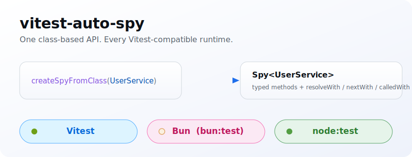
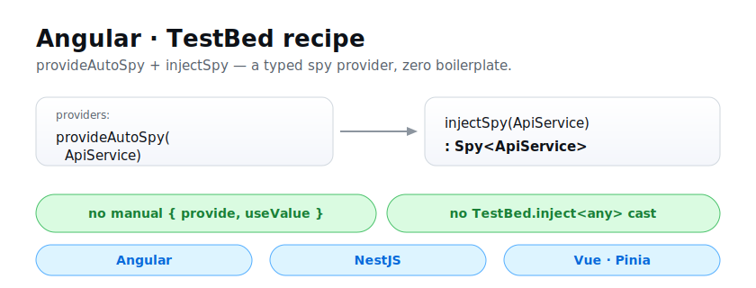

<div align="center">

# vitest-auto-spy

**Auto-generate fully-typed test spies from a class — across any Vitest-compatible runtime and framework.**

The only auto-spy library that reads a **class** and gives a **fully-typed** spy of every method
with **return-type-aware** helpers (`resolveWith` / `nextWith` / `calledWith`). Runs on **Vitest**,
**Bun** (`bun:test`) and **`node:test`** behind one identical API, with **RxJS** spies and
**Angular / NestJS / React / Vue·Pinia / Svelte** recipes ([availability](#availability)). A drop-in
replacement for [`jest-auto-spies`](https://www.npmjs.com/package/jest-auto-spies) — same API.

[](https://www.npmjs.com/package/vitest-auto-spy)
[](https://www.npmjs.com/package/vitest-auto-spy)
[](https://github.com/ASDAlexey/vitest-auto-spy/actions/workflows/ci.yml)
[](https://bundlephobia.com/package/vitest-auto-spy)
[](https://www.npmjs.com/package/vitest-auto-spy)
[](https://github.com/ASDAlexey/vitest-auto-spy/actions/workflows/ci.yml)
[](./LICENSE)

[](#runtimes)
[](#availability)
[](#availability)
[](#install)

📦 [**npm**](https://www.npmjs.com/package/vitest-auto-spy) · 🐙 [**GitHub**](https://github.com/ASDAlexey/vitest-auto-spy) · 🔖 [**Changelog**](./CHANGELOG.md)

<br/>



</div>

---

- 🧪 Reads a class and generates a typed spy for **every** method — no hand-written `vi.fn()` lists
- 🧬 Or mock from a **type/interface** alone — `createAutoMock<T>()`, no class required
- 🌐 One `MockAdapter` core — **Vitest**, **Bun** and **`node:test`**, identical API on each
- 🧩 Framework recipes: **Angular**, **NestJS**, **React**, **Vue/Pinia** and **Svelte**
- 🎯 Return-type-aware helpers — sync, `Promise`, and `Observable` all get the right API
- 🔀 `calledWith` / `mustBeCalledWith` argument dispatch
- 📡 First-class RxJS `Observable` spying (`nextWith`, `nextWithValues`, `throwWith`, …)
- ⚙️ Getter / setter spies via `accessorSpies`
- 🧰 DI & mocking utilities — `provideAutoSpy` / `injectSpy` (Angular, NestJS, Vue), `createFunctionSpy`, `mockReadonlyProp` for signals
- 🔇 Console spies — `import { consoleInfoSpy } from 'vitest-auto-spy/console'` silences `console` and asserts its calls
- 🟢 100% test coverage, **zero runtime dependencies** (in-tree arg serializer, no `javascript-stringify`)

## Table of contents

- [Install](#install)
- [Availability](#availability)
- [Quick start](#quick-start)
- [Why](#why)
- [How it works (and what it won't spy)](#how-it-works-and-what-it-wont-spy)
- [Comparison](#comparison)
- [Migrating from jest-auto-spies](#migrating-from-jest-auto-spies)
- [Configuration](#configuration)
- [Auto-mock by type (no class needed)](#auto-mock-by-type-no-class-needed)
- [Synchronous methods](#synchronous-methods)
- [Promise-returning methods](#promise-returning-methods)
- [Observable methods & properties](#observable-returning-methods--observable-properties)
- [Getters & setters](#getters--setters)
- [Framework adapters](#framework-adapters)
  - [NestJS](#nestjs)
  - [React (Testing Library)](#react-testing-library)
  - [Vue / Pinia](#vue--pinia)
  - [Svelte](#svelte)
  - [Angular](#angular)
- [Utilities](#utilities)
- [API reference](#api-reference)
- [FAQ & troubleshooting](#faq--troubleshooting)
- [Versioning](#versioning)
- [Contributing](#contributing)
- [Acknowledgements](#acknowledgements)
- [License](#license)

## Install

```bash
npm i -D vitest-auto-spy
```

### Requirements

| Tool | Minimum |
| --- | --- |
| Node.js | ≥ 18 |
| Vitest | ≥ 1.0 (required peer) |
| TypeScript | ≥ 4.7 for the typed helpers (plain JS works too, just untyped) |

Ships **dual ESM + CommonJS** with bundled `.d.ts` types, so it drops into both `import`- and
`require`-style test setups.

### Peer dependencies

All peers are **provided by your project**; `rxjs` and `@angular/core` are **optional** — install
them only for the matching entry point. The package itself has **zero runtime dependencies**.

| Peer | Needed for | Optional? |
| --- | --- | --- |
| `vitest` | the default runner | no |
| `rxjs` | `vitest-auto-spy/rxjs` observable spies (and `Spy<T>` type-checking) — `>=7`, **no upper bound** (the rxjs 8 line included) | yes |
| `@angular/core` | `vitest-auto-spy/angular` helpers | yes |

## Availability

> **All entry points are published.** The **Vitest / Bun / `node:test`** runtimes, the **RxJS** layer,
> and the **Angular / NestJS / React / Vue·Pinia / Svelte** recipes all ship as importable entry points —
> one identical API across every runner and framework.

| Entry point | Status |
| --- | --- |
| `vitest-auto-spy` · `vitest-auto-spy/rxjs` · `vitest-auto-spy/angular` | ✅ **Published** |
| `vitest-auto-spy/bun` · `vitest-auto-spy/node` | ✅ **Published** |
| `vitest-auto-spy/nestjs` · `/react` · `/vue` · `/svelte` · `/console` | ✅ **Published** |

## Quick start

Pass a class — every method becomes a typed spy, and the **constructor is never called** (no side
effects). The helper you get on each method matches its return type:

```ts
import { beforeEach, expect, it } from 'vitest';
import { createSpyFromClass, type Spy } from 'vitest-auto-spy';

class UserService {
  getName(id: number): string {
    return 'real name';
  }
  async getUser(id: number): Promise<{ id: number; name: string }> {
    return fetchUser(id);
  }
}

let userService: Spy<UserService>;

beforeEach(() => {
  userService = createSpyFromClass(UserService); // every method is now a spy
});

it('stubs each method with the right helper for its return type', async () => {
  userService.getName.mockReturnValue('Ada'); // sync
  userService.getUser.resolveWith({ id: 1, name: 'Ada' }); // Promise helper

  expect(userService.getName(1)).toBe('Ada');
  await expect(userService.getUser(1)).resolves.toEqual({ id: 1, name: 'Ada' });
  expect(userService.getName).toHaveBeenCalledWith(1);
});
```

No class, only a TypeScript type? Reach for
[`createAutoMock<T>()`](#auto-mock-by-type-no-class-needed).

## Why

Manually mocking a service is tedious and brittle:

```ts
// 😫  the old way
const userService = {
  getUser: vi.fn(),
  getUserList: vi.fn(),
  // ...one line per method, kept in sync by hand
};
```

`createSpyFromClass` reads the class and generates a typed spy for **every** method:

```ts
// 😎  the auto-spy way
let userService: Spy<UserService>;

beforeEach(() => {
  userService = createSpyFromClass(UserService);
});
```

`Spy<UserService>` exposes each method as a `vi.fn()` **plus** the right helpers based on
the method's return type (sync / `Promise` / `Observable`).

## How it works (and what it won't spy)

`createSpyFromClass(MyService)` reads `MyService.prototype` and walks the **prototype chain** — it
never `new`s the class. Concretely:

- ✅ **The class is never instantiated.** The constructor and its side effects (HTTP clients, DB
  connections, `inject()` calls) never run — you pass the class itself, not an instance.
- ✅ **Inherited methods are spied too**, all the way up the prototype chain.
- ✅ Each method is replaced by a fresh spy carrying the helpers that match its **return type**:
  sync → `mockReturnValue` / `calledWith`; `Promise` → `resolveWith` / `rejectWith`; `Observable`
  → `nextWith` / `throwWith` / … .

What it **won't** auto-discover — by design, because these aren't prototype methods:

- ⚠️ **Arrow-function class fields** (`doThing = () => {}`) are instance properties set in the
  constructor, so prototype scanning can't see them. Use regular methods, list them explicitly, or
  mock them by hand. (Same constraint as `jest-auto-spies`.)
- ⚠️ **Getters / setters** are skipped unless named in `gettersToSpyOn` / `settersToSpyOn` — see
  [Getters & setters](#getters--setters).
- ⚠️ **Plain data properties** carry no value until you set one; auto-spy mocks *behaviour*
  (methods), not state. To mock by type including properties, use
  [`createAutoMock`](#auto-mock-by-type-no-class-needed).

## Entry points & runtimes

The library ships a framework-agnostic core plus runtime and framework layers, so a plain
Node / Bun / React / Vue project pulls **neither rxjs nor Angular into its runtime bundle**:

| Import | Provides | Pulls in | Status |
| --- | --- | --- | :---: |
| `vitest-auto-spy` | `createSpyFromClass`, `createAutoMock`, `createFunctionSpy`, sync + promise + accessor spies, `errorHandler`, types | `vitest` | ✅ |
| `vitest-auto-spy/rxjs` | observable spies (`nextWith`, `nextWithValues`, `observablePropsToSpyOn`, …) + `createObservableWithValues` | `rxjs` | ✅ |
| `vitest-auto-spy/angular` | `provideAutoSpy`, `injectSpy`, `mockReadonlyProp*`, `mockAccessorsProp` | `@angular/core` | ✅ |
| `vitest-auto-spy/bun` | the same core, driven by Bun's `bun:test` mocks | `bun:test` | ✅ |
| `vitest-auto-spy/node` | the same core, driven by `node:test`'s `mock.fn()` | `node:test` | ✅ |
| `vitest-auto-spy/nestjs` | `provideAutoSpy`, `injectSpy` for `Test.createTestingModule` | — (your `@nestjs/*`) | ✅ |
| `vitest-auto-spy/react` | the core, with a natural import for React Testing Library suites | — (your `react`) | ✅ |
| `vitest-auto-spy/vue` | `provideAutoSpy` for `global.provide` + Pinia store spying | — (your `vue`/`pinia`) | ✅ |
| `vitest-auto-spy/svelte` | the core, with a natural import for Svelte suites | — (your `svelte`) | ✅ |
| `vitest-auto-spy/console` | `consoleInfoSpy` & friends — silent typed spies over the global `console`, installed on import | `vitest` | ✅ |

✅ all entry points published (see [Availability](#availability)).

> The framework subpaths import **nothing** from their framework — the helpers are structural, so
> `@nestjs/*`, `react`, `vue`/`pinia` and `svelte` stay your own (already-present) dev dependencies and
> never reach this package's runtime bundle.

```ts
import { createSpyFromClass } from 'vitest-auto-spy';
import 'vitest-auto-spy/rxjs'; // once (e.g. in your test setup) — enables observable spies
import { provideAutoSpy, injectSpy } from 'vitest-auto-spy/angular';
```

### Runtimes

The core is runner-agnostic behind a `MockAdapter`: pick the entry that matches your test
runner — the public API (`createSpyFromClass`, `calledWith`, `resolveWith`, `nextWith`, …) is
identical across all three.

```ts
import { createSpyFromClass } from 'vitest-auto-spy'; // Vitest (default, zero-config)
import { createSpyFromClass } from 'vitest-auto-spy/bun'; // Bun — bun:test
import { createSpyFromClass } from 'vitest-auto-spy/node'; // node:test
```

> Only the auto-spy helpers are normalised across runtimes; **native** mock methods stay the
> runner's own — `mockReturnValue` on Vitest/Bun, `spy.method.mock.mockImplementation` on
> `node:test`. Each entry registers its adapter on import, so import the one matching your runner.

> Using an observable spy (`observablePropsToSpyOn`, `nextWith`, …) without importing
> `vitest-auto-spy/rxjs` throws a clear hint telling you to add that import.
>
> The decoupling is at the **runtime** level. The core's _type_ surface (`Spy<T>`) still
> references rxjs types, so keep `rxjs` available for type-checking (it's normally already a
> devDependency); none of it reaches your runtime bundle.
>
> The same inversion-of-control applies to the **test runner**: the core no longer imports
> `vitest` directly — `vi.fn()` / `vi.spyOn()` sit behind a `MockAdapter` that the
> `vitest-auto-spy` entry registers by default, so it stays zero-config. This is the groundwork
> for running the exact same core on other Vitest-compatible runners.

## Comparison

| Library | Reads a class? | Return-type-aware helpers? | Runtimes | We win on |
| --- | :---: | :---: | --- | --- |
| **vitest-auto-spy** | ✅ | ✅ | Vitest · Bun · node:test | — |
| [jest-auto-spies](https://www.npmjs.com/package/jest-auto-spies) | ✅ | ✅ | Jest only | Vitest/Bun/Node successor, **same API** — direct migration path |
| [@bugsplat/vitest-auto-spies](https://www.npmjs.com/package/@bugsplat/vitest-auto-spies) | ✅ | ✅ | Vitest only | Same class-based API **plus** Bun & `node:test`, [type-only `createAutoMock`](#auto-mock-by-type-no-class-needed), framework recipes (Angular/NestJS/React/Vue/Svelte), console spies, and **zero runtime deps** (it depends on `@hirez_io/auto-spies-core`) |
| [vitest-mock-extended](https://www.npmjs.com/package/vitest-mock-extended) | ❌ (Proxy) | ❌ | Vitest | Return-type ergonomics **and** reading a real class (we also ship a Proxy mode: [`createAutoMock`](#auto-mock-by-type-no-class-needed)) |
| [@golevelup/ts-vitest](https://www.npmjs.com/package/@golevelup/ts-vitest) | partial | ❌ | Vitest | Typed `Promise`/`Observable` helpers + explicit class→spy + `mustBeCalledWith` |
| [sinon](https://www.npmjs.com/package/sinon) | ❌ (manual) | ❌ | Any | Auto-generated + fully typed vs. manual + loosely typed |

**The pitch:** the only auto-spy library that reads a **class** and gives a **fully-typed** spy of
every method with **return-type-aware** control helpers (`resolveWith` / `nextWith` / `calledWith`) —
across any Vitest-compatible runtime and framework.

## Migrating from jest-auto-spies

The public API is intentionally identical. In most projects the migration is a
**find-and-replace of the import**:

```diff
- import { createSpyFromClass, provideAutoSpy } from 'jest-auto-spies';
+ import { createSpyFromClass } from 'vitest-auto-spy';
+ import { provideAutoSpy } from 'vitest-auto-spy/angular';
+ import 'vitest-auto-spy/rxjs'; // once, if you use observable spies
```

The only API-shape change from `jest-auto-spies` is that the Angular helpers and the
observable layer live behind the `/angular` and `/rxjs` subpaths (see [Entry points & runtimes](#entry-points--runtimes)).

This also covers migrating from [`@bugsplat/vitest-auto-spies`](https://www.npmjs.com/package/@bugsplat/vitest-auto-spies),
which re-exports the same `jest-auto-spies` API — the swap is identical, and you gain Bun /
`node:test`, `createAutoMock`, framework recipes and console spies on top.

| jest-auto-spies | vitest-auto-spy | Status |
| --- | --- | --- |
| `createSpyFromClass` | `createSpyFromClass` | ✅ identical |
| `provideAutoSpy` | `provideAutoSpy` | ✅ identical |
| `calledWith` / `mustBeCalledWith` | same | ✅ identical |
| `calledWith(...).returnValue(v)` | same — `.returnValue` **and** `.mockReturnValue` both work | ✅ identical |
| `resolveWith` / `rejectWith` / `resolveWithPerCall` | same | ✅ identical |
| `nextWith` / `nextOneTimeWith` / `nextWithValues` / `nextWithPerCall` | same | ✅ identical |
| `throwWith` / `complete` / `returnSubject` | same | ✅ identical |
| `accessorSpies.getters/setters` | same | ✅ identical |
| `createObservableWithValues` | same | ✅ identical |
| underlying mock | `jest.fn()` → `vi.fn()` | 🔁 swapped |

Just make sure your tests run under Vitest, and (for Angular) that `TestBed` is set up.

## Configuration

```ts
// 1. all methods (default)
createSpyFromClass(MyService);

// 2. only these methods
createSpyFromClass(MyService, ['getName', 'getAge']);

// 3. full config object
createSpyFromClass(MyService, {
  methodsToSpyOn: ['getName'],
  observablePropsToSpyOn: ['products$'], // Observable *properties*
  gettersToSpyOn: ['userName'],
  settersToSpyOn: ['userName'],
});
```

## Auto-mock by type (no class needed)

`createSpyFromClass` reads a real class's prototype. When you only have a TypeScript **interface or
type** (no runtime class), use `createAutoMock<T>()` — it builds the spy lazily from the type alone,
via a `Proxy`:

```ts
import { createAutoMock } from 'vitest-auto-spy';

interface UserService {
  getName(id: number): string;
  getUser(id: number): Promise<User>;
  apiUrl: string;
}

// Before — needs a concrete class:
// const svc = createSpyFromClass(UserServiceClass);

// After — type only, no class:
const svc = createAutoMock<UserService>();
```

Every accessed method becomes a decorated spy with the **same typed control helpers** as
`createSpyFromClass`, materialized lazily and cached (same reference on re-access):

```ts
svc.getName.calledWith(1).mockReturnValue('Ada');   // sync, arg-matched
svc.getUser.resolveWith({ id: 1, name: 'Ada' });    // promise helper
expect(svc.getName(1)).toBe('Ada');
await expect(svc.getUser(1)).resolves.toEqual({ id: 1, name: 'Ada' });
```

Seed concrete values or implementations with the optional `overrides` argument (seeded keys are
returned as-is, never turned into spies):

```ts
const svc = createAutoMock<UserService>({ apiUrl: 'https://api.test' });
expect(svc.apiUrl).toBe('https://api.test'); // or assign: svc.apiUrl = '...'
```

> Caveat: with only a type at runtime, methods and plain properties are indistinguishable on
> access — an un-seeded property read returns a spy. Seed real property values via `overrides`
> (or assignment) to get them back verbatim.

## Synchronous methods

```ts
// standard vi.fn() API works as-is
myService.getName.mockReturnValue('Fake Name');

// return a value only for specific arguments
myService.getName.calledWith(1).mockReturnValue('Fake Name');
expect(myService.getName(1)).toBe('Fake Name');
expect(myService.getName(2)).toBeUndefined();

// throw if called with the "wrong" arguments
myService.getName.mustBeCalledWith(1).mockReturnValue('Fake Name');
expect(() => myService.getName(2)).toThrow();
```

## Promise-returning methods

```ts
myService.getProducts.resolveWith([{ name: 'Product 1' }]);
await expect(myService.getProducts()).resolves.toEqual([{ name: 'Product 1' }]);

myService.getProducts.rejectWith('FAKE ERROR');
await expect(myService.getProducts()).rejects.toBe('FAKE ERROR');

// per-call values, and conditional-by-args
myService.getProducts.resolveWithPerCall([{ value: ['a'] }, { value: ['b'] }]);
myService.getProducts.calledWith(1).resolveWith(['one']);
```

## Observable-returning methods & Observable properties

Both spied **methods** that return an `Observable` and spied **properties** of type
`Observable` get the same control surface. Enable them by importing the rxjs layer once:

```ts
import 'vitest-auto-spy/rxjs';
```

```ts
myService.getProducts$.nextWith([{ name: 'Product 1' }]); // emit, stream stays open
myService.getProducts$.nextOneTimeWith([{ name: 'X' }]);  // emit one value, then complete
myService.getProducts$.throwWith('FAKE ERROR');           // error the stream
myService.getProducts$.complete();                        // complete the stream

// emit a precise sequence — values, errors, completion, optional delays
myService.getProducts$.nextWithValues([
  { value: [{ name: 'Product 1' }] },
  { errorValue: 'FAKE ERROR' },
  { complete: true },
]);

// a fresh stream per call
myService.getProducts$.nextWithPerCall([{ value: ['a'] }, { value: ['b'] }]);

// grab the underlying Subject for full manual control
const subject = myService.getProducts$.returnSubject();
subject.next([{ name: 'manual' }]);
```

`calledWith(...)` / `mustBeCalledWith(...)` also chain into the observable helpers:

```ts
myService.getProducts$.calledWith(1).nextWith([{ name: 'Product 1' }]);
```

### Standalone observable builder

```ts
import { createObservableWithValues } from 'vitest-auto-spy/rxjs';

const fake$ = createObservableWithValues([{ value: 1 }, { value: 2 }, { complete: true }]);

// or get the subject too
const { values$, subject } = createObservableWithValues([{ value: 1 }], { returnSubject: true });
```

## Getters & setters

```ts
const spy = createSpyFromClass(MyService, {
  gettersToSpyOn: ['userName'],
  settersToSpyOn: ['userName'],
});

// configure / assert the getter
spy.accessorSpies.getters.userName.mockReturnValue('Fake Name');
expect(spy.userName).toBe('Fake Name');

// assert the setter was called
spy.userName = 'New Name';
expect(spy.accessorSpies.setters.userName).toHaveBeenCalledWith('New Name');
```

## Framework adapters

The core is framework-agnostic — `createSpyFromClass` / `createAutoMock` work in any test. The
subpaths below add a natural import and, where the framework has class DI, a tiny `provide*` helper.
None of them pull the framework into this package; they're recipes over the same core.

> The **Angular**, **NestJS**, **React**, **Vue/Pinia** and **Svelte** entry points are all published
> ([Availability](#availability)). Each is a thin recipe over the same core, so you can equally copy it
> using the core `vitest-auto-spy` import directly.

### NestJS

Use `provideAutoSpy` to register a fully-mocked service in a `TestingModule`, then `injectSpy` to
pull it back out already typed as `Spy<T>`. `@nestjs/common` / `@nestjs/testing` are your own
(optional) peers — the helper imports neither:

```ts
import { Test, type TestingModule } from '@nestjs/testing';
import { provideAutoSpy, injectSpy } from 'vitest-auto-spy/nestjs';
import { beforeEach, expect, it } from 'vitest';

import { AuthService } from './auth.service';
import { UserService } from './user.service';

let moduleRef: TestingModule;
let userServiceSpy: Spy<UserService>;

beforeEach(async () => {
  moduleRef = await Test.createTestingModule({
    providers: [AuthService, provideAutoSpy(UserService)],
  }).compile();

  userServiceSpy = injectSpy(moduleRef, UserService);
});

it('logs in a known user', () => {
  userServiceSpy.findByEmail.mockReturnValue({ id: 1, name: 'Ada' });

  const auth = moduleRef.get(AuthService);
  expect(auth.login('ada@example.com')).toBeTruthy();
  expect(userServiceSpy.findByEmail).toHaveBeenCalledWith('ada@example.com');
});
```

### React (Testing Library)

React has no DI container, so there's no `provide*` helper — the recipe is: **spy the classes you
own** (services, stores, API clients, hook deps), then pass the spy into a Context provider or hook.
The spy is a plain object of spied functions, so it drops straight into `value={...}`:

```tsx
import { render, screen } from '@testing-library/react';
import { createSpyFromClass, type Spy } from 'vitest-auto-spy/react';
import { CartContext, Cart } from './cart';

class CartStore {
  getItemCount(): number { return 0; }
  checkout(token: string): Promise<{ orderId: string }> { /* ... */ }
}

let cart: Spy<CartStore>;

beforeEach(() => {
  cart = createSpyFromClass(CartStore); // every method is now a spy
});

it('shows the item count from the injected store', () => {
  cart.getItemCount.mockReturnValue(3);

  render(
    <CartContext.Provider value={cart}>
      <Cart />
    </CartContext.Provider>,
  );

  expect(screen.getByText('3 items')).toBeInTheDocument();
});

it('drives async deps and asserts the component called them', async () => {
  cart.checkout.resolveWith({ orderId: 'ord_42' });
  // ...trigger checkout in the UI...
  expect(cart.checkout).toHaveBeenCalledWith('tok_abc');
});
```

### Vue / Pinia

`provideAutoSpy(token, Class)` returns a `{ [token]: Spy<T> }` map you can spread into
`@vue/test-utils`' `global.provide`; for a class-based Pinia store, spy it directly:

```ts
import { mount } from '@vue/test-utils';
import { createSpyFromClass, provideAutoSpy } from 'vitest-auto-spy/vue';

// (a) class-based service injected via provide / global.provide
import { UserServiceKey, UserService } from '@/services/user.service';

const provide = provideAutoSpy(UserServiceKey, UserService); // { [UserServiceKey]: Spy<UserService> }
provide[UserServiceKey].getName.mockReturnValue('Fake Name');

const wrapper = mount(UserBadge, { global: { provide } });
expect(provide[UserServiceKey].getName).toHaveBeenCalled();

// (b) class-based Pinia store — every action becomes a spy
import { CartStore } from '@/stores/cart.store';

const store = createSpyFromClass(CartStore);
store.itemCount.mockReturnValue(3);                  // sync action/getter
store.checkout.resolveWith({ orderId: 'ord_42' });   // async action (Promise)
await store.checkout('tok_abc');
expect(store.checkout).toHaveBeenCalledWith('tok_abc');
```

### Svelte

Svelte has no class-based DI, so it's a recipe: keep your logic in plain class-based
services/stores, spy the class, and hand the spy to the component the same way it receives the real
one (props, context, or a mocked module):

```ts
import { render } from '@testing-library/svelte';
import { createSpyFromClass } from 'vitest-auto-spy/svelte';
import Cart from './Cart.svelte';
import { CartStore } from './cart-store';

it('shows the cart total from the store', () => {
  const cartStore = createSpyFromClass(CartStore); // every method is a spy

  cartStore.total.mockReturnValue(42);
  cartStore.priceOf.calledWith('apple').mockReturnValue(7);

  render(Cart, { props: { store: cartStore } });

  expect(cartStore.total).toHaveBeenCalled();
});
```

### Angular

<div align="center">

 — no manual { provide, useValue }, no TestBed.inject<any> cast" width="720" />

</div>

`provideAutoSpy` is the shorthand for providing an auto-spy in a `TestBed`:

```ts
import { provideAutoSpy, injectSpy } from 'vitest-auto-spy/angular';

TestBed.configureTestingModule({
  providers: [
    provideAutoSpy(MyService),
    // accepts the same second argument as createSpyFromClass
    provideAutoSpy(ApiService, { methodsToSpyOn: ['get', 'post'] }),
  ],
});

let myService: Spy<MyService>;

beforeEach(() => {
  myService = injectSpy(MyService);
});
```

> The spies are change-detection agnostic, so they work in **both zoneless and
> zone.js** Angular projects — nothing here touches `NgZone` or change detection.
> You only need the usual Vitest + Angular wiring:
> [`@analogjs/vite-plugin-angular`](https://www.npmjs.com/package/@analogjs/vite-plugin-angular)
> plus a TestBed setup file (e.g. `@analogjs/vitest-angular`'s `setupTestBed()`).

#### Signal / readonly property mocking (bonus)

```ts
import { mockReadonlyProp, mockReadonlyPropGetter, mockAccessorsProp } from 'vitest-auto-spy/angular';

mockReadonlyProp(service, 'isReady', true);              // static value (incl. signals)
mockReadonlyPropGetter(service, 'label', () => 'A');     // dynamic getter
mockAccessorsProp(service, 'theme');                     // spied get + set
```

## Utilities

Beyond the spy factories, the package ships a set of small standalone helpers. Each one is a
single-purpose utility you can pick up independently — they all ride on the same core:

| Utility | Entry point | What it's for |
| --- | --- | --- |
| `injectSpy(token)` / `injectSpy(moduleRef, token)` | `/angular`, `/nestjs` | Pull a provided spy out of the DI container, already typed as `Spy<T>` — no casting |
| `provideAutoSpy(Class, config?)` | `/angular`, `/nestjs`, `/vue` | One-liner `{ provide, useValue }` (or Vue `global.provide`) that builds the spy for you |
| `createFunctionSpy(name)` | core | A single standalone function spy with the full helper set (`calledWith`, `resolveWith`, `nextWith`, …) — no class needed |
| `createAutoMock<T>(overrides?)` | core | Proxy-based spy from a **type/interface** alone ([details](#auto-mock-by-type-no-class-needed)) |
| `createObservableWithValues(configs, opts?)` | `/rxjs` | Build a fake `Observable` emitting a precise sequence of values / errors / completion |
| `consoleInfoSpy` / `consoleWarnSpy` / … | `/console` | Silent typed spies over the global `console`, installed on import ([details](#console-spies--vitest-auto-spyconsole)) |
| `mockReadonlyProp(obj, prop, value)` | `/angular` | Overwrite a `readonly` property (incl. Angular signals) with a static value |
| `mockReadonlyPropGetter(obj, prop, getter)` | `/angular` | Same, but backed by a dynamic getter |
| `mockAccessorsProp(obj, prop)` | `/angular` | Redefine a property with spied `get` + `set` |
| `errorHandler` | core | The `mustBeCalledWith` argument-mismatch reporter — swap it to customize failure output |

A taste of the DI pair — provide the spy, inject it back fully typed:

```ts
import { provideAutoSpy, injectSpy } from 'vitest-auto-spy/angular';

TestBed.configureTestingModule({ providers: [provideAutoSpy(UserService)] });
const userService = injectSpy(UserService); // Spy<UserService>, no `as` cast
```

And a standalone function spy, when there's no class or interface at all:

```ts
import { createFunctionSpy } from 'vitest-auto-spy';

const onSave = createFunctionSpy<(id: number) => Promise<void>>('onSave');
onSave.calledWith(1).resolveWith();
```

### Console spies — `vitest-auto-spy/console`

Importing the entry replaces `console.debug` / `error` / `info` / `log` / `time` / `timeEnd` /
`trace` / `warn` with **silent, fully-typed spies** and exports each one ready to assert — no
`vi.spyOn(console, 'info')` boilerplate in every suite, no log output polluting the test run:

```ts
import { consoleInfoSpy, consoleWarnSpy } from 'vitest-auto-spy/console';

service.doWork();

expect(consoleInfoSpy).toHaveBeenCalledWith('done');
expect(consoleWarnSpy).not.toHaveBeenCalled();
```

Housekeeping: `resetConsoleSpies()` clears the recorded calls between tests (Vitest's
`clearMocks: true` already does that automatically), `restoreConsole()` puts the original
methods back, and `installConsoleSpies()` re-installs after a restore.

> The spies use the registered `MockAdapter` — import your runtime entry
> (`vitest-auto-spy/bun`, `…/node`) **before** `vitest-auto-spy/console` and the console spies
> are driven by that runner's mocks; with no prior runtime entry the default Vitest adapter is used.

Prefer a fully detached fake instead of touching the real global? `createAutoMock<Console>()`
gives you a typed, in-memory console to inject into code that takes a logger:

```ts
import { createAutoMock } from 'vitest-auto-spy';

const fakeConsole = createAutoMock<Console>();
const service = new ReportService(fakeConsole);

service.doWork();

expect(fakeConsole.info).toHaveBeenCalledWith('done');
```

## API reference

| Export | Description |
| --- | --- |
| `createSpyFromClass(Class, methodsOrConfig?)` | Build a fully-typed `Spy<T>` from a class |
| `createAutoMock<T>(overrides?)` | Build a `Spy<T>` from a **type/interface** alone (Proxy, no class) |
| `provideAutoSpy(Class, methodsOrConfig?)` | Angular / NestJS `{ provide, useValue }` shorthand |
| `provideAutoSpy(token, Class, methodsOrConfig?)` | Vue `{ [token]: Spy<T> }` for `global.provide` |
| `injectSpy(token)` _(Angular)_ / `injectSpy(moduleRef, token)` _(NestJS)_ | Inject typed as `Spy<T>` |
| `createFunctionSpy(name)` | A single standalone function spy with all helpers |
| `createObservableWithValues(configs, opts?)` | Build an Observable from value configs |
| `mockReadonlyProp` / `mockReadonlyPropGetter` / `mockAccessorsProp` | Mock readonly / accessor / signal props |
| `consoleDebugSpy` … `consoleWarnSpy` _(`/console`)_ | Silent typed spies replacing the global `console` methods on import |
| `installConsoleSpies()` / `resetConsoleSpies()` / `restoreConsole()` | Install / clear / undo the console spies |
| `errorHandler` | The `mustBeCalledWith` argument-mismatch error helper |

**Spied sync method:** `mockReturnValue`, `calledWith(...)`, `mustBeCalledWith(...)`

**Spied Promise method:** `resolveWith`, `rejectWith`, `resolveWithPerCall`

**Spied Observable method / property:** `nextWith`, `nextOneTimeWith`, `nextWithValues`,
`nextWithPerCall`, `throwWith`, `complete`, `returnSubject`

**Config (`ClassSpyConfiguration`):** `methodsToSpyOn`, `observablePropsToSpyOn`,
`gettersToSpyOn`, `settersToSpyOn`

`ValueConfig` (for `nextWithValues`): `{ value, delay? }` | `{ errorValue, delay? }` | `{ complete?, delay? }`.

## FAQ & troubleshooting

**"I get `X.nextWith is not a function` / observable helpers are missing."**
Import the rxjs layer once (e.g. in your test setup): `import 'vitest-auto-spy/rxjs';`. Without it,
requesting an observable spy throws a hint pointing you here.

**"My method isn't on the spy."**
Auto-discovery only sees **prototype methods**. Arrow-function class fields (`foo = () => {}`) and
plain properties aren't included — see [How it works](#how-it-works-and-what-it-wont-spy). List
getters/setters via `gettersToSpyOn` / `settersToSpyOn`.

**"Does it construct my class? Will the constructor's side effects run?"**
No. `createSpyFromClass` reads the prototype and never `new`s the class, so constructors (and their
HTTP/DB/`inject()` side effects) never run.

**"I only have an interface/type, not a class."**
Use [`createAutoMock<T>()`](#auto-mock-by-type-no-class-needed) — it builds the spy lazily from the
type via a `Proxy`, no runtime class needed.

**"Can I use it without TypeScript?"**
Yes — the runtime works in plain JS; you just lose the compile-time `Spy<T>` typing.

**"Native mock methods differ between runners."**
Only the auto-spy helpers are normalised. Native APIs stay the runner's own (`mockReturnValue` on
Vitest/Bun, `spy.method.mock.mockImplementation` on `node:test`).

## Versioning

This package follows [Semantic Versioning](https://semver.org). Breaking changes to the public API
land only in major releases; see the [Changelog](./CHANGELOG.md) for what changed in each version.
Releases are automated from Conventional Commits (see [Contributing](#contributing)).

## Contributing

Contributions are welcome! Please read [CONTRIBUTING.md](./CONTRIBUTING.md) and the
[Code of Conduct](./CODE_OF_CONDUCT.md). In short:

```bash
npm ci
npm test            # run the suite
npm run test:coverage   # 100% thresholds enforced
npm run build
```

Releases are automated: merging a PR into `master` bumps the version from the
Conventional Commit types and publishes to npm — see
[CONTRIBUTING.md → Releasing](./CONTRIBUTING.md#releasing).

If this package saved you time, a ⭐ on [GitHub](https://github.com/ASDAlexey/vitest-auto-spy)
helps others find it.

## Acknowledgements

API and ergonomics are modelled on Shai Reznik's
[`jest-auto-spies`](https://www.npmjs.com/package/jest-auto-spies) — `vitest-auto-spy` is its
Vitest-era successor with the same surface, so migrations are (mostly) a find-and-replace. Thanks to
the Vitest, Bun, RxJS and Angular communities whose tooling this builds on.

## License

[MIT](./LICENSE) © [Alexey Popov](https://github.com/ASDAlexey)

Get in touch: [asdalexey.github.io](https://asdalexey.github.io/ru/)
