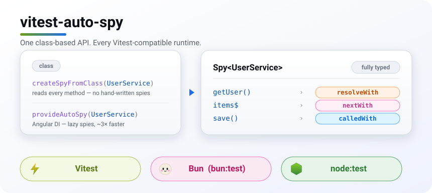
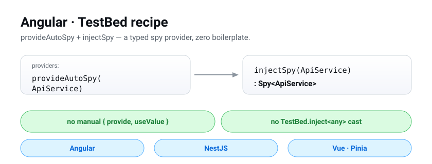

<div align="center">

# vitest-auto-spy

**Auto-generate fully-typed test spies from a class — across any Vitest-compatible runtime and framework.**

The only auto-spy library that reads a **class** and gives a **fully-typed** spy of every method
with **return-type-aware** helpers — `resolveWith` / `rejectWith` for `Promise`s, `nextWith` /
`throwWith` for RxJS `Observable`s, and `calledWith` / `mustBeCalledWith` for argument matching. Or
skip the class entirely and mock straight from a **type or interface** with `createAutoMock<T>()` and
recursive `mockDeep<T>()`. Runs on **Vitest**, **Bun** (`bun:test`) and **`node:test`** behind one
identical API, with **RxJS** spies and **Angular / NestJS / React / Vue·Pinia / Svelte** recipes
([availability](#availability)). A drop-in replacement for
[`jest-auto-spies`](https://www.npmjs.com/package/jest-auto-spies) — same API — and for
[`jasmine-auto-spies`](https://www.npmjs.com/package/jasmine-auto-spies) through
[`vitest-auto-spy/jasmine`](#migrating-from-jasmine-auto-spies), which keeps `.and`, `.calls` and
`.withArgs` working while you land the suite green.

[](https://www.npmjs.com/package/vitest-auto-spy)
[](https://www.npmjs.com/package/vitest-auto-spy)
[](https://github.com/ASDAlexey/vitest-auto-spy/actions/workflows/ci.yml)
[](#install)
[](https://www.npmjs.com/package/vitest-auto-spy)
[](https://github.com/ASDAlexey/vitest-auto-spy/actions/workflows/ci.yml)
[](./LICENSE)

[](#runtimes)
[](#availability)
[](#angular-on-bun-buntest)
[](#availability)
[](#install)

📚 [**Documentation**](https://asdalexey.github.io/vitest-auto-spy/) · 🧭 [**Spec patterns**](https://asdalexey.github.io/vitest-auto-spy/recipes) · 📦 [**npm**](https://www.npmjs.com/package/vitest-auto-spy) · 🐙 [**GitHub**](https://github.com/ASDAlexey/vitest-auto-spy) · 🔖 [**Changelog**](./CHANGELOG.md)

🤖 [**AGENTS.md**](./AGENTS.md) · 🔤 [**llms.txt**](https://asdalexey.github.io/vitest-auto-spy/llms.txt) · 📄 [**llms-full.txt**](https://asdalexey.github.io/vitest-auto-spy/llms-full.txt) — works with [Claude Code, OpenAI Codex, GLM, Cursor, Copilot, Gemini CLI and the rest](#which-file-your-agent-reads)

<br/>



</div>

---

- 🧪 Reads a class and generates a typed spy for **every** method — no hand-written `vi.fn()` lists
- 🧬 Or mock from a **type/interface** alone — `createAutoMock<T>()`, no class required
- 🌐 One `MockAdapter` core — **Vitest**, **Bun** and **`node:test`**, identical API on each
- 🧩 Framework recipes: **Angular**, **NestJS**, **React**, **Vue/Pinia** and **Svelte**
- 🎯 Return-type-aware helpers — sync, `Promise`, and `Observable` all get the right API
- 🔀 `calledWith` / `mustBeCalledWith` argument dispatch
- 📡 First-class RxJS `Observable` spying (`nextWith`, `nextWithValues`, `throwWith`, …)
- ⚙️ Getter / setter spies via `accessorSpies`
- 🧰 DI & mocking utilities — `provideAutoSpy` / `injectSpy` (Angular, NestJS, Vue), `createFunctionSpy`, `mockReadonlyProp` for signals
- ⚡ Angular speed & zoneless helpers — `renderShallow` (**1.7×** on real component specs), `createWithAutoSpies`, `stable` / `flushEffects`, `settleResource` for `httpResource()`, `toHaveSignalValue`, per-file `TestBed` timings
- 🌐 `httpResource()` and `HttpClient` in two lines — `provideHttpTesting()` + `await expectRequest(url).flush(body)` does the tick, the controller, the `expectOne`, the flush **and the settling**, so `resource.value()` reads on the next line; `@angular/common` stays an optional peer, confined to the `/angular-http` entry
- 🪆 NestJS units from their own DI metadata — `createNestUnit(Target, { expose, providers })`, the solitary / sociable model of `@suites/unit` with the real prototype behind every spy and no `@nestjs` dependency
- 🧱 The providers a testing module cannot reach — `overrideComponentProvider` (which verifies the override actually applied), `provideAutoSpyForToken`, `assertNgModuleScopes`, `assertComponentDefIntact`, `createDirectiveHost`
- 🚨 Failures that used to be silence — `enableAngularDiagnostics()` for dead NgModule imports, dead `schemas`, an unspied provider and unflushed HTTP requests; `trackInjections` for which collaborators the code actually asked for
- 🔒 [Strict doubles](#strict-doubles--fail-on-a-method-nobody-configured) — `strict: true` / `onUnstubbedCall` fail on a method nobody configured, naming the class, the method and the arguments instead of answering `undefined`
- ♻️ `using spy = createSpyFromClass(X)` — every double carries `[Symbol.dispose]`, so the `afterEach` that only reset one spy can go
- 📡 Observable assertions that fail on silence — `expectEmission` / `expectEmissions` / `expectNoEmission` / `expectCompletion` / `expectError`, no rxjs required, Angular `output()` included
- 🏗️ Doubles for what the code builds itself — `mockConstructor` / `stubConstructor` for `new`, plus `stubMediaElement`, `stubAbortController` and the observer stubs
- ⏳ Waiting that is not a guess — `flushEventLoop`, `settleDynamicImport`, `flushEventLoopUntil`, and a clock that survives fake timers (`mockSystemTime`, `useCountingClock`)
- 🌀 `fakeAsync` / `waitForAsync` on Vitest — one import of `vitest-auto-spy/zone`; zone.js stays out of every other entry
- 🧩 Module mocks that prove they applied — `assertMocked`, `moduleNamespace`, for a `vi.mock()` a bundler quietly ignored
- 🧾 Fixtures without casts — deep-partial `createMock`, `createFixture` / `createFixtureFactory`, `narrow()`, `withOverrides()`, `asInstances()`, `captureArg()`
- 🚚 A migration you can verify — `compareTestRuns` on the two JSON reports, `diffByField` for the assertion the reporter collapses
- 📏 Lint rules and one-line test-run hygiene — nineteen rules in `vitest-auto-spy/eslint-plugin` (three `--fix`, seven suggestions, four of them for a suite mid-migration off jasmine), `setupAutoSpy()`
- 🩺 [Editor diagnostics](#editor-diagnostics--webstorm--vs-code) — the same anti-patterns underlined while you type: native ESLint inspections in **WebStorm** and the other JetBrains IDEs, the ESLint extension in **VS Code**, no extra plugin either way
- 🔎 [`npx vitest-auto-spy doctor`](#the-cli--doctor-codemod-and-init) — suite-level defects **that never fail a run**: a `tsconfig` `include` matching no file, a production module importing a spec, a `@jest-environment` pragma the runner never reads, config left behind for a runner that is gone. Read-only, no config, exits 1 in CI
- 🚚 [`npx vitest-auto-spy codemod`](#codemod--migrating-a-suite-off-jest-auto-spies) — thirteen transforms that move a suite off `jest-auto-spies` and Jest, or off `jasmine-auto-spies` and jasmine (`--from jasmine`), dry-run by default, with a `--verify` pass that also checks a file somebody edited by hand
- 🔇 Console spies — `import { consoleInfoSpy } from 'vitest-auto-spy/console'` silences `console` and asserts its calls
- 🧭 [**Spec patterns**](https://asdalexey.github.io/vitest-auto-spy/recipes) — the shapes a ~370-file Angular suite converged on, and the traps that only surface at scale
- 🤖 Built for AI agents too — one `npx vitest-auto-spy init` writes the pointer into the files your agents actually read and specialises it for this repository, backed by an offline [`AGENTS.md`](#using-this-library-with-an-ai-agent) inside the package, a [per-agent map](#which-file-your-agent-reads) for **Claude Code**, **OpenAI Codex**, **GLM/z.ai**, **Cursor**, **Copilot**, **Gemini CLI** and the rest, `llms.txt` on the docs site, a Claude Code skill, and errors that name their own fix
- 🟢 100% test coverage, **zero runtime dependencies** (in-tree arg serializer, no `javascript-stringify`)

## Table of contents

- [Install](#install)
  - [Requirements](#requirements)
  - [Peer dependencies](#peer-dependencies)
- [The CLI — `doctor`, `codemod` and `init`](#the-cli--doctor-codemod-and-init)
  - [`doctor` — defects that never fail](#doctor--defects-that-never-fail)
  - [`codemod` — migrating a suite off `jest-auto-spies`](#codemod--migrating-a-suite-off-jest-auto-spies)
  - [`init` — the pointer an agent reads](#init--the-pointer-an-agent-reads)
- [Using this library with an AI agent](#using-this-library-with-an-ai-agent)
  - [Point your agent at it once](#point-your-agent-at-it-once)
  - [Which file your agent reads](#which-file-your-agent-reads)
  - [Install it in your agent](#install-it-in-your-agent)
  - [OpenAI Codex](#openai-codex)
  - [GLM (z.ai), Kimi K2 and other Claude-compatible models](#glm-zai-kimi-k2-and-other-claude-compatible-models)
  - [Gemini CLI](#gemini-cli)
  - [Claude Code plugin](#claude-code-plugin)
- [Availability](#availability)
- [Quick start](#quick-start)
- [How to mock](#how-to-mock)
  - [A service behind Angular DI](#how-to-mock-a-service-behind-angular-di)
  - [A service without DI](#how-to-mock-a-service-without-di)
  - [Reading a spy back from DI](#how-to-mock-reading-a-spy-back-from-di)
  - [A whole class's dependencies at once](#how-to-mock-a-whole-classs-dependencies-at-once)
  - [A readonly property or a signal](#how-to-mock-a-readonly-property-or-a-signal)
  - [An Observable](#how-to-mock-an-observable)
  - [A promise a test forgets to await](#how-to-mock-a-promise-a-test-forgets-to-await)
  - [A component's children](#how-to-mock-a-components-children)
  - [A class the code under test builds with `new`](#how-to-mock-a-class-the-code-under-test-builds-with-new)
  - [A double more than one spec uses](#how-to-mock-a-double-more-than-one-spec-uses)
  - [A pipe](#how-to-mock-a-pipe)
  - [A jasmine suite mid-migration](#how-to-mock-a-jasmine-suite-mid-migration)
- [Why](#why)
- [How it works (and what it won't spy)](#how-it-works-and-what-it-wont-spy)
- [Entry points & runtimes](#entry-points--runtimes)
  - [Runtimes](#runtimes)
- [Angular on Bun (`bun:test`)](#angular-on-bun-buntest)
- [Comparison](#comparison)
- [Migrating from jest-auto-spies](#migrating-from-jest-auto-spies)
- [Migrating from jasmine-auto-spies](#migrating-from-jasmine-auto-spies)
- [Configuration](#configuration)
  - [Spying instance-assigned callables (`signal()`, arrow props, `signalStore()`)](#spying-instance-assigned-callables-signal-arrow-props-signalstore)
  - [Strict doubles — fail on a method nobody configured](#strict-doubles--fail-on-a-method-nobody-configured)
- [Auto-mock by type (no class needed)](#auto-mock-by-type-no-class-needed)
- [Synchronous methods](#synchronous-methods)
- [Promise-returning methods](#promise-returning-methods)
- [Observable methods & properties](#observable-returning-methods--observable-properties)
  - [Standalone observable builder](#standalone-observable-builder)
- [Getters & setters](#getters--setters)
- [Resetting — `using`, `resetAutoSpy`, `clearAutoSpy`](#resetting--using-resetautospy-clearautospy)
- [Framework adapters](#framework-adapters)
  - [Angular](#angular)
    - [Signal / readonly property mocking (bonus)](#signal--readonly-property-mocking-bonus)
    - [Shallow component rendering](#shallow-component-rendering)
    - [Building a class with auto-spied dependencies](#building-a-class-with-auto-spied-dependencies)
    - [Zoneless waiting](#zoneless-waiting)
    - [Settling a `resource()` or `httpResource()`](#settling-a-resource-or-httpresource)
    - [Asserting a signal's value](#asserting-a-signals-value)
    - [Where a spec spends its time](#where-a-spec-spends-its-time)
    - [A provider the component declares for itself](#a-provider-the-component-declares-for-itself)
    - [Diagnostics — four silent failures made loud](#diagnostics--four-silent-failures-made-loud)
    - [Which collaborators the code asked for](#which-collaborators-the-code-asked-for)
  - [NestJS](#nestjs)
  - [React (Testing Library)](#react-testing-library)
  - [Vue / Pinia](#vue--pinia)
  - [Svelte](#svelte)
  - [Which factory, and what it costs](#which-factory-and-what-it-costs)
- [Utilities](#utilities)
  - [Console spies — `vitest-auto-spy/console`](#console-spies--vitest-auto-spyconsole)
- [Observable assertions](#observable-assertions)
- [Test-run hygiene](#test-run-hygiene)
- [Fake timers](#fake-timers)
- [Observer stubs](#observer-stubs)
- [ESLint plugin](#eslint-plugin)
- [Editor diagnostics — WebStorm & VS Code](#editor-diagnostics--webstorm--vs-code)
  - [WebStorm and the other JetBrains IDEs](#webstorm-and-the-other-jetbrains-ides)
  - [VS Code, Cursor, Windsurf, VSCodium](#vs-code-cursor-windsurf-vscodium)
- [Bridging `Spy<T>` and `T`](#bridging-spyt-and-t)
- [API reference](#api-reference)
- [FAQ & troubleshooting](#faq--troubleshooting)
- [Versioning](#versioning)
- [Contributing](#contributing)
- [Acknowledgements](#acknowledgements)
- [License](#license)

## Install

```bash
npm i -D vitest-auto-spy
```

> The plural name — [`vitest-auto-spies`](https://www.npmjs.com/package/vitest-auto-spies) — is an
> alias package that re-exports this one, entry point for entry point, so a typo resolves to the
> same code. Prefer the singular; the alias only follows it.

### Requirements

| Tool       | Minimum                                                                           |
| ---------- | --------------------------------------------------------------------------------- |
| Node.js    | ≥ 18 for the library — in practice, whatever your runner needs                    |
| Vitest     | ≥ 2.1 (required peer)                                                             |
| Bun        | ≥ 1.4 for `vitest-auto-spy/bun-angular`; any recent Bun for `vitest-auto-spy/bun` |
| TypeScript | ≥ 4.7 for the typed helpers (plain JS works too, just untyped)                    |

Vitest **≥ 2.1** because the typed `spy.method.mock.settledResults` surface is Vitest's own `Mock`
type, and `@vitest/spy` only grew `settledResults` in 2.0 — 2.1 is where the 2.x line actually sits.
The runtime helpers themselves still run on older Vitest (the library polyfills `settledResults` for
`bun:test` and `node:test` regardless), but the types no longer line up there, so the range stops
claiming it.

Node **≥ 18** is the library's own floor and it holds — the published output is ES2022 and every
entry runs on 18. What moves the real minimum is the runner: **Vitest 4 cannot start on Node 18 at
all**, because Vite 7 calls `crypto.hash` (added in Node 20.12) and the run dies with
`TypeError: crypto.hash is not a function` before a spec loads. On Vitest ≤ 3 Node 18 is fine. Which
version to actually run is measured in
[Performance → Which Node version](https://vitest-auto-spy.dev/core/performance#which-node-version):
the core is 9–15% faster from Node 24 on, and a cold import more than halves.

Ships **ESM with bundled `.d.ts` types**. Two subpaths additionally ship a CommonJS build —
`vitest-auto-spy/node` (a `node --test` suite written in CJS) and `vitest-auto-spy/eslint-plugin`
(loaded by a CommonJS `eslint.config.cjs`). Everything else is ESM-only, because a `require()` of it
could never have worked: Vitest itself refuses to be required (`Vitest cannot be imported in a
CommonJS module using require()`), so every Vitest-backed entry threw on the first line of its own
`.cjs`. Test runners load ESM natively, so nothing is lost — and dropping the unreachable output cut
the published package roughly in half.

### Peer dependencies

All peers are **provided by your project**; `rxjs` and `@angular/core` are **optional** — install
them only for the matching entry point. The package itself has **zero runtime dependencies**.

| Peer            | Needed for                                                                                                                  | Optional? |
| --------------- | --------------------------------------------------------------------------------------------------------------------------- | --------- |
| `vitest`        | the default runner                                                                                                          | no        |
| `rxjs`          | `vitest-auto-spy/rxjs` observable spies (and `Spy<T>` type-checking) — `>=7`, **no upper bound** (the rxjs 8 line included) | yes       |
| `@angular/core` | `vitest-auto-spy/angular` helpers                                                                                           | yes       |

## The CLI — `doctor`, `codemod` and `init`

The package ships one executable, with no dependencies and nothing to configure:

```bash
npx vitest-auto-spy doctor   # read-only. Exits 1 when it finds something
npx vitest-auto-spy codemod  # prints the migration diff. Writes nothing without --write
npx vitest-auto-spy init     # writes the agent instructions pointer
```

### `doctor` — defects that never fail

Every check shares one property: **nothing consumes the result**. The suite is green,
`tsc --noEmit` reports zero errors, and the only reader of the stale thing is whoever opens the
file. That is why they survive for years, and why a per-file linter cannot find most of them — the
evidence is spread across files.

```
$ npx vitest-auto-spy doctor
vitest-auto-spy doctor — /work/app
1284 files, runner: vitest, entry: vitest-auto-spy/angular

error  tsconfig-glob-matches-nothing libs/users/tsconfig.spec.json
       The "include" pattern "src*.spec.ts" matches no file.
       → A pattern that matches nothing type-checks nothing, and `tsc --noEmit` still reports
         zero errors. Fix the glob or delete the entry.

3 errors, 4 warnings, 1 note
```

| Check                               | What it finds                                                                                                    |
| ----------------------------------- | ---------------------------------------------------------------------------------------------------------------- |
| `tsconfig-glob-matches-nothing`     | An `include` pattern that matches no file — so it type-checks nothing                                            |
| `tsconfig-file-missing`             | A `files` entry naming a file that is gone                                                                       |
| `spec-imported-by-non-spec`         | A production module importing a `*.spec.ts`                                                                      |
| `spec-exports-fixture`              | A spec importing another spec, whose hooks then run in a foreign file                                            |
| `foreign-runner-pragma`             | `@jest-environment` left in a spec, which Vitest never reads                                                     |
| `dead-runner-config`                | `jest.config.*` / `karma.conf.*` for a runner that is not installed                                              |
| `orphan-runner-file`                | A setup file only that dead config referenced                                                                    |
| `angular-build-splitting-off`       | `@angular/build` in `[22.1.5, 22.1.7)` — the OOM under `--coverage`                                              |
| `coverage-all-removed`              | `coverage.all` in a config, on a Vitest that stopped reading the key                                             |
| `coverage-include-misses-bundle`    | A `coverage.include` of sources only, in a runner config over a bundle                                           |
| `coverage-include-recompiles-globs` | A coverage scope large enough that `picomatch` recompiling it per file costs more than the coverage. Info        |
| `jasmine-era-project`               | `jasmine-core`, `@types/jasmine`, `karma.conf.*` or `@hirez_io/observer-spy` still installed. Info, not an error |
| `no-agent-instructions`             | No instruction file names the package. A note, not an error                                                      |

The check that motivated the tool: a spec showing `Cannot find name 'vi'` in the editor while
`tsc --noEmit` reported zero errors. A migration codemod editing `include` had eaten a `/**`,
turning `src/**/*.spec.ts` into `src*.spec.ts` — a valid glob that matches nothing. Nine of 152
spec tsconfigs still covered their specs.

`doctor` never writes. There is no `--fix`.

### `codemod` — migrating a suite off `jest-auto-spies`

```bash
npx vitest-auto-spy codemod                    # every *.spec.ts / *.test.ts — dry run
npx vitest-auto-spy codemod src/app --write    # apply, under a path
npx vitest-auto-spy codemod --verify           # transform nothing; exit 1 on anything left
```

Thirteen transforms in three families — four shared, three Jest's, six jasmine's. `--from` picks the
family (`jest-auto-spies`, `jasmine-auto-spies` / `jasmine`, or `auto`, the default, which reads each
file). Two are this package's own knowledge: **`auto-spies-import`** splits
`import { createSpyFromClass, provideAutoSpy, Spy } from 'jest-auto-spies'` across the entry points
that export each name — from a table read off the **installed** package's export map, not a
hard-coded list — and **`inject-cast`** rewrites `TestBed.inject(X) as Spy<X>` into
`asSpy<X>(TestBed.inject(X))`, the cast that fails with `TS2352` once per injected double in a
migrated suite. The other five are the Jest half: **`jest-types`** transposes `jest.Mock<R, [A]>`
into the single call signature Vitest takes (a plain rename compiles into the reverse meaning and
nothing fails until a call site disagrees), **`jest-namespace`** renames the `jest.*` members that
have a `vi` twin, and `jest-globals-import`, `jasmine-aliases` (`xit` → `it.skip`) and
`mock-implementation-arity` finish the mechanical part.

The six jasmine transforms take `.and` off the auto-spies helpers (`spy.load.and.nextWith(v)` →
`spy.load.nextWith(v)`), turn jasmine's own strategies into their `mock*` twins, rewrite the
`jasmine` global's members onto `vi` / `expect`, rename the matchers Vitest spells differently — and
give **`spyOn` back the stub it had for free**: jasmine's `spyOn` stubs the method, `vi.spyOn` calls
through, so a bare rename is green, silent and inverts the behaviour of every unstubbed spy in the
suite. That one is why this is a codemod and not a `sed` line. A bare `spyOn(` is deliberately not
enough for `--from auto` to classify a file, for exactly the same reason — that suite says
`--from jasmine` out loud.

**Dry-run by default**, so the first thing a repository sees is a diff it can reject. `--write`
applies it, `--only` / `--skip` select transforms by id, `--list` prints them together with the
generated entry-point table.

What it deliberately does not do is guess. A `jest.*` member with no `vi` twin — `requireMock`,
`replaceProperty`, `createMockFromModule`, `jest.setTimeout`, `requireActual` — is **left exactly as
it was and reported with what to do instead**, and so is any member in neither list: a mechanical
`jest.` → `vi.` is right for about thirty members and wrong for a dozen more, and the wrong ones fail
later as `vi.requireMock is not a function`, which reads as "the runner broke". Same for an import
name no entry point exports, and for a span it could not reach at all — a template literal, an
unbalanced bracket.

`--verify` is the pass to run afterwards: it transforms nothing and matches the files against the
patterns the codemod removes, exiting 1 on anything left. Matching the _result_ rather than reading
the diff is the only form that notices a file the transforms declined to enter — and it works the
same on a file somebody migrated by hand.

Full reference, transform by transform:
**[The codemod](https://asdalexey.github.io/vitest-auto-spy/utilities/codemod)**.

### `init` — the pointer an agent reads

No coding agent scans dependencies for instructions, so the `AGENTS.md` and the skill shipped
inside this package's tarball are never discovered on their own. `init` writes the pointer into
the files that _are_ read — `AGENTS.md`, `CLAUDE.md`, `GEMINI.md`, a Claude Code skill stub, and a
glob-scoped rule file for each tool whose directory already exists — and specialises it for this
repository's runner, framework and setup file. Everything sits between markers, so a re-run is a
no-op and `--uninstall` puts the files back.

Full reference, including the flags and the CI form: **[The CLI](https://asdalexey.github.io/vitest-auto-spy/utilities/cli)**.

## Using this library with an AI agent

Most tests are now written with an assistant in the loop, so this package ships documentation
written for one — not a second copy of the README, but the compressed form an agent can act on:
the decision tree, the configuration semantics, an error→fix table and the anti-patterns.

| What                                                                         | Where                                                  | For                                                      |
| ---------------------------------------------------------------------------- | ------------------------------------------------------ | -------------------------------------------------------- |
| [`AGENTS.md`](./AGENTS.md)                                                   | `node_modules/vitest-auto-spy/AGENTS.md`               | any agent, **offline** — it ships inside the npm tarball |
| [`llms.txt`](https://asdalexey.github.io/vitest-auto-spy/llms.txt)           | the docs site root                                     | a crawler picking the one page it needs                  |
| [`llms-full.txt`](https://asdalexey.github.io/vitest-auto-spy/llms-full.txt) | the docs site root                                     | reading the entire documentation in one fetch            |
| A Claude Code skill                                                          | `skills/vitest-auto-spy/SKILL.md`, also in the tarball | Claude Code — and any client that _is_ it, GLM included  |
| Runtime error messages                                                       | every thrown error ends with `Docs: <url>`             | reading a stack trace instead of guessing                |

### Point your agent at it once

Add this to the instruction file your agent actually reads — the table below says which one that is:

```md
When writing or fixing tests that use `vitest-auto-spy`, first read
`node_modules/vitest-auto-spy/AGENTS.md`. It is the authoritative reference for the API,
the configuration semantics and the common mistakes.
```

The text is the same everywhere; only the filename changes. **Two files cover the whole field: a
root `AGENTS.md` and a root `CLAUDE.md`.** Put the identical block in both and every agent below is
served — including the ones your teammates use and you do not.

### Which file your agent reads

| Agent                                                               | Instruction file it reads                                                                                                                                                                 | Reads `AGENTS.md`?                                                |
| ------------------------------------------------------------------- | ----------------------------------------------------------------------------------------------------------------------------------------------------------------------------------------- | ----------------------------------------------------------------- |
| **Claude Code**                                                     | `CLAUDE.md` — project, `.claude/CLAUDE.md` and `~/.claude/CLAUDE.md`, all concatenated                                                                                                    | **No.** Bridge with an `@AGENTS.md` import line, or a symlink     |
| **OpenAI Codex** — the `codex` CLI, the IDE extension, Codex cloud  | `AGENTS.md`, one per directory from the git root down to the cwd ([below](#openai-codex))                                                                                                 | native                                                            |
| **GLM (z.ai coding plan)**, **Kimi K2**                             | whatever their client reads — inside Claude Code that is `CLAUDE.md` ([below](#glm-zai-kimi-k2-and-other-claude-compatible-models))                                                       | through the client                                                |
| **Cursor**                                                          | root `AGENTS.md`; `.cursor/rules/*.mdc` for glob-scoped rules                                                                                                                             | native — and it applies a root `CLAUDE.md` the same always-on way |
| **GitHub Copilot**                                                  | root `AGENTS.md`; `.github/copilot-instructions.md`                                                                                                                                       | native, coding agent included                                     |
| **OpenCode**                                                        | `AGENTS.md`, then `CLAUDE.md`, per directory upwards                                                                                                                                      | native                                                            |
| **Cline**                                                           | root `AGENTS.md`; the `.clinerules/` directory                                                                                                                                            | native                                                            |
| **Windsurf / Cascade**                                              | root `AGENTS.md`; `.windsurf/rules/*.md` (`.devin/rules/*.md` when present)                                                                                                               | yes                                                               |
| **Zed**                                                             | **first match wins, no merging**: `.rules` → `.cursorrules` → `.windsurfrules` → `.clinerules` → `.github/copilot-instructions.md` → `AGENT.md` → `AGENTS.md` → `CLAUDE.md` → `GEMINI.md` | yes — only if nothing earlier in that list exists                 |
| **Gemini CLI**                                                      | `GEMINI.md` ([below](#gemini-cli))                                                                                                                                                        | **not by default**                                                |
| **Qwen Code**                                                       | `QWEN.md`                                                                                                                                                                                 | native fallback                                                   |
| **Roo Code**                                                        | root `AGENTS.md`; `.roo/rules/`                                                                                                                                                           | yes                                                               |
| **Junie**                                                           | root `AGENTS.md` — note that `.junie/AGENTS.md` replaces it outright                                                                                                                      | yes                                                               |
| **Aider**                                                           | nothing implicitly — list the file: `read: [AGENTS.md]` in `.aider.conf.yml`                                                                                                              | on request                                                        |
| **Jules, Factory, goose, Amp, Warp, Devin, Kilo, Augment, VS Code** | root `AGENTS.md`                                                                                                                                                                          | native                                                            |

**Do not create `.rules`, `.cursorrules`, `.windsurfrules` or `.clinerules` just to hold this
snippet.** Zed resolves that list first-match-wins with no merging, so a newly created legacy file
silently shadows the `AGENTS.md` the rest of the project relies on. Append to one only if it
already exists.

### Install it in your agent

One command covers every tool in that table, and specialises the text for this repository:

```bash
npx vitest-auto-spy init          # write it
npx vitest-auto-spy init --check  # CI: fail when it is missing or out of date
```

By hand, the same thing is two commands at the repository root:

```bash
# 1 — AGENTS.md: Codex, Cursor, Copilot, Cline, Windsurf, Zed, OpenCode, Qwen, Roo, Junie, Aider…
cat >> AGENTS.md <<'MD'

## Tests that use `vitest-auto-spy`

When writing or fixing tests that use `vitest-auto-spy`, first read
`node_modules/vitest-auto-spy/AGENTS.md`. It is the authoritative reference for the API,
the configuration semantics and the common mistakes.
MD

# 2 — CLAUDE.md: Claude Code, and GLM / Kimi running inside it. One line, no second copy to maintain
printf '\n@AGENTS.md\n' >> CLAUDE.md
```

`@AGENTS.md` is Claude Code's own import syntax, so the instructions live in exactly one file. A
symlink (`ln -s AGENTS.md CLAUDE.md`) does the same job if you would rather not have the second file
at all.

Then, per tool — everything in the right-hand column is optional on top of those two files:

| Agent                                       | Install                                                                                                                                                                  |
| ------------------------------------------- | ------------------------------------------------------------------------------------------------------------------------------------------------------------------------ |
| **Claude Code**                             | `/plugin marketplace add ASDAlexey/vitest-auto-spy`, then `/plugin install vitest-auto-spy@vitest-auto-spy` — [the skill](#claude-code-plugin), no project files touched |
| **OpenAI Codex**                            | nothing more; optionally `~/.codex/config.toml` from [below](#openai-codex)                                                                                              |
| **GLM (z.ai)**, **Kimi K2**                 | identical to Claude Code — same client, same plugin command                                                                                                              |
| **Cursor**                                  | `.cursor/rules/vitest-auto-spy.mdc` to load it only for spec files (see below)                                                                                           |
| **GitHub Copilot**                          | `.github/instructions/vitest-auto-spy.instructions.md` (see below)                                                                                                       |
| **Cline**                                   | `.clinerules/vitest-auto-spy.md` — the same three lines, plus `paths: ["**/*.spec.ts","**/*.test.ts"]`                                                                   |
| **Windsurf / Cascade**                      | `.windsurf/rules/vitest-auto-spy.md` with `trigger: glob` (see below)                                                                                                    |
| **Roo Code**                                | `.roo/rules/vitest-auto-spy.md` — always on, so keep it to the three-line pointer                                                                                        |
| **Gemini CLI**                              | `GEMINI.md`, or the `.gemini/settings.json` patch from [below](#gemini-cli)                                                                                              |
| **Aider**                                   | `.aider.conf.yml`: `read: [AGENTS.md]`                                                                                                                                   |
| **Zed, OpenCode, Qwen Code, Junie, Jules…** | nothing — the root `AGENTS.md` is the whole install                                                                                                                      |

The glob-scoped variants, for the three tools whose format is not plain Markdown. Each body is the
same pointer; only the frontmatter differs:

```md
## <!-- .cursor/rules/vitest-auto-spy.mdc -->

description: How to write tests with vitest-auto-spy
globs: **/\*.spec.ts, **/_.spec.tsx, \*\*/_.test.ts, \*_/_.test.tsx
alwaysApply: false

---

Read `node_modules/vitest-auto-spy/AGENTS.md` before writing or fixing a spec that uses
`vitest-auto-spy` — the API, the configuration semantics and the common mistakes.
```

```md
## <!-- .github/instructions/vitest-auto-spy.instructions.md -->

## applyTo: '**/\*.spec.ts,**/_.spec.tsx,\*\*/_.test.ts,\*_/_.test.tsx'

Read `node_modules/vitest-auto-spy/AGENTS.md` before writing or fixing a spec that uses
`vitest-auto-spy`.
```

```md
## <!-- .windsurf/rules/vitest-auto-spy.md — .devin/rules/ when that directory exists -->

trigger: glob
globs: **/\*.spec.ts, **/\*.test.ts

---

Read `node_modules/vitest-auto-spy/AGENTS.md` before writing or fixing a spec that uses
`vitest-auto-spy`.
```

Cursor's `globs` is a **comma-separated string, not a YAML array**, and a Windsurf rule file is
capped at 12 000 characters — both are reasons the rule points at the reference instead of copying
it.

### OpenAI Codex

Codex — the `codex` CLI, the IDE extension and Codex cloud — reads the open `AGENTS.md` convention,
so a root `AGENTS.md` is the whole integration. Two details decide whether it reaches the model at
all:

- **The chain is git-root→cwd, at most one file per directory** (`AGENTS.override.md` wins over
  `AGENTS.md`), concatenated. In a monorepo, put the block in the package's own `AGENTS.md` too when
  that package runs a different runner — it is the only way to say "this one is `bun test`, the one
  next door is Vitest", which is exactly the distinction that decides which entry point gets
  imported.
- **The whole chain is capped** by `project_doc_max_bytes`, **32 768 bytes by default**; anything
  over budget is truncated with a warning. If your `AGENTS.md` is already long, keep the pointer
  near the top of it.

For a repo that keeps its instructions in `CLAUDE.md`, teach Codex to fall back — this is global
config on your own machine, nothing to commit:

```toml
# ~/.codex/config.toml
project_doc_fallback_filenames = ["CLAUDE.md"]   # per directory, when no AGENTS.md is there
project_doc_max_bytes = 65536                    # raise the 32 KB budget for a monorepo chain
```

Codex cloud reads the same root `AGENTS.md`, and its agent has **no internet access by default** —
which is exactly why this reference ships inside the tarball rather than only on the docs site.
`node_modules/vitest-auto-spy/AGENTS.md` is on disk the moment the setup script has installed
dependencies, so nothing has to be fetched.

### GLM (z.ai), Kimi K2 and other Claude-compatible models

GLM is a **model**, not an agent — the thing that reads files is the client you run it in.

The z.ai coding plan runs GLM **inside Claude Code**, by pointing `ANTHROPIC_BASE_URL` (with
`ANTHROPIC_AUTH_TOKEN`) at z.ai's Anthropic-compatible endpoint. File discovery is untouched by
that: `CLAUDE.md`, `.claude/skills/` and the [plugin](#claude-code-plugin) below behave exactly as
they do on Claude, because it is the same client. Kimi K2 driven through Claude Code is the same
story — and there the skill and the plugin are worth more than a pasted snippet, because they load
only when a spec actually mentions the library and cost no context the rest of the time.

Run GLM through a different client and that client decides: OpenCode, Cline, Roo Code and Kilo Code
all read the root `AGENTS.md`. Moonshot's own `kimi-cli` reads its own `AGENTS.md` chain, including
`.kimi/AGENTS.md`.

### Gemini CLI

Gemini CLI reads `GEMINI.md` and does **not** read `AGENTS.md` by default. Either paste the snippet
into `GEMINI.md`, or name both files once:

```json
// .gemini/settings.json
{ "context": { "fileName": ["GEMINI.md", "AGENTS.md"] } }
```

Qwen Code is derived from Gemini CLI and takes the same `context.fileName` setting, but already
falls back to `AGENTS.md` on its own.

### Claude Code plugin

The repository is also a Claude Code marketplace, so the skill installs without touching your
project files:

```
/plugin marketplace add ASDAlexey/vitest-auto-spy
/plugin install vitest-auto-spy@vitest-auto-spy
```

The skill loads only when a spec actually mentions the library, so it costs nothing the rest of
the time. It works in any client that _is_ Claude Code — the z.ai and Kimi setups above included.

## Availability

> **All entry points are published.** The **Vitest / Bun / `node:test`** runtimes, the **RxJS** layer,
> and the **Angular / NestJS / React / Vue·Pinia / Svelte** recipes all ship as importable entry points —
> one identical API across every runner and framework.

| Entry point                                                                        | Status                                                                                                                                                                                          |
| ---------------------------------------------------------------------------------- | ----------------------------------------------------------------------------------------------------------------------------------------------------------------------------------------------- |
| `vitest-auto-spy` · `vitest-auto-spy/rxjs` · `vitest-auto-spy/angular`             | ✅ **Published**                                                                                                                                                                                |
| `vitest-auto-spy/bun` · `vitest-auto-spy/bun-angular` · `vitest-auto-spy/node`     | ✅ **Published**                                                                                                                                                                                |
| `vitest-auto-spy/nestjs` · `/react` · `/vue` · `/svelte` · `/console`              | `provideAutoSpy`, `injectSpy` for `Test.createTestingModule`; `createNestUnit` builds the unit from its DI metadata with every unprovided token auto-spied, `expose` for sociable collaborators |
| `vitest-auto-spy/setup` · `vitest-auto-spy/zone` · `vitest-auto-spy/eslint-plugin` | ✅ **Published**                                                                                                                                                                                |
| `vitest-auto-spy/jasmine` · `/jasmine-compat` · `/observer-spy`                    | ✅ **Published**                                                                                                                                                                                |

## Quick start

Pass a class — every method becomes a typed spy, and the **constructor is never called** (no side
effects). The helper you get on each method matches its return type:

```ts
import { beforeEach, expect, it } from 'vitest';
import { type Spy, createSpyFromClass } from 'vitest-auto-spy';

class UserService {
  getName(id: number): string {
    return 'real name';
  }
  async getUser(id: number): Promise<{ id: number; name: string }> {
    return fetchUser(id);
  }
}

let userService: Spy<UserService>;

beforeEach(() => {
  userService = createSpyFromClass(UserService); // every method is now a spy
});

it('stubs each method with the right helper for its return type', async () => {
  userService.getName.mockReturnValue('Ada'); // sync
  userService.getUser.resolveWith({ id: 1, name: 'Ada' }); // Promise helper

  expect(userService.getName(1)).toBe('Ada');
  await expect(userService.getUser(1)).resolves.toEqual({ id: 1, name: 'Ada' });
  expect(userService.getName).toHaveBeenCalledWith(1);
});
```

No class, only a TypeScript type? Reach for
[`createAutoMock<T>()`](#auto-mock-by-type-no-class-needed).

## How to mock

One recipe per thing a spec has to stand in for — each is the whole answer, not a fragment. The
[ESLint rules](#eslint-plugin) shipped with the package link back to these, so a report always
comes with the replacement.

### How to mock: a service behind Angular DI

```ts
import { injectSpy, provideAutoSpy } from 'vitest-auto-spy/angular';

TestBed.configureTestingModule({ providers: [provideAutoSpy(CartService)] });

const cart = injectSpy(CartService); // Spy<CartService>
cart.total.mockReturnValue(42);
```

`provideAutoSpy` reads the real class, so the stub cannot drift from it: add a method to
`CartService` and the spy has it. A hand-written `{ provide: CartService, useValue: { total:
vi.fn() } }` silently keeps mocking yesterday's class.

On **Vitest 4.1+**, the same thing as fixtures — one statement, types inferred, and a test that
never names a dependency never builds it:

```ts
import { test as base } from 'vitest';
import { extendWithAutoSpies } from 'vitest-auto-spy/angular';

const test = extendWithAutoSpies(base, { cart: CartService, api: [ApiService, { returns: { get: of([]) } }] });

test('checks out', ({ cart }) => cart.total.mockReturnValue(42));
```

It takes the whole map at once because every provider has to be known before the first injection —
[why, in full](https://asdalexey.github.io/vitest-auto-spy/adapters/angular#fixtures-instead-of-let-beforeeach-extendwithautospies).
On an older Vitest it throws `needs Vitest 4.1 or newer` up front, instead of letting the object-form
`extend` register nonsense and every test die on `undefined`.

### How to mock: a service without DI

```ts
import { createAutoMock, createSpyFromClass } from 'vitest-auto-spy';

const cart = createSpyFromClass(CartService); // from a class
const gateway = createAutoMock<PaymentGateway>(); // from a type/interface alone
```

The constructor is never called, so no side effects run. `createAutoMock<T>()` is for the case
where there is no runtime class to read — an interface, a type alias, an imported `.d.ts`.

### How to mock: reading a spy back from DI

```ts
const cart = injectSpy(CartService); // typed Spy<CartService>, no cast
```

Not `vi.spyOn(TestBed.inject(CartService), 'total')`: that replaces one method and leaves the rest
of a **real** service live, which is how a unit test quietly turns into an integration test.

### How to mock: a whole class's dependencies at once

```ts
import { createWithAutoSpies } from 'vitest-auto-spy/angular';

const { instance, spies } = createWithAutoSpies(CartService);

spies.get(PricingService).total.mockReturnValue(100);
expect(instance.checkout(3)).toBe(120);
```

Angular DI still builds the class — constructor parameters and `inject()` fields resolve exactly as
they do in the app — but any token nobody provided is answered with a spy instead of a
`NullInjectorError`. Pass `providers` for the ones you want to control by hand; they win.

### How to mock: a readonly property or a signal

```ts
import { mockReadonlyProp, mockValueProp, restoreMockedProps } from 'vitest-auto-spy';

mockReadonlyProp(store, 'items', signal([task])); // readonly field, signal(), computed()
mockValueProp(service, 'retries', 3); // a field the code assigns to
```

Not `Object.defineProperty`: these record the descriptor they overwrote, hand back the undo for
their own patch, and are all reverted by one `restoreMockedProps()` — which
[`setupAutoSpy()`](#test-run-hygiene) wires into `afterEach` for you. An un-restored patch on a
global, a prototype or a singleton leaks into the next file whenever `isolate: false` is on.

### How to mock: an Observable

```ts
import { expectEmission } from 'vitest-auto-spy';

cart.items$.nextWith([task]); // drive the stream from the spy

await expect(expectEmission(component.visible$)).resolves.toBe(true); // the first value, not a list
```

Not `source$.subscribe(value => expect(value).toEqual(…))`: if the stream never emits, the callback
never runs, nothing is asserted, and the test is green and empty. `expectEmission` **is** the
assertion — a silent stream fails it, with the stream's name and the timeout in the message.

### How to mock: a call that has to throw

```ts
cart.checkout.failWith(new HttpErrorResponse({ status: 500 })); // every call throws
cart.checkout.calledWith(BAD_ID).failWith(new Error('unknown cart')); // only these arguments
```

`failWith` works on a spy of any return type. Vitest 4.1's `mockThrow` covers the first line; Bun
and `node:test` have no equivalent, and **no** runtime has one for the second — `mockImplementation`
replaces the whole dispatch, which is the opposite of configuring one set of arguments. It is not
called `throwWith` because that name already means _error the stream_ on an observable spy.

### How to mock: a promise a test forgets to await

```ts
// ❌ the test ends before the callback runs, so the assertion never runs at all
it('renders once compiled', () => {
  TestBed.compileComponents().then(() => expect(component.ready).toBe(true));
});

// ✅ the assertion lands inside the test
it('renders once compiled', async () => {
  await TestBed.compileComponents();

  expect(component.ready).toBe(true);
});
```

Nothing awaits that chain, so the test is over before the callback runs, and an assertion that
settles after its test cannot fail it — the test was reported green without ever running it. Under
zone.js the failure does not even reach the runner: `ZoneAwarePromise` drains a rejection nobody
handled into `console.error` and stops there, so the run exits 0 with the assertion sitting in
stderr. The same is true of a `TypeError` thrown on the way to it, in production code.

Make the runner care — one switch in [`setupAutoSpy()`](#test-run-hygiene):

```ts
setupAutoSpy({ strayRejections: true }); // needs zone.js loaded — see test-run hygiene
```

The rejection then fails the test it surfaced in, named, with the advice that matches its kind. In
one migrated Angular monorepo — 1688 spec files, 11 587 tests, green, exit 0 — that turned up six
real defects of exactly this shape, two of them assertions that were simply false and one a
`TypeError` thrown by production code. The `no-floating-assertion` lint rule finds the shape
statically, before it ever runs.

### How to mock: a component's children

```ts
import { renderShallow } from 'vitest-auto-spy/angular';

const { fixture, component } = renderShallow(TaskListComponent, {
  providers: [provideAutoSpy(TaskService)],
  inputs: { projectId: 42 },
});
```

One call for `configureTestingModule` + `NO_ERRORS_SCHEMA` + `overrideComponent` with trimmed
`imports` and a blank template. `fixture` is a real `ComponentFixture`, so everything in
`@angular/core/testing` still applies. See [shallow rendering](#shallow-component-rendering) for
`keepTemplate`, `keepChildren` and what it actually saves.

### How to mock: a class the code under test builds with `new`

```ts
import { createSpyClass, mockValueProp } from 'vitest-auto-spy';

const WorkerSpy = createSpyClass(BackgroundWorker);

mockValueProp(globalThis, 'BackgroundWorker', WorkerSpy);
service.start();

expect(WorkerSpy.calls[0]).toEqual(['./task.js']);
WorkerSpy.instances[0].postMessage.mockReturnValue(undefined);
```

A runner mock (`vi.fn()`) refuses `new` as soon as it carries a `mockReturnValue`. `createSpyClass`
is a real constructor whose instances are full auto-spies, and it records every construction.

When there is no class at runtime — a browser global, a vendor SDK, a type-only client — use
`mockConstructor` (a runner mock that is also a constructor) or `stubConstructor` (the same, put on
a global and taken off again by `restoreMockedProps()`):

```ts
import { mockConstructor, stubConstructor } from 'vitest-auto-spy';

const Image = stubConstructor(globalThis, 'Image', () => ({ src: '' }));

tracker.ping();

expect(Image).toHaveBeenCalledTimes(1);
expect(Image.instances[0].src).toBe('https://tns.example/hit');
```

This is the most common failure of a Jest → Vitest move. `jest.fn().mockImplementation(() => obj)`
served `new`; Vitest only forwards `new` to a **constructible** implementation, and an arrow is not
one — the call is recorded, the body never runs, `new` hands back an empty object, and what surfaces
is `TypeError: (cb) => {…} is not a constructor` with a stack in production code (or a green test,
when the resulting `undefined` is swallowed by a `catch`).

### How to mock: a double more than one spec uses

```ts
// ❌ a constant: one set of spies for the whole worker
export const actionContext = { actions: { navigateToSection: vi.fn() } };

// ✅ a factory: one set per caller
export const createActionContext = () => ({ actions: { navigateToSection: vi.fn() } });
```

Under `isolate: false` a module is evaluated **once per worker**, so an exported object holding
`vi.fn()`s is one set of spies shared by every file that imports it — registered against whichever
file got there first, where the other files' `clearMocks` never reaches them. What surfaces is a
30-second timeout, in a different file on each run.

The same applies to a shared provider fixture (`{ provide: X, useValue: { load: vi.fn() } }` is a
constant unless a function returns it), and a **spec file must export nothing at all**: under
`isolate: false` an exported spec file gets imported by its neighbours and loses its own suite. Put
shared doubles in a `*.mock.ts` beside them. The `no-shared-module-level-mock` lint rule finds these
mechanically.

### How to mock: a pipe

A pipe is a class with one method, so it is the plain case:

```ts
const currency = createSpyFromClass(CurrencyPipe);

currency.transform.calledWith(10, 'EUR').mockReturnValue('€10');
```

In a component spec, provide it (`provideAutoSpy(CurrencyPipe)`) or keep it out of the template
entirely — `renderShallow` drops it with the rest of the subtree.

### How to mock: a jasmine suite mid-migration

A suite arriving from `jasmine-auto-spies` writes every helper behind `.and`, because that is where
jasmine keeps its own spy strategies. `vitest-auto-spy/jasmine` puts that namespace back, so the
import specifier is the only edit needed to get the suite running:

```ts
import { type Spy, createSpyFromClass } from 'vitest-auto-spy/jasmine';

const service: Spy<AccountService> = createSpyFromClass(AccountService);

service.load.and.returnValue('stubbed'); // .mockReturnValue(…) once the shim is gone
service.load.and.nextWith(account); // .nextWith(…) once the shim is gone
service.load.withArgs(7).and.returnValue('seven'); // .calledWith(7).mockReturnValue(…)
expect(service.load.calls.count()).toBe(1); // service.load.mock.calls.length
```

On `bun test` or `node --test` that entry cannot be imported — it registers the Vitest adapter, so
it pulls in `vitest` — and the namespaces are turned on by a call instead:

```ts
// test-setup.ts
import { enableJasmineCompat } from 'vitest-auto-spy/jasmine-compat';

enableJasmineCompat();
```

Order matters in one direction: spies built **before** the call do not get the namespaces, which is
why it belongs in a setup file rather than in a `beforeEach`.

Two things this deliberately does not copy. `.and.callThrough()` here restores **this library's own
dispatch**, so a `calledWith` chain decides the value again — upstream had no original to call
through to and silently answered `undefined`. And `.calls.saveArgumentsByValue()` is a **no-op**: no
runner in this family copies call arguments, so a spec that relied on it silently starts asserting
on post-mutation state. Take the copy at call time instead, in a `mockImplementation`.

The whole mapping — both the auto-spies API and jasmine's own globals — is in
[Migrating from jasmine-auto-spies](#migrating-from-jasmine-auto-spies), and
`npx vitest-auto-spy codemod --from jasmine` does the rewriting.

## Why

Manually mocking a service is tedious and brittle:

```ts
// 😫  the old way
const userService = {
  getUser: vi.fn(),
  getUserList: vi.fn(),
  // ...one line per method, kept in sync by hand
};
```

`createSpyFromClass` reads the class and generates a typed spy for **every** method:

```ts
// 😎  the auto-spy way
let userService: Spy<UserService>;

beforeEach(() => {
  userService = createSpyFromClass(UserService);
});
```

`Spy<UserService>` exposes each method as a `vi.fn()` **plus** the right helpers based on
the method's return type (sync / `Promise` / `Observable`).

## How it works (and what it won't spy)

`createSpyFromClass(MyService)` reads `MyService.prototype` and walks the **prototype chain** — it
never `new`s the class. Concretely:

- ✅ **The class is never instantiated.** The constructor and its side effects (HTTP clients, DB
  connections, `inject()` calls) never run — you pass the class itself, not an instance.
- ✅ **Inherited methods are spied too**, all the way up the prototype chain.
- ✅ Each method is replaced by a fresh spy carrying the helpers that match its **return type**:
  sync → `mockReturnValue` / `calledWith`; `Promise` → `resolveWith` / `rejectWith`; `Observable`
  → `nextWith` / `throwWith` / … .

What it **won't** auto-discover — by design, because these aren't prototype methods:

- ⚠️ **Arrow-function class fields** (`doThing = () => {}`) are instance properties set in the
  constructor, so prototype scanning can't see them. Use regular methods, list them explicitly, or
  mock them by hand. (Same constraint as `jest-auto-spies`.)
- ⚠️ **Getters / setters** are skipped unless named in `gettersToSpyOn` / `settersToSpyOn` — see
  [Getters & setters](#getters--setters).
- ⚠️ **Plain data properties** carry no value until you set one; auto-spy mocks _behaviour_
  (methods), not state. To mock by type including properties, use
  [`createAutoMock`](#auto-mock-by-type-no-class-needed).

For the full walkthrough of the two ideas the library is built on — the prototype-chain walk and
the conditional types that pick helpers from a return type — see
[How it works](https://asdalexey.github.io/vitest-auto-spy/core/how-it-works).

## Entry points & runtimes

The library ships a framework-agnostic core plus runtime and framework layers, so a plain
Node / Bun / React / Vue project pulls **neither rxjs nor Angular into its runtime bundle**:

| Import                           | Provides                                                                                                                                                                                                       | Pulls in                    | Status |
| -------------------------------- | -------------------------------------------------------------------------------------------------------------------------------------------------------------------------------------------------------------- | --------------------------- | :----: |
| `vitest-auto-spy`                | `createSpyFromClass`, `createAutoMock`, `createFunctionSpy`, sync + promise + accessor spies, `errorHandler`, types                                                                                            | `vitest`                    |   ✅   |
| `vitest-auto-spy/rxjs`           | observable spies (`nextWith`, `nextWithValues`, `observablePropsToSpyOn`, …) and `createObservableWithValues`                                                                                                  | `rxjs`                      |   ✅   |
| `vitest-auto-spy/angular`        | `provideAutoSpy`, `injectSpy`, `renderShallow`, `createWithAutoSpies`, `stable`/`flushEffects`, `settleResource`, `mockResourceProp`, the `mock*Prop` helpers, signal & resource matchers, TestBed diagnostics | `@angular/core`             |   ✅   |
| `vitest-auto-spy/angular-http`   | `provideHttpTesting`, `expectRequest`, `expectNoRequest`, `verifyNoPendingRequests` — the `httpResource()` / `HttpClient` recipe in two lines, settling included                                               | `@angular/common`           |   ✅   |
| `vitest-auto-spy/bun`            | the same core, driven by Bun's `bun:test` mocks                                                                                                                                                                | `bun:test`                  |   ✅   |
| `vitest-auto-spy/bun-angular`    | Angular's `TestBed` under `bun test` — DOM, JIT `templateUrl` resolution and a zoneless environment, from one preload                                                                                          | `bun:test`, `@angular/core` |   ✅   |
| `vitest-auto-spy/node`           | the same core, driven by `node:test`'s `mock.fn()`                                                                                                                                                             | `node:test`                 |   ✅   |
| `vitest-auto-spy/nestjs`         | `provideAutoSpy`, `injectSpy` for `Test.createTestingModule`                                                                                                                                                   | — (your `@nestjs/*`)        |   ✅   |
| `vitest-auto-spy/react`          | the core, with a natural import for React Testing Library suites                                                                                                                                               | — (your `react`)            |   ✅   |
| `vitest-auto-spy/vue`            | `provideAutoSpy` for `global.provide` + Pinia store spying                                                                                                                                                     | — (your `vue`/`pinia`)      |   ✅   |
| `vitest-auto-spy/svelte`         | the core, with a natural import for Svelte suites                                                                                                                                                              | — (your `svelte`)           |   ✅   |
| `vitest-auto-spy/console`        | `consoleInfoSpy` & friends — silent typed spies over the global `console`, installed on import                                                                                                                 | `vitest`                    |   ✅   |
| `vitest-auto-spy/jasmine`        | the drop-in surface for a `jasmine-auto-spies` suite — `.and` / `.calls` / `.withArgs` on every spy, `createSpyObj`, the `jasmine` namespace, `registerJasmineMatchers`                                        | `vitest`                    |   ✅   |
| `vitest-auto-spy/jasmine-compat` | `enableJasmineCompat()` alone — the same `.and` / `.calls` layer, registering no adapter, for `bun test` and `node --test`                                                                                     | — (your runner)             |   ✅   |
| `vitest-auto-spy/observer-spy`   | `subscribeSpyTo` / `ObserverSpy` / `SubscriberSpy` — the `@hirez_io/observer-spy` surface, so `/rxjs` does not carry it                                                                                        | `rxjs`                      |   ✅   |
| `vitest-auto-spy/setup`          | `setupAutoSpy()` — property restore, duplicate-copy detection and mock-registry hygiene in one call; `setupFakeTimers()` / `advanceTimers()`                                                                   | `vitest`                    |   ✅   |
| `vitest-auto-spy/zone`           | `fakeAsync` / `waitForAsync` on Vitest — the ProxyZone patch `zone.js/testing` does not ship. Reads the `zone.js` **you** loaded; imports none of it                                                           | — (your `zone.js`)          |   ✅   |
| `vitest-auto-spy/eslint-plugin`  | the lint rules that steer a suite onto these helpers                                                                                                                                                           | — (your `eslint`)           |   ✅   |

✅ all entry points published (see [Availability](#availability)).

> The framework subpaths import **nothing** from their framework — the helpers are structural, so
> `@nestjs/*`, `react`, `vue`/`pinia` and `svelte` stay your own (already-present) dev dependencies and
> never reach this package's runtime bundle.

> **The two entries every suite loads are shipped as one module each.** Importing an entry costs
> per-module loader work rather than per-byte work, and every consumer imports the root on every spec
> file while every Angular consumer imports `/angular` alongside it. The root now reaches the loader
> as **2 modules instead of 8** and `/angular` as **2 instead of 10** — measured at ~0.8 ms less per
> spec file for the root and ~1.0 ms for an Angular consumer, at a cost of ~120 kB in a dev-only
> dependency that never reaches a production bundle. The four modules that hold process-wide state
> stay in one shared `dist/shared-state.js` that every ESM entry imports, so there is still exactly
> one mock-adapter registry — two copies of it is what `No mock adapter registered` and
> `Observable spies require rxjs` used to mean. Only these two entries: de-chunking them all
> costs +429 kB and duplicates the registries.

```ts
import { createSpyFromClass } from 'vitest-auto-spy';
// once (e.g. in your test setup) — enables observable spies
import { injectSpy, provideAutoSpy } from 'vitest-auto-spy/angular';
import 'vitest-auto-spy/rxjs';
```

### Runtimes

The core is runner-agnostic behind a `MockAdapter`: pick the entry that matches your test
runner — the public API (`createSpyFromClass`, `calledWith`, `resolveWith`, `nextWith`, …) is
identical across all three.

```ts
import { createSpyFromClass } from 'vitest-auto-spy'; // Vitest (default, zero-config)
import { createSpyFromClass } from 'vitest-auto-spy/bun'; // Bun — bun:test
import { createSpyFromClass } from 'vitest-auto-spy/node'; // node:test
```

Angular's `TestBed` runs on Bun too — see [Angular on Bun](#angular-on-bun-buntest) below.

> Only the auto-spy helpers are normalised across runtimes; **native** mock methods stay the
> runner's own — `mockReturnValue` on Vitest/Bun, `spy.method.mock.mockImplementation` on
> `node:test`. Each entry registers its adapter on import, so import the one matching your runner.

> Using an observable spy (`observablePropsToSpyOn`, `nextWith`, …) without importing
> `vitest-auto-spy/rxjs` throws a clear hint telling you to add that import.
>
> The decoupling is at the **runtime** level. The core's _type_ surface (`Spy<T>`) still
> references rxjs types, so keep `rxjs` available for type-checking (it's normally already a
> devDependency); none of it reaches your runtime bundle.
>
> The same inversion-of-control applies to the **test runner**: the core no longer imports
> `vitest` directly — `vi.fn()` / `vi.spyOn()` sit behind a `MockAdapter` that the
> `vitest-auto-spy` entry registers by default, so it stays zero-config. This is the groundwork
> for running the exact same core on other Vitest-compatible runners.

## Angular on Bun (`bun:test`)

Angular has no `bun test` integration of its own, and two gaps make it a non-starter: Bun ships no
DOM, and `@Component({ templateUrl: './x.html' })` is not an import — nothing in the module graph
points at the HTML file, so Angular's JIT compiler refuses to build the component. Under Vitest,
`@analogjs/vite-plugin-angular` inlines it during transform; Bun has no such transform.

`vitest-auto-spy/bun-angular` closes both from one preload:

```toml
# bunfig.toml
[test]
preload = ["vitest-auto-spy/bun-angular"]
```

```bash
bun add -d @happy-dom/global-registrator   # or: bun add -d jsdom
```

On load it installs a DOM (unless one is already there), registers a `Bun.plugin` `onLoad` hook that
inlines `templateUrl` / `styleUrl` / `styleUrls`, initialises a **zoneless** `TestBed` environment
that resets after every test, and registers the Bun mock adapter. From there a spec reads exactly
like its Vitest counterpart:

```ts
import { TestBed } from '@angular/core/testing';
import { describe, expect, it } from 'bun:test';
import { injectSpy, provideAutoSpy, stable } from 'vitest-auto-spy/bun-angular';

import { GreetingComponent } from './greeting.component';
// declared with templateUrl
import { GreetingService } from './greeting.service';

describe('GreetingComponent', () => {
  it('renders the name the service returns', async () => {
    TestBed.configureTestingModule({ providers: [provideAutoSpy(GreetingService)] });

    injectSpy(GreetingService).currentName.mockReturnValue('external user');

    const fixture = TestBed.createComponent(GreetingComponent);

    await stable(fixture);

    expect(fixture.nativeElement.textContent).toContain('Hello, external user!');
  });
});
```

> It has to be a **preload**: a `Bun.plugin` hook only sees modules loaded after it is registered, so
> importing this entry from inside a spec is too late for the component under test. Importing it from
> a spec as well is harmless — the module is cached and every step is guarded.

`provideAutoSpy`, `injectSpy`, `renderShallow`, `createWithAutoSpies`, `stable` / `flushEffects` and
the whole core behave identically to the Vitest entry. Two helpers stay Vitest-only because they need
the runner's `expect.extend` and suite-level hooks: `registerSignalMatchers` and the TestBed
diagnostics family.

Bun 1.4's runner flags need no configuration here — `--isolate` (a fresh global per file, matching
Vitest's default), `--parallel`, `--shard`, `--changed` and `--timings` all work. Without
`--isolate`, treat a Bun run the way you would treat Vitest's `isolate: false`: restore what you
patch (`restoreMockedProps()` in an `afterEach`, `resetAutoSpy(spy)` for a spy that outlives a test).

Full recipe, including building your own preload:
[Angular on Bun](https://asdalexey.github.io/vitest-auto-spy/runtimes/bun-angular).

## Comparison

| Library                                                                                  | Reads a class? | Return-type-aware helpers? | Runtimes                 | We win on                                                                                                                                                                                                                                                    |
| ---------------------------------------------------------------------------------------- | :------------: | :------------------------: | ------------------------ | ------------------------------------------------------------------------------------------------------------------------------------------------------------------------------------------------------------------------------------------------------------ |
| **vitest-auto-spy**                                                                      |       ✅       |             ✅             | Vitest · Bun · node:test | — (and the only one that runs Angular's `TestBed` under [`bun test`](#angular-on-bun-buntest))                                                                                                                                                               |
| [jest-auto-spies](https://www.npmjs.com/package/jest-auto-spies)                         |       ✅       |             ✅             | Jest only                | Vitest/Bun/Node successor, **same API** — direct migration path                                                                                                                                                                                              |
| [@bugsplat/vitest-auto-spies](https://www.npmjs.com/package/@bugsplat/vitest-auto-spies) |       ✅       |             ✅             | Vitest only              | Same class-based API **plus** Bun & `node:test`, [type-only `createAutoMock`](#auto-mock-by-type-no-class-needed), framework recipes (Angular/NestJS/React/Vue/Svelte), console spies, and **zero runtime deps** (it depends on `@hirez_io/auto-spies-core`) |
| [vitest-mock-extended](https://www.npmjs.com/package/vitest-mock-extended)               |   ❌ (Proxy)   |             ❌             | Vitest                   | Return-type ergonomics **and** reading a real class (we also ship a Proxy mode: [`createAutoMock`](#auto-mock-by-type-no-class-needed))                                                                                                                      |
| [@golevelup/ts-vitest](https://www.npmjs.com/package/@golevelup/ts-vitest)               |    partial     |             ❌             | Vitest                   | Typed `Promise`/`Observable` helpers + explicit class→spy + `mustBeCalledWith`                                                                                                                                                                               |
| [sinon](https://www.npmjs.com/package/sinon)                                             |  ❌ (manual)   |             ❌             | Any                      | Auto-generated + fully typed vs. manual + loosely typed                                                                                                                                                                                                      |

**The pitch:** the only auto-spy library that reads a **class** and gives a **fully-typed** spy of
every method with **return-type-aware** control helpers (`resolveWith` / `nextWith` / `calledWith`) —
across any Vitest-compatible runtime and framework.

Feature-by-feature breakdown, and where another library is the better answer:
[Comparison](https://asdalexey.github.io/vitest-auto-spy/comparison).

## Migrating from jest-auto-spies

The public API is intentionally identical. In most projects the migration is a
**find-and-replace of the import** — and
[`npx vitest-auto-spy codemod`](#codemod--migrating-a-suite-off-jest-auto-spies) does it for you,
splitting each legacy import across the right entry points and reporting every span it refused to
rewrite:

```diff
- import { createSpyFromClass, provideAutoSpy } from 'jest-auto-spies';
+ import { createSpyFromClass } from 'vitest-auto-spy';
+ import { provideAutoSpy } from 'vitest-auto-spy/angular';
+ import 'vitest-auto-spy/rxjs'; // once, if you use observable spies
```

The only API-shape change from `jest-auto-spies` is that the Angular helpers and the
observable layer live behind the `/angular` and `/rxjs` subpaths (see [Entry points & runtimes](#entry-points--runtimes)).

This also covers migrating from [`@bugsplat/vitest-auto-spies`](https://www.npmjs.com/package/@bugsplat/vitest-auto-spies),
which re-exports the same `jest-auto-spies` API — the swap is identical, and you gain Bun /
`node:test`, `createAutoMock`, framework recipes and console spies on top.

| jest-auto-spies                                                       | vitest-auto-spy                                            | Status       |
| --------------------------------------------------------------------- | ---------------------------------------------------------- | ------------ |
| `createSpyFromClass`                                                  | `createSpyFromClass`                                       | ✅ identical |
| `methodsToSpyOn` (additive)                                           | `methodsToSpyOn` — additive since v2                       | ✅ identical |
| `provideAutoSpy`                                                      | `provideAutoSpy`                                           | ✅ identical |
| `calledWith` / `mustBeCalledWith`                                     | same                                                       | ✅ identical |
| `calledWith(...).returnValue(v)`                                      | same — `.returnValue` **and** `.mockReturnValue` both work | ✅ identical |
| `resolveWith` / `rejectWith` / `resolveWithPerCall`                   | same                                                       | ✅ identical |
| `nextWith` / `nextOneTimeWith` / `nextWithValues` / `nextWithPerCall` | same                                                       | ✅ identical |
| `throwWith` / `complete` / `returnSubject`                            | same                                                       | ✅ identical |
| `accessorSpies.getters/setters`                                       | same                                                       | ✅ identical |
| `createObservableWithValues`                                          | same                                                       | ✅ identical |
| underlying mock                                                       | `jest.fn()` → `vi.fn()`                                    | 🔁 swapped   |

Just make sure your tests run under Vitest, and (for Angular) that `TestBed` is set up.

## Migrating from jasmine-auto-spies

`jasmine-auto-spies` and `jest-auto-spies` are the same library twice — both thin layers over
`@hirez_io/auto-spies-core`, with every configuration key (`methodsToSpyOn`,
`observablePropsToSpyOn`, `gettersToSpyOn`, `settersToSpyOn`) and every helper name spelled
identically. **Exactly one thing differs**: upstream parks its async helpers behind `.and`, because
that is where jasmine keeps its own spy strategies.

```ts
spy.load.and.nextWith(account); // jasmine-auto-spies
spy.load.nextWith(account); // jest-auto-spies, and here
```

So the jasmine migration is the one above plus deleting `.and.` — and `vitest-auto-spy/jasmine`
means you do not have to do that first:

```diff
- import { createSpyFromClass, provideAutoSpy, type Spy } from 'jasmine-auto-spies';
+ import { createSpyFromClass, provideAutoSpy, type Spy } from 'vitest-auto-spy/jasmine';
```

That entry registers the Vitest adapter and installs `.and`, `.calls` and `.withArgs` on every spy
built afterwards, so the suite lands **green** before anything is rewritten. Then
`npx vitest-auto-spy codemod --from jasmine` does the rewriting, and the import goes.
`import { jasmine } from 'vitest-auto-spy/jasmine'` restores the whole `jasmine` namespace
(`objectContaining`, `any`, `createSpyObj`, `clock()`, the eight matchers Vitest has no twin for)
for the specs that never touched auto-spies at all — nothing is installed on `globalThis`, so it is
one explicit line per file that the codemod later deletes.

> ⚠️ **The one rename that is silent, green and wrong.** jasmine's `spyOn(obj, 'm')` installs a
> **stub** — the real method does not run. Vitest's `vi.spyOn(obj, 'm')` **calls through** — it
> does. A mechanical rename inverts the behaviour of every unstubbed spy in the suite, and the test
> only fails if the real implementation happens to do something observable. Write
> `vi.spyOn(obj, 'm').mockImplementation(() => undefined)` where the jasmine line meant "stub it";
> the codemod appends exactly that.

Two things this deliberately does not copy from upstream. `.and.callThrough()` here restores
**this library's own dispatch**, so `calledWith` decides the value again — upstream had no original
to call through to and silently answered `undefined`. And `.calls.saveArgumentsByValue()` is a
**documented no-op**: no runner in this family copies call arguments, so a migrated spec that
relied on it silently starts asserting on post-mutation state.

On `bun test` and `node --test` the entry cannot be imported (it pulls in `vitest`); call
`enableJasmineCompat()` from `vitest-auto-spy/jasmine-compat` once in the setup file instead — it
registers no adapter, so it composes with whichever runtime entry the suite already imports.
Observables still come from `vitest-auto-spy/rxjs`, as everywhere else. A project that never imports
the entry pays one `undefined` check per spy and ships none of the code.

**`@hirez_io/observer-spy` comes along too.** It sits beside `jasmine-auto-spies` in almost every
suite that has one and is the larger of the two by an order of magnitude, so `vitest-auto-spy/rxjs`
exports the same surface — `subscribeSpyTo`, `SubscriberSpy`, `ObserverSpy` — with four fixes
upstream never made (`getValues()` returns a copy and is typed `T[]`, not `any[]`; `getFirstValue()`
throws instead of lying about `T`; an unexpected error reaches the reader instead of vanishing into
rxjs 7's `reportUnhandledError`). `autoUnsubscribe()` and `fakeTime()` are not implemented — a
`SubscriberSpy` is disposable, so `using spy = subscribeSpyTo(source$)`, and fake timers are
`setupFakeTimers()` + `await advanceTimers(ms)`. Prefer `expectEmission` / `expectEmissions` in new
specs: observer-spy is synchronous inspection and passes on silence, those fail on it.

Four ESLint rules cover the window between landing green and finishing —
`jasmine-namespace-without-entry`, `no-jasmine-globals`, `no-save-arguments-by-value`, and
`prefer-native-spy-api` (off by default; it is the last-mile one).

The full mapping — the auto-spies API, jasmine's own globals, `withContext`, `DEFAULT_TIMEOUT_INTERVAL`,
`done` callbacks, and what upstream cannot do — is on the docs site:
[Migrating from jasmine-auto-spies](https://asdalexey.github.io/vitest-auto-spy/migrating-jasmine).
An Angular suite that went through `ng generate @schematics/angular:refactor-jasmine-vitest` instead
arrives with a `{ get: vi.fn(), post: vi.fn() }` literal per double and up to three
`// TODO: vitest-migration:` comments the schematic cannot resolve — that diff has its own page,
[After Angular's refactor-jasmine-vitest](https://asdalexey.github.io/vitest-auto-spy/migrating-angular-schematic),
with the schematic's real output beside `createSpyFromClass(Api)`.

## Configuration

```ts
// 1. all methods (default)
createSpyFromClass(MyService);

// 2. the discovered methods PLUS these names
createSpyFromClass(MyService, ['reload', 'count']);

// 3. only these methods, discovery skipped
createSpyFromClass(MyService, { onlyMethodsToSpyOn: ['getName', 'getAge'] });

// 4. full config object
createSpyFromClass(MyService, {
  methodsToSpyOn: ['reload'], // added to the discovered methods (jest-auto-spies semantics)
  instanceMethodsToSpyOn: ['count'], // the same thing, under a name that says what it is for
  observablePropsToSpyOn: ['products$'], // Observable *properties*
  gettersToSpyOn: ['userName'],
  settersToSpyOn: ['userName'],
});
```

### Spying instance-assigned callables (`signal()`, arrow props, `signalStore()`)

`createSpyFromClass` discovers methods by walking the **prototype**, so a callable assigned on the
instance is invisible to it — an arrow-function property, an Angular `signal()` / `computed()`
field, a method of an ngrx `signalStore()`.

Name them in `instanceMethodsToSpyOn`. They are **added** to whatever the method resolution
produced, and never warn — being absent from the prototype is the point. Both lists behave
identically: `methodsToSpyOn` is the same option under the name `jest-auto-spies` uses, kept so a
migrated spec needs no edit.

```ts
class SettingsService {
  readonly isReady = signal(false); // instance field — not on the prototype
  load(): void {} // prototype method — auto-discovered
}

const spy = createSpyFromClass(SettingsService, { instanceMethodsToSpyOn: ['isReady'] });

spy.isReady.mockReturnValue(true);
expect(spy.isReady()).toBe(true);
expect(vi.isMockFunction(spy.load)).toBe(true); // still spied
```

### Strict doubles — fail on a method nobody configured

A method nobody configured answers `undefined`, which is a legal value — so nothing fails there. It
fails wherever that `undefined` is finally used, several frames away, inside the production code:

```ts
const users = createSpyFromClass(UserService, { strict: true });

users.load.resolveWith([]);
users.currentTenant(); // throws here, on the line that called it
```

```
[vitest-auto-spy] Nothing configured Cart.checkout, and strict mode is on.
Called as: Cart.checkout(1,'now')
Configure it — .mockReturnValue(…), .mockImplementation(…), .resolveWith(…), .nextWith(…) or .calledWith(…), or seed it through the 'returns' option — or drop 'strict' from this double.
```

The arguments are printed because on a wide service the same method is called several times and
_which_ call is half the diagnosis. A type-driven double (`createAutoMock<T>()`, and the fully
abstract-class fallback) never read a class, so it has no class name to print and its message names
the method alone.

`strict` is available on `createSpyFromClass`, `createAutoMock` and `provideAutoSpy`, and suite-wide
through `setupAutoSpy({ strict: true })` — one line rather than an edit per factory call.
`onUnstubbedCall` is the general form, and whatever it returns becomes the call's return value: use
it to _record_ the gap before turning the throw on across a suite, or as a blanket fallback value.

```ts
setupAutoSpy({ strict: true }); // vitest.setup.ts

createSpyFromClass(Cart).total(); // throws
createSpyFromClass(Cart, { strict: false }).total(); // undefined — the way to exempt one double
```

Two limits worth knowing before turning it on. It answers _"nobody configured this method"_, never
_"nobody configured this call"_ — a `calledWith` chain for other arguments does not trip it, because
argument-level strictness is what `mustBeCalledWith` already does, with a better message. And it
does **not** reach accessor spies, observable-property spies, `mockDeep` nodes, `console-spy`,
`mockResourceProp`'s `reload` or a standalone `createFunctionSpy`; a strict double still answers
`undefined` for an unconfigured getter or `items$`. Full page, including the precedence chain and
what counts as configured:
**[Strict mode](https://asdalexey.github.io/vitest-auto-spy/core/strict-mode)**.

## Auto-mock by type (no class needed)

`createSpyFromClass` reads a real class's prototype. When you only have a TypeScript **interface or
type** (no runtime class), use `createAutoMock<T>()` — it builds the spy lazily from the type alone,
via a `Proxy`:

```ts
import { createAutoMock } from 'vitest-auto-spy';

interface UserService {
  getName(id: number): string;
  getUser(id: number): Promise<User>;
  apiUrl: string;
}

// Before — needs a concrete class:
// const svc = createSpyFromClass(UserServiceClass);

// After — type only, no class:
const svc = createAutoMock<UserService>();
```

Every accessed method becomes a decorated spy with the **same typed control helpers** as
`createSpyFromClass`, materialized lazily and cached (same reference on re-access):

```ts
svc.getName.calledWith(1).mockReturnValue('Ada'); // sync, arg-matched
svc.getUser.resolveWith({ id: 1, name: 'Ada' }); // promise helper
expect(svc.getName(1)).toBe('Ada');
await expect(svc.getUser(1)).resolves.toEqual({ id: 1, name: 'Ada' });
```

Seed concrete values or implementations with the optional `overrides` argument (seeded keys are
returned as-is, never turned into spies):

```ts
const svc = createAutoMock<UserService>({ apiUrl: 'https://api.test' });
expect(svc.apiUrl).toBe('https://api.test'); // or assign: svc.apiUrl = '...'
```

> Caveat: with only a type at runtime, methods and plain properties are indistinguishable on
> access — an un-seeded property read returns a spy. Seed real property values via `overrides`
> (or assignment) to get them back verbatim.

For a double the code under test only **reads** — a DTO, a route snapshot, a config object — that
caveat is the wrong trade, and [`createMock<T>()`](#utilities) is the other half of the pair: it
returns a plain `T` built from the fields you seed, with no spies anywhere.

```ts
import { createMock } from 'vitest-auto-spy';

const route = createMock<ActivatedRouteSnapshot>({ data: { title: 'Report' } });
```

Rule of thumb: `createAutoMock` for a collaborator you **call** and assert on, `createMock` for a
data shape you **read**. `createMock` is also the one place the `as` lives, so a suite under a
`no-type-assertion` lint rule stops sprinkling `eslint-disable` over its fixtures.

### A model many specs build — `createFixture` / `createFixtureFactory`

`createMock` answers "this spec reads two fields of a big shape". The other habit is more expensive:
a model with seventeen required fields, each with its own nested interface, copied into every spec
that needs one. Measured on one migration shard, those copies alone produced **28 `TS1117`**
diagnostics — a duplicate key in a literal, where the runtime keeps the _second_ one.

```ts
import { createFixtureFactory } from 'vitest-auto-spy';

// article.fixture.ts — the model, written out once and checked in full
export const anArticle = createFixtureFactory<Article>({
  id: '1',
  header: { title: '', subtitle: 'none' },
  tags: [],
  publishedAt: new Date(0),
});

// in a spec — name only what this test is about
const draft = anArticle({ header: { title: 'Draft' } }); // header.subtitle survives
```

`defaults` is a **complete** `T`, and that is the point rather than a chore: a field the model
dropped six months ago fails in one place instead of in eight copies nobody re-checks. `Partial<T>`
and `as T` both delete that diagnostic. Overrides are deep-partial-checked and merge leaf by leaf; an
overridden array replaces the default one outright.

Every call returns a **new object**, and the defaults are copied when the factory is built — a
fixture shared by reference is the most common way one test's mutation decides another's outcome, and
under `isolate: false` that reaches across files. The copy is deep through plain objects and arrays
and stops there: a `Date`, a `Map` or a class instance is carried across by reference rather than
rebuilt without its prototype. For defaults that _are_ a class instance with getters, snapshot them
with `withOverrides()` first.

## Synchronous methods

```ts
// standard vi.fn() API works as-is
myService.getName.mockReturnValue('Fake Name');

// return a value only for specific arguments
myService.getName.calledWith(1).mockReturnValue('Fake Name');
expect(myService.getName(1)).toBe('Fake Name');
expect(myService.getName(2)).toBeUndefined();

// throw if called with the "wrong" arguments
myService.getName.mustBeCalledWith(1).mockReturnValue('Fake Name');
expect(() => myService.getName(2)).toThrow();
```

The failure prints both sides, because the diagnosis is the comparison rather than either half of
it — and every configured call when there is more than one, matchers included, so a config that
never matched is visible instead of inferred:

```
The function 'getName' was configured with 'mustBeCalledWith' and expects to be called with specific arguments.
Wanted: getName(1)
Actual: getName(2)
```

### Matching order, and re-configuring the same arguments

An exact argument list is matched first; the asymmetric configs (`expect.any(Number)`,
`expect.objectContaining({ … })`, …) are then tried in the order they were registered, so a narrow
config placed before a wide one keeps its calls. Registering the **same** argument list again
replaces the answer it gave before — matcher arguments included:

```ts
myService.getName.calledWith(expect.anything()).mockReturnValue('first');
myService.getName.calledWith(expect.anything()).mockReturnValue('second');
expect(myService.getName(1)).toBe('second');
```

Each `expect.anything()` is a new object, so the two are compared by what they accept rather than by
identity — same matcher class, same sample, same inversion. A hand-rolled `{ asymmetricMatch }`
object is the exception: its verdict lives in a closure nothing can read, so two of them are always
two configs and only the very same instance, re-registered, overrides.

## Promise-returning methods

```ts
myService.getProducts.resolveWith([{ name: 'Product 1' }]);
await expect(myService.getProducts()).resolves.toEqual([{ name: 'Product 1' }]);

myService.getProducts.rejectWith('FAKE ERROR');
await expect(myService.getProducts()).rejects.toBe('FAKE ERROR');

// per-call values, and conditional-by-args
myService.getProducts.resolveWithPerCall([{ value: ['a'] }, { value: ['b'] }]);
myService.getProducts.calledWith(1).resolveWith(['one']);
```

## Observable-returning methods & Observable properties

Both spied **methods** that return an `Observable` and spied **properties** of type
`Observable` get the same control surface. Enable them by importing the rxjs layer once:

```ts
import 'vitest-auto-spy/rxjs';
```

```ts
myService.getProducts$.nextWith([{ name: 'Product 1' }]); // emit, stream stays open
myService.getProducts$.nextOneTimeWith([{ name: 'X' }]); // emit one value, then complete
myService.getProducts$.throwWith('FAKE ERROR'); // error the stream
myService.getProducts$.complete(); // complete the stream

// emit a precise sequence — values, errors, completion, optional delays
myService.getProducts$.nextWithValues([{ value: [{ name: 'Product 1' }] }, { errorValue: 'FAKE ERROR' }, { complete: true }]);

// a fresh stream per call
myService.getProducts$.nextWithPerCall([{ value: ['a'] }, { value: ['b'] }]);

// grab the underlying Subject for full manual control
const subject = myService.getProducts$.returnSubject();
subject.next([{ name: 'manual' }]);
```

`calledWith(...)` / `mustBeCalledWith(...)` also chain into the observable helpers:

```ts
myService.getProducts$.calledWith(1).nextWith([{ name: 'Product 1' }]);
```

### Standalone observable builder

```ts
import { createObservableWithValues } from 'vitest-auto-spy/rxjs';

const fake$ = createObservableWithValues([{ value: 1 }, { value: 2 }, { complete: true }]);

// or get the subject too
const { values$, subject } = createObservableWithValues([{ value: 1 }], { returnSubject: true });
```

## Getters & setters

```ts
const spy = createSpyFromClass(MyService, {
  gettersToSpyOn: ['userName'],
  settersToSpyOn: ['userName'],
});

// configure / assert the getter
spy.accessorSpies.getters.userName.mockReturnValue('Fake Name');
expect(spy.userName).toBe('Fake Name');

// assert the setter was called
spy.userName = 'New Name';
expect(spy.accessorSpies.setters.userName).toHaveBeenCalledWith('New Name');
```

## Resetting — `using`, `resetAutoSpy`, `clearAutoSpy`

```ts
import { clearAutoSpy, resetAutoSpy } from 'vitest-auto-spy';

clearAutoSpy(service); // recorded calls only — configured returns survive
resetAutoSpy(service); // calls AND configuration (calledWith / resolveWith / mockReturnValue)
```

Both cover method spies **and** accessor spies, on `createSpyFromClass` spies and `createAutoMock`
proxies alike — reach for them instead of looping over methods calling `mockClear`.

Every double this package builds also carries a `[Symbol.dispose]()` that runs `resetAutoSpy(this)`,
so the `afterEach` that existed only to reset one spy can go:

```ts
it('loads', () => {
  using cart = createSpyFromClass(Cart); // reset when the block ends
  cart.total.calledWith().mockReturnValue(42);

  expect(cart.total()).toBe(42);
});
// calls and configuration both gone
```

`createAutoMock` proxies and **every `mockDeep` node** carry it too, so `using api = mockDeep<Api>()`
resets the whole tree, children included, and `using` on a sub-tree resets that sub-tree. The key is
non-enumerable, so `{ ...spy }` does not carry it into a snapshot, and there is deliberately no
`[Symbol.asyncDispose]` — `resetAutoSpy` is synchronous, and `await using` falls back to `@@dispose`
anyway.

**The method is ours; the `using` declaration is your toolchain's.** esbuild and `tsc` both downlevel
the declaration. If your setup does not transpile, call `spy[Symbol.dispose]()` or
`resetAutoSpy(spy)` directly. On **Node 22** the package installs the missing `Symbol.dispose` when
it loads: the downlevelled form reads the symbol off the global `Symbol`, and Node 22 patches it in
only on its main realm — under Vitest's `jsdom` environment, whose globals come from a `vm` context,
it is absent and `using` throws `TypeError: Symbol.dispose is not defined.`. The shim is
`Symbol.for('nodejs.dispose')`, the same registry symbol Node uses, so the key is identical across
realms; a runtime that already has the symbol (Node 24+, Bun) is left untouched. A standalone `createFunctionSpy` is **not** covered: it is a host-runner mock, and Vitest
puts its own `[Symbol.dispose]` on those, which restores the original implementation rather than
reverting this library's configuration.

## Framework adapters

The core is framework-agnostic — `createSpyFromClass` / `createAutoMock` work in any test. The
subpaths below add a natural import and, where the framework has class DI, a tiny `provide*` helper.
None of them pull the framework into this package; they're recipes over the same core.

> The **Angular**, **NestJS**, **React**, **Vue/Pinia** and **Svelte** entry points are all published
> ([Availability](#availability)). Each is a thin recipe over the same core, so you can equally copy it
> using the core `vitest-auto-spy` import directly.

### Angular

<div align="center">

 — no manual { provide, useValue }, no TestBed.inject<any> cast" width="720" />

</div>

`provideAutoSpy` is the shorthand for providing an auto-spy in a `TestBed`:

```ts
import { injectSpy, provideAutoSpy } from 'vitest-auto-spy/angular';

TestBed.configureTestingModule({
  providers: [
    provideAutoSpy(MyService),
    // accepts the same second argument as createSpyFromClass
    provideAutoSpy(ApiService, { onlyMethodsToSpyOn: ['get', 'post'] }),
  ],
});

let myService: Spy<MyService>;

beforeEach(() => {
  myService = injectSpy(MyService);
});
```

> The spies are change-detection agnostic, so they work in **both zoneless and
> zone.js** Angular projects — nothing here touches `NgZone` or change detection.
> You only need the usual Vitest + Angular wiring:
> [`@analogjs/vite-plugin-angular`](https://www.npmjs.com/package/@analogjs/vite-plugin-angular)
> plus a TestBed setup file (e.g. `@analogjs/vitest-angular`'s `setupTestBed()`).

> **Lazy by default, everywhere.** Every factory builds each method spy on first access
> (`lazySpies: true`), since Angular tests typically spy a wide service but call
> only a few of its methods — roughly **4× faster** spy assembly (≈8× on a
> 20-method service). Behaviour is unchanged; pass `{ lazySpies: false }` to build
> every spy eagerly.

#### Signal / readonly property mocking (bonus)

```ts
import { mockAccessorsProp, mockReadonlyProp, mockReadonlyPropGetter, mockValueProp, restoreMockedProps } from 'vitest-auto-spy/angular';

mockReadonlyProp(service, 'isReady', true); // static value (incl. signals)
mockReadonlyPropGetter(service, 'label', () => 'A'); // dynamic getter
mockValueProp(service, 'retries', 3); // plain writable value
mockAccessorsProp(service, 'theme'); // spied get + set
mockAccessorsProp(input, 'valueAsNumber', { get, set }); // …with real implementations behind them
```

Each helper also returns the undo for _its own_ patch, for a stub that has to come off inside a
single test:

```ts
const restoreNavigator = mockValueProp(globalThis, 'navigator', undefined);

try {
  // …
} finally {
  restoreNavigator();
}
```

Every one of them records the descriptor it overwrote, so a single `restoreMockedProps()` puts them
all back. That matters when the patched object outlives the spec file — a global, a class
prototype, a singleton — which is always the case under Vitest's `isolate: false`:

```ts
// test setup
afterEach(() => restoreMockedProps());
```

Members the public type does not describe (`#private` fields, ad-hoc keys) are accepted too — the
helpers take a `PropertyKey` overload, so no `as never` dance.

#### Shallow component rendering

`renderShallow` is the standard `TestBed` sequence a component-heavy suite ends up copy-pasting —
`configureTestingModule` + `NO_ERRORS_SCHEMA` + `overrideComponent` with emptied `imports` and a
blank template — given a name:

```ts
import { provideAutoSpy, renderShallow } from 'vitest-auto-spy/angular';

const { fixture, component } = renderShallow(TaskListComponent, {
  providers: [provideAutoSpy(TaskService), provideHttpClient()],
  inputs: { projectId: 42 }, // set through componentRef.setInput, before the first CD
});
```

| Option          | Default | What it does                                                                                                                    |
| --------------- | ------- | ------------------------------------------------------------------------------------------------------------------------------- |
| `providers`     | `[]`    | Providers for the testing module. `EnvironmentProviders` (`provideHttpClient()`, …) welcome                                     |
| `imports`       | `[]`    | Extra imports for the testing module (a stub module, a routing harness)                                                         |
| `inputs`        | —       | Values for the component's inputs — signal inputs take the **value**, not the signal                                            |
| `keepTemplate`  | `false` | Keep the real template (for `viewChild`, content projection, host bindings)                                                     |
| `keepChildren`  | `[]`    | Child components/directives/pipes that stay resolvable; everything else is dropped                                              |
| `template`      | `''`    | A stand-in template to render instead of a blank one                                                                            |
| `beforeCreate`  | —       | Runs after the module is configured, before the component exists — the seam for stubbing a dependency a field initializer reads |
| `detectChanges` | `true`  | Run the first change detection, and therefore `ngOnInit`                                                                        |

`fixture` is a real `ComponentFixture`; nothing here replaces `@angular/core/testing`.

**What it saves, measured.** On a private Angular 22 zoneless suite (784 specs, the AOT
`@angular/build:unit-test` builder), three of its most expensive component specs were converted and
the ten-file batch re-run three times — medians, same batch, same machine:

| Spec (479 tests in the batch, all still green) | Before | After  | Change   |
| ---------------------------------------------- | ------ | ------ | -------- |
| a container with a deep child tree (34 tests)  | 129 ms | 61 ms  | **2.1×** |
| a list rendering 58 fixtures                   | 133 ms | 75 ms  | **1.8×** |
| a small leaf component (20 tests)              | 29 ms  | 38 ms  | **0.8×** |
| the three together                             | 291 ms | 174 ms | **1.7×** |

The third row is the honest half of the result: a leaf component has almost no subtree to remove, so
the per-test `overrideComponent` costs more than it saves. **Shallow rendering
pays where there is a real child tree to skip** — the seven untouched files in the same batch moved
by ±10%, which is this suite's run-to-run noise, so the two wins are outside it and the one
regression is only just outside.

Use [the diagnostics](#where-a-spec-spends-its-time) to find the files worth converting rather than
guessing: across those ten files `TestBed` accounted for 820 ms of 3231 ms (25%), but per file the
share ranged from 13% to 66%.

#### Building a class with auto-spied dependencies

```ts
import { createWithAutoSpies } from 'vitest-auto-spy/angular';

const { instance, spies, injector } = createWithAutoSpies(CartService, {
  providers: [{ provide: TaxService, useValue: realTax }], // explicit providers win
});

spies.get(PricingService).total.mockReturnValue(100);
```

The class is built through its own Angular factory, so constructor parameters **and** `inject()`
field initializers resolve normally; an unprovided token gets a `createSpyFromClass` spy (a class)
or a `createAutoMock` proxy (an `InjectionToken`). `inject(X, { optional: true })` still returns
`null`, exactly as it would in the app. `spies.get(token)` resolves through the same injector the
instance used, so it returns the explicit provider when there is one — and
`spies.autoSpiedTokens()` lists what was invented.

> Plain providers only: this builds an `Injector.create()` injector, which does not accept the
> `EnvironmentProviders` returned by `provideHttpClient()` and friends. A class that needs those
> belongs in a `TestBed` — `renderShallow`, or a plain `configureTestingModule`.

#### Zoneless waiting

```ts
import { flushEffects, stable } from 'vitest-auto-spy/angular';

component.filter.set('open');
await stable(fixture); // flush effects, then await the fixture

flushEffects(); // the no-fixture half: services, stores, runInInjectionContext code
```

`fixture.detectChanges()` runs a single change-detection pass and does **not** flush pending
effects, so an assertion right after it reads state that has not finished computing. In a zoneless
app the state that matters is signal-derived and effects are what move it forward. `stable` does
both, in the right order; `flushEffects` prefers `TestBed.tick()` (Angular ≥ 20) and falls back to
`ApplicationRef.tick()`.

The wait is bounded: `stable` gives the fixture **2000 ms** and then throws the cause, instead of
letting the runner report a 5 s file-level timeout that names neither the helper nor the fixture.
Pass `{ timeout, label }` to change either; `{ timeout: 0 }` waits indefinitely. The watchdog runs
on a timer captured at import, so `vi.useFakeTimers()` cannot freeze it.

#### Settling a `resource()` or `httpResource()`

```ts
import { flushEffects, settleResource } from 'vitest-auto-spy/angular';

const products = TestBed.runInInjectionContext(() => httpResource<Product[]>(() => '/api/products'));

flushEffects(); // the request is issued here — not when the resource was created
TestBed.inject(HttpTestingController).expectOne('/api/products').flush([product]);
await settleResource(products, { label: 'the product resource' });

expect(products.value()).toEqual([product]);
```

Angular's resource primitives need a **different wait each** — measured on 21.2.17, an
`httpResource` settles one tick + one microtask after its flush, a plain `resource()` takes two
rounds of the same, and neither has made a request at all until something ticks. Getting it wrong
asserts against the resource's _default_ value, which is a green test proving nothing.
`settleResource` is the loop both converge under, with a turn budget and a failure that names the
resource and the flush it is missing.

`flushEventLoopUntil` cannot do this: it takes real event-loop turns and never ticks, so a resource
awaited through it finishes the budget having issued zero requests.

#### Driving a resource with no HTTP at all

```ts
import { mockResourceProp, registerResourceMatchers } from 'vitest-auto-spy/angular';

const products = mockResourceProp(service, 'products', []);

products.set([product]); // 'resolved'
products.loading(); // back in flight
products.fail('offline'); // 'error', error() is Error('offline')

expect(products.reload).toHaveBeenCalled(); // reload is spied and re-issues nothing
```

Everything above is the answer when the request _is_ the point. Often it is not — the spec is about
the component's own logic and the value was chosen in advance. `mockResourceProp` replaces the
property with a double the spec moves directly, so nothing is ever in flight: no tick, no
`HttpTestingController`, no budget. It is built from real `signal()`s, so a `computed()` reading
`products.value()` still recomputes and an `effect()` still runs. Undone by `restoreMockedProps()`.

And `registerResourceMatchers()` adds `toBeLoading` / `toHaveResourceValue` / `toHaveResourceError`,
which read the value **and** the status. `toHaveResourceValue` is the one that earns its place: it
fails an unresolved resource **even when its default value matches**, which is exactly the assertion
`expect(products.value()).toEqual([])` lets through.

#### Asserting a signal's value

```ts
import { registerSignalMatchers } from 'vitest-auto-spy/angular';

registerSignalMatchers(); // once, in your setup file

expect(component.total).toHaveSignalValue(3);
expect(component.items).toHaveSignalValue([{ id: 1 }]);
```

`expect(component.total).toBeTruthy()` passes for every signal ever created — a signal is a
function. The matcher reads it, deep-compares, and rejects anything that is not a zero-argument
getter, so the missing-parentheses mistake fails instead of quietly passing.

#### Where a spec spends its time

```ts
// vitest.setup.ts
import { enableTestBedDiagnostics } from 'vitest-auto-spy/angular';

if (process.env['SPEC_TIMING']) {
  enableTestBedDiagnostics();
}
```

```
[vitest-auto-spy] src/app/…/layer-editor.component.spec.ts — TestBed 353ms of 661ms (53%), logic 308ms, 155 component(s), 132 module config(s)
```

One line per spec file: how much of its wall clock went into `TestBed` (module configuration,
template compilation, component creation) versus plain logic, and how many components it created.
That is the list of rewrite candidates, and the number that says whether a rewrite helped. Pass
`report` to collect the timings yourself, `minTestBedMs` to stay quiet about cheap files, and call
`disableTestBedDiagnostics()` to put the untouched `TestBed` back. `instrumentTestBed()`,
`getTestBedTiming()`, `formatSpecTiming()` and `reportSpecTiming()` are the pieces underneath, for a
suite that wants the numbers without the per-file line.

The clock is captured at import time, so a spec using `vi.useFakeTimers()` is still measured
honestly rather than reported as free.

#### A provider the component declares for itself

A testing-module provider **loses** to one the component declares in its own
`@Component({ providers: [...] })` — a route-scoped service, a per-component store, a `provideX()`
helper — and it loses silently. `overrideComponentProvider` queues the component with the TestBed
compiler (as an `imports` entry when it is standalone, `declarations` otherwise), overrides the
provider, and hands the spy back:

```ts
import { overrideComponentProvider } from 'vitest-auto-spy/angular';

const menu = overrideComponentProvider(CatalogPageComponent, NavigationBuilderService); // → Spy<…>

menu.build.mockReturnValue([]);

const fixture = TestBed.createComponent(HostComponent); // ← the override is verified here
```

Queuing the component removes the _usual_ cause of a silent no-op; it does not prove the override
landed, so the helper checks. On the next `TestBed.createComponent` the component's **own** injector
is asked for the token, and a mismatch throws naming the component, the token and what was resolved
instead. The check is always on, not a diagnostics flag: it cannot fire in a spec that never called
the helper, and it stays silent when the component was not rendered. It covers the **first**
`createComponent` only — the wrapper unhooks itself after one fixture — and a later competing
`TestBed.overrideProvider` still wins, which it reports but cannot prevent.
[Details](https://asdalexey.github.io/vitest-auto-spy/adapters/angular-overrides).

#### Diagnostics — four silent failures made loud

```ts
// vitest.setup.ts — AFTER getTestBed().initTestEnvironment(…)
import { enableAngularDiagnostics } from 'vitest-auto-spy/angular';

enableAngularDiagnostics(); // all four
enableAngularDiagnostics({ pendingRequests: false }); // or pick
```

| Member             | Fails when                                                                           |
| ------------------ | ------------------------------------------------------------------------------------ |
| `ngModuleScopes`   | a testing module imports an NgModule that contributes nothing at all at runtime      |
| `deadSchemas`      | `schemas` sit next to a standalone component, where they can never apply             |
| `unspiedProviders` | `injectSpy` gets a real instance — a `console.warn` on its own, a throw in the group |
| `pendingRequests`  | a test ends with unflushed `HttpTestingController` requests                          |

Each has the same shape: something the spec wrote does nothing, nothing says so, and the test passes
for a reason its author did not intend. Every member defaults to `true`; a second call **replaces**
the previous selection, and `disableAngularDiagnostics()` turns the group off.
`assertNoPendingRequests()` is the HTTP check on its own, for use mid-test.

Order matters: Vitest runs `afterEach` in reverse registration order, so the group has to be
registered _after_ the Angular test environment whose teardown it inspects.
`@angular/common/http/testing` is never imported — the token is read out of your own
`provideHttpClientTesting()` / `HttpClientTestingModule` configuration, so a project that configures
neither is silently inert.
[Details, and what each check deliberately misses](https://asdalexey.github.io/vitest-auto-spy/adapters/angular-diagnostics).

#### Which collaborators the code asked for

```ts
import { trackInjections } from 'vitest-auto-spy/angular';

// same function on /nestjs

const collaborators = trackInjections([FeatureFlagService, ANALYTICS_TOKEN]);

TestBed.configureTestingModule({ providers: [CheckoutFacade, ...collaborators.providers] });
collaborators.get(FeatureFlagService).isOn.mockReturnValue(true);

TestBed.inject(CheckoutFacade).start();

expect(collaborators.names()).toEqual(['FeatureFlagService']); // analytics was never asked for
```

The assertion behind most `vi.mock('@app/services')` calls is not "this module was replaced" — it is
_which collaborators did this entry point ask for_, and a provider factory runs exactly when
something injects its token. DI is a seam the build has to keep, where a barrel a bundler already
inlined is not. The log also carries the doubles (`get<D>(token)` → `Spy<D>`, built eagerly so a spec
can stub one first), `injectedTokens()` in the order the factories ran, `wasInjected(token)` and
`reset()` for the record alone.
[Details](https://asdalexey.github.io/vitest-auto-spy/utilities/track-injections).

### NestJS

Use `provideAutoSpy` to register a fully-mocked service in a `TestingModule`, then `injectSpy` to
pull it back out already typed as `Spy<T>`. `@nestjs/common` / `@nestjs/testing` are your own
(optional) peers — the helper imports neither:

```ts
import { Test, type TestingModule } from '@nestjs/testing';
import { beforeEach, expect, it } from 'vitest';
import { injectSpy, provideAutoSpy } from 'vitest-auto-spy/nestjs';

import { AuthService } from './auth.service';
import { UserService } from './user.service';

let moduleRef: TestingModule;
let userServiceSpy: Spy<UserService>;

beforeEach(async () => {
  moduleRef = await Test.createTestingModule({
    providers: [AuthService, provideAutoSpy(UserService)],
  }).compile();

  userServiceSpy = injectSpy(moduleRef, UserService);
});

it('logs in a known user', () => {
  userServiceSpy.findByEmail.mockReturnValue({ id: 1, name: 'Ada' });

  const auth = moduleRef.get(AuthService);
  expect(auth.login('ada@example.com')).toBeTruthy();
  expect(userServiceSpy.findByEmail).toHaveBeenCalledWith('ada@example.com');
});
```

When the class under test does not need a `TestingModule` at all, build it from its own metadata —
the provider list is derived, so a constructor change does not touch the spec:

#### `httpResource()` and `HttpClient` — `vitest-auto-spy/angular-http`

```ts
import { expectRequest, provideHttpTesting } from 'vitest-auto-spy/angular-http';

beforeEach(() => {
  TestBed.configureTestingModule({ providers: [...provideHttpTesting()] });
});

it('loads the products', async () => {
  const products = TestBed.runInInjectionContext(() => httpResource<Product[]>(() => '/api/products'));

  await expectRequest('/api/products').flush([product]);

  expect(products.value()).toEqual([product]); // no tick, no microtask, no detectChanges
});
```

`expectRequest` ticks before it looks — an `httpResource()` has issued nothing until something does —
and `flush()` / `error()` settle before they resolve, which is why the value reads on the next line.
Match by URL (either `url` or `urlWithParams`), by `RegExp`, or by a predicate over the request, with
`{ method }` to tell a read from a write. `provideHttpTesting()` fails, by default, any test that
ends holding a request nothing answered; `provideHttpTesting({ verifyOnTeardown: false })` turns that
off, and `verifyNoPendingRequests()` runs the same check by hand.

It is a separate entry because it is the only part of the package that imports `@angular/common` —
an **optional** peer, so `vitest-auto-spy/angular` keeps loading in a project that does not have it.
Unlike every other subpath it does not re-export the core; it is a companion to
`vitest-auto-spy/angular`, not a replacement.

### React (Testing Library)

React has no DI container, so there's no `provide*` helper — the recipe is: **spy the classes you
own** (services, stores, API clients, hook deps), then pass the spy into a Context provider or hook.
The spy is a plain object of spied functions, so it drops straight into `value={...}`:

```tsx
import { render, screen } from '@testing-library/react';
import { createSpyFromClass, type Spy } from 'vitest-auto-spy/react';
import { CartContext, Cart } from './cart';

class CartStore {
  getItemCount(): number { return 0; }
  checkout(token: string): Promise<{ orderId: string }> { /* ... */ }
}

let cart: Spy<CartStore>;

beforeEach(() => {
  cart = createSpyFromClass(CartStore); // every method is now a spy
});

it('shows the item count from the injected store', () => {
  cart.getItemCount.mockReturnValue(3);

  render(
    <CartContext.Provider value={cart}>
      <Cart />
    </CartContext.Provider>,
  );

  expect(screen.getByText('3 items')).toBeInTheDocument();
});

it('drives async deps and asserts the component called them', async () => {
  cart.checkout.resolveWith({ orderId: 'ord_42' });
  // ...trigger checkout in the UI...
  expect(cart.checkout).toHaveBeenCalledWith('tok_abc');
});
```

### Vue / Pinia

`provideAutoSpy(token, Class)` returns a `{ [token]: Spy<T> }` map you can spread into
`@vue/test-utils`' `global.provide`; for a class-based Pinia store, spy it directly:

```ts
// (a) class-based service injected via provide / global.provide
import { UserService, UserServiceKey } from '@/services/user.service';
// (b) class-based Pinia store — every action becomes a spy
import { CartStore } from '@/stores/cart.store';
import { mount } from '@vue/test-utils';
import { createSpyFromClass, provideAutoSpy } from 'vitest-auto-spy/vue';

const provide = provideAutoSpy(UserServiceKey, UserService); // { [UserServiceKey]: Spy<UserService> }
provide[UserServiceKey].getName.mockReturnValue('Fake Name');

const wrapper = mount(UserBadge, { global: { provide } });
expect(provide[UserServiceKey].getName).toHaveBeenCalled();

const store = createSpyFromClass(CartStore);
store.itemCount.mockReturnValue(3); // sync action/getter
store.checkout.resolveWith({ orderId: 'ord_42' }); // async action (Promise)
await store.checkout('tok_abc');
expect(store.checkout).toHaveBeenCalledWith('tok_abc');
```

### Svelte

Svelte has no class-based DI, so it's a recipe: keep your logic in plain class-based
services/stores, spy the class, and hand the spy to the component the same way it receives the real
one (props, context, or a mocked module):

```ts
import { render } from '@testing-library/svelte';
import { createSpyFromClass } from 'vitest-auto-spy/svelte';

import Cart from './Cart.svelte';
import { CartStore } from './cart-store';

it('shows the cart total from the store', () => {
  const cartStore = createSpyFromClass(CartStore); // every method is a spy

  cartStore.total.mockReturnValue(42);
  cartStore.priceOf.calledWith('apple').mockReturnValue(7);

  render(Cart, { props: { store: cartStore } });

  expect(cartStore.total).toHaveBeenCalled();
});
```

### Which factory, and what it costs

Reach for `provideAutoSpy` on Angular and `createSpyFromClass` everywhere else; use
`createAutoMock<T>()` when there is no class at runtime (an interface, an ngrx `signalStore()`
whose members live on the instance) and `createMock<T>(partial)` for a data shape the code only
reads.

None of it is worth optimising. On a ten-method class: `provideAutoSpy` ~8 µs per call,
`createSpyFromClass` ~29 µs, `createAutoMock` ~33 µs, a `calledWith` lookup ~0.7 µs — five
providers across two thousand tests come to under a tenth of a second for the whole suite.
`provideAutoSpy` leads because it defaults to `lazySpies: true`, and prototype discovery is
cached per class either way. Full numbers and the two settings that do cost something are in
[Performance](https://asdalexey.github.io/vitest-auto-spy/core/performance).

## Utilities

Beyond the spy factories, the package ships a set of small standalone helpers. Each one is a
single-purpose utility you can pick up independently — they all ride on the same core:

| Utility                                                                                  | Entry point                   | What it's for                                                                                                                                                                                         |
| ---------------------------------------------------------------------------------------- | ----------------------------- | ----------------------------------------------------------------------------------------------------------------------------------------------------------------------------------------------------- |
| `injectSpy(token)` / `injectSpy(moduleRef, token)`                                       | `/angular`, `/nestjs`         | Pull a provided spy out of the DI container, already typed as `Spy<T>` — no casting                                                                                                                   |
| `provideAutoSpy(Class, config?)`                                                         | `/angular`, `/nestjs`, `/vue` | One-liner `{ provide, useValue }` (or Vue `global.provide`) that builds the spy for you                                                                                                               |
| `createFunctionSpy(name)`                                                                | core                          | A single standalone function spy with the full helper set (`calledWith`, `resolveWith`, `nextWith`, …) — no class needed                                                                              |
| `createAutoMock<T>(overrides?)`                                                          | core                          | Proxy-based spy from a **type/interface** alone ([details](#auto-mock-by-type-no-class-needed))                                                                                                       |
| `createMock<T>(partial?)`                                                                | core                          | A plain, spy-free `T` built from the fields a test seeds — for data shapes, not collaborators                                                                                                         |
| `createFixture<T>(defaults, overrides?)`                                                 | core                          | One `T` from a complete, checked default plus what this test changes — a fresh copy every call                                                                                                        |
| `createFixtureFactory<T>(defaults)`                                                      | core                          | Somewhere to put that default: returns `(overrides?) => T`, with the defaults pinned at build time                                                                                                    |
| `createObservableWithValues(configs, opts?)`                                             | `/rxjs`                       | Build a fake `Observable` emitting a precise sequence of values / errors / completion                                                                                                                 |
| `consoleInfoSpy` / `consoleWarnSpy` / …                                                  | `/console`                    | Silent typed spies over the global `console`, installed on import ([details](#console-spies--vitest-auto-spyconsole))                                                                                 |
| `mockReadonlyProp(obj, prop, value)`                                                     | `/angular`                    | Overwrite a `readonly` property (incl. Angular signals) with a static value                                                                                                                           |
| `mockReadonlyPropGetter(obj, prop, getter)`                                              | `/angular`                    | Same, but backed by a dynamic getter                                                                                                                                                                  |
| `mockValueProp(obj, prop, value)`                                                        | `/angular`                    | Overwrite a property with a plain **writable** value                                                                                                                                                  |
| `mockAccessorsProp(obj, prop, accessors?)`                                               | `/angular`                    | Redefine a property with spied `get` + `set`, optionally backed by real implementations                                                                                                               |
| `restoreMockedProps()`                                                                   | `/angular`                    | Undo every patch the `mock*Prop` helpers applied — one call in `afterEach` (each helper also returns the undo for its own patch)                                                                      |
| `setupFakeTimers(config?, opts?)`                                                        | `/setup`                      | `vi.useFakeTimers()` / `vi.useRealTimers()` as one paired `beforeEach` + `afterEach`; `{ betweenTests: true }` between them ([details](#fake-timers))                                                 |
| `advanceTimers(ms?)`                                                                     | `/setup`                      | Advance the fake clock **and** settle the microtasks the callbacks queued ([details](#fake-timers))                                                                                                   |
| `stubIntersectionObserver()` / `stubResizeObserver()` / `stubMutationObserver()`         | core                          | Replace an observer global with one the spec drives, restored automatically ([details](#observer-stubs))                                                                                              |
| `intersectionEntry(target, isIntersecting, overrides?)`                                  | core                          | Build one `IntersectionObserverEntry` without the fields nothing reads                                                                                                                                |
| `mutationRecord(target, init?)` / `resizeEntry(target, rect?)`                           | core                          | Build one `MutationRecord` (with a real `NodeList`) / one `ResizeObserverEntry`                                                                                                                       |
| `mockConstructor(factory, name?)` / `stubConstructor(obj, key, factory)`                 | core                          | A runner mock that can be called with `new` — see [How to mock](#how-to-mock-a-class-the-code-under-test-builds-with-new)                                                                             |
| `stubAbortController()`                                                                  | core                          | A realm-consistent `AbortController`, so `addEventListener(…, { signal })` works under jsdom + zone.js                                                                                                |
| `flushEventLoop(turns?)` / `settleDynamicImport(load, turns?)`                           | core                          | Real event-loop turns while the timers are faked — for a dynamic `import()` or native `async` in a dependency                                                                                         |
| `flushEventLoopUntil(isDone, opts?)`                                                     | core                          | Real turns until a condition holds — a `resource()` leaving `loading` — with a budget instead of a hang                                                                                               |
| `stubMediaElement(opts?)`                                                                | core                          | A `<video>` / `<audio>` that plays, reports a duration and fires the media events jsdom never does                                                                                                    |
| `assertMocked(namespace, opts?)`                                                         | core                          | Fail when the `vi.mock()` a spec relies on silently did not apply (a bundled alias, `isolate: false`)                                                                                                 |
| `moduleNamespace(exports, opts?)`                                                        | core                          | The `vi.mock` factory result an interop probe recognises — `default` + `__esModule` in place                                                                                                          |
| `diffByField(actual, expected)`                                                          | core                          | Which field of an array of records moved, and in how many elements — the diff the reporter collapses                                                                                                  |
| `captureArg<T>()`                                                                        | core                          | Take hold of a callback or config the code under test built, instead of describing its shape — assertions only, never `calledWith`                                                                    |
| `asInstances(...spies)`                                                                  | core                          | `asInstance` for a whole argument list — one edit against one compiler error, not five                                                                                                                |
| `narrow(value, guard)` / `narrow.byKey` / `narrow.observable`                            | core                          | The branch of a union a test knows it got, failing with the shape the value actually had                                                                                                              |
| `withOverrides(model, overrides?)`                                                       | core                          | A fixture from a model instance: its getters read once, as data — a spread drops them                                                                                                                 |
| `compareTestRuns(a, b, root?)`                                                           | core                          | Whether a migration lost a test — the set of `file::name`, which matching counters cannot answer                                                                                                      |
| `provideAutoSpyForToken(TOKEN, overrides?)`                                              | `/angular`                    | The provider for a dependency behind an `InjectionToken` — no stand-in class to write                                                                                                                 |
| `createDirectiveHost({ template, scope, props })`                                        | `/angular`                    | A standalone host for a directive under test, with its scope where the compiler reads it                                                                                                              |
| `mockResourceProp(obj, prop, initial)`                                                   | `/angular`                    | Drive a resource with no HTTP — `set` / `fail` / `loading`, plus a spied `reload`                                                                                                                     |
| `registerResourceMatchers()`                                                             | `/angular`                    | Adds `toBeLoading` / `toHaveResourceValue` / `toHaveResourceError`; the value matcher fails an unresolved resource                                                                                    |
| `registerDirectiveMatchers()`                                                            | `/angular`                    | Adds `expect(fixture).toHaveDirectiveApplied(Directive, selector?)`                                                                                                                                   |
| `installProxyZonePatch(opts?)`                                                           | `/zone`                       | `fakeAsync` / `waitForAsync` on Vitest — the patch `zone.js/testing` does not ship; `scope: 'callback'` per callback                                                                                  |
| `autoMocked<T>(overrides?)`                                                              | core                          | `createAutoMock` typed as `T & Spy<T>`, for a collaborator passed as an argument rather than injected                                                                                                 |
| `mockSystemTime(time)` / `withSystemTime(time, fn)`                                      | `/setup`                      | Freeze the clock whether or not fake timers are already running                                                                                                                                       |
| `mockNow(source)` / `useCountingClock(opts?)`                                            | `/setup`                      | A `Date.now` that survives fake timers being re-installed around every test; counts ticks instead of telling the time                                                                                 |
| `registerFocusMatchers()`                                                                | `/setup`                      | Adds `expect(el).toHaveFocus()`, which names _why_ focus is elsewhere                                                                                                                                 |
| `overrideAutoSpy(Token, config?)` / `overrideComponentProvider(Cmp, Token, config?)`     | `/angular`                    | Replace a dependency a component declares in its own `providers`                                                                                                                                      |
| `assertNgModuleScopes(...modules)`                                                       | `/angular`                    | Fail early when an AOT test bundle left an NgModule with no runtime declarations                                                                                                                      |
| `assertComponentDefIntact(...components)`                                                | `/angular`                    | Fail before rendering when a half-loaded barrel chunk left a hole in a component's own `providers` or scope                                                                                           |
| `enableAngularDiagnostics(opts?)` / `assertNoPendingRequests()`                          | `/angular`                    | Dead NgModule imports, dead `schemas`, an unspied provider and unflushed HTTP requests, as failures ([details](#diagnostics--four-silent-failures-made-loud))                                         |
| `trackInjections(tokens, opts?)`                                                         | `/angular`, `/nestjs`         | Which collaborators DI actually constructed, recorded through provider factories — with the doubles attached                                                                                          |
| `mockSignalProp(obj, prop, initial)`                                                     | `/angular`                    | Replace a signal-valued property with a real `WritableSignal`, and hand the writable handle back                                                                                                      |
| `runEffect(effectRef)`                                                                   | `/angular`                    | Run one `effect()` body on demand, for an effect whose trigger a spec replaced with a static signal                                                                                                   |
| `blockNetwork(options?)`                                                                 | `/setup`                      | Close `fetch`, `XMLHttpRequest` and `sendBeacon`, naming what was requested ([details](#test-run-hygiene))                                                                                            |
| `trackStrayRejections()` / `flushStrayRejections()` / `countStrayRejections()`           | `/setup`                      | Read back the promise rejections zone.js swallowed into `console.error`, so one can fail a test ([details](#test-run-hygiene))                                                                        |
| `guardGlobalPatches(reaction)`                                                           | `/setup`                      | Name the test that redefined a property of `document` / `navigator` / `globalThis` as non-configurable                                                                                                |
| `installPerTest(install)`                                                                | `/setup`                      | Re-install a stub before every test of the block — a `describe`-level stub is restored away after the first                                                                                           |
| `setupAngularTestEnv(opts)`                                                              | `/angular`                    | Zone and zoneless spec files in one worker, switching platforms per file                                                                                                                              |
| `restoreTimerGlobals()`                                                                  | `/setup`                      | Put back timer globals that uninstalling the fakes deleted rather than restored                                                                                                                       |
| `trackMockRegistry()` / `keepMockRegistered(mock)` / `restoreLongLivedImplementations()` | `/setup`                      | Keep @vitest/spy's mock registry to the mocks that outlive a file; mark one the split would miss; put back an implementation a cross-file `vi.resetAllMocks()` dropped ([details](#test-run-hygiene)) |
| `errorHandler`                                                                           | core                          | The `mustBeCalledWith` argument-mismatch reporter — swap it to customize failure output                                                                                                               |

A taste of the DI pair — provide the spy, inject it back fully typed:

```ts
import { injectSpy, provideAutoSpy } from 'vitest-auto-spy/angular';

TestBed.configureTestingModule({ providers: [provideAutoSpy(UserService)] });
const userService = injectSpy(UserService); // Spy<UserService>, no `as` cast
```

And a standalone function spy, when there's no class or interface at all:

```ts
import { createFunctionSpy } from 'vitest-auto-spy';

const onSave = createFunctionSpy<(id: number) => Promise<void>>('onSave');
onSave.calledWith(1).resolveWith();
```

### Console spies — `vitest-auto-spy/console`

Importing the entry replaces `console.debug` / `error` / `info` / `log` / `time` / `timeEnd` /
`trace` / `warn` with **silent, fully-typed spies** and exports each one ready to assert — no
`vi.spyOn(console, 'info')` boilerplate in every suite, no log output polluting the test run:

```ts
import { consoleInfoSpy, consoleWarnSpy } from 'vitest-auto-spy/console';

service.doWork();

expect(consoleInfoSpy).toHaveBeenCalledWith('done');
expect(consoleWarnSpy).not.toHaveBeenCalled();
```

Housekeeping: `resetConsoleSpies()` clears the recorded calls between tests (Vitest's
`clearMocks: true` already does that automatically), `restoreConsole()` puts the original
methods back, and `installConsoleSpies()` re-installs after a restore.

> The spies use the registered `MockAdapter` — import your runtime entry
> (`vitest-auto-spy/bun`, `…/node`) **before** `vitest-auto-spy/console` and the console spies
> are driven by that runner's mocks; with no prior runtime entry the default Vitest adapter is used.

Prefer a fully detached fake instead of touching the real global? `createAutoMock<Console>()`
gives you a typed, in-memory console to inject into code that takes a logger:

```ts
import { createAutoMock } from 'vitest-auto-spy';

const fakeConsole = createAutoMock<Console>();
const service = new ReportService(fakeConsole);

service.doWork();

expect(fakeConsole.info).toHaveBeenCalledWith('done');
```

## Observable assertions

`expect(...)` inside a `subscribe()` callback is the most common way to write a test that passes
while asserting nothing: if the stream never emits, the callback never runs and no expectation is
ever evaluated. These helpers invert that — the assertion is the `await`.

```ts
import { expectCompletion, expectEmission, expectEmissions, expectError, expectNoEmission } from 'vitest-auto-spy';

await expect(expectEmission(component.visible$)).resolves.toBe(true); // the first VALUE, not a list
await expect(expectEmission(tasks$)).resolves.toEqual({ id: 1 }); // the task itself, not `[task]`
await expect(expectEmissions(source$, 3)).resolves.toEqual([1, 2, 3]); // the list is this one
await expectNoEmission(source$, { timeout: 50 }); // asserts silence
await expectCompletion(service.purgeCache()); // asserts termination — the `Observable<void>` case
```

The emitted type is inferred, so `expectEmission(of(1))` is a `Promise<number>`; up to 3.4.0 it was
`Promise<unknown>` and nothing said so. `expectCompletion` covers the stream whose value is not the
point, which `firstValueFrom` rejects with rxjs's `EmptyError`. When the **failure** is the subject,
`expectError` resolves with the error exactly as it was thrown — so `resolves.toBe(originalError)`
and `toBeInstanceOf(HttpErrorResponse)` are ordinary assertions again:

```ts
await expect(expectError(service.load())).resolves.toBe(originalError);
```

Three options put the rest of the rxjs boilerplate in the assertion: `{ skip: 1 }` for the stale
first value of a `shareReplay`, `{ until: (v) => … }` for "it emitted _the_ value" (non-matching
emissions are still counted, so the failure says how many arrived), and
`{ advance: () => vi.runAllTimers() }` for a stream whose clock has to move _after_ something is
listening.

A stream that stays quiet fails with the label and the timeout in the message, one that errors
fails with the error, and one that completes empty says so:

```
saved$ did not emit within 1000 ms (0 emission(s) received). Either the stream never fired — check
the trigger and any provider spy feeding it — or it is slower than the timeout; …
```

| Option    | Default | Notes                                                        |
| --------- | ------- | ------------------------------------------------------------ |
| `timeout` | `1000`  | Milliseconds to wait. `0` waits indefinitely                 |
| `label`   | —       | Name used in the failure message instead of "the observable" |

The source is duck-typed, so this lives in the **core** entry and pulls in no rxjs. Both
subscription contracts are accepted: an observer object, as rxjs takes, and a bare `next` callback,
as Angular's `output()` (`OutputEmitterRef`) takes — the second one used to hang until the watchdog,
because Angular routes the resulting `TypeError` into its `ErrorHandler` where no spec can see it.

The watchdog uses the timer functions captured at import time, so `vi.useFakeTimers()` cannot stop
it — the failure stays "the stream did not emit", not "the test timed out" — and a virtual watchdog
would race the timers a spec advances. The price is that under global fake timers a _failing_
assertion spends a real second; lower the default once with `setEmissionTimeout(100)` in the setup
file rather than passing `{ timeout: 0 }` at every call site, which disables the watchdog and takes
the message with it.

## Test-run hygiene

```ts
// vitest.setup.ts
import { setupAutoSpy } from 'vitest-auto-spy/setup';

setupAutoSpy();
```

The pieces of hygiene every project otherwise assembles by hand, each cheap to install and
expensive to diagnose when it is missing. The first three are on by default:

1. **`restoreMockedProps()` after each test.** `vi.restoreAllMocks()` knows about spies, not about
   properties `mockReadonlyProp` / `mockValueProp` redefined. Under `isolate: false` an un-restored
   patch on a global, a prototype or a singleton leaks straight into the next file.
2. **One copy of the library in the process.** Two copies keep two sets of console spies and two
   registries, so an assertion runs against a spy that never replaced the console the code under
   test called; the symptom reads as "tests fail depending on file order". The check fails the run
   with a report naming both copies and what to do about each cause — a second install, or one
   install resolved through two different subpaths.
3. **Draining the runner's restore registry.** Every `vi.spyOn` adds an entry that only
   `vi.restoreAllMocks()` removes; with a shared environment that list grows for the whole run.
4. **Timers that outlive their file.** Opt-in. Under `isolate: false` a `setTimeout` a component
   never clears fires while a **later** file is mid-test, against mocks and a DOM that no longer
   match, and the runner blames whichever file happened to be running.
5. **The network.** Opt-in. jsdom ships no `fetch`, so a component reaching for a remote asset is
   inert under it; happy-dom implements it and the same component issues real requests. Nothing
   asserts on them, so every test passes — then the runner aborts what is in flight at teardown, the
   aborts arrive as unhandled rejections, and a run with every test green exits 1 naming no test.
6. **Timer globals the fakes took with them.** On by default, because it can only repair. Under
   happy-dom `Date` is inherited from the environment's realm, so `vi.useRealTimers()` deletes it
   rather than putting it back; with `isolate: false` the next file then dies inside Vitest's own
   `useFakeTimers`, several files from the cause. Only globals that went missing are restored, so a
   replacement a spec installed on purpose is left alone.
7. **Promise rejections zone.js swallowed.** Opt-in. zone.js replaces the global `Promise`, and a
   rejected one nobody handled is drained into `console.error` and no further — it never reaches
   `process.on('unhandledRejection')`, the channel Vitest watches, so the runner is never told. An
   assertion that dies inside a `.then()` therefore prints to stderr and leaves its test green. One
   migrated Angular monorepo — 1688 spec files, 11 587 tests, green, exit 0 — was hiding six defects
   of exactly that shape, two of them assertions that were simply false and one a `TypeError` thrown
   by production code.
8. **The mock registry, which nothing empties.** Opt-in. Every `vi.fn()` and `vi.spyOn()` is added to
   one `Set` inside `@vitest/spy` so that `vi.clearAllMocks()` has something to walk, and no API takes
   anything out of it again. With `isolate: false` that set is created once per worker and only
   grows, so `clearMocks: true` walks every mock of every file already run before each test, and the
   worker holds all of them at once — with their recorded arguments, and through those whole
   component trees. Pruning it is easy to get wrong in one specific way: drop the module-level
   `vi.fn()` that six spec files import from a shared `*.mock.ts` and nothing clears it any more, so
   its calls accumulate and the file that happens to run second fails on calls its predecessor made.
   `pruneMockRegistry` keeps what a file inherited and drops only what it added. Keeping a mock
   registered also means `vi.resetAllMocks()` can reach it — `mockReset` drops an implementation
   that came from a chained `.mockReturnValue(…)`, which under `isolate: false` kills a _later_
   file's test on a double it never touched — so `trackMockRegistry()` remembers the implementation
   each long-lived mock carried and puts it back before a test that has lost it
   (`restoreLongLivedImplementations()` is that repair on its own, and returns how many it put back).
9. **A hook that ran out of a budget nobody meant to give it.** On by default, because it only ever
   appends a sentence to a test that has already failed. Jest applies one `testTimeout` to a hook and
   to a test body alike; Vitest resolves `hookTimeout` separately and defaults it to 10 000 ms, so a
   suite that carried its Jest preset's `testTimeout: 30000` across and left `hookTimeout` alone gives
   hooks a third of the budget their tests get. Vitest then reports the timeout against the **test**,
   with the test's duration pinned at the limit — `× should create 10045ms` reads as a slow test, and
   the body it names never ran. The hint names both budgets and the field to set. Silent when the
   budgets agree, and silent for a hook that named its own timeout (`beforeEach(fn, 300)`).
10. **A timeout the clock explains, not the code.** On by default, and silent unless the clock is
    actually frozen with callbacks queued on it. Fake timers turn waiting into waiting forever:
    `await new Promise(r => setTimeout(r, 10))` never resolves unless something advances them, and
    the runner's own advice — "pass a timeout value as the last argument" — is the one repair that
    cannot work, because the callback is not late, it is never scheduled to run. Under
    `globalFakeTimers` nothing in the spec says the clock is fake at all, so the timeout arrives in a
    file that never mentions a timer. The hint reports `vi.isFakeTimers()` and `vi.getTimerCount()`,
    which is a fact rather than a guess, and names the `setImmediate` case that reaches this with no
    timer in sight: a request matching no Express route is ended by `finalhandler` on `setImmediate`,
    so the 404 is never written and a routing mistake is reported as a slow test.

| Option                | Default   | Notes                                                                                 |
| --------------------- | --------- | ------------------------------------------------------------------------------------- |
| `duplicateCopies`     | `'throw'` | `'warn'` to report without failing, `'off'` to skip the check                         |
| `restoreProps`        | `true`    | `restoreMockedProps()` in a global `afterEach`                                        |
| `restoreMocks`        | `false`   | `vi.restoreAllMocks()` in a global `afterEach` — turn on for `isolate: false`         |
| `strayTimers`         | `false`   | Cancel timeouts, intervals and frames that outlive their file                         |
| `onStrayTimers`       | —         | Takes the per-file count the sweep cancelled — see the note on `--detect-async-leaks` |
| `strayRejections`     | `false`   | Fail the test a rejection zone.js swallowed surfaced in — needs zone.js               |
| `blockNetwork`        | `false`   | Close every network channel the environment has — `true`, or a narrowing object       |
| `guardGlobals`        | `'off'`   | Report a test that redefines a global property as non-configurable                    |
| `globalFakeTimers`    | `false`   | Fake timers for every test **and between them** — Jest's `enableGlobally`             |
| `restoreTimerGlobals` | `true`    | Put back timer globals that uninstalling the fakes deleted                            |
| `pruneMockRegistry`   | `false`   | Keep @vitest/spy's ever-growing mock registry to the mocks that outlive a file        |
| `hookTimeoutHint`     | `true`    | Explain a hook that ran out of `hookTimeout` while `testTimeout` is larger            |
| `frozenClockHint`     | `true`    | Explain a timeout that happened because nothing advanced the fake clock               |
| `angularBuildHint`    | `true`    | Say once per worker that `@angular/build` builds the test bundle unsplit              |

`restoreMocks` is off by default because it also drops `vi.spyOn` stubs a suite installed in
`beforeAll`; it is the knob to reach for when the run shares one environment across files.

Whatever is turned on, the hooks belong to the spec file whose collection imported the setup module.
Vitest re-imports setup files per spec file, so that is normally invisible — until something keeps
the module in the cache across files, and then only the **first** file of each worker gets any of
them: no property restore, no `blockNetwork`, no stray-timer cancellation, no global fake timers,
and no report that they are missing. The case seen in the wild is `@angular/build:unit-test` with
coverage, where each test file is served as a wrapper around the built bundle and the setup module
is never re-evaluated. Run that with `--isolate`, or call `setupAutoSpy()` from something evaluated
per file. The one thing that once-per-worker evaluation is used _for_: under `@angular/build` in
`[22.1.5, 22.1.7)`, where the unit-test bundle is built with code splitting off and `--coverage`
grows by hundreds of megabytes with no plateau, the first evaluation writes one line to stderr
naming the version, both exits and the opt-out (`angularBuildHint: false`) — see
[the Angular page](https://asdalexey.github.io/vitest-auto-spy/adapters/angular#when-the-unit-test-build-has-code-splitting-off).

## Fake timers

```ts
import { advanceTimers, setupFakeTimers } from 'vitest-auto-spy/setup';

describe('SearchComponent', () => {
  setupFakeTimers();

  it('debounces the query', async () => {
    component.onInput('ab');
    await advanceTimers(300);
    expect(search.query).toHaveBeenCalledWith('ab');
  });
});
```

Two pieces of boilerplate, and the one bug that hides in them.

**`setupFakeTimers(config?)`** installs the clock in a `beforeEach` and gives it back in an
`afterEach`. Written as two separate hooks, the second is the one a suite forgets — and a frozen
clock left behind leaks into every later file in the same worker, where it surfaces as an unrelated
test hanging on a `setTimeout` that never fires. The optional `config` is forwarded verbatim to
`vi.useFakeTimers()` (`{ toFake: ['setTimeout'] }`, `shouldAdvanceTime`, `now`, …).

**`setupFakeTimers(config?, options?)`** takes `{ betweenTests: true }` as its second argument, which
keeps the clock fake in the gaps between tests as well — Jest's `fakeTimers.enableGlobally`. Arming
in `beforeEach` alone does not reproduce that: a `beforeAll` inside a **nested** `describe` runs
_after_ the previous test's `afterEach`, so a block preparing its samples there meets real timers and
fails with "the timers APIs are not mocked", in a set whose own tests never touch a timer. With the
option the fakes are re-armed after every test and taken off for good in `afterAll`, so they never
outlive the file. For a whole run, `setupAutoSpy({ globalFakeTimers: true })` turns it on from the
setup file.

**`advanceTimers(ms?)`** is `vi.advanceTimersByTime()` plus the step that is easy to miss.
Advancing runs the timer callbacks synchronously, but whatever they _queue_ — a resolved promise, an
`await` continuation, an RxJS `delay()` handing control back — is still in the microtask queue when
the next line runs:

```ts
// Reads state from before the callback finished — fails like a race in the code under test:
vi.advanceTimersByTime(300);
expect(search.query).toHaveBeenCalled();

// Awaits the queue the callback filled:
await advanceTimers(300);
expect(search.query).toHaveBeenCalled();
```

That is why it is `async`: the return value must be awaited. On real timers it throws with a message
naming the fix, rather than letting Vitest fail deeper in with "timers are not mocked".

> On Angular, pair it with [`stable(fixture)`](#zoneless-waiting) — `advanceTimers` moves the clock,
> `stable` flushes the effects and change detection that the clock set off.

## Observer stubs

```ts
import { intersectionEntry, stubIntersectionObserver } from 'vitest-auto-spy';

it('reveals the card once it scrolls into view', async () => {
  const observers = stubIntersectionObserver();
  const fixture = TestBed.createComponent(RevealHost);

  fixture.detectChanges(); // the directive constructs its observer

  observers.last.emit([intersectionEntry(fixture.nativeElement, true)]);
  await fixture.whenStable();

  expect(fixture.nativeElement.classList).toContain('is-visible');
});
```

A component constructs its `IntersectionObserver` / `ResizeObserver` / `MutationObserver` itself and
keeps the instance private, so the only handle a spec has is the global constructor. The stub every
project writes for that goes wrong in two ways this one does not.

**It is never taken off.** A directly assigned `globalThis.IntersectionObserver` is inherited by the
next file under `isolate: false`, which then fails on something unrelated — `.observe is not a
function`, or an assertion that never fires — pointing at innocent code. Installation here goes
through `mockValueProp`, so `restoreMockedProps()` (which [`setupAutoSpy()`](#test-run-hygiene)
already runs) puts the real constructor back.

**The instance is reached through `static last`,** which is shared mutable state that outlives the
spec just as the stub does. Here the instances live on the handle the installer returns. Asking for
`last` before the code under test constructed anything throws and names which mistake it is, rather
than failing three lines later against `undefined`.

| Member                                 | What it is                                                              |
| -------------------------------------- | ----------------------------------------------------------------------- |
| `instances`                            | every observer constructed since the stub went in, in order             |
| `last`                                 | the newest — the usual case, where a component builds exactly one       |
| `targets`                              | everything passed to `observe`, with `unobserve` / `disconnect` applied |
| `observe` / `unobserve` / `disconnect` | the spies, for asserting _that_ it happened                             |
| `disconnected`                         | whether teardown ran                                                    |
| `emit(entries)`                        | invoke the callback with one batch, as the browser delivers it          |

`emit` takes an array on purpose: a fast scroll or a resize storm delivers several entries at once,
and code that assumes one entry per call is a real bug this makes reachable.

`stubResizeObserver()`, `stubMutationObserver()` and the generic `stubObserver(name)` are the same
thing for the other two. `intersectionEntry(target, isIntersecting, overrides?)` fills in the fields
nothing reads and derives `intersectionRatio`, since a ratio disagreeing with `isIntersecting` is
not a state the browser produces.

Nothing here is Angular-specific — the spies come from whichever runtime adapter is registered, so
this works on Bun and `node:test` too.

## ESLint plugin

```js
// eslint.config.js
import autoSpy from 'vitest-auto-spy/eslint-plugin';

export default [{ files: ['**/*.spec.ts'], ...autoSpy.configs.recommended }];
```

Scope it to spec files yourself: every rule is about test code, and `Object.defineProperty` or an
object of `vi.fn()`s is perfectly reasonable in application code. Flat config only — the legacy
`.eslintrc` `plugins: ['…']` form resolves names to `eslint-plugin-*` packages, which a subpath
export can never be.

| Rule                              | Recommended | Fix               | Flags                                                                                                                                      |
| --------------------------------- | :---------: | ----------------- | ------------------------------------------------------------------------------------------------------------------------------------------ |
| `prefer-provide-auto-spy`         |   `warn`    | —                 | a hand-rolled `useValue` **or** `useFactory` → `provideAutoSpy(Class)` / `provideAutoSpyForToken(TOKEN)`                                   |
| `prefer-create-spy-from-class`    |   `warn`    | —                 | an object literal of two or more `vi.fn()`s → `createSpyFromClass` / `createAutoMock`, unless it is a factory's own seed                   |
| `prefer-inject-spy`               |   `warn`    | suggest           | `vi.spyOn(TestBed.inject(X), 'm')`, in one step or two → `injectSpy(X).m`                                                                  |
| `no-object-define-property`       |   `error`   | suggest           | `Object.defineProperty` in a spec → `mockReadonlyProp` / `mockValueProp`                                                                   |
| `no-expect-in-subscribe`          |   `error`   | suggest           | `expect()` inside a `subscribe()` callback → `expectEmission` / `firstValueFrom`                                                           |
| `no-shared-module-level-mock`     |   `error`   | —                 | an **exported** value holding `vi.fn()`s → export a factory that returns it                                                                |
| `no-mocked-for-spy`               |   `warn`    | `--fix` / suggest | `Mocked<T>` in any type position → `Spy<T>`, import and all — a suggestion where the value assigned is not one of this library's factories |
| `prefer-as-spy`                   |   `warn`    | `--fix`           | `TestBed.inject(X) as Spy<X>` → `asSpy<X>(TestBed.inject(X))`, import and all                                                              |
| `no-done-callback`                |   `error`   | —                 | `it('x', (done) => …)` → `async` + an awaited assertion, and `done.fail(…)` at the call site                                               |
| `no-floating-assertion`           |   `error`   | —                 | `expect()` in a `.then()` nobody awaits → `expect(await promise)`                                                                          |
| `no-bare-called-with`             |   `error`   | —                 | `spy.m.calledWith(1);` as a statement of its own — a stub nobody continued, asserting nothing                                              |
| `no-overridden-provider`          |   `error`   | suggest           | two providers for one token in one array → the earlier one never runs; the exact duplicate can be deleted                                  |
| `no-inject-before-override`       |   `warn`    | —                 | `TestBed.inject()` in a hook, in a suite that still calls `override*`                                                                      |
| `no-import-time-spread`           |   `error`   | suggest           | `export const x = [...Imported]` at module scope → a `TypeError` while the bundle loads                                                    |
| `no-unregistered-inject-spy`      |   `warn`    | —                 | `injectSpy(X)` for a token this file never registered → the real instance, whose spy helpers exist only for the compiler                   |
| `jasmine-namespace-without-entry` |   `warn`    | —                 | `.and` / `.calls` / `.withArgs` on a library spy in a file that installs the compatibility layer nowhere                                   |
| `no-jasmine-globals`              |   `error`   | —                 | `jasmine.*`, `spyOn(` / `spyOnProperty(` / `spyOnAllFunctions(` / `fail(` / `pending(`, `.withContext(` — none of them exist under Vitest  |
| `no-save-arguments-by-value`      |   `error`   | —                 | `spy.calls.saveArgumentsByValue()`, which is a no-op here → take the copy at call time                                                     |
| `prefer-native-spy-api`           |    `off`    | `--fix` / suggest | `.and` / `.calls` where the spy's own API says the same thing — the last mile off the jasmine shim                                         |

Every message ends with a link to the matching [recipe](#how-to-mock): a rule that only says
"don't" moves the problem rather than solving it. Rules travel with the API they recommend, so they
are versioned together and stop being re-written in every project that installs the package.

**Three of the nineteen fix on their own, seven offer suggestions**, and the split is not about how hard
the rewrite is. `no-mocked-for-spy` touches a _declaration_: get it wrong and the file stops
compiling, which is the loudest, cheapest failure there is — so `--fix` rewrites the type, adds
`import type { Spy } from 'vitest-auto-spy'` and drops the `Mocked` import once nothing else uses
it. It stands back where it cannot prove the rename is Vitest's `Mocked` (a `Mocked` the file
declares itself, a `Spy` that already means something else, an argument that is not a named type)
and reports without a fix.

That licence was once read too loosely, and the rule shipped a fix that did not compile: a
declaration is decidable, but what the name is _assigned_ a few lines below is a separate question —
`--fix` renamed the declaration and left an object literal beneath it that `Spy<T>` rejects, so
`eslint --fix` reported clean and the type gate failed afterwards. **The plain fix now survives only
where the value came out of one of this library's own factories** (`createSpyFromClass`,
`createAutoMock`, `createMock`, `mockDeep`, `injectSpy`, `asSpy`, …), which return a `Spy<T>`
already, plus annotations that belong to no variable — a parameter, a return type, an `as`
expression. Everywhere else the identical edit is offered as a **suggestion**, to be taken together
with the repair at the creation site (usually `createAutoMock<T>()` in place of the literal).

`no-overridden-provider` classifies the pair it found, because the two halves are not the same
defect. A **verbatim duplicate** — `provideAutoSpy(X)` twice in one array — was already being ignored
by Angular, so deleting the dead copy cannot change what the test gets: that one carries a suggestion
to delete it, never a `--fix`, because a run that removes lines of a `providers` array unattended is
not something to discover in a diff. The other half is the one that misleads: the surviving provider
is the **barer** of the two, so everything a configured `provideAutoSpy(X, { gettersToSpyOn: … })`
set up is gone and the assertions below run against a poorer spy answering to the same name. There
is nothing to delete for you there — which of the two to keep is the entire question — so the message
says that instead. Every message names the token and the line the surviving provider is on. A `multi: true` registration is exempt on both sides:
Angular accumulates multi providers rather than keeping the last, so two of them for one token is
the feature — a spec asserting that two `BEFORE_INIT` hooks run in registration order needs both.
Multi mixed with plain is still reported, because Angular refuses that pair at runtime
(`Cannot mix multi providers and regular providers`). For the same reason `prefer-provide-auto-spy`
says nothing about a multi provider: `provideAutoSpy` takes no registration mode, so the replacement
it would ask for does not exist.

`prefer-as-spy` earns the same licence from the other end: the cast it
reports is the developer's own assertion that the value is a `Spy<X>`, and `asSpy` is a typed
identity function — so the rewrite keeps that assertion whole, changes nothing but how it is
spelled, and cannot reach run time. It arrives in batches, because `TestBed.inject(X) as Spy<X>`
is written once per injected double in a `jest-auto-spies` suite and fails with `TS2352` here.
The other two change _behaviour_ — whether `injectSpy(X)` finds a spy
depends on a `provideAutoSpy(X)` that usually lives in another file, and `mockValueProp` leaves the
property writable and configurable — so they are offered as editor suggestions and applied by a
human — as is `no-expect-in-subscribe`, which rewrites the whole
`it(name, () => new Promise((done) => src$.subscribe(…)))` template into an `async` test that awaits
`firstValueFrom`. The remaining six replace one shape with several statements, or with a shape
whose arguments the source does not contain (`createSpyFromClass` needs the class the object
literal never names), and no per-node edit can do that.

`no-import-time-spread` exists for a `TypeError` raised while a spec bundle
_loads_, on a tree whose every test passes:
`export const webosEvents = [...BaseEvents]` is safe under `tsc` and under a browser's ESM loader —
a module never runs before its dependency — and inside one bundle a shared chunk can be evaluated
while a binding it re-exports is still `undefined`, so the spread throws
`Spread syntax requires ...iterable[Symbol.iterator] to be a function`. An AST pass found exactly
seven sites in an 8 673-file workspace, which is small enough to flag at the cursor. A function body
and an instance field are deliberately not reported — they run later than the module does — while a
`static` field is.

`no-unregistered-inject-spy` catches `injectSpy(X)` for a token nothing in the file
registered as an auto-spy. What comes back is whatever Angular DI already had — the real service, or
an object an imported testing module put there — and nothing complains, because `injectSpy` is
declared to return a `Spy<T>`: the helpers are present for `tsc` and absent at run time, so the first
`.mockReturnValue(…)` or `.calledWith(…)` throws on a real method. The library warns about exactly
this at run time, and that warning is why the rule exists rather than why it is redundant — it does
not fail the run, it scrolls past in a suite of a thousand files, and it arrives only for the tests
that executed the line; in one consumer monorepo dozens of spec files print it on every CI run and it
has never been acted on. Reading it at the cursor needs no types, only the file's own registrations,
and the rule stays quiet unless it can read all of them: it needs at least one `provideAutoSpy`, and
a spread, an unknown provider factory, `createWithAutoSpies`, `renderShallow` or
`TestBed.overrideProvider` silences the file. A token handed a plain `useValue` is left to
`prefer-provide-auto-spy` — two rules on one line only teach people to disable both.

**The last four are for a suite that has not arrived yet** — one running on
[`vitest-auto-spy/jasmine`](#migrating-from-jasmine-auto-spies), or one that thinks it is.
`no-jasmine-globals` is the one that pays for itself on the first run: jasmine's `spyOn` **stubs**
the method and `vi.spyOn` **calls through**, so the rename compiles, the spec passes, and the code
under test starts really talking to its collaborator. `jasmine-namespace-without-entry` warns rather
than errors because the fact that settles it — does this project install the compatibility layer? —
is usually written in a setup file the linted spec never imports; `{ setupModules: ['./test-setup'] }`
is how a project says where it comes from. `no-save-arguments-by-value` is the purest silent case in
the whole plugin: the call still runs, nothing fails, and the spec quietly stops asserting what it
was written to assert.

`prefer-native-spy-api` is **off** in the recommended config, and that is not timidity. It reports
code that works: the compatibility layer is what a suite runs on _while_ it is being migrated, and a
rule that flags every line of a bridge for as long as the bridge is needed is noise that gets the
whole config disabled. Turn it on for the last mile — `eslint --fix` then does the renames whose
receiver it can trace to one of this library's factories (`.and.returnValue(x)` →
`.mockReturnValue(x)`, `.and.nextWith(v)` → `.nextWith(v)`, `.withArgs(a).and.returnValue(v)` →
`.calledWith(a).mockReturnValue(v)`, `.calls.count()` → `.mock.calls.length`), offers the same edit
as a suggestion everywhere else, and leaves alone every chain with an optional link in it, because
the rewrite would drop the `?.` without a word.

## Editor diagnostics — WebStorm & VS Code

The rules above are worth more while the cursor is still on the line than they are in CI, because
every shape they catch **passes**. They are ESLint rules, so no editor needs a plugin of this
package's own — it needs its ESLint integration switched on.

### WebStorm and the other JetBrains IDEs

No plugin to install: WebStorm, IntelliJ IDEA Ultimate, PhpStorm, PyCharm Professional and RubyMine
all run ESLint natively, so the nineteen rules appear inline, in the **Problems** tool window, and
under **Code → Inspect Code** for the whole project.

```js
// eslint.config.js — flat config, at the repository root
import autoSpy from 'vitest-auto-spy/eslint-plugin';

export default [{ files: ['**/*.spec.ts', '**/*.test.ts'], ...autoSpy.configs.recommended }];
```

Then **Settings → Languages & Frameworks → JavaScript → Code Quality Tools → ESLint → Automatic
ESLint configuration**. Three things that otherwise read as "the rules do not work": flat config
only (the legacy `.eslintrc` `plugins: [...]` form can never resolve a subpath export, and WebStorm
has supported flat config since 2023.3); scope the block to spec files yourself; and `⌥⏎` is where
the fixes and suggestions live.

A native JetBrains plugin is **not** planned — it would duplicate an integration the IDE already has
and then keep a second copy of nineteen rules, in Kotlin, in step with the TypeScript ones.

### VS Code, Cursor, Windsurf, VSCodium

The same flat config, plus the [ESLint extension](https://marketplace.visualstudio.com/items?itemName=dbaeumer.vscode-eslint) —
the rules then appear inline and in the Problems panel exactly as they do in WebStorm, and
`source.fixAll.eslint` applies the one auto-fixable rule on save:

```jsonc
// .vscode/settings.json
{ "editor.codeActionsOnSave": { "source.fixAll.eslint": "explicit" } }
```

Full details, including what each rule catches and why, in
[Editor diagnostics](https://asdalexey.github.io/vitest-auto-spy/utilities/editor-diagnostics).

## Bridging `Spy<T>` and `T`

`Spy<T>` is a mapped type. It drops `#private` / `private` members, so it is **not** assignable to
`T` — correct (a spy is not the class), and a constant nuisance when an API asks for `T`. The fix
is a named, documented view instead of `as any` scattered through a suite:

```ts
import { asInstance, asSpy } from 'vitest-auto-spy';

asInstance(cartSpy); // Spy<CartService> → CartService, for APIs typed against the class
asSpy(TestBed.inject(CartService)); // CartService → Spy<CartService>, for the helpers
```

Both are the same object at runtime; only the view changes.

### Error → cure

Keyed by what the compiler prints, because that is what you have when you get there. The helper
names are unfindable from these messages otherwise — no `TS2739` text contains the word `asInstance`.

| Message                                                                           | What actually happened                                                                                              | Cure                                               |
| --------------------------------------------------------------------------------- | ------------------------------------------------------------------------------------------------------------------- | -------------------------------------------------- |
| `TS2352 … 'Spy<X>' … Property 'accessorSpies' is missing in type 'X'`             | `x as Spy<X>`, written by hand                                                                                      | `asSpy(x)` — never a double assertion              |
| `TS2739` / `TS2740`: `'Spy<X>' is missing … ` + a list of **private** fields      | a spy handed to an API typed against `X`                                                                            | `asInstance(spy)`                                  |
| `TS2345: Argument of type 'Spy<X>' is not assignable to parameter of type 'X'`    | the same, in an argument                                                                                            | `asInstance(spy)`, or `asInstances(a, b, c)`       |
| `TS2322: Type 'Spy<X>' is not assignable to type 'Mocked<X>' …`                   | the variable was declared `Mocked<T>`                                                                               | declare it `Spy<T>`                                |
| `'AddPromiseSpyMethods<unknown>' is missing … from type 'WithMockReturnValue<…>'` | a generic class inferred as `Service<any>`                                                                          | `asSpy<Service>(…)` / `injectSpy<Service>(…)`      |
| `TS2345` / `TS2554` **on a call to a spied method** (wrong arguments)             | the arguments the real method rejects — the double's call signature is the method's own; it used to accept anything | fix the call; don't re-widen the spy               |
| `TS2739 … 'Spy<X>' is missing …` **on a line with `injectSpy`**                   | the provider handed back the real object                                                                            | `provideAutoSpy(X)`, or an honest `TestBed.inject` |

Two notes that cost real time when they are missing.

**The last row is word for word the second one**, and that is a property of the language rather than
a flaw in the table: one message serves two different mistakes. The tell is the line it lands on.

**The error count does not go down monotonically.** TypeScript stops checking a call at the first bad
argument, so "one error left" means "as many as there are unfixed arguments" — one file counted
40 → 1 → 1 → 1 → 0. Excess-property checking stops at the first unknown key of a literal for the same
reason. The useful heuristic: if a file already contains one `asInstance`, it almost certainly needs
another, and the next one is in that same file.

## API reference

| Export                                                                                                            | Description                                                                                                                                           |
| ----------------------------------------------------------------------------------------------------------------- | ----------------------------------------------------------------------------------------------------------------------------------------------------- |
| `createSpyFromClass(Class, methodsOrConfig?)`                                                                     | Build a fully-typed `Spy<T>` from a class                                                                                                             |
| `createAutoMock<T>(overrides?, config?)`                                                                          | Build a `Spy<T>` from a **type/interface** alone (Proxy, no class); `{ returns, observablePropsToSpyOn }` configure it                                |
| `createMock<T>(partial?)`                                                                                         | Build a plain, spy-free `T` from the fields a test seeds — for data shapes the code under test reads                                                  |
| `createFixture<T>(defaults, overrides?)` / `createFixtureFactory<T>(defaults)`                                    | A model written out and checked once, stamped into a fresh copy per test — for the fixture eight specs would otherwise each keep a copy of            |
| `mockDeep<T>(overrides?, options?)`                                                                               | Build a **recursive** auto-mock — `mock.repo.user.find()` chains without seeding; `{ selfReturning: true }` chains through calls too                  |
| `resetAutoSpy(spy)` / `clearAutoSpy(spy)`                                                                         | Reset every spy in an auto-spy at once — `reset` also reverts return-value config (`calledWith` **and** a bare `mockReturnValue`); `clear` keeps it   |
| `spy[Symbol.dispose]()`                                                                                           | What `using spy = createSpyFromClass(X)` runs at the end of the block — `resetAutoSpy(this)`, on every double including each `mockDeep` node          |
| `{ strict, onUnstubbedCall }` on the factories and `setupAutoSpy`                                                 | Throw (or run a handler) on a method nobody configured, naming the class, the method and the arguments                                                |
| `provideAutoSpy(Class, methodsOrConfig?)`                                                                         | Angular / NestJS `{ provide, useValue }` shorthand — an `abstract class` DI token included                                                            |
| `provideAutoSpy(token, Class, methodsOrConfig?)`                                                                  | Vue `{ [token]: Spy<T> }` for `global.provide`                                                                                                        |
| `injectSpy(token)` _(Angular)_ / `injectSpy(moduleRef, token)` _(NestJS)_                                         | Inject typed as `Spy<T>`                                                                                                                              |
| `createFunctionSpy(name)`                                                                                         | A single standalone function spy with all helpers                                                                                                     |
| `createObservableWithValues(configs, opts?)`                                                                      | Build an Observable from value configs                                                                                                                |
| `mockReadonlyProp` / `mockReadonlyPropGetter` / `mockValueProp` / `mockAccessorsProp`                             | Mock readonly / writable / accessor / signal props                                                                                                    |
| `restoreMockedProps()` / `countMockedProps()`                                                                     | Undo every `mock*Prop` patch (descriptors restored newest-first) / how many are still applied                                                         |
| `expectEmission(source$, opts?)` / `expectEmissions(source$, n, opts?)` / `expectNoEmission(source$, opts?)`      | Assert an Observable without a `subscribe` callback that may never run; the emitted type is inferred                                                  |
| `expectCompletion(source$, opts?)` / `expectError(source$, opts?)`                                                | Assert that a stream terminates; await the error it fails with, unwrapped                                                                             |
| `setEmissionTimeout(ms)`                                                                                          | Change the process-wide default wait of the emission helpers                                                                                          |
| `asInstance(spy)` / `asSpy(instance)`                                                                             | The two named views between `Spy<T>` / `DeepMockProxy<T>` and `T`, instead of `as any`                                                                |
| `createSpyClass(Class, config?)`                                                                                  | A spy that can be called with `new`; records `calls` and `instances`                                                                                  |
| `mockConstructor(factory, name?)` / `stubConstructor(obj, key, factory)`                                          | A runner mock that is also a constructor — for a global or an SDK with no class at runtime                                                            |
| `stubAbortController()`                                                                                           | A realm-consistent `AbortController` / `AbortSignal` for jsdom + zone.js                                                                              |
| `flushEventLoop(turns?)` / `settleDynamicImport(load, turns?)`                                                    | Real event-loop turns under fake timers; wait for a dynamic `import()`                                                                                |
| `autoMocked<T>(overrides?)`                                                                                       | `createAutoMock` typed as `T & Spy<T>`                                                                                                                |
| `mockSystemTime` / `withSystemTime` / `mockNow` / `useCountingClock` _(`/setup`)_                                 | Clock control that survives fake timers being re-installed per test                                                                                   |
| `registerFocusMatchers()` _(`/setup`)_                                                                            | Adds `expect(el).toHaveFocus()`                                                                                                                       |
| `overrideAutoSpy` / `overrideComponentProvider` / `assertNgModuleScopes` / `assertComponentDefIntact` _(Angular)_ | Override a component-level provider — and verify on the next fixture that the override applied; diagnose an NgModule with an empty runtime scope      |
| `enableAngularDiagnostics(opts?)` / `disableAngularDiagnostics()` / `assertNoPendingRequests()` _(Angular)_       | Dead NgModule imports, dead `schemas`, an unspied provider and unflushed HTTP requests, as failures                                                   |
| `trackInjections(tokens, opts?)` _(Angular, NestJS)_                                                              | Providers that record which collaborators DI constructed, with an auto-spy behind each token                                                          |
| `setupAutoSpy(opts?)` _(`/setup`)_                                                                                | Property restore + duplicate-copy detection + mock-registry hygiene, in one call                                                                      |
| `setupFakeTimers(config?)` / `advanceTimers(ms?)` _(`/setup`)_                                                    | Paired fake-timer install/restore, and an advance that also settles queued microtasks                                                                 |
| `describeDuplicateCopies()` / `getPackageCopies()`                                                                | The duplicate-install report, and the copies behind it                                                                                                |
| `renderShallow(Component, opts?)` _(Angular)_                                                                     | `TestBed` component, minus its children and (by default) its template                                                                                 |
| `createWithAutoSpies(Class, opts?)` _(Angular)_                                                                   | Build a class through Angular DI with every unprovided token auto-spied                                                                               |
| `createNestUnit(Class, opts?)` _(NestJS)_                                                                         | Build a provider from its DI metadata with every unprovided token auto-spied; `expose` builds collaborators for real, `providers` wins over both      |
| `stable(fixture, opts?)` / `flushEffects()` _(Angular)_                                                           | Zoneless waiting: flush effects, then await the fixture, with a 2 s budget that names the cause                                                       |
| `settleResource(resource, opts?)` _(Angular)_                                                                     | Tick until an `httpResource()` / `resource()` / `rxResource()` leaves `loading`                                                                       |
| `provideHttpTesting(opts?)` / `expectRequest(matcher, opts?)` _(`/angular-http`)_                                 | `provideHttpClient()` + `provideHttpClientTesting()` in one spread; find the one matching request and `flush` / `error` it with the settling included |
| `expectNoRequest(matcher?, opts?)` / `verifyNoPendingRequests()` _(`/angular-http`)_                              | Assert that nothing was requested / that the test left nothing unanswered                                                                             |
| `registerSignalMatchers()` _(Angular)_                                                                            | Adds `expect(sig).toHaveSignalValue(value)`                                                                                                           |
| `enableTestBedDiagnostics(opts?)` _(Angular)_                                                                     | Per-file report of how much of a spec's time went into `TestBed`                                                                                      |
| `setupAngularTestEnv(opts)` _(Angular)_                                                                           | Zone and zoneless spec files in one worker, switching platforms per file                                                                              |
| `stubMediaElement(opts?)`                                                                                         | A `<video>` / `<audio>` that plays, reports a duration and fires the media events                                                                     |
| `assertMocked(namespace, opts?)` / `moduleNamespace(exports, opts?)`                                              | Prove a `vi.mock()` applied; give its factory the shape an interop probe recognises                                                                   |
| `flushEventLoopUntil(isDone, opts?)`                                                                              | Real event-loop turns until a condition holds, with a budget instead of a hang                                                                        |
| `diffByField(actual, expected)`                                                                                   | Which field of an array of records moved, and in how many elements                                                                                    |
| `guardGlobalPatches(reaction)` / `installPerTest(install)` _(`/setup`)_                                           | Name the test that sealed a global property; re-install a stub before every test                                                                      |
| `consoleDebugSpy` … `consoleWarnSpy` _(`/console`)_                                                               | Silent typed spies replacing the global `console` methods on import                                                                                   |
| `installConsoleSpies()` / `resetConsoleSpies()` / `restoreConsole()`                                              | Install / clear / undo the console spies                                                                                                              |
| `errorHandler`                                                                                                    | The `mustBeCalledWith` argument-mismatch error helper                                                                                                 |

**Spied sync method:** `mockReturnValue`, `calledWith(...)`, `mustBeCalledWith(...)` — `calledWith`
also matches **asymmetric matchers** (`calledWith(expect.any(Number))`, `expect.objectContaining({...})`)

**Spied Promise method:** `resolveWith`, `rejectWith`, `resolveWithPerCall`

**Spied Observable method / property:** `nextWith`, `nextOneTimeWith`, `nextWithValues`,
`nextWithPerCall`, `throwWith`, `complete`, `returnSubject`

**Config (`ClassSpyConfiguration`):** `methodsToSpyOn` (added to the discovered methods),
`onlyMethodsToSpyOn` (spy on nothing but these — discovery skipped), `instanceMethodsToSpyOn` (same
as `methodsToSpyOn`, named for callables that live on the instance — `signal()` fields, arrow props,
`signalStore()` methods), `observablePropsToSpyOn`,
`gettersToSpyOn`, `settersToSpyOn`, `autoSpyAccessors` (discover every getter/setter),
`fillMissing` (answer a name the prototype never carried with a spy — for a **partially** abstract
class, where `abstract` members are erased and the empty-prototype fallback no longer fires),
`lazySpies` (materialize method spies on first access — cheaper for wide classes; the `provideAutoSpy` default on Angular. `'proxy'` keeps the laziness and drops the per-method placeholder: 11.8 kB retained against 101.6 kB on a 400-method class, at +30 ns per read — opt-in, and worth it only above ~20 methods)

`ValueConfig` (for `nextWithValues`): `{ value, delay? }` | `{ errorValue, delay? }` | `{ complete?, delay? }`.

## FAQ & troubleshooting

**"I get `X.nextWith is not a function` / observable helpers are missing."**
Import the rxjs layer once (e.g. in your test setup): `import 'vitest-auto-spy/rxjs';`. Without it,
requesting an observable spy throws a hint pointing you here.

**"My method isn't on the spy."**
Auto-discovery only sees **prototype methods**. Arrow-function class fields (`foo = () => {}`) and
plain properties aren't included — see [How it works](#how-it-works-and-what-it-wont-spy). List
getters/setters via `gettersToSpyOn` / `settersToSpyOn`.

**"Does it construct my class? Will the constructor's side effects run?"**
No. `createSpyFromClass` reads the prototype and never `new`s the class, so constructors (and their
HTTP/DB/`inject()` side effects) never run.

**"I only have an interface/type, not a class."**
Use [`createAutoMock<T>()`](#auto-mock-by-type-no-class-needed) — it builds the spy lazily from the
type via a `Proxy`, no runtime class needed.

**"Can I use it without TypeScript?"**
Yes — the runtime works in plain JS; you just lose the compile-time `Spy<T>` typing.

**"Native mock methods differ between runners."**
Only the auto-spy helpers are normalised. Native APIs stay the runner's own (`mockReturnValue` on
Vitest/Bun, `spy.method.mock.mockImplementation` on `node:test`).

**"`TypeError: Cannot redefine property: injectDomainMetrics`."**
Once a bundler has inlined a barrel or a workspace alias, its exports are live bindings on a module
namespace object: not configurable, not writable, and not replaceable by `vi.spyOn`, `jest.spyOn` or
`Object.defineProperty`. Where the accessor spy goes through this library — an
`observablePropsToSpyOn` or getter/setter spy on an auto-spy — that bare `TypeError` is re-thrown
naming the property, what the target actually is, and the way out: give the code under test a real
seam and spy on that (inject the dependency, pass it as an argument, or reach it through an object
your own code owns). A `vi.spyOn` written by hand in a spec is not something this package can see, so
that one still reports the bare `TypeError`. `vi.mock()` of the same module is the silent version of
this failure, not the fix —
[details](https://asdalexey.github.io/vitest-auto-spy/utilities/module-mocks).

## Versioning

This package follows [Semantic Versioning](https://semver.org). Breaking changes to the public API
land only in major releases; see the [Changelog](./CHANGELOG.md) for what changed in each version.
Releases are automated from Conventional Commits (see [Contributing](#contributing)).

## Contributing

Contributions are welcome! Please read [CONTRIBUTING.md](./CONTRIBUTING.md) and the
[Code of Conduct](./CODE_OF_CONDUCT.md). In short:

```bash
npm ci
npm test            # run the suite once
npm run test:watch  # fast local loop — no v8 coverage instrumentation
npm run test:coverage   # 100% thresholds enforced (slower; for CI / pre-push)
npm run build
```

> **Tip:** develop against `npm run test:watch` — it skips the v8 coverage
> instrumentation that `test:coverage` adds, so the feedback loop is noticeably
> faster. Run `test:coverage` before pushing to confirm the 100% thresholds.

Releases are automated: merging a PR into `master` bumps the version from the
Conventional Commit types and publishes to npm — see
[CONTRIBUTING.md → Releasing](./CONTRIBUTING.md#releasing).

`auto-release.yml` is the **only** entry point that publishes either package, and it authenticates
with npm **Trusted Publishing (OIDC)** — no npm token anywhere in the repository, and provenance
attached by the registry. A hand-pushed `v*` tag runs `release.yml`, which now only creates the
GitHub Release; it does not publish. The `vitest-auto-spies` alias is a second npm package with its
own publish (`publish-alias.yml`), but it is `workflow_call`-only and reached through
`auto-release.yml`, because npm validates the workflow that _entered_ the run, not the reusable one
that runs `npm publish`.

If this package saved you time, a ⭐ on [GitHub](https://github.com/ASDAlexey/vitest-auto-spy)
helps others find it.

## Acknowledgements

API and ergonomics are modelled on Shai Reznik's
[`jest-auto-spies`](https://www.npmjs.com/package/jest-auto-spies) — `vitest-auto-spy` is its
Vitest-era successor with the same surface, so migrations are (mostly) a find-and-replace. Thanks to
the Vitest, Bun, RxJS and Angular communities whose tooling this builds on.

## License

[MIT](./LICENSE) © [Alexey Popov](https://github.com/ASDAlexey)

Get in touch: [asdalexey.github.io](https://asdalexey.github.io/ru/)
