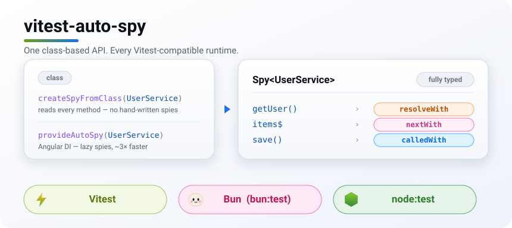
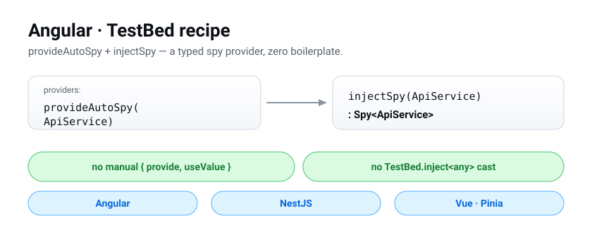

<div align="center">

# vitest-auto-spy

**Typed test spies generated from a class, for Vitest, Bun, node:test and Rstest.**

Pass a class and get a spy of every method, with helpers that match each method's return type.
No hand-written `vi.fn()` per method, and the spy never drifts from the class. It is a drop-in
replacement for [`jest-auto-spies`](https://www.npmjs.com/package/jest-auto-spies) and
[`jasmine-auto-spies`](https://www.npmjs.com/package/jasmine-auto-spies).

[](https://www.npmjs.com/package/vitest-auto-spy)
[](https://www.npmjs.com/package/vitest-auto-spy)
[](https://www.npmjs.com/package/vitest-auto-spy)
[](https://www.npmjs.com/package/vitest-auto-spy)
[](https://www.npmjs.com/package/vitest-auto-spy)
[](https://github.com/ASDAlexey/vitest-auto-spy/actions/workflows/ci.yml)
[](#install)
[](https://www.npmjs.com/package/vitest-auto-spy)
[](https://github.com/ASDAlexey/vitest-auto-spy/actions/workflows/ci.yml)
[](./LICENSE)

[](#runtimes)
[](#availability)
[](#angular-on-bun-buntest)
[](#availability)
[](#install)

📚 [**Documentation**](https://asdalexey.github.io/vitest-auto-spy/) · 🧭 [**Spec patterns**](https://asdalexey.github.io/vitest-auto-spy/recipes) · 📦 [**npm**](https://www.npmjs.com/package/vitest-auto-spy) · 🐙 [**GitHub**](https://github.com/ASDAlexey/vitest-auto-spy) · 🔖 [**Changelog**](./CHANGELOG.md)

🤖 [**AGENTS.md**](./AGENTS.md) · 🔤 [**llms.txt**](https://asdalexey.github.io/vitest-auto-spy/llms.txt) · 📄 [**llms-full.txt**](https://asdalexey.github.io/vitest-auto-spy/llms-full.txt) — works with [Claude Code, OpenAI Codex, GLM, Cursor, Copilot, Gemini CLI and the rest](#which-file-your-agent-reads)

<br/>



</div>

---

## What you get

- **A spy of every method from a class**, typed, with helpers that match each return type:
  `resolveWith` for a `Promise`, `nextWith` for an `Observable`, `mockReturnValue` for the rest.
- **Answers per argument list**: `calledWith(1).mockReturnValue(...)`.
- **A spy from a type alone**: `createAutoMock<T>()` and `mockDeep<T>()`.
- **Angular `TestBed` in one line**: `provideAutoSpy(ApiService)`, then `injectSpy(ApiService)`.
- **One API on every runner**: Vitest, Bun, `node:test` and Rstest; helpers for Angular, NestJS,
  React, Vue / Pinia and Svelte.
- **Checks that make silent tests fail**: strict mode, Observable assertions, cleanup between tests,
  56 ESLint rules.
- **Zero runtime dependencies.**

## Contents

- [Install](#install)
- [Quick start](#quick-start)
- [Core API](#core-api)
- [Availability](#availability): runners and frameworks
- [Versions and peer dependencies](#versions-and-peer-dependencies)
- [How to mock](#how-to-mock): one recipe per kind of dependency
- [Everything else](#everything-else): where to go next

> Reading this on npmjs.com? npm shows this file only up to [Everything else](#everything-else).
> The [documentation site](https://asdalexey.github.io/vitest-auto-spy/) has everything, and the
> whole README is on [GitHub](https://github.com/ASDAlexey/vitest-auto-spy#readme).

## Install

```bash
npm i -D vitest-auto-spy
```

On Vitest, including Angular's `ng test` builder, you can import the helpers in a spec right away.
If you spy on Observables, add `import 'vitest-auto-spy/rxjs'` once, usually in your setup file. For Bun, `node:test`, Rstest and Analog, see
[Installation → Wiring it up](https://asdalexey.github.io/vitest-auto-spy/core/installation#wiring-it-up).

The plural name, [`vitest-auto-spies`](https://www.npmjs.com/package/vitest-auto-spies), is an alias
that re-exports this package. Prefer the singular.

## Quick start

`UserService` loads a user through `ApiService`. The spec replaces `ApiService` with a spy and tests
the real `UserService`:

```ts
import { expect, it } from 'vitest';
import { createSpyFromClass } from 'vitest-auto-spy';

interface User {
  id: number;
  name: string;
}

class ApiService {
  async get(url: string): Promise<User> {
    const response = await fetch(url);
    return response.json();
  }
}

class UserService {
  constructor(private readonly api: ApiService) {}

  load(id: number): Promise<User> {
    return this.api.get(`/users/${id}`);
  }
}

it('loads the user from the API', async () => {
  const api = createSpyFromClass(ApiService); // every method is a spy; the constructor never runs
  api.get.resolveWith({ id: 1, name: 'Ada' }); // get() returns a Promise, so it has resolveWith

  const user = await new UserService(api).load(1);

  expect(user.name).toBe('Ada');
  expect(api.get).toHaveBeenCalledWith('/users/1');
});
```

An Angular component spec. `CheckoutComponent` injects `CartService` and shows its total:

```ts
import { TestBed } from '@angular/core/testing';
import { expect, it } from 'vitest';
import { injectSpy, provideAutoSpy, stable } from 'vitest-auto-spy/angular';

import { CartService } from './cart.service';
import { CheckoutComponent } from './checkout.component';

it('shows the cart total', async () => {
  TestBed.configureTestingModule({
    imports: [CheckoutComponent],
    providers: [provideAutoSpy(CartService)], // CartService is now a spy in TestBed
  });

  const cart = injectSpy(CartService); // typed Spy<CartService>, no cast
  cart.total.mockReturnValue(42); // configure before the component is created

  const fixture = TestBed.createComponent(CheckoutComponent);
  await stable(fixture); // runs change detection and effects, then waits

  expect(fixture.nativeElement.textContent).toContain('42');
});
```

Run it with `npx vitest`, or `ng test` on the Angular CLI. Step by step:
[Getting started](https://asdalexey.github.io/vitest-auto-spy/core/introduction).

## Core API

### `createSpyFromClass`

Creates a spy of every method of a class. Use it for any dependency that is a class.

```ts
import { createSpyFromClass } from 'vitest-auto-spy';

const cart = createSpyFromClass(CartService);
cart.total.mockReturnValue(42);

// or set answers up front, where the spy is built
const seeded = createSpyFromClass(CartService, { returns: { total: 42 } });
```

| Second argument                      | What it does                                                             |
| ------------------------------------ | ------------------------------------------------------------------------ |
| `['reload']`                         | an array: extra names to spy, besides the methods found on the prototype |
| `{ onlyMethodsToSpyOn }`             | spies only these methods                                                 |
| `{ instanceMethodsToSpyOn }`         | adds callables set in the constructor (`signal()`, arrow fields)         |
| `{ observablePropsToSpyOn }`         | Observable properties to spy (needs `vitest-auto-spy/rxjs`)              |
| `{ gettersToSpyOn, settersToSpyOn }` | accessors to spy, under `spy.accessorSpies`                              |
| `{ returns }`                        | a return value per method, set up front                                  |
| `{ strict: true }`                   | an unconfigured call throws                                              |

**Common mistake:** an arrow-function field (`load = () => {}`) is not on the prototype, so it is
not spied. List it in `instanceMethodsToSpyOn`.

Every option: [createSpyFromClass](https://asdalexey.github.io/vitest-auto-spy/core/create-spy-from-class).

### `provideAutoSpy` and `injectSpy`

`provideAutoSpy` registers a spy of a class in Angular's `TestBed`; `injectSpy` reads it back typed
as `Spy<T>`. NestJS has the same pair (`vitest-auto-spy/nestjs`); Vue has `provideAutoSpy` only.

```ts
import { injectSpy, provideAutoSpy } from 'vitest-auto-spy/angular';

TestBed.configureTestingModule({ providers: [provideAutoSpy(CartService)] });

const cart = injectSpy(CartService); // Spy<CartService>
cart.total.mockReturnValue(42);
```

`provideAutoSpy` takes the same second argument as `createSpyFromClass`.

**Common mistake:** calling `injectSpy(X)` for a class you did not `provideAutoSpy`. You get the real
service; the library warns once and names the missing provider.

Full page: [Angular](https://asdalexey.github.io/vitest-auto-spy/adapters/angular).

### `calledWith` and `mustBeCalledWith`

`calledWith(...args)` sets an answer for one argument list. `mustBeCalledWith(...args)` does the same
and throws on any other arguments.

```ts
users.getName.calledWith(1).mockReturnValue('Ada');
users.getName(1); // 'Ada'
users.getName(2); // undefined

users.getName.mustBeCalledWith(1).mockReturnValue('Ada');
users.getName(2); // throws: … Wanted: getName(1) Actual: getName(2)
```

Matchers work too: `calledWith(expect.any(Number))`.

**Common mistake:** `mockReturnValue` and `calledWith` on the same method. The one set later replaces
the other; the library warns. For a fallback answer, use the `returns` option; `calledWith` answers
still win over it: `createSpyFromClass(UserService, { returns: { getName: 'Unknown' } })`.

Full page: [Control helpers](https://asdalexey.github.io/vitest-auto-spy/core/control-helpers).

### Return-type helpers

Each spied method gets helpers for what it returns:

| Method returns  | Helpers                                                                                                                                                                                                  |
| --------------- | -------------------------------------------------------------------------------------------------------------------------------------------------------------------------------------------------------- |
| a value         | `mockReturnValue`, `calledWith(...)`, `mustBeCalledWith(...)`, `failWith(error)`                                                                                                                         |
| a `Promise`     | `resolveWith(value)`, `rejectWith(error)`, `resolveWithPerCall([...])`                                                                                                                                   |
| an `Observable` | `nextWith(value)` emits and keeps the stream open; `nextOneTimeWith(value)` emits once, then completes (like an HTTP call); `nextWithValues([...])`, `throwWith(error)`, `complete()`, `returnSubject()` |

```ts
products.load.resolveWith([product]); // load(): Promise<Product[]>
products.items$.nextWith([product]); // items$(): Observable<Product[]>
payments.charge.calledWith(42).resolveWith({ ok: true }); // calledWith chains into every helper
```

The Observable helpers need one import per project, usually in the setup file (a spec works too):
`import 'vitest-auto-spy/rxjs';`.

**Common mistake:** `nextWith is not a function`. The `vitest-auto-spy/rxjs` import is missing.

Full page: [Control helpers](https://asdalexey.github.io/vitest-auto-spy/core/control-helpers).

### `createAutoMock` and `mockDeep`

`createAutoMock<T>()` creates a spy from a TypeScript interface or type, when there is no class at
run time. `mockDeep<T>()` does the same for nested objects.

```ts
import { createAutoMock, mockDeep } from 'vitest-auto-spy';

const gateway = createAutoMock<PaymentGateway>();
gateway.charge.resolveWith({ ok: true });

const api = mockDeep<ApiClient>();
api.users.find.resolveWith([user]); // nested members are spies too
```

**Common mistake:** reading a data property you did not seed. With only a type, every unknown member
is a spy. Seed values: `createAutoMock<Config>({ apiUrl: 'https://api.test' })`.

Full page: [Auto-mock by type](https://asdalexey.github.io/vitest-auto-spy/core/auto-mock-by-type).

### `strict`

With `strict: true`, a call to a method you did not configure throws instead of returning
`undefined`. Use it so a test cannot pass on an empty answer.

```ts
const users = createSpyFromClass(UserService, { strict: true });
users.load.resolveWith([]);
users.currentTenant(); // throws: UserService.currentTenant() was called; this strict double has nothing configured for it.
```

Turn it on for the whole suite with `setupAutoSpy({ strict: true })` from `vitest-auto-spy/setup`.

Full page: [Strict mode](https://asdalexey.github.io/vitest-auto-spy/core/strict-mode).

### `setupAutoSpy`

`setupAutoSpy()` adds cleanup between tests to your setup file: it restores patched properties,
checks for two copies of the library, and can catch leaked timers, network calls and console output.

```ts
// vitest.setup.ts
import { setupAutoSpy } from 'vitest-auto-spy/setup';

setupAutoSpy(); // or setupAutoSpy({ preset: 'strict' }) for every guard
```

Every option: [Test-run hygiene](https://asdalexey.github.io/vitest-auto-spy/utilities/setup).

## Availability

Every entry point is published. Pick the one for your runner, and add a framework entry if you use
one. The API is the same everywhere.

| You use                      | Import from                               | Guide                                                                                              |
| ---------------------------- | ----------------------------------------- | -------------------------------------------------------------------------------------------------- |
| Vitest                       | `vitest-auto-spy`                         | [Vitest](https://asdalexey.github.io/vitest-auto-spy/runtimes/vitest)                              |
| Bun (`bun:test`)             | `vitest-auto-spy/bun`                     | [Bun](https://asdalexey.github.io/vitest-auto-spy/runtimes/bun)                                    |
| `node:test`                  | `vitest-auto-spy/node`                    | [node:test](https://asdalexey.github.io/vitest-auto-spy/runtimes/node)                             |
| Rstest                       | `vitest-auto-spy/rstest`                  | [Rstest](https://asdalexey.github.io/vitest-auto-spy/runtimes/rstest)                              |
| RxJS Observables             | `vitest-auto-spy/rxjs` (import once)      | [RxJS](https://asdalexey.github.io/vitest-auto-spy/runtimes/rxjs)                                  |
| Angular                      | `vitest-auto-spy/angular`                 | [Angular](https://asdalexey.github.io/vitest-auto-spy/adapters/angular)                            |
| Angular `HttpClient`         | `vitest-auto-spy/angular-http`            | [Angular HTTP](https://asdalexey.github.io/vitest-auto-spy/adapters/angular-http)                  |
| Angular router               | `vitest-auto-spy/angular-router`          | [Angular router](https://asdalexey.github.io/vitest-auto-spy/adapters/angular-router)              |
| Angular signal forms         | `vitest-auto-spy/signal-forms`            | [Signal forms](https://asdalexey.github.io/vitest-auto-spy/adapters/signal-forms)                  |
| Angular on Bun               | `vitest-auto-spy/bun-angular` (a preload) | [Angular on Bun](https://asdalexey.github.io/vitest-auto-spy/runtimes/bun-angular)                 |
| NestJS                       | `vitest-auto-spy/nestjs`                  | [NestJS](https://asdalexey.github.io/vitest-auto-spy/adapters/nestjs)                              |
| React                        | `vitest-auto-spy/react`                   | [React](https://asdalexey.github.io/vitest-auto-spy/adapters/react)                                |
| Vue / Pinia                  | `vitest-auto-spy/vue`                     | [Vue](https://asdalexey.github.io/vitest-auto-spy/adapters/vue)                                    |
| Svelte                       | `vitest-auto-spy/svelte`                  | [Svelte](https://asdalexey.github.io/vitest-auto-spy/adapters/svelte)                              |
| a `jasmine-auto-spies` suite | `vitest-auto-spy/jasmine`                 | [Migrating from jasmine-auto-spies](https://asdalexey.github.io/vitest-auto-spy/migrating-jasmine) |

Other entry points hold utilities: `/setup`, `/console`, `/dom-stubs`, `/diagnostics`, `/zone`,
`/eslint-plugin` and more. Full list: [Installation → Entry points](https://asdalexey.github.io/vitest-auto-spy/core/installation#entry-points).

## Versions and peer dependencies

### Requirements

| Tool       | Minimum                                                          |
| ---------- | ---------------------------------------------------------------- |
| Node.js    | 22; CI runs 22, 24 and 26                                        |
| Vitest     | 2.1; one install covers 2.1 through 5.x                          |
| Angular    | 20 for the Angular entry points, 22 for `/signal-forms`          |
| Bun        | 1.4 for `vitest-auto-spy/bun-angular`; any recent Bun for `/bun` |
| TypeScript | 4.7 for the typed helpers; plain JavaScript works without types  |

Vitest 5 needs no change on your side. Why each minimum is what it is:
[Compatibility](https://asdalexey.github.io/vitest-auto-spy/core/compatibility).

The package ships ESM with bundled types. `vitest-auto-spy/node` and `vitest-auto-spy/eslint-plugin`
also ship CommonJS.

### Peer dependencies

Every peer is optional: install one only if you use the entry point that needs it. The package has
no runtime dependencies.

| Peer                        | Needed for                                                                       | Version  |
| --------------------------- | -------------------------------------------------------------------------------- | -------- |
| `vitest`                    | the default entry `vitest-auto-spy` and every Vitest-only entry                  | `>=2.1`  |
| `rxjs`                      | Observable spies from `vitest-auto-spy/rxjs`; rxjs 8 works too                   | `>=7.2`  |
| `@angular/core`             | `vitest-auto-spy/angular` and `vitest-auto-spy/bun-angular`                      | `>=20`   |
| `@angular/common`           | `vitest-auto-spy/angular-http` only                                              | `>=20`   |
| `@angular/router`           | `vitest-auto-spy/angular-router` only                                            | `>=20`   |
| `@angular/forms`            | `vitest-auto-spy/signal-forms` only; signal forms need Angular 22                | `>=20`   |
| `@angular/platform-browser` | `By` and the directive matchers, and the Bun preload                             | `>=20`   |
| `@angular/compiler`         | `vitest-auto-spy/angular/matchers` and the `vitest-auto-spy/bun-angular` preload | `>=20`   |
| `@rstest/core`              | `vitest-auto-spy/rstest` only                                                    | `>=0.11` |

A suite on `vitest-auto-spy/bun` or `vitest-auto-spy/node` does not need Vitest installed, and its
types check without it.

## How to mock

One short recipe per kind of dependency. Each links to the full page.

### How to mock: a service behind Angular DI

```ts
import { injectSpy, provideAutoSpy } from 'vitest-auto-spy/angular';

TestBed.configureTestingModule({ providers: [provideAutoSpy(CartService)] });

const cart = injectSpy(CartService); // Spy<CartService>
cart.total.mockReturnValue(42);
```

Because `provideAutoSpy` reads the real class, a method you add to `CartService` appears on the spy
too. A hand-written `{ provide: CartService, useValue: { total: vi.fn() } }` stays out of date.

A primitive token is still fine as `useValue`: `{ provide: IS_BROWSER, useValue: false }`. The lint
rules `no-mistyped-use-value` and `no-unknown-use-value-key` check such values and keys, which
Angular types as `any`.

On Vitest 4.1+, `extendWithAutoSpies` gives the spies as test fixtures:

```ts
import { of } from 'rxjs';
import { test as base } from 'vitest';
import { extendWithAutoSpies } from 'vitest-auto-spy/angular';

const test = extendWithAutoSpies(base, { cart: CartService, products: [ProductApi, { returns: { list: of([]) } }] });

test('checks out', ({ cart }) => cart.total.mockReturnValue(42));
```

It throws `needs Vitest 4.1 or newer` on an older Vitest.
[Details](https://asdalexey.github.io/vitest-auto-spy/adapters/angular#fixtures-instead-of-let-beforeeach-—-extendwithautospies)

### How to mock: a service without DI

```ts
import { createAutoMock, createSpyFromClass } from 'vitest-auto-spy';

const cart = createSpyFromClass(CartService); // from a class
const gateway = createAutoMock<PaymentGateway>(); // from a type/interface alone
```

The constructor never runs. Use `createAutoMock<T>()` when there is no class at run time: an
interface, a type alias, a `.d.ts`.

### How to mock: an object the test already holds

`createSpyFromInstance` turns an existing object into a spy in place. Use it when other code already
holds a reference to the object (a closure, a DI container, a subscription).

```ts
import { createSpyFromInstance, restoreSpiedInstance } from 'vitest-auto-spy';

const client = new PaymentsClient(config); // real, and already wired into the code under test
const spy = createSpyFromInstance(client); // same object, now typed as Spy<PaymentsClient>

spy.charge.calledWith(100).resolveWith({ ok: true });
await checkout.pay(100);

expect(spy.charge).toHaveBeenCalledWith(100);
restoreSpiedInstance(client); // client.charge is the real method again
```

- It takes most of the options of `createSpyFromClass`.
- With `{ passthrough: true }`, each method keeps running its real code and records its calls, until
  you configure that method: `createSpyFromInstance(TestBed.inject(CartService), { passthrough: true })`.
- To undo: `restoreSpiedInstance(instance)`, `restoreMockedProps()`, or `using spy = …`.

[Details](https://asdalexey.github.io/vitest-auto-spy/core/create-spy-from-class#passthrough)

### How to mock: a plain data fixture

`createMock<T>(partial)` builds typed test data from the fields you pass. Use it instead of an
object literal with `as T`.

```ts
const device = { id: '1', name: 'TV', isOffline: false } as Device; // ❌ a key Device lacks still compiles
const device = createMock<Device>({ id: '1', name: 'TV' }); // ✅ checked at every depth
```

Unnamed fields are `undefined`, as with the cast, but an unknown key is a compile error. Where the
value already sits in a typed slot (an argument, a typed `const`), just delete the cast. The
`prefer-create-mock` lint rule finds the casts.
[Details](https://asdalexey.github.io/vitest-auto-spy/utilities/fixtures)

### How to mock: reading a spy back from DI

```ts
const cart = injectSpy(CartService); // typed Spy<CartService>, no cast
```

**Common mistake:** `vi.spyOn(TestBed.inject(CartService), 'total')`. It replaces one method and
leaves the rest of a real service running.

### How to mock: a whole class's dependencies at once

`createWithAutoSpies` builds a class through Angular DI and spies every dependency you did not
provide:

```ts
import { createWithAutoSpies } from 'vitest-auto-spy/angular';

const { instance, spies } = createWithAutoSpies(CartService);

spies.get(PricingService).total.mockReturnValue(100);
instance.checkout(3);

expect(spies.get(PricingService).total).toHaveBeenCalled();
```

Pass `providers` for the ones you want to control yourself; they win.
[Details](https://asdalexey.github.io/vitest-auto-spy/adapters/angular#building-a-class-with-auto-spied-dependencies)

### How to mock: a readonly property or a signal

```ts
import { mockReadonlyProp, mockValueProp, restoreMockedProps } from 'vitest-auto-spy';

mockReadonlyProp(store, 'items', signal([task])); // readonly field, signal(), computed()
mockValueProp(service, 'retries', 3); // a field the code assigns to
```

These helpers remember what they replaced, and one `restoreMockedProps()` undoes them all.
[`setupAutoSpy()`](#setupautospy) runs it after every test.

**Common mistake:** `Object.defineProperty` in a spec. Nothing undoes it, and under
`isolate: false` it leaks into the next file.
[Details](https://asdalexey.github.io/vitest-auto-spy/adapters/angular#signal-readonly-property-mocking)

### How to mock: an Observable

```ts
import { expectEmission } from 'vitest-auto-spy';

cart.items$.nextWith([task]); // drive the stream from the spy

await expect(expectEmission(component.visible$)).resolves.toBe(true); // the first value, not a list
```

**Common mistake:** `source$.subscribe(value => expect(value).toEqual(…))`. If the stream never
emits, nothing is asserted and the test passes. `expectEmission` fails on a silent stream.
[Details](https://asdalexey.github.io/vitest-auto-spy/core/observable-assertions)

### How to mock: an overloaded method

A spy uses the last overload of a method by default. Name the one you mean on the declaration:

```ts
import type { Spy } from 'vitest-auto-spy';

let shelves: Spy<ShelvesClient, { overload: { getShelf: 'first' } }>;

shelves = createSpyFromClass(ShelvesClient); // no second type argument here
shelves.getShelf.nextWith(page); // checked against the first signature
```

**Common mistake:** `@ts-expect-error` on the line. It also hides a fixture of the wrong shape. The
`no-ts-expect-error-on-double` rule reports it.
[Details](https://asdalexey.github.io/vitest-auto-spy/core/spy-typing)

### How to mock: a call that has to throw

```ts
cart.checkout.failWith(new HttpErrorResponse({ status: 500 })); // every call throws
cart.checkout.calledWith(BAD_ID).failWith(new Error('unknown cart')); // only these arguments
```

`failWith` works on a method of any return type, on every runner.
[Details](https://asdalexey.github.io/vitest-auto-spy/core/control-helpers#making-a-call-throw-—-failwith)

### How to mock: a promise a test forgets to await

```ts
// ❌ the test ends before the callback runs, so the assertion never runs at all
it('renders once compiled', () => {
  TestBed.compileComponents().then(() => expect(component.ready).toBe(true));
});

// ✅ the assertion lands inside the test
it('renders once compiled', async () => {
  await TestBed.compileComponents();

  expect(component.ready).toBe(true);
});
```

Under zone.js, an assertion that fails inside an un-awaited `.then()` does not even reach the runner.
`setupAutoSpy({ strayRejections: true })` makes it fail the test, and the `no-floating-assertion`
lint rule finds the shape before it runs.
[Details](https://asdalexey.github.io/vitest-auto-spy/utilities/setup#_8-failing-on-a-rejection-zone-js-swallowed)

### How to mock: a component's children

```ts
import { provideAutoSpy, renderShallow } from 'vitest-auto-spy/angular';

const { fixture, component } = renderShallow(TaskListComponent, {
  providers: [provideAutoSpy(TaskService)],
  inputs: { projectId: 42 },
});
```

`renderShallow` renders through the real `TestBed` without child components. `fixture` is a real
`ComponentFixture`. `keepTemplate` and `keepChildren` keep parts of the template:
[Shallow component rendering](https://asdalexey.github.io/vitest-auto-spy/adapters/angular#shallow-component-rendering).

### How to mock: a child the template still binds

`createComponentStub` builds a stand-in child from the real one's selector, inputs and outputs, so
it cannot drift:

```ts
import { createComponentStub } from 'vitest-auto-spy/angular';

const ChartStub = createComponentStub(ChartComponent);

TestBed.configureTestingModule({ imports: [DashboardComponent] });
TestBed.overrideComponent(DashboardComponent, { remove: { imports: [ChartComponent] }, add: { imports: [ChartStub] } });

const chart = fixture.debugElement.query(By.directive(ChartStub)).componentInstance;
expect(chart.series()).toEqual([1, 2, 3]);
chart.pointSelected.emit(2);
```

Directives and pipes work the same way. With `renderShallow`: `{ keepTemplate: true, keepChildren: [ChartStub] }`.
[Details](https://asdalexey.github.io/vitest-auto-spy/adapters/angular#a-stand-in-for-a-child-createcomponentstub)

### How to mock: a lifecycle hook

Spy on the prototype, before the component is created:

```ts
const init = vi.spyOn(CardComponent.prototype, 'ngOnInit').mockImplementation(() => undefined);
const fixture = TestBed.createComponent(CardComponent);

fixture.detectChanges();
expect(init).toHaveBeenCalledTimes(1);
```

**Common mistake:** `vi.spyOn(component, 'ngOnInit')` on the instance. Angular never calls it, so
the real hook runs. The `no-instance-lifecycle-spy` rule reports it. Better still, assert what the
hook does.

### How to mock: a class the code under test builds with `new`

`createSpyClass` is a real constructor whose instances are full spies:

```ts
import { createSpyClass, mockValueProp } from 'vitest-auto-spy';

const WorkerSpy = createSpyClass(BackgroundWorker);

mockValueProp(globalThis, 'BackgroundWorker', WorkerSpy);
service.start();

expect(WorkerSpy.calls[0]).toEqual(['./task.js']);
WorkerSpy.instances[0].postMessage.mockReturnValue(undefined);
```

- `calls` holds the constructor arguments, `instances` the spy each call produced.
- `createSpyClass(BackgroundWorker, undefined, { statics: true })` also copies static members:
  functions become spies, data is copied, getters are skipped.
- With no class at run time (a browser global, a vendor SDK), use `mockConstructor`, or
  `stubConstructor(globalThis, 'Image', () => ({ src: '' }))`, which `restoreMockedProps()` removes.

**Common mistake:** `vi.fn().mockImplementation(() => obj)` called with `new`. An arrow function is
not a constructor, so you get `TypeError: … is not a constructor` or an empty object.
[Details](https://asdalexey.github.io/vitest-auto-spy/utilities/constructor-doubles)

### How to mock: a double more than one spec uses

```ts
// ❌ a constant: one set of spies for the whole worker
export const actionContext = { actions: { navigateToSection: vi.fn() } };

// ✅ a factory: one set per caller
export const createActionContext = () => ({ actions: { navigateToSection: vi.fn() } });
```

Under `isolate: false` a module runs once per worker, so an exported constant is shared by every
file. Put shared doubles in a `*.mock.ts` file, and never export from a spec file. The
`no-shared-module-level-mock` rule finds these.

### How to mock: a pipe

A pipe is a class with one method:

```ts
const currency = createSpyFromClass(CurrencyPipe);

currency.transform.calledWith(10, 'EUR').mockReturnValue('€10');
```

In a component spec, provide it with `provideAutoSpy(CurrencyPipe)`, or drop it with `renderShallow`.
To keep the template and replace the pipe in it:
`createComponentStub(CurrencyPipe, { transform: (value) => String(value) })`.

### How to mock: `localStorage` and `sessionStorage`

```ts
import { stubWebStorage } from 'vitest-auto-spy/dom-stubs';

const local = stubWebStorage('localStorage', { items: { token: 'abc' } });

session.logout();

expect(local.snapshot()).toEqual({});
```

An in-memory `Storage`, installed in `beforeEach` and removed by `restoreMockedProps()`.
[Details](https://asdalexey.github.io/vitest-auto-spy/guides/mocking-local-storage)

### How to mock: a Web Worker

```ts
import { stubWorker } from 'vitest-auto-spy/dom-stubs';

const workers = stubWorker<TreeRequest, TreeResponse>({
  respond: (request) => ({ requestId: request.requestId, nodes: [] }),
});

await firstValueFrom(service.visibleNodes(request));

expect(workers.last.messages).toEqual([request]);
```

`respond` answers each message on a microtask. Without it, drive the worker with
`workers.last.emit(data)` / `fail(error)`.
[Details](https://asdalexey.github.io/vitest-auto-spy/utilities/worker-stub)

### How to mock: `fetch` and other globals

```ts
import { mockValueProp } from 'vitest-auto-spy';
import { stubResponse } from 'vitest-auto-spy/setup';

beforeEach(() => {
  mockValueProp(
    globalThis,
    'fetch',
    vi.fn(async () => stubResponse({ body: user })),
  );
});
```

- `mockValueProp` puts the original back after each test (through `setupAutoSpy()`).
- `stubResponse` builds a real `Response`: data goes out as JSON (`null` included); `undefined` or
  no `body` sends no body. A body can be read once, so build a new one per call.
- To only keep tests off the network, use
  [`blockNetwork()`](https://asdalexey.github.io/vitest-auto-spy/utilities/setup#_5-keeping-the-run-off-the-network).

**Common mistake:** `global.fetch = vi.fn()`. No cleanup reaches it, so it answers every later test
of the file. The `no-hand-assigned-global` rule reports it.
[Details](https://asdalexey.github.io/vitest-auto-spy/utilities/setup#answering-a-stubbed-fetch-—-stubresponse)

### How to mock: the console

```ts
import { useConsoleSpies } from 'vitest-auto-spy/console';

const { consoleErrorSpy } = useConsoleSpies();

it('reports a failed load', () => {
  service.load();

  expect(consoleErrorSpy).toHaveBeenCalledWith('load failed', expect.any(Error));
});
```

`useConsoleSpies()` installs silent spies before each test and restores the console after. It works
on every runner. `consoleOutput()` returns everything logged, per channel, for one exact assertion.

**Common mistakes:**

- A bare `vi.spyOn(console, 'error')` still prints; add `.mockImplementation(() => undefined)`.
- Relying on the import alone: it installs once per worker, and under `isolate: false` silences every
  later file.

`setupAutoSpy({ strayConsole: 'throw' })` fails any test whose output nothing absorbed.
[Details](https://asdalexey.github.io/vitest-auto-spy/utilities/console)

### How to mock: a jasmine suite mid-migration

`vitest-auto-spy/jasmine` keeps jasmine's `.and`, `.calls` and `.withArgs` working, so changing the
import is enough to run the suite:

```ts
import { type Spy, createSpyFromClass } from 'vitest-auto-spy/jasmine';

const service: Spy<AccountService> = createSpyFromClass(AccountService);

service.load.and.returnValue('stubbed'); // .mockReturnValue(…) once the shim is gone
service.load.and.nextWith(account); // .nextWith(…) once the shim is gone
service.load.withArgs(7).and.returnValue('seven'); // .calledWith(7).mockReturnValue(…)
expect(service.load.calls.count()).toBe(1); // service.load.mock.calls.length
```

On `bun test` or `node --test`, call `enableJasmineCompat()` from `vitest-auto-spy/jasmine-compat` in
the setup file instead. Spies created before that call do not get the jasmine API.
`npx vitest-auto-spy codemod --from jasmine` rewrites the calls.
[Details](https://asdalexey.github.io/vitest-auto-spy/migrating-jasmine)

## Everything else

npmjs.com shows a README only up to its first 64 kB, so this is where the npm page ends. Next:

- [Getting started](https://asdalexey.github.io/vitest-auto-spy/core/introduction): a first spec,
  step by step.
- [Installation](https://asdalexey.github.io/vitest-auto-spy/core/installation): wiring for
  `ng test`, Vitest, Bun, `node:test` and Rstest.
- [Spec patterns](https://asdalexey.github.io/vitest-auto-spy/recipes): the shapes a large Angular
  suite settled on.
- [API](https://asdalexey.github.io/vitest-auto-spy/api): every export.
- [The CLI](https://asdalexey.github.io/vitest-auto-spy/utilities/cli) and
  [ESLint rules](https://asdalexey.github.io/vitest-auto-spy/utilities/eslint-rules).
- [Migrating from jest-auto-spies](https://asdalexey.github.io/vitest-auto-spy/migrating) or
  [from jasmine-auto-spies](https://asdalexey.github.io/vitest-auto-spy/migrating-jasmine).
- [Agents](https://asdalexey.github.io/vitest-auto-spy/agents): pointing a coding agent at the
  `AGENTS.md` inside the package.

The whole README, with its full table of contents, is on
[GitHub](https://github.com/ASDAlexey/vitest-auto-spy#everything-else).

<!-- npm-readme-cut
npmjs.com cuts the README at 65 536 characters. The cut has to fall inside this comment: npm then
renders everything above it and nothing after, and GitHub renders none of it. The dots are filler
that keeps the cut inside; `node scripts/check-readme-npm-cut.mjs --write` resizes them.
....................................................................................................
....................................................................................................
....................................................................................................
....................................................................................................
....................................................................................................
....................................................................................................
....................................................................................................
....................................................................................................
....................................................................................................
....................................................................................................
....................................................................................................
....................................................................................................
....................................................................................................
....................................................................................................
....................................................................................................
....................................................................................................
....................................................................................................
....................................................................................................
....................................................................................................
....................................................................................................
....................................................................................................
....................................................................................................
....................................................................................................
....................................................................................................
....................................................................................................
....................................................................................................
....................................................................................................
....................................................................................................
....................................................................................................
....................................................................................................
....................................................................................................
....................................................................................................
....................................................................................................
....................................................................................................
....................................................................................................
....................................................................................................
....................................................................................................
....................................................................................................
....................................................................................................
....................................................................................................
....................................................................................................
....................................................................................................
....................................................................................................
....................................................................................................
....................................................................................................
....................................................................................................
....................................................................................................
....................................................................................................
....................................................................................................
....................................................................................................
....................................................................................................
....................................................................................................
....................................................................................................
....................................................................................................
....................................................................................................
....................................................................................................
....................................................................................................
....................................................................................................
....................................................................................................
....................................................................................................
....................................................................................................
....................................................................................................
....................................................................................................
....................................................................................................
....................................................................................................
....................................................................................................
....................................................................................................
....................................................................................................
....................................................................................................
....................................................................................................
....................................................................................................
....................................................................................................
....................................................................................................
....................................................................................................
....................................................................................................
....................................................................................................
....................................................................................................
....................................................................................................
....................................................................................................
....................................................................................................
....................................................................................................
....................................................................................................
....................................................................................................
....................................................................................................
....................................................................................................
....................................................................................................
....................................................................................................
....................................................................................................
....................................................................................................
....................................................................................................
....................................................................................................
....................................................................................................
....................................................................................................
....................................................................................................
....................................................................................................
....................................................................................................
....................................................................................................
....................................................................................................
....................................................................................................
....................................................................................................
....................................................................................................
....................................................................................................
....................................................................................................
....................................................................................................
....................................................................................................
....................................................................................................
....................................................................................................
....................................................................................................
....................................................................................................
....................................................................................................
....................................................................................................
....................................................................................................
....................................................................................................
....................................................................................................
....................................................................................................
....................................................................................................
....................................................................................................
....................................................................................................
....................................................................................................
....................................................................................................
....................................................................................................
....................................................................................................
....................................................................................................
....................................................................................................
....................................................................................................
....................................................................................................
....................................................................................................
....................................................................................................
....................................................................................................
....................................................................................................
....................................................................................................
....................................................................................................
....................................................................................................
....................................................................................................
....................................................................................................
....................................................................................................
....................................................................................................
....................................................................................................
....................................................................................................
....................................................................................................
....................................................................................................
....................................................................................................
....................................................................................................
....................................................................................................
....................................................................................................
....................................................................................................
....................................................................................................
....................................................................................................
....................................................................................................
....................................................................................................
....................................................................................................
....................................................................................................
....................................................................................................
....................................................................................................
....................................................................................................
....................................................................................................
....................................................................................................
....................................................................................................
....................................................................................................
....................................................................................................
....................................................................................................
....................................................................................................
....................................................................................................
....................................................................................................
....................................................................................................
....................................................................................................
....................................................................................................
....................................................................................................
....................................................................................................
....................................................................................................
....................................................................................................
....................................................................................................
....................................................................................................
....................................................................................................
....................................................................................................
....................................................................................................
....................................................................................................
....................................................................................................
....................................................................................................
....................................................................................................
....................................................................................................
....................................................................................................
....................................................................................................
....................................................................................................
....................................................................................................
....................................................................................................
....................................................................................................
....................................................................................................
....................................................................................................
....................................................................................................
....................................................................................................
....................................................................................................
....................................................................................................
....................................................................................................
....................................................................................................
....................................................................................................
....................................................................................................
....................................................................................................
....................................................................................................
....................................................................................................
....................................................................................................
....................................................................................................
....................................................................................................
....................................................................................................
....................................................................................................
....................................................................................................
....................................................................................................
....................................................................................................
....................................................................................................
....................................................................................................
....................................................................................................
....................................................................................................
....................................................................................................
....................................................................................................
....................................................................................................
....................................................................................................
....................................................................................................
....................................................................................................
....................................................................................................
....................................................................................................
....................................................................................................
....................................................................................................
....................................................................................................
....................................................................................................
....................................................................................................
....................................................................................................
....................................................................................................
....................................................................................................
....................................................................................................
....................................................................................................
....................................................................................................
....................................................................................................
....................................................................................................
....................................................................................................
....................................................................................................
....................................................................................................
....................................................................................................
....................................................................................................
....................................................................................................
....................................................................................................
....................................................................................................
....................................................................................................
....................................................................................................
....................................................................................................
....................................................................................................
....................................................................................................
....................................................................................................
....................................................................................................
....................................................................................................
....................................................................................................
....................................................................................................
....................................................................................................
....................................................................................................
....................................................................................................
....................................................................................................
....................................................................................................
....................................................................................................
....................................................................................................
....................................................................................................
....................................................................................................
....................................................................................................
....................................................................................................
....................................................................................................
....................................................................................................
....................................................................................................
....................................................................................................
....................................................................................................
....................................................................................................
....................................................................................................
....................................................................................................
....................................................................................................
....................................................................................................
....................................................................................................
....................................................................................................
....................................................................................................
....................................................................................................
....................................................................................................
....................................................................................................
....................................................................................................
....................................................................................................
....................................................................................................
....................................................................................................
....................................................................................................
....................................................................................................
....................................................................................................
....................................................................................................
....................................................................................................
....................................................................................................
....................................................................................................
....................................................................................................
....................................................................................................
....................................................................................................
....................................................................................................
....................................................................................................
....................................................................................................
....................................................................................................
....................................................................................................
-->

## Table of contents

- [What you get](#what-you-get)
- [Contents](#contents)
- [Install](#install)
- [Quick start](#quick-start)
- [Core API](#core-api)
  - [`createSpyFromClass`](#createspyfromclass)
  - [`provideAutoSpy` and `injectSpy`](#provideautospy-and-injectspy)
  - [`calledWith` and `mustBeCalledWith`](#calledwith-and-mustbecalledwith)
  - [Return-type helpers](#return-type-helpers)
  - [`createAutoMock` and `mockDeep`](#createautomock-and-mockdeep)
  - [`strict`](#strict)
  - [`setupAutoSpy`](#setupautospy)
- [Availability](#availability)
- [Versions and peer dependencies](#versions-and-peer-dependencies)
  - [Requirements](#requirements)
  - [Peer dependencies](#peer-dependencies)
- [How to mock](#how-to-mock)
  - [A service behind Angular DI](#how-to-mock-a-service-behind-angular-di)
  - [A service without DI](#how-to-mock-a-service-without-di)
  - [An object the test already holds](#how-to-mock-an-object-the-test-already-holds)
  - [A plain data fixture](#how-to-mock-a-plain-data-fixture)
  - [Reading a spy back from DI](#how-to-mock-reading-a-spy-back-from-di)
  - [A whole class's dependencies at once](#how-to-mock-a-whole-classs-dependencies-at-once)
  - [A readonly property or a signal](#how-to-mock-a-readonly-property-or-a-signal)
  - [An Observable](#how-to-mock-an-observable)
  - [An overloaded method](#how-to-mock-an-overloaded-method)
  - [A call that has to throw](#how-to-mock-a-call-that-has-to-throw)
  - [A promise a test forgets to await](#how-to-mock-a-promise-a-test-forgets-to-await)
  - [A component's children](#how-to-mock-a-components-children)
  - [A child the template still binds](#how-to-mock-a-child-the-template-still-binds)
  - [A lifecycle hook](#how-to-mock-a-lifecycle-hook)
  - [A class the code under test builds with `new`](#how-to-mock-a-class-the-code-under-test-builds-with-new)
  - [A double more than one spec uses](#how-to-mock-a-double-more-than-one-spec-uses)
  - [A pipe](#how-to-mock-a-pipe)
  - [`localStorage` and `sessionStorage`](#how-to-mock-localstorage-and-sessionstorage)
  - [A Web Worker](#how-to-mock-a-web-worker)
  - [`fetch` and other globals](#how-to-mock-fetch-and-other-globals)
  - [The console](#how-to-mock-the-console)
  - [A jasmine suite mid-migration](#how-to-mock-a-jasmine-suite-mid-migration)
- [Everything else](#everything-else)
- [New in 5](#new-in-5)
- [New in 4](#new-in-4)
- [The CLI — `doctor`, `perf`, `codemod`, `init` and `ng-test`](#the-cli--doctor-perf-codemod-init-and-ng-test)
  - [`doctor` — defects that never fail](#doctor--defects-that-never-fail)
  - [`perf` — where the CPU time actually goes](#perf--where-the-cpu-time-actually-goes)
  - [`codemod` — migrating a suite off `jest-auto-spies`](#codemod--migrating-a-suite-off-jest-auto-spies)
  - [`init` — the pointer an agent reads](#init--the-pointer-an-agent-reads)
- [Using this library with an AI agent](#using-this-library-with-an-ai-agent)
  - [Point your agent at it once](#point-your-agent-at-it-once)
  - [Which file your agent reads](#which-file-your-agent-reads)
  - [Install it in your agent](#install-it-in-your-agent)
  - [OpenAI Codex](#openai-codex)
  - [GLM (z.ai), Kimi K3 and other Claude-compatible models](#glm-zai-kimi-k3-and-other-claude-compatible-models)
  - [Gemini CLI](#gemini-cli)
  - [Claude Code plugin](#claude-code-plugin)
- [Why](#why)
- [How it works (and what it won't spy)](#how-it-works-and-what-it-wont-spy)
- [Entry points & runtimes](#entry-points--runtimes)
  - [Runtimes](#runtimes)
- [Angular on Bun (`bun:test`)](#angular-on-bun-buntest)
- [Comparison](#comparison)
  - [@testing-library/angular /vitest-utils](#testing-libraryangular-vitest-utils)
- [The spy engine](#the-spy-engine)
- [Benchmarks](#benchmarks)
  - [Reproducing the numbers](#reproducing-the-numbers)
- [Migrating from jest-auto-spies](#migrating-from-jest-auto-spies)
- [Migrating from jasmine-auto-spies](#migrating-from-jasmine-auto-spies)
- [Migrating from @ngneat/spectator](https://asdalexey.github.io/vitest-auto-spy/migrating-spectator)
- [Migrating from @testing-library/angular](https://asdalexey.github.io/vitest-auto-spy/migrating-testing-library-angular)
- [Configuration](#configuration)
  - [The composition belongs to the class — `registerAutoSpyDefaults`](#the-composition-belongs-to-the-class--registerautospydefaults)
  - [Spying instance-assigned callables (`signal()`, arrow props, `signalStore()`)](#spying-instance-assigned-callables-signal-arrow-props-signalstore)
  - [Strict doubles — fail on a method nobody configured](#strict-doubles--fail-on-a-method-nobody-configured)
- [Auto-mock by type (no class needed)](#auto-mock-by-type-no-class-needed)
  - [A model many specs build — `createFixture` / `createFixtureFactory`](#a-model-many-specs-build--createfixture--createfixturefactory)
- [Synchronous methods](#synchronous-methods)
  - [Matching order, and re-configuring the same arguments](#matching-order-and-re-configuring-the-same-arguments)
- [Promise-returning methods](#promise-returning-methods)
- [Observable-returning methods & Observable properties](#observable-returning-methods--observable-properties)
  - [Standalone observable builder](#standalone-observable-builder)
- [Getters & setters](#getters--setters)
- [Resetting — `using`, `resetAutoSpy`, `clearAutoSpy`](#resetting--using-resetautospy-clearautospy)
- [Framework adapters](#framework-adapters)
  - [Angular](#angular)
    - [Signal / readonly property mocking (bonus)](#signal--readonly-property-mocking-bonus)
    - [Shallow component rendering](#shallow-component-rendering)
    - [Typed elements under a strict lint](#typed-elements-under-a-strict-lint)
    - [Building a class with auto-spied dependencies](#building-a-class-with-auto-spied-dependencies)
    - [Zoneless waiting](#zoneless-waiting)
    - [Settling a `resource()` or `httpResource()`](#settling-a-resource-or-httpresource)
    - [Driving a resource with no HTTP at all](#driving-a-resource-with-no-http-at-all)
    - [Asserting a signal's value](#asserting-a-signals-value)
    - [Where a spec spends its time](#where-a-spec-spends-its-time)
    - [A provider the component declares for itself](#a-provider-the-component-declares-for-itself)
    - [Diagnostics — five silent failures made loud](#diagnostics--five-silent-failures-made-loud)
    - [Which collaborators the code asked for](#which-collaborators-the-code-asked-for)
    - [An `ActivatedRoute` whose halves agree — `vitest-auto-spy/angular-router`](#an-activatedroute-whose-halves-agree--vitest-auto-spyangular-router)
  - [NestJS](#nestjs)
    - [`httpResource()` and `HttpClient` — `vitest-auto-spy/angular-http`](#httpresource-and-httpclient--vitest-auto-spyangular-http)
  - [React (Testing Library)](#react-testing-library)
  - [Vue / Pinia](#vue--pinia)
  - [Svelte](#svelte)
  - [Which factory, and what it costs](#which-factory-and-what-it-costs)
- [Utilities](#utilities)
  - [Console spies — `vitest-auto-spy/console`](#console-spies--vitest-auto-spyconsole)
  - [Taking hold of an argument — `captureArg`](#taking-hold-of-an-argument--capturearg)
  - [Why a spy answered what it did — `explainSpy`](#why-a-spy-answered-what-it-did--explainspy)
- [Observable assertions](#observable-assertions)
- [Test-run hygiene](#test-run-hygiene)
  - [`node:test` retains every mock](#nodetest-retains-every-mock)
- [Fake timers](#fake-timers)
- [Observer stubs](#observer-stubs)
- [ESLint plugin](#eslint-plugin)
- [Editor diagnostics — WebStorm & VS Code](#editor-diagnostics--webstorm--vs-code)
  - [WebStorm and the other JetBrains IDEs](#webstorm-and-the-other-jetbrains-ides)
  - [VS Code, Cursor, Windsurf, VSCodium](#vs-code-cursor-windsurf-vscodium)
- [Bridging `Spy<T>` and `T`](#bridging-spyt-and-t)
  - [Error → cure](#error--cure)
- [API reference](#api-reference)
- [FAQ & troubleshooting](#faq--troubleshooting)
- [Versioning](#versioning)
- [Contributing](#contributing)
- [Acknowledgements](#acknowledgements)
- [License](#license)

## New in 5

Version 5 changes no helper, no option and no runtime behaviour. It changes the peer ranges, so
they match what the code can actually run on:

| What changed                                                                                          | What you do                                              |
| ----------------------------------------------------------------------------------------------------- | -------------------------------------------------------- |
| Angular peer floor is `>=20` (was `>=16.0.0`, which admitted majors where an entry point cannot load) | nothing on any Angular that Angular still supports       |
| `@angular/platform-browser` is a declared optional peer (`/angular` imports `By` from it)             | nothing; pnpm users stop seeing a resolve error          |
| rxjs peer floor is `>=7.2`, and rxjs 8 is allowed (operators now come from the root `rxjs` entry)     | move off `rxjs@7.0` / `7.1` if you pinned one on purpose |
| `flushEffects()` calls `TestBed.tick()` directly; the `ApplicationRef.tick()` fallback is gone        | nothing                                                  |

Full list: [Upgrading to 5.0](https://asdalexey.github.io/vitest-auto-spy/upgrading-5).

## New in 4

Version 4 removed weight from your project. Nothing was removed or renamed; two import paths moved.

| What changed                                                                                                        | What you do                                                            |
| ------------------------------------------------------------------------------------------------------------------- | ---------------------------------------------------------------------- |
| The type declarations no longer reference rxjs, so rxjs leaves your TypeScript program                              | keep `import 'vitest-auto-spy/rxjs'` if you use the observable helpers |
| DOM stubs and run diagnostics moved to `vitest-auto-spy/dom-stubs` and `vitest-auto-spy/diagnostics`                | change those two import paths                                          |
| Observable detection is structural, so an `Observable` from a second copy of rxjs still gets the observable helpers | nothing                                                                |
| Every lint rule ships as `error`; you pick which ones block a merge in your config                                  | adjust severities in your ESLint config if needed                      |

Put `import 'vitest-auto-spy/rxjs'` in a setup file, a spec, or a `.d.ts` your `tsconfig` includes.
That import keeps `returnSubject()` typed as rxjs's own `Subject<T>`. Under
`@angular/build:unit-test` 22.2+, the test program is only the specs, the setup files and `.d.ts`
files, so a plain `.ts` listed in the spec `tsconfig` is not enough.

Full list, with measurements: [Upgrading to 4.0](https://asdalexey.github.io/vitest-auto-spy/upgrading-4).

## The CLI — `doctor`, `perf`, `codemod`, `init` and `ng-test`

The package ships one command-line tool. It has no dependencies and needs no config.

```bash
npx vitest-auto-spy doctor   # finds suite defects that never fail a run; exits 1 on a finding
npx vitest-auto-spy perf     # shows where the suite's CPU time goes; --gate fails CI on a slow file
npx vitest-auto-spy codemod  # prints the migration diff; writes nothing without --write
npx vitest-auto-spy init     # writes the pointer your coding agent reads
npx vitest-auto-spy ng-test  # runs `ng test` with --shard / --changed, which the builder does not pass through
```

| Exit code | Meaning                                                                                         |
| --------- | ----------------------------------------------------------------------------------------------- |
| `0`       | ran, nothing to report                                                                          |
| `1`       | ran, and found something (or `perf --gate` failed)                                              |
| `2`       | nothing to judge: an unknown flag, a path that matches no file, a red suite under `perf --gate` |

`ng-test` passes `ng`'s own exit code through once it runs. An unknown flag stops the run, so a typo
such as `perf --gat` cannot pass CI silently.

`doctor` and `codemod` skip what git ignores (every `.gitignore`, `.git/info/exclude` and
`core.excludesFile`). They stop at a nested repository or a git worktree.

Full reference: [The CLI](https://asdalexey.github.io/vitest-auto-spy/utilities/cli).

### `doctor` — defects that never fail

`doctor` finds problems that leave the suite green: a `tsconfig` `include` that matches no file, a
production module that imports a spec, config for a runner that is gone. It reads your repository
and writes nothing.

```
$ npx vitest-auto-spy doctor
vitest-auto-spy doctor — /work/app
1284 files, runner: vitest, entry: vitest-auto-spy/angular

error  tsconfig-glob-matches-nothing libs/users/tsconfig.spec.json
       The "include" pattern "src*.spec.ts" matches no file.
       → A pattern that matches nothing type-checks nothing, and `tsc --noEmit` still reports
         zero errors. Fix the glob or delete the entry.

3 errors, 4 warnings, 1 note
```

| Check                                  | What it finds                                                                                             |
| -------------------------------------- | --------------------------------------------------------------------------------------------------------- |
| `tsconfig-glob-matches-nothing`        | An `include` pattern that matches no file, so it type-checks nothing                                      |
| `tsconfig-file-missing`                | A `files` entry naming a file that is gone                                                                |
| `spec-imported-by-non-spec`            | A production module importing a `*.spec.ts`                                                               |
| `spec-exports-fixture`                 | A spec importing another spec, whose hooks then run in the wrong file                                     |
| `foreign-runner-pragma`                | `@jest-config` or a bare `@jest-environment` that no runner here reads                                    |
| `dead-runner-config`                   | `jest.config.*` / `karma.conf.*` for a runner that is not installed                                       |
| `orphan-runner-file`                   | A setup file that only the dead config referenced                                                         |
| `angular-build-splitting-off`          | `@angular/build` in `[22.1.5, 22.1.7)`, which runs out of memory under `--coverage`                       |
| `angular-build-splitting-deprecated`   | `"splitting"` on a unit-test target under `@angular/build` 22.2+, which deprecates it                     |
| `analog-behind-angular-build`          | `@analogjs/vite-plugin-angular` below 2.7.5 next to `@angular/build` 22.2+                                |
| `analog-fast-compile-ctor-injection`   | Analog `fastCompile` in JIT mode with a constructor parameter known only by its type (NG0202)             |
| `analog-module-cache-inline-styles`    | `fsModuleCache` under the Analog plugin with a component that has inline `styles`                         |
| `angular-build-istanbul-module-cache`  | istanbul coverage under the unit-test builder without `fsModuleCache`. Info                               |
| `angular-build-happy-dom`              | jsdom only because `happy-dom` is not installed. Info                                                     |
| `runner-dom-differs-from-builder`      | A runner config on `jsdom` beside a builder target that runs happy-dom                                    |
| `analog-testbed-laxer-than-builder`    | Analog `setupTestBed()` without the unknown-element and unknown-property errors the builder turns on      |
| `coverage-all-removed`                 | `coverage.all`, which current Vitest no longer reads                                                      |
| `coverage-include-misses-bundle`       | A `coverage.include` of sources only, in a runner config over a bundle                                    |
| `coverage-include-recompiles-globs`    | A coverage scope so large that matching it per file costs more than the coverage. Info                    |
| `vitest-5-removed`                     | APIs and flags Vitest 5 removed; error on 5, note on 4                                                    |
| `vitest-5-deprecated`                  | `experimental_clearCache` / `experimental_parseSpecifications` on Vitest 5. Info                          |
| `vitest-5-clear-mocks`                 | `clearMocks: true` restating the Vitest 5 default, or a Vitest 4 suite that never set it. Info            |
| `mock-reset-config-unread`             | `no-redundant-mock-reset` given a `configFile` it cannot read flags from. Info                            |
| `vitest-5-available`                   | Vitest 4 with nothing holding back 5, or what holds it back. Info                                         |
| `fs-module-cache-not-persisted`        | `fsModuleCache` on, but no CI config caches its directory                                                 |
| `vitest-5-bundled-package`             | An import of `@vitest/expect` / `@vitest/runner`, which Vitest 5 bundles; import from `vitest`            |
| `vitest-5-matchers-augmentation`       | A one-parameter `Matchers<T = any>` or `jest.Matchers` augmentation; Vitest 5 declares `Matchers<R, T>`   |
| `vitest-5-nested-hoist`                | `vi.mock` / `vi.unmock` / `vi.hoisted` inside a block: a warning on 4, a throw on 5                       |
| `vitest-5-empty-throw-message`         | `.toThrow('')`, which matches every message on Vitest 5                                                   |
| `vitest-5-prune-mock-registry`         | `pruneMockRegistry` / `trackMockRegistry()`, a no-op on Vitest 5. Info                                    |
| `vitest-5-project-own-server`          | An inline project that loses the shared Vite server because it sets its own Vite option. Info             |
| `vitest-5-extends-restated`            | An inline project's `extends: true`, which restates the Vitest 5 default. Info                            |
| `vitest-5-report-path`                 | json / junit output paths that moved under `.vitest/` on Vitest 5                                         |
| `vitest-5-vite-peer`                   | A Yarn repository with no direct `vite`, which Vitest 5 takes as a peer                                   |
| `vitest-entry-without-vitest`          | A Vitest-only entry imported where `vitest` is not installed                                              |
| `angular-testbed-split`                | An Analog config without `server.deps.inline: ['vitest-auto-spy']`, so `/angular` gets a second `TestBed` |
| `angular-cache-off-in-ci`              | The unit-test builder's cache never reaching CI. Info                                                     |
| `shared-env-without-restore`           | An Angular suite sharing one environment without the `setupAutoSpy` restore options it needs. Info        |
| `mock-registry-capture-drops-sentinel` | A hand-written mock-registry pruner that can drop the `clearAllMocks` sweep of every auto-spy             |
| `jasmine-era-project`                  | `jasmine-core`, `@types/jasmine`, `karma.conf.*` or `@hirez_io/observer-spy` still installed. Info        |
| `no-agent-instructions`                | No instruction file names the package. Note                                                               |
| `helper-from-wrong-entry`              | A named import taken from an entry that does not export it, such as `provideAutoSpy` from the root        |
| `no-unawaited-helper`                  | An `expectEmission` / `stable` / `flushEventLoop` call that nothing awaits                                |

`doctor` has no `--fix`. `--fail-on <error|warning|info>` (also on `perf`) sets the lowest severity
that exits 1; the default for `doctor` is `warning`.

Every check, with examples: [`doctor`](https://asdalexey.github.io/vitest-auto-spy/utilities/cli#doctor-—-defects-that-never-fail).

### `perf` — where the CPU time actually goes

`perf` runs your Vitest suite once and shows which phase (environment, prepare, import, setup,
tests, transform) takes the time, per file. It then names the files to act on and the rule behind
each finding.

```bash
npx vitest-auto-spy perf              # run the whole suite once and report
npx vitest-auto-spy perf src/cli      # pass a file filter through to Vitest
npx vitest-auto-spy perf --json out/perf.json  # re-analyse a saved report instead of running Vitest
```

```
$ npx vitest-auto-spy perf src/cli
16 test files, 860ms wall clock, 17.30s of CPU time summed over the workers

  phase               time    share
  prepare            6.34s    36.7%
  environment        5.46s    31.6%
  setup              3.01s    17.4%
  transform          1.19s     6.9%
  import             879ms     5.1%
  tests              411ms     2.4%
```

Phase totals are CPU time summed over all workers, so they are larger than the wall-clock time.
Without `--gate`, `perf` always exits 0.

`--gate` fails CI over a file whose tests are slow compared with the median test of the same run, so
a fast laptop and a slow runner agree. It re-measures each suspect alone before failing it, and a
confirmed file comes with a CPU profile card: slowest tests, hooks against test bodies, time per
package, and a likely cause.

```bash
npx vitest-auto-spy perf --gate                                              # a plain Vitest suite
npx vitest-auto-spy perf --command 'npm test -- {paths:--include=}' --gate   # a suite behind a script
```

| Flag                      | What it does                                                          |
| ------------------------- | --------------------------------------------------------------------- |
| `--gate`                  | fail the run over a file whose tests are too slow                     |
| `--command '<cmd>'`       | run the suite through your own script (Angular builder, Nx target)    |
| `--baseline <file.jsonl>` | keep the last 30 runs and fail a file only past twice its usual share |
| `--fail-on-flaky`         | fail a test that passed only on a retry                               |
| `--code-quality <path>`   | write findings for the GitLab merge request widget (also on `doctor`) |
| `--format json`           | print the result as one JSON document (also on `doctor`)              |
| `--json <file>`           | analyse a saved report instead of running Vitest                      |

**Common mistake:** a bare `perf` on a suite that only runs through `ng test` or an Nx target. With
no root config, every file fails to collect. Use `--command`.

Every finding and the gate's budget rule: [`perf`](https://asdalexey.github.io/vitest-auto-spy/utilities/cli).

### `codemod` — migrating a suite off `jest-auto-spies`

`codemod` rewrites a suite from `jest-auto-spies` + Jest, or `jasmine-auto-spies` + jasmine, to this
library on Vitest. It is a dry run by default.

```bash
npx vitest-auto-spy codemod                    # every *.spec.ts / *.test.ts, dry run
npx vitest-auto-spy codemod src/app --write    # apply, under a path
npx vitest-auto-spy codemod --verify           # change nothing; exit 1 on anything left to migrate
```

| Flag                      | What it does                                                                       |
| ------------------------- | ---------------------------------------------------------------------------------- |
| `--from <name>`           | `jest-auto-spies`, `jasmine-auto-spies` / `jasmine`, or `auto` (default, per file) |
| `--write`                 | apply the changes                                                                  |
| `--verify`                | transform nothing; exit 1 if any pattern the codemod removes is still there        |
| `--only` / `--skip <ids>` | pick transforms by id                                                              |
| `--list`                  | print the transforms and the entry-point table                                     |
| `--format json`           | print the run as one JSON document                                                 |

There are thirteen transforms: four shared, three for Jest, six for jasmine. Each rewrite is
type-checked before it is written; a file it would break is reported as `codemod-broke-syntax` and
left untouched. A `jest.*` member with no `vi` equivalent (`requireMock`, `replaceProperty`,
`createMockFromModule`, `jest.setTimeout`, `requireActual`) is left as it was and reported with what
to do instead.

**Common mistake:** renaming jasmine's `spyOn` to `vi.spyOn` by hand. jasmine's `spyOn` stubs the
method; `vi.spyOn` calls through. The codemod adds the stub back.

Every transform: [The codemod](https://asdalexey.github.io/vitest-auto-spy/utilities/codemod).

### `init` — the pointer an agent reads

Coding agents do not read instructions inside `node_modules`. `init` writes a short pointer to the
package's `AGENTS.md` into the files agents do read: `AGENTS.md`, `CLAUDE.md`, `GEMINI.md`, a skill
stub, and a rule file for each editor whose folder already exists. It fills in your runner,
framework and setup file.

```bash
npx vitest-auto-spy init            # write or refresh the pointer
npx vitest-auto-spy init --check    # CI: exit 1 if the managed block is out of date
npx vitest-auto-spy init --uninstall
```

The pointer sits between markers, so a re-run changes nothing and `--uninstall` removes it cleanly.
A block you edited by hand is reported as `edited`, not overwritten.

Flags and the CI form: [`init`](https://asdalexey.github.io/vitest-auto-spy/utilities/cli).

## Using this library with an AI agent

The package ships documentation for coding agents: a short map, topic files, and an error-to-fix
table. The agent only has to be told where it is.

| What                                                                         | Where                                                  | For                                                 |
| ---------------------------------------------------------------------------- | ------------------------------------------------------ | --------------------------------------------------- |
| [`AGENTS.md`](./AGENTS.md)                                                   | `node_modules/vitest-auto-spy/AGENTS.md`               | any agent, offline; it ships inside the npm package |
| [`llms.txt`](https://asdalexey.github.io/vitest-auto-spy/llms.txt)           | the docs site root                                     | a crawler picking the one page it needs             |
| [`llms-full.txt`](https://asdalexey.github.io/vitest-auto-spy/llms-full.txt) | the docs site root                                     | the whole documentation in one fetch                |
| A Claude Code skill                                                          | `skills/vitest-auto-spy/SKILL.md`, also in the package | Claude Code, and any model running inside it        |
| Runtime error messages                                                       | every thrown error ends with `Docs: <url>`             | fixing a failure from the stack trace               |

Full guide: [Agents](https://asdalexey.github.io/vitest-auto-spy/agents).

### Point your agent at it once

Add this block to the instruction file your agent reads (the next table says which one):

```md
When writing or fixing tests that use `vitest-auto-spy`, first read
`node_modules/vitest-auto-spy/AGENTS.md` whole — a short map — then only the topic files in
`agent-docs/` it names for the task.
```

The text is the same for every agent. A root `AGENTS.md` plus a root `CLAUDE.md` with the same block
covers every agent below.

### Which file your agent reads

| Agent                                                               | Instruction file it reads                                                                                                                                                     | Reads `AGENTS.md`?                                    |
| ------------------------------------------------------------------- | ----------------------------------------------------------------------------------------------------------------------------------------------------------------------------- | ----------------------------------------------------- |
| **Claude Code**                                                     | `CLAUDE.md`: project, `.claude/CLAUDE.md` and `~/.claude/CLAUDE.md`, all combined                                                                                             | **No.** Add an `@AGENTS.md` import line, or a symlink |
| **OpenAI Codex**: the `codex` CLI, the IDE extension, Codex cloud   | `AGENTS.md`, one per directory from the git root down ([below](#openai-codex))                                                                                                | native                                                |
| **GLM (z.ai coding plan)**, **Kimi K3**                             | whatever their client reads; inside Claude Code that is `CLAUDE.md` ([below](#glm-zai-kimi-k3-and-other-claude-compatible-models))                                            | through the client                                    |
| **Cursor**                                                          | root `AGENTS.md`; `.cursor/rules/*.mdc` for glob-scoped rules                                                                                                                 | native; it also applies a root `CLAUDE.md`            |
| **GitHub Copilot**                                                  | root `AGENTS.md`; `.github/copilot-instructions.md`                                                                                                                           | native, coding agent included                         |
| **OpenCode**                                                        | `AGENTS.md`, then `CLAUDE.md`, per directory upwards                                                                                                                          | native                                                |
| **Cline**                                                           | root `AGENTS.md`; the `.clinerules/` directory                                                                                                                                | native                                                |
| **Windsurf / Cascade**                                              | root `AGENTS.md`; `.windsurf/rules/*.md` (`.devin/rules/*.md` when present)                                                                                                   | yes                                                   |
| **Zed**                                                             | the first match only: `.rules` → `.cursorrules` → `.windsurfrules` → `.clinerules` → `.github/copilot-instructions.md` → `AGENT.md` → `AGENTS.md` → `CLAUDE.md` → `GEMINI.md` | only if nothing earlier in that list exists           |
| **Gemini CLI**                                                      | `GEMINI.md` ([below](#gemini-cli))                                                                                                                                            | **not by default**                                    |
| **Qwen Code**                                                       | `QWEN.md`                                                                                                                                                                     | native fallback                                       |
| **Roo Code**                                                        | root `AGENTS.md`; `.roo/rules/`                                                                                                                                               | yes                                                   |
| **Junie**                                                           | root `AGENTS.md`; `.junie/AGENTS.md` replaces it completely                                                                                                                   | yes                                                   |
| **Aider**                                                           | nothing by default; list the file: `read: [AGENTS.md]` in `.aider.conf.yml`                                                                                                   | on request                                            |
| **Jules, Factory, goose, Amp, Warp, Devin, Kilo, Augment, VS Code** | root `AGENTS.md`                                                                                                                                                              | native                                                |

**Common mistake:** creating `.rules`, `.cursorrules`, `.windsurfrules` or `.clinerules` just for
this block. Zed reads only the first file it finds, so the new file hides your `AGENTS.md`. Append to
one of them only if it already exists.

### Install it in your agent

One command covers every tool in the table and fills in details for your repository:

```bash
npx vitest-auto-spy init          # write it
npx vitest-auto-spy init --check  # CI: fail when it is missing or out of date
```

By hand, run two commands at the repository root:

```bash
# 1 — AGENTS.md: Codex, Cursor, Copilot, Cline, Windsurf, Zed, OpenCode, Qwen, Roo, Junie, Aider…
cat >> AGENTS.md <<'MD'

## Tests that use `vitest-auto-spy`

When writing or fixing tests that use `vitest-auto-spy`, first read
`node_modules/vitest-auto-spy/AGENTS.md` whole — a short map — then only the topic files in
`agent-docs/` it names for the task.
MD

# 2 — CLAUDE.md: Claude Code, and GLM / Kimi running inside it. One line, no second copy to maintain
printf '\n@AGENTS.md\n' >> CLAUDE.md
```

`@AGENTS.md` is Claude Code's import syntax, so the text lives in one file. A symlink
(`ln -s AGENTS.md CLAUDE.md`) works too.

Optional extras per tool:

| Agent                                       | Install                                                                                                                                        |
| ------------------------------------------- | ---------------------------------------------------------------------------------------------------------------------------------------------- |
| **Claude Code**                             | `/plugin marketplace add ASDAlexey/vitest-auto-spy`, then `/plugin install vitest-auto-spy@vitest-auto-spy` ([the skill](#claude-code-plugin)) |
| **OpenAI Codex**                            | nothing more; optionally `~/.codex/config.toml` from [below](#openai-codex)                                                                    |
| **GLM (z.ai)**, **Kimi K3**                 | the same as Claude Code: same client, same plugin command                                                                                      |
| **Cursor**                                  | `.cursor/rules/vitest-auto-spy.mdc` to load it only for spec files (see below)                                                                 |
| **GitHub Copilot**                          | `.github/instructions/vitest-auto-spy.instructions.md` (see below)                                                                             |
| **Cline**                                   | `.clinerules/vitest-auto-spy.md`: the same three lines, plus `paths: ["**/*.spec.ts", "**/*.test.ts"]`                                         |
| **Windsurf / Cascade**                      | `.windsurf/rules/vitest-auto-spy.md` with `trigger: glob` (see below)                                                                          |
| **Roo Code**                                | `.roo/rules/vitest-auto-spy.md`; it is always on, so keep it to the three-line pointer                                                         |
| **Gemini CLI**                              | `GEMINI.md`, or the `.gemini/settings.json` setting from [below](#gemini-cli)                                                                  |
| **Aider**                                   | `.aider.conf.yml`: `read: [AGENTS.md]`                                                                                                         |
| **Zed, OpenCode, Qwen Code, Junie, Jules…** | nothing; the root `AGENTS.md` is the whole install                                                                                             |

Three tools take a rule file with frontmatter, which loads the pointer only for spec files. The body
is the same pointer each time:

<!-- prettier-ignore-start -->

**`.cursor/rules/vitest-auto-spy.mdc`**

```md
---
description: How to write tests with vitest-auto-spy
globs: **/*.spec.ts, **/*.spec.tsx, **/*.test.ts, **/*.test.tsx
alwaysApply: false
---

Read `node_modules/vitest-auto-spy/AGENTS.md` before writing or fixing a spec that uses
`vitest-auto-spy` — the API, the configuration semantics and the common mistakes.
```

**`.github/instructions/vitest-auto-spy.instructions.md`**

```md
---
applyTo: '**/*.spec.ts,**/*.spec.tsx,**/*.test.ts,**/*.test.tsx'
---

Read `node_modules/vitest-auto-spy/AGENTS.md` before writing or fixing a spec that uses
`vitest-auto-spy` — the API, the configuration semantics and the common mistakes.
```

**`.windsurf/rules/vitest-auto-spy.md`** (or `.devin/rules/vitest-auto-spy.md` when that directory exists)

```md
---
trigger: glob
globs: **/*.spec.ts, **/*.spec.tsx, **/*.test.ts, **/*.test.tsx
---

Read `node_modules/vitest-auto-spy/AGENTS.md` before writing or fixing a spec that uses
`vitest-auto-spy` — the API, the configuration semantics and the common mistakes.
```

<!-- prettier-ignore-end -->

Cursor's `globs` is a comma-separated string, not a YAML array. A Windsurf rule file is limited to
12 000 characters, which is why the rule points at the reference instead of copying it.

### OpenAI Codex

Codex (the CLI, the IDE extension and Codex cloud) reads `AGENTS.md`, so a root `AGENTS.md` is
enough. Two details matter:

- Codex reads one file per directory, from the git root down to the current directory
  (`AGENTS.override.md` wins over `AGENTS.md`). In a monorepo where a package uses a different
  runner, add the block to that package's `AGENTS.md` too, so the agent picks the right entry point.
- The combined files are limited by `project_doc_max_bytes`, 32 768 bytes by default. Longer text is
  cut off, so keep the pointer near the top.

If your repository keeps its instructions in `CLAUDE.md`, tell Codex to fall back to it. This is
your own machine's config; nothing to commit:

```toml
# ~/.codex/config.toml
project_doc_fallback_filenames = ["CLAUDE.md"]   # per directory, when no AGENTS.md is there
project_doc_max_bytes = 65536                    # raise the 32 KB budget for a monorepo chain
```

Codex cloud has no internet access by default. That is why the reference ships inside the package:
`node_modules/vitest-auto-spy/AGENTS.md` is on disk once dependencies are installed.

### GLM (z.ai), Kimi K3 and other Claude-compatible models

GLM is a model, not an agent; the client you run it in decides which files it reads.

The z.ai coding plan runs GLM inside Claude Code, with `ANTHROPIC_BASE_URL` (and
`ANTHROPIC_AUTH_TOKEN`) pointing at z.ai's Anthropic-compatible endpoint. `CLAUDE.md`,
`.claude/skills/` and the [plugin](#claude-code-plugin) work exactly as on Claude. Kimi K3 inside
Claude Code works the same way.

In another client, that client decides: OpenCode, Cline, Roo Code and Kilo Code read the root
`AGENTS.md`. Moonshot's `kimi-cli` reads its own `AGENTS.md` chain, including `.kimi/AGENTS.md`.

### Gemini CLI

Gemini CLI reads `GEMINI.md`, not `AGENTS.md`. Paste the block into `GEMINI.md`, or name both files
once:

```json
// .gemini/settings.json
{ "context": { "fileName": ["GEMINI.md", "AGENTS.md"] } }
```

Qwen Code takes the same `context.fileName` setting, and falls back to `AGENTS.md` on its own.

### Claude Code plugin

The repository is also a Claude Code plugin marketplace, so you can install the skill without
touching project files:

```
/plugin marketplace add ASDAlexey/vitest-auto-spy
/plugin install vitest-auto-spy@vitest-auto-spy
```

The skill loads only when a spec mentions the library, so it costs no context otherwise. It works in
any client that is Claude Code, including the z.ai and Kimi setups above.

## Why

Mocking a service by hand means one `vi.fn()` per method, kept in sync with the class by hand:

```ts
const userService = {
  getUser: vi.fn(),
  getUserList: vi.fn(),
  // ...one line per method
};
```

`createSpyFromClass` reads the class and creates a typed spy for every method:

```ts
let userService: Spy<UserService>;

beforeEach(() => {
  userService = createSpyFromClass(UserService);
});
```

Each method of `Spy<UserService>` is a mock function plus helpers that match its return type (sync,
`Promise` or `Observable`). Add a method to the class and the spy has it.

## How it works (and what it won't spy)

`createSpyFromClass(UserService)` reads the class's prototype. It never creates an instance.

- The constructor never runs, so its side effects (HTTP clients, database connections, `inject()`
  calls) never happen.
- Inherited methods are spied too.
- Each method gets helpers for its return type: sync → `mockReturnValue` / `calledWith`;
  `Promise` → `resolveWith` / `rejectWith`; `Observable` → `nextWith` / `throwWith`.
- Symbol-keyed methods (`[SERIALIZE]()`, `Symbol.for('app.render')`) are spied. Built-in symbols
  such as `Symbol.iterator` and `Symbol.dispose` are not, so the double does not pretend to be
  iterable.

What it does not find on its own:

| Member                                   | Why                                                | What to do                                                                                                                                 |
| ---------------------------------------- | -------------------------------------------------- | ------------------------------------------------------------------------------------------------------------------------------------------ |
| arrow-function field (`load = () => {}`) | it is set in the constructor, not on the prototype | make it a method, list it in `instanceMethodsToSpyOn`, or mock it by hand                                                                  |
| getter / setter                          | accessors are skipped by default                   | name it in `gettersToSpyOn` / `settersToSpyOn` ([Getters & setters](#getters--setters)); a symbol-keyed accessor needs `mockAccessorsProp` |
| plain data property                      | a spy mocks behaviour, not state                   | set the value yourself, or use [`createAutoMock`](#auto-mock-by-type-no-class-needed)                                                      |

Full explanation: [How it works](https://asdalexey.github.io/vitest-auto-spy/core/how-it-works).

## Entry points & runtimes

Pick the entry point for your test runner and framework. A project only loads rxjs or Angular when
it imports an entry that needs them.

| Import                                | Provides                                                                                                                                                                                                                                                                      | Pulls in                                                 | Status |
| ------------------------------------- | ----------------------------------------------------------------------------------------------------------------------------------------------------------------------------------------------------------------------------------------------------------------------------- | -------------------------------------------------------- | :----: |
| `vitest-auto-spy`                     | `createSpyFromClass`, `createAutoMock`, `createFunctionSpy`, sync + promise + accessor spies, `errorHandler`, types                                                                                                                                                           | `vitest`                                                 |   ✅   |
| `vitest-auto-spy/rxjs`                | observable spies (`nextWith`, `nextWithValues`, `observablePropsToSpyOn`, …) and `createObservableWithValues`                                                                                                                                                                 | `rxjs`                                                   |   ✅   |
| `vitest-auto-spy/angular`             | `provideAutoSpy`, `injectSpy` and its `Spy<T>` type, `renderShallow`, `setInputs`, `hostElement` / `queryElement`, `createWithAutoSpies`, `stable` / `flushEffects`, `settleResource`, `mockResourceProp`, the `mock*Prop` helpers, `trackRecomputations` / `trackEffectRuns` | `@angular/core`                                          |   ✅   |
| `vitest-auto-spy/angular/diagnostics` | `enableAngularDiagnostics` and the `TestBed` timing helpers                                                                                                                                                                                                                   | `@angular/core`                                          |   ✅   |
| `vitest-auto-spy/angular/doubles`     | the `window` / `document` and Material dialog doubles; registers the Vitest adapter on import                                                                                                                                                                                 | `@angular/core`                                          |   ✅   |
| `vitest-auto-spy/angular/matchers`    | `registerDirectiveMatchers`, `registerResourceMatchers`, `registerSignalMatchers`                                                                                                                                                                                             | `@angular/core`, `@angular/platform-browser`             |   ✅   |
| `vitest-auto-spy/angular-http`        | `provideHttpTesting`, `expectRequest`, `expectNoRequest`, `verifyNoPendingRequests`, `injectHttpTesting` for `httpResource()` / `HttpClient`                                                                                                                                  | `@angular/common`                                        |   ✅   |
| `vitest-auto-spy/angular-router`      | `provideActivatedRoute`, `injectActivatedRoute`, `createActivatedRoute`; `provideRouterDouble` / `injectRouterDouble` with `collectRouterEvents()`; `provideLocationDouble`                                                                                                   | `@angular/router`, `@angular/common`                     |   ✅   |
| `vitest-auto-spy/signal-forms`        | `createForm` (Angular's `form()` built where it can inject) and `registerFormMatchers()` for `toHaveFieldErrors`                                                                                                                                                              | `@angular/forms` (>=22)                                  |   ✅   |
| `vitest-auto-spy/bun`                 | the same core, on Bun's `bun:test` mocks                                                                                                                                                                                                                                      | `bun:test`                                               |   ✅   |
| `vitest-auto-spy/bun-angular`         | Angular's `TestBed` under `bun test`: DOM, `templateUrl` loading and a zoneless environment from one preload                                                                                                                                                                  | `bun:test`, `@angular/core`, `@angular/platform-browser` |   ✅   |
| `vitest-auto-spy/node`                | the same core, on `node:test`'s `mock.fn()`, plus `trackNodeMocks()` so dropped spies are freed                                                                                                                                                                               | `node:test`                                              |   ✅   |
| `vitest-auto-spy/rstest`              | the same core, on Rstest's `rstest.fn()` / `rstest.spyOn()`                                                                                                                                                                                                                   | `@rstest/core`                                           |   ✅   |
| `vitest-auto-spy/nestjs`              | `provideAutoSpy`, `injectSpy` for `Test.createTestingModule`                                                                                                                                                                                                                  | — (your `@nestjs/*`)                                     |   ✅   |
| `vitest-auto-spy/react`               | the core, under a name that reads naturally in React Testing Library specs                                                                                                                                                                                                    | — (your `react`)                                         |   ✅   |
| `vitest-auto-spy/vue`                 | `provideAutoSpy` for `global.provide`, plus Pinia store spies                                                                                                                                                                                                                 | — (your `vue`/`pinia`)                                   |   ✅   |
| `vitest-auto-spy/svelte`              | the core, under a name that reads naturally in Svelte specs                                                                                                                                                                                                                   | — (your `svelte`)                                        |   ✅   |
| `vitest-auto-spy/console`             | `consoleInfoSpy` and friends: silent typed spies over the global `console`; `consoleOutput()` for all of it at once                                                                                                                                                           | `vitest`                                                 |   ✅   |
| `vitest-auto-spy/jasmine`             | the `jasmine-auto-spies` API: `.and` / `.calls` / `.withArgs` on every spy, `createSpyObj`, the `jasmine` namespace, `registerJasmineMatchers`                                                                                                                                | `vitest`                                                 |   ✅   |
| `vitest-auto-spy/jasmine-compat`      | `enableJasmineCompat()` alone: the same `.and` / `.calls` layer for `bun test` and `node --test`                                                                                                                                                                              | — (your runner)                                          |   ✅   |
| `vitest-auto-spy/observer-spy`        | `subscribeSpyTo` / `ObserverSpy` / `SubscriberSpy`, the `@hirez_io/observer-spy` API                                                                                                                                                                                          | `rxjs`                                                   |   ✅   |
| `vitest-auto-spy/dom-stubs`           | stand-ins for globals a component creates: the observer stubs, `stubMediaElement`, `stubAbortController`, `stubWebStorage`, `stubWorker`, `stubAnimationFrame`, `stubElementRect`                                                                                             | —                                                        |   ✅   |
| `vitest-auto-spy/diagnostics`         | `compareTestRuns` / `summarizeTestRun` / `formatTestRunComparison`, `diffByField` and `explainSpy`; plain functions, usable from a Node script                                                                                                                                | —                                                        |   ✅   |
| `vitest-auto-spy/setup`               | `setupAutoSpy()`, `setupFakeTimers()` / `advanceTimers()`, the stray-listener and global-restore helpers, `restoreStorageSpies`, `isAngularUnitTestBuilder()`                                                                                                                 | `vitest`                                                 |   ✅   |
| `vitest-auto-spy/zone`                | `fakeAsync` / `waitForAsync` on Vitest; uses the `zone.js` you loaded                                                                                                                                                                                                         | — (your `zone.js`)                                       |   ✅   |
| `vitest-auto-spy/eslint-plugin`       | lint rules that point specs to these helpers                                                                                                                                                                                                                                  | — (your `eslint`)                                        |   ✅   |
| `vitest-auto-spy/perf-reporter`       | the Vitest reporter behind `npx vitest-auto-spy perf`, for a `reporters` list                                                                                                                                                                                                 | `vitest`                                                 |   ✅   |

The framework entries (`/nestjs`, `/react`, `/vue`, `/svelte`) import nothing from their framework,
so your own framework install is the only copy.

`vitest-auto-spy/angular` adds to the root entry; it does not replace it. It re-exports only the
`Spy<T>` type, the `mock*Prop` helpers with `restoreMockedProps`, the `expectEmission` family and
`registerAutoSpyDefaults`. `createSpyFromClass`, `createMock`, `createAutoMock`, `spyOnVoidMethod`,
`spyOnOwnMethod`, `stubConstructor`, `asInstance` and the rest come from `vitest-auto-spy`:

```ts
import { createSpyFromClass } from 'vitest-auto-spy';
import { injectSpy, provideAutoSpy } from 'vitest-auto-spy/angular';

import 'vitest-auto-spy/rxjs';

// once, e.g. in your test setup: enables observable spies
```

Full table: [Installation → Entry points](https://asdalexey.github.io/vitest-auto-spy/core/installation#entry-points).

### Runtimes

The API is the same on every runner. Import the entry that matches yours; it connects the library to
that runner's mock function.

```ts
import { createSpyFromClass } from 'vitest-auto-spy'; // Vitest (default, zero-config)
import { createSpyFromClass } from 'vitest-auto-spy/bun'; // Bun — bun:test
import { createSpyFromClass } from 'vitest-auto-spy/node'; // node:test
import { createSpyFromClass } from 'vitest-auto-spy/rstest'; // Rstest
```

Only the library's helpers (`calledWith`, `resolveWith`, `nextWith`, …) are the same everywhere. The
runner's own mock methods stay the runner's: `mockReturnValue` on Vitest, Bun and Rstest,
`spy.method.mock.mockImplementation` on `node:test`.

**Common mistake:** using an observable helper (`nextWith`, `observablePropsToSpyOn`) without
`import 'vitest-auto-spy/rxjs'`. The error message tells you to add the import.

Angular's `TestBed` runs on Bun too: see [Angular on Bun](#angular-on-bun-buntest).

## Angular on Bun (`bun:test`)

`vitest-auto-spy/bun-angular` lets you run Angular `TestBed` specs with `bun test`. Bun has no DOM
and cannot load a component's `templateUrl`; this preload adds both.

```toml
# bunfig.toml
[test]
preload = ["vitest-auto-spy/bun-angular"]
```

```bash
bun add -d @happy-dom/global-registrator   # or: bun add -d jsdom
```

The preload installs a DOM (unless one exists), inlines `templateUrl` / `styleUrl` / `styleUrls`,
sets up a zoneless `TestBed` that resets after every test, and registers the Bun mock adapter. A
spec then reads like its Vitest version:

```ts
import { TestBed } from '@angular/core/testing';
import { describe, expect, it } from 'bun:test';
import { injectSpy, provideAutoSpy, stable } from 'vitest-auto-spy/bun-angular';

import { GreetingComponent } from './greeting.component';
import { GreetingService } from './greeting.service';

describe('GreetingComponent', () => {
  it('renders the name the service returns', async () => {
    TestBed.configureTestingModule({ providers: [provideAutoSpy(GreetingService)] });

    injectSpy(GreetingService).currentName.mockReturnValue('external user');

    const fixture = TestBed.createComponent(GreetingComponent);

    await stable(fixture);

    expect(fixture.nativeElement.textContent).toContain('Hello, external user!');
  });
});
```

**Common mistake:** importing `vitest-auto-spy/bun-angular` only from a spec. It must be a preload:
the template loader only sees modules loaded after it is registered.

`provideAutoSpy`, `injectSpy`, `renderShallow`, `createWithAutoSpies`, `stable` / `flushEffects` and
the core work as on Vitest. The matcher registrars (`/angular/matchers`), the `TestBed` diagnostics
(`/angular/diagnostics`), the overrides, `extendWithAutoSpies`, `provideAutoSpyForToken`, the stub
factories and the prop, platform and dialog doubles are not available on Bun.

Bun's `--isolate`, `--parallel`, `--shard`, `--changed` and `--timings` flags need no setup. Without
`--isolate`, restore what you patch: `restoreMockedProps()` in an `afterEach`, `resetAutoSpy(spy)`
for a spy that outlives a test.

Full recipe, including a custom preload:
[Angular on Bun](https://asdalexey.github.io/vitest-auto-spy/runtimes/bun-angular).

## Comparison

| Library                                                                                  | Reads a class? | Return-type-aware helpers? | Runtimes                 | What this library adds                                                                                                                               |
| ---------------------------------------------------------------------------------------- | :------------: | :------------------------: | ------------------------ | ---------------------------------------------------------------------------------------------------------------------------------------------------- |
| **vitest-auto-spy**                                                                      |       ✅       |             ✅             | Vitest · Bun · node:test | also runs Angular's `TestBed` under [`bun test`](#angular-on-bun-buntest)                                                                            |
| [jest-auto-spies](https://www.npmjs.com/package/jest-auto-spies)                         |       ✅       |             ✅             | Jest only                | the same API on Vitest, Bun and `node:test`; a direct migration path                                                                                 |
| [@bugsplat/vitest-auto-spies](https://www.npmjs.com/package/@bugsplat/vitest-auto-spies) |       ✅       |             ✅             | Vitest only              | Bun and `node:test`, [`createAutoMock`](#auto-mock-by-type-no-class-needed) from a type, framework helpers, console spies, zero runtime dependencies |
| [vitest-mock-extended](https://www.npmjs.com/package/vitest-mock-extended)               |   ❌ (Proxy)   |             ❌             | Vitest                   | return-type helpers and reading a real class; a Proxy mode exists too ([`createAutoMock`](#auto-mock-by-type-no-class-needed))                       |
| [@golevelup/ts-vitest](https://www.npmjs.com/package/@golevelup/ts-vitest)               |    partial     |             ❌             | Vitest                   | typed `Promise` / `Observable` helpers, explicit class-to-spy, `mustBeCalledWith`                                                                    |
| [@testing-library/angular](https://www.npmjs.com/package/@testing-library/angular)       |       ✅       |             ❌             | Vitest · Jest            | its `/vitest-utils` `createMock` skips getters and spies `Object.prototype` methods ([below](#testing-libraryangular-vitest-utils))                  |
| [sinon](https://www.npmjs.com/package/sinon)                                             |  ❌ (manual)   |             ❌             | Any                      | spies are generated and fully typed instead of written by hand                                                                                       |

Feature by feature, and where another library is the better choice:
[Comparison](https://asdalexey.github.io/vitest-auto-spy/comparison).

### @testing-library/angular /vitest-utils

Its `/vitest-utils` entry exports `createMock` / `provideMock`, which do the job of
`createSpyFromClass` / `provideAutoSpy`. Two differences, checked in the 19.4.2 package:

- Getters are skipped without a word, while its `Mock<T>` type still says they are there.
- It spies `Object.prototype` methods too (`hasOwnProperty`, `toString`, `valueOf`).

Its rendering API (`render`, `screen`) has no equivalent here, and it has a `./zoneless` entry since
19.2.0. Keep it for rendering. Details, with ng-mocks and Spectator:
[Comparison → Angular](https://asdalexey.github.io/vitest-auto-spy/comparison#angular).

## The spy engine

A method spy is this library's own mock function, not a `vi.fn()`. It has the same API, but it
allocates its call records only on the first call, so a double whose methods a test never calls is
much smaller.

Everything a spec can see works as with `vi.fn()`:

- `vi.isMockFunction`, every `expect` matcher, and failure messages that name the mock;
- `mock.calls` / `.results` / `.settledResults` / `.instances` / `.contexts` / `.lastCall`, the
  `mockReturnValue` / `mockResolvedValue` / `mockImplementation` family, `withImplementation`,
  `mockClear` / `mockReset` / `mockRestore`, `mockName`, `using`;
- `vi.clearAllMocks()`, `vi.resetAllMocks()`, and the `clearMocks` / `mockReset` config keys.

**The one difference:** `mock.invocationCallOrder` uses the library's own counter. So
`toHaveBeenCalledBefore` is exact between two auto-spies, but not between an auto-spy and a
hand-written `vi.fn()`. If you need that comparison, switch back to `vi.fn()`:

```ts
// vitest.setup.ts
import { setSpyEngine } from 'vitest-auto-spy/setup';

setSpyEngine('runner'); // every double built afterwards uses vi.fn() per method
```

The switch is Vitest-only. On Bun and `node:test`, spies are always built from the runner's own
`mock()` / `t.mock.fn()`, because those runners' matchers only recognise their own mocks.

Memory figures: [Performance → Retained memory per double](https://asdalexey.github.io/vitest-auto-spy/core/performance#retained-memory-per-double).

## Benchmarks

Headline results (Node v24.19.0; full tables and method on the
[Performance](https://asdalexey.github.io/vitest-auto-spy/core/performance) page):

- **Building a double:** from 2.19× to 9.11× faster than the best other option measured, on every
  micro-benchmark row (class sizes of 6, 14 and 45 methods, doubles from a type, deep doubles,
  `calledWith` dispatch).
- **Whole suite, `isolate: true`:** about 1.5× faster than the `jest-auto-spies` family. Hand-written
  `vi.fn()` doubles are about 3 % faster at the median; building doubles is around 1 % of a test's
  cost.
- **Memory, `isolate: false`, 10 000 tests:** hand-written `vi.fn()` peaks at 6366 MB; this library at
  2103 MB by default.

| Comparison                  |    1 000 tests |    3 000 tests |    10 000 tests |
| --------------------------- | -------------: | -------------: | --------------: |
| vitest-auto-spy             |         1.33 s |         2.86 s |         10.02 s |
| hand-written `vi.fn()`      | 1.31 s (0.99×) | 2.85 s (1.00×) |  9.25 s (0.92×) |
| @bugsplat/vitest-auto-spies | 2.00 s (1.50×) | 4.61 s (1.61×) | 15.45 s (1.54×) |

What to do with this:

- Set `isolate: false` first if your suite allows it. It is worth about 4× on its own, and memory
  then becomes the limit.
- Leave `lazySpies` unset. The library picks the lighter double from the class width.

A single wall-clock run can be off by up to 16 %, so do not quote a difference under about 20 %.

Full write-up, methodology and every table:
[Performance](https://asdalexey.github.io/vitest-auto-spy/core/performance).

### Reproducing the numbers

You need Node 22 or newer. The steps are the same on Windows, macOS and Linux:

```bash
git clone https://github.com/ASDAlexey/vitest-auto-spy.git
cd vitest-auto-spy
npm ci
npm ci --prefix bench
npm run bench:vs
```

| Command                    | What it runs                                         | Time                            |
| -------------------------- | ---------------------------------------------------- | ------------------------------- |
| `npm run bench:vs`         | the micro-benchmark, one run                         | about a minute                  |
| `npm run bench:vs:precise` | seven runs in seven processes; the published figures | about 11 min                    |
| `npm run bench:suite`      | the suite-scale tables (`--help` for options)        | tens of minutes at 10 000 tests |

The second install is on purpose. The competitor packages live in `bench/package.json`, and
`bench/.npmrc` sets `legacy-peer-deps=true` so npm does not install a second `vitest`.

The benchmark also runs in CI monthly, on pull requests that touch `bench/**` or `src/lib/**`, and on
demand: [Actions → Benchmarks](https://github.com/ASDAlexey/vitest-auto-spy/actions/workflows/bench.yml).

## Migrating from jest-auto-spies

The API is the same. Usually you only change the imports, and
[`npx vitest-auto-spy codemod`](#codemod--migrating-a-suite-off-jest-auto-spies) does that for you:

```diff
- import { createSpyFromClass, provideAutoSpy } from 'jest-auto-spies';
+ import { createSpyFromClass } from 'vitest-auto-spy';
+ import { provideAutoSpy } from 'vitest-auto-spy/angular';
+ import 'vitest-auto-spy/rxjs'; // once, if you use observable spies
```

The one change in shape: Angular helpers and the observable layer live on the `/angular` and `/rxjs`
entry points ([Entry points & runtimes](#entry-points--runtimes)). The same swap works for
[`@bugsplat/vitest-auto-spies`](https://www.npmjs.com/package/@bugsplat/vitest-auto-spies), which
re-exports the `jest-auto-spies` API.

| jest-auto-spies                                                       | vitest-auto-spy                                       | Status       |
| --------------------------------------------------------------------- | ----------------------------------------------------- | ------------ |
| `createSpyFromClass`                                                  | `createSpyFromClass`                                  | ✅ identical |
| `methodsToSpyOn` (additive)                                           | `methodsToSpyOn`, additive since v2                   | ✅ identical |
| `provideAutoSpy`                                                      | `provideAutoSpy`                                      | ✅ identical |
| `calledWith` / `mustBeCalledWith`                                     | same                                                  | ✅ identical |
| `calledWith(...).returnValue(v)`                                      | same; `.returnValue` and `.mockReturnValue` both work | ✅ identical |
| `resolveWith` / `rejectWith` / `resolveWithPerCall`                   | same                                                  | ✅ identical |
| `nextWith` / `nextOneTimeWith` / `nextWithValues` / `nextWithPerCall` | same                                                  | ✅ identical |
| `throwWith` / `complete` / `returnSubject`                            | same                                                  | ✅ identical |
| `accessorSpies.getters/setters`                                       | same                                                  | ✅ identical |
| `createObservableWithValues`                                          | same                                                  | ✅ identical |
| underlying mock                                                       | `jest.fn()` → `vi.fn()`                               | 🔁 swapped   |

Your tests must run under Vitest, and for Angular, `TestBed` must be set up.

Full guide: [Migrating from jest-auto-spies](https://asdalexey.github.io/vitest-auto-spy/migrating).

## Migrating from jasmine-auto-spies

`jasmine-auto-spies` has the same API as `jest-auto-spies`, except that its helpers sit behind
`.and`. `vitest-auto-spy/jasmine` keeps `.and`, `.calls` and `.withArgs` working, so the suite runs
green after changing one import:

```diff
- import { createSpyFromClass, provideAutoSpy, type Spy } from 'jasmine-auto-spies';
+ import { createSpyFromClass, provideAutoSpy, type Spy } from 'vitest-auto-spy/jasmine';
```

Then run `npx vitest-auto-spy codemod --from jasmine` to rewrite the calls, and drop the import.
For specs that use jasmine's own globals, `import { jasmine } from 'vitest-auto-spy/jasmine'` gives
back the namespace (`objectContaining`, `any`, `createSpyObj`, `clock()`, and eight matchers Vitest
lacks). Nothing is put on `globalThis`.

**Common mistake:** renaming `spyOn(obj, 'm')` to `vi.spyOn(obj, 'm')`. jasmine's `spyOn` stubs the
method; `vi.spyOn` calls the real one. Write
`vi.spyOn(obj, 'm').mockImplementation(() => undefined)` where the jasmine line meant "stub it"; the
codemod does this for you.

Behaviour to know:

- `.and.callThrough()` goes back to this library's `calledWith` dispatch.
- `.calls.saveArgumentsByValue()` does nothing. Copy the argument yourself in a
  `mockImplementation` if the spec relies on it.
- `spy.withArgs(…).and` supports `stub()`, `throwError(…)`, `resolveTo(…)`, `returnValue(…)`;
  `callFake`, `callThrough` and `returnValues` throw with the alternative named.
- `jasmine.clock().install()` leaves `Date` real, as in jasmine; call `mockDate()` right after
  `install()` to fake it.
- `jasmine.createSpyObj`'s third argument builds spied accessors.
- On `bun test` and `node --test`, call `enableJasmineCompat()` from `vitest-auto-spy/jasmine-compat`
  once in the setup file instead of importing `/jasmine`.

`@hirez_io/observer-spy` users get `subscribeSpyTo`, `SubscriberSpy` and `ObserverSpy` from
`vitest-auto-spy/observer-spy`. `autoUnsubscribe()` and `fakeTime()` are not implemented: use
`using spy = subscribeSpyTo(source$)`, and `setupFakeTimers()` with `await advanceTimers(ms)`. In new
specs prefer `expectEmission`, which fails on a silent stream.

Four ESLint rules help while you finish: `jasmine-namespace-without-entry`, `no-jasmine-globals`,
`no-save-arguments-by-value` and `prefer-native-spy-api`.

Full mapping: [Migrating from jasmine-auto-spies](https://asdalexey.github.io/vitest-auto-spy/migrating-jasmine).

Other migrations:

- After Angular's `refactor-jasmine-vitest` schematic:
  [its own page](https://asdalexey.github.io/vitest-auto-spy/migrating-angular-schematic).
- [`@ngneat/spectator`](https://asdalexey.github.io/vitest-auto-spy/migrating-spectator):
  `createSpyObject` → `createSpyFromClass`, `mockProvider` → `provideAutoSpy`.
- [`@suites/unit`](https://asdalexey.github.io/vitest-auto-spy/migrating-suites):
  `TestBed.solitary(S).compile()` → `createNestUnit(S)`,
  `TestBed.sociable(S).expose(D).compile()` → `createNestUnit(S, { expose: [D] })`, without `await`.
- [`@testing-library/angular`](https://asdalexey.github.io/vitest-auto-spy/migrating-testing-library-angular):
  keep it for rendering; swap only its `/vitest-utils` `createMock` → `createSpyFromClass` and
  `provideMock` → `provideAutoSpy`.

## Configuration

`createSpyFromClass` spies every method by default. The second argument changes which members are
spied and what they answer.

```ts
// 1. all methods (default)
createSpyFromClass(MyService);

// 2. the discovered methods PLUS these names
createSpyFromClass(MyService, ['reload', 'count']);

// 3. only these methods, discovery skipped
createSpyFromClass(MyService, { onlyMethodsToSpyOn: ['getName', 'getAge'] });

// 4. full config object
createSpyFromClass(MyService, {
  methodsToSpyOn: ['reload'], // added to the discovered methods (jest-auto-spies semantics)
  instanceMethodsToSpyOn: ['count'], // the same thing, under a name that says what it is for
  observablePropsToSpyOn: ['products$'], // Observable *properties*
  gettersToSpyOn: ['userName'],
  settersToSpyOn: ['userName'],
});
```

| Option                              | What it does                                                                         |
| ----------------------------------- | ------------------------------------------------------------------------------------ |
| `methodsToSpyOn`                    | adds names to the discovered methods                                                 |
| `instanceMethodsToSpyOn`            | the same, for callables assigned in the constructor (`signal()`, arrow fields)       |
| `onlyMethodsToSpyOn`                | spies only these methods; discovery is skipped                                       |
| `observablePropsToSpyOn`            | Observable properties that get `nextWith` and friends (needs `vitest-auto-spy/rxjs`) |
| `gettersToSpyOn` / `settersToSpyOn` | accessors to spy, under `spy.accessorSpies`                                          |
| `returns`                           | a return value per method, set when the double is built                              |
| `selfReturning`                     | methods that return the double itself, for chained calls                             |
| `strict`                            | an unconfigured call throws instead of returning `undefined`                         |

Every option: [createSpyFromClass](https://asdalexey.github.io/vitest-auto-spy/core/create-spy-from-class).

### The composition belongs to the class — `registerAutoSpyDefaults`

Register a class's spy settings once, in the setup file. Every spy of that class then starts from
them. Use it when every spec needs the same settings, such as `Router.events` as an Observable.

```ts
// vitest-setup.ts, once
registerAutoSpyDefaults(Router, { observablePropsToSpyOn: ['events'], gettersToSpyOn: ['url'] });

// every spec, from then on
provideAutoSpy(Router);
provideAutoSpy(Router, { instanceMethodsToSpyOn: ['currentNavigation'] }); // adds, does not replace
```

- The call site is merged with the registration: lists are combined, `returns` / `overrides` merge
  key by key, and a scalar set at the call site wins.
- A subclass inherits nothing. A second registration for the same class replaces the first.
- `clearAutoSpyDefaults(Class)` removes one; `clearAutoSpyDefaults()` removes all.

Register many classes at once with a table; `AutoSpyDefaultEntry<T>` is the row type:

```ts
registerAutoSpyDefaults([
  [Router, { observablePropsToSpyOn: ['events'], gettersToSpyOn: ['url'] }],
  [AccountService, { gettersToSpyOn: ['isGuest'] }],
]);
```

For an Angular `InjectionToken`, import `registerAutoSpyDefaults` from `vitest-auto-spy/angular`. A
token row takes what `createAutoMock` takes (`returns`, `selfReturning`, `observablePropsToSpyOn`,
`strict`, `name`) plus `overrides`:

```ts
import { registerAutoSpyDefaults } from 'vitest-auto-spy/angular';

registerAutoSpyDefaults(LOGGER, { returns: { info: undefined, err: undefined }, selfReturning: ['channel'] });

provideAutoSpyForToken(LOGGER); // starts from the registration
provideAutoSpyForToken(LOGGER, { level: 'debug' }, { returns: { warn: undefined } }); // merged over it
```

`selfReturning` names methods that return the double itself, so a chain like
`inject(LOGGER).channel('auth').debug('…')` works. Every factory accepts it. A later `calledWith` /
`mockReturnValue` still wins, and a method also listed in `returns` answers that value.

Details: [createSpyFromClass → registerAutoSpyDefaults](https://asdalexey.github.io/vitest-auto-spy/core/create-spy-from-class).

### Spying instance-assigned callables (`signal()`, arrow props, `signalStore()`)

Methods are found on the prototype, so a callable assigned in the constructor is not found: an
arrow-function property, an Angular `signal()` / `computed()` field, a method of an ngrx
`signalStore()`. List them in `instanceMethodsToSpyOn`:

```ts
class SettingsService {
  readonly isReady = signal(false); // instance field, not on the prototype
  load(): void {} // prototype method, found automatically
}

const spy = createSpyFromClass(SettingsService, { instanceMethodsToSpyOn: ['isReady'] });

spy.isReady.mockReturnValue(true);
expect(spy.isReady()).toBe(true);
expect(vi.isMockFunction(spy.load)).toBe(true); // still spied
```

The names are added to the discovered methods. `methodsToSpyOn` does the same; it keeps the
`jest-auto-spies` name so a migrated spec needs no edit.

### Strict doubles — fail on a method nobody configured

With `strict: true`, a call to a method you did not configure throws, instead of returning
`undefined` that fails somewhere else later.

```ts
const users = createSpyFromClass(UserService, { strict: true });

users.load.resolveWith([]);
users.currentTenant(); // throws here, on the line that called it
```

```
[vitest-auto-spy] Cart.checkout(1, 'now') was called; this strict double has nothing configured for it.
Called from src/app/cart.component.ts:41:12
Configure it in the test: cart.checkout.calledWith(1, 'now').mockReturnValue(…) for these arguments, or .mockReturnValue(…) for any — .resolveWith(…) / .nextWith(…) when it returns a Promise / Observable.
Docs: https://asdalexey.github.io/vitest-auto-spy/core/strict-mode#the-message
```

Turn it on for the whole suite in the setup file, and exempt one double where needed:

```ts
setupAutoSpy({ strict: true }); // vitest.setup.ts

createSpyFromClass(Cart).total(); // throws
createSpyFromClass(Cart, { strict: false }).total(); // undefined — the way to exempt one double
```

| Option                 | Where                     | Default   | What it does                                                                              |
| ---------------------- | ------------------------- | --------- | ----------------------------------------------------------------------------------------- |
| `strict`               | factories, `setupAutoSpy` | `false`   | an unconfigured method call throws                                                        |
| `onUnstubbedCall`      | factories, `setupAutoSpy` | —         | your callback runs instead; its return value becomes the call's result                    |
| `swallowedStrictCalls` | `setupAutoSpy`            | `'throw'` | fails a test whose code caught a strict throw; `'warn'` or `'off'`                        |
| `unconfiguredReads`    | `setupAutoSpy`            | `'off'`   | reports unconfigured getter reads and unfed streams after the test; `'warn'` or `'throw'` |
| `onUnstubbedRead`      | factories, `setupAutoSpy` | —         | your callback receives those read findings instead                                        |

A test that triggers a strict throw on purpose takes it with `takeStrictViolations()`:

```ts
import { takeStrictViolations } from 'vitest-auto-spy/setup';

expect(() => cart.total()).toThrow('Cart.total() was called');
expect(takeStrictViolations()).toHaveLength(1);
```

Limits:

- It checks methods, not argument lists. A `calledWith` for other arguments does not trip it; use
  `mustBeCalledWith` for that.
- It does not cover accessor spies, observable-property spies, `mockDeep` nodes, console spies,
  `mockResourceProp`'s `reload` or a standalone `createFunctionSpy`. Use `unconfiguredReads` for
  getters and streams.

Full page, with the precedence rules: [Strict mode](https://asdalexey.github.io/vitest-auto-spy/core/strict-mode).

## Auto-mock by type (no class needed)

`createAutoMock<T>()` builds a spy from a TypeScript interface or type alone. Use it when there is
no class at run time.

```ts
import { createAutoMock } from 'vitest-auto-spy';

interface UserService {
  getName(id: number): string;
  getUser(id: number): Promise<User>;
  apiUrl: string;
}

const svc = createAutoMock<UserService>();

svc.getName.calledWith(1).mockReturnValue('Ada'); // sync, arg-matched
svc.getUser.resolveWith({ id: 1, name: 'Ada' }); // promise helper
expect(svc.getName(1)).toBe('Ada');
await expect(svc.getUser(1)).resolves.toEqual({ id: 1, name: 'Ada' });
```

Each method is created on first access and then reused. The same helpers as on
`createSpyFromClass` are available.

**Common mistake:** reading a data property you did not seed. With only a type, the library cannot
tell a property from a method, so the read returns a spy. Seed properties through the `overrides`
argument (or assign them):

```ts
const svc = createAutoMock<UserService>({ apiUrl: 'https://api.test' });
expect(svc.apiUrl).toBe('https://api.test');
```

Seeded keys are returned as they are, never turned into spies. A getter in `overrides` stays a
getter and runs on each read, so a seed that throws fails where the code reads the member:

```ts
const platform = createAutoMock<PlatformSupport>({
  get transceiver(): never {
    throw new TypeError('RTCRtpTransceiver is not defined');
  },
});

expect(() => platform.transceiver).toThrow(); // at the read, not at `TestBed.configureTestingModule`
```

For a value the code only reads (a DTO, a route snapshot, a config object), use `createMock<T>()`:
it returns a plain `T` built from the fields you pass, with no spies.

```ts
import { createMock } from 'vitest-auto-spy';

const route = createMock<ActivatedRouteSnapshot>({ data: { title: 'Report' } });
```

Rule of thumb: `createAutoMock` for a collaborator you call and assert on; `createMock` for data you
read. `createMock<T>(undefined)` returns `{}`, like `createMock<T>()`.

Full page, including `mockDeep`: [Auto-mock by type](https://asdalexey.github.io/vitest-auto-spy/core/auto-mock-by-type).

### A model many specs build — `createFixture` / `createFixtureFactory`

Write a model's full default value once, then override only what a test is about:

```ts
import { createFixtureFactory } from 'vitest-auto-spy';

// article.fixture.ts — the model, written out once and checked in full
export const anArticle = createFixtureFactory<Article>({
  id: '1',
  header: { title: '', subtitle: 'none' },
  tags: [],
  publishedAt: new Date(0),
});

// in a spec — name only what this test is about
const draft = anArticle({ header: { title: 'Draft' } }); // header.subtitle survives
```

- The defaults must be a complete `T`, so a field removed from the model fails in one place.
- Overrides are type-checked deeply and merged field by field; an array in the overrides replaces the
  default array.
- Every call returns a new object. Plain objects and arrays are copied; a `Date`, a `Map` or a class
  instance is shared by reference. For a class instance with getters, snapshot it with
  `withOverrides()` first.

Full page: [Fixtures](https://asdalexey.github.io/vitest-auto-spy/utilities/fixtures).

## Synchronous methods

```ts
// standard vi.fn() API works as-is
myService.getName.mockReturnValue('Fake Name');

// return a value only for specific arguments
myService.getName.calledWith(1).mockReturnValue('Fake Name');
expect(myService.getName(1)).toBe('Fake Name');
expect(myService.getName(2)).toBeUndefined();

// throw if called with the "wrong" arguments
myService.getName.mustBeCalledWith(1).mockReturnValue('Fake Name');
expect(() => myService.getName(2)).toThrow();
```

**Common mistake:** combining `mockReturnValue` (or `mockImplementation`, `mockResolvedValue`,
`mockRejectedValue`, `mockThrow`, `mockReturnThis`) with `calledWith` on the same method. The one set
later replaces the other. The library reports this as a warning (a throw under the `strict` preset).
For a fallback value next to `calledWith`, use the `returns` option or `resolveWith` / `nextWith` /
`failWith`. The `Once` variants are fine.

A `mustBeCalledWith` failure shows both sides:

```
[vitest-auto-spy] getName is set up with mustBeCalledWith, and this call matches none of its configs — argument 1: expected 1, got 2.
Wanted: getName(1)
Actual: getName(2)
Fix the value the code under test passes, or configure this call too.
```

Full page: [Control helpers](https://asdalexey.github.io/vitest-auto-spy/core/control-helpers).

### Matching order, and re-configuring the same arguments

- An exact argument list is matched first. Then asymmetric matchers (`expect.any(Number)`,
  `expect.objectContaining({ … })`) are tried in the order you registered them.
- Registering the same argument list again replaces the earlier answer, matchers included:

```ts
myService.getName.calledWith(expect.anything()).mockReturnValue('first');
myService.getName.calledWith(expect.anything()).mockReturnValue('second');
expect(myService.getName(1)).toBe('second');
```

- A matcher works at any depth: `calledWith({ id: expect.any(Number) })`,
  `calledWith([expect.any(String)])`.
- Arguments are compared by value: a `Map` and a `Set` ignore order, a `Date` compares its time, an
  `Error` its `name` and `message`, a function by identity.
- Each `calledWith(...)` returns its own handle, so a stored handle keeps configuring its own
  arguments:

```ts
const found = users.load.calledWith(1); // each call hands back its OWN handle
users.load.calledWith(2).mockReturnValue(undefined);
found.mockReturnValue({ id: 1 }); // configures 1
```

A method spy also works with `new`, so `new sdk.Client()` on a `createAutoMock` / `mockDeep` double
returns the instance.

Details: [Control helpers → What counts as the same argument](https://asdalexey.github.io/vitest-auto-spy/core/control-helpers#what-counts-as-the-same-argument).

## Promise-returning methods

```ts
myService.getProducts.resolveWith([{ name: 'Product 1' }]);
await expect(myService.getProducts()).resolves.toEqual([{ name: 'Product 1' }]);

myService.getProducts.rejectWith('FAKE ERROR');
await expect(myService.getProducts()).rejects.toBe('FAKE ERROR');

// per-call values, and conditional-by-args
myService.getProducts.resolveWithPerCall([{ value: ['a'] }, { value: ['b'] }]);
myService.getProducts.calledWith(1).resolveWith(['one']);
```

## Observable-returning methods & Observable properties

Methods that return an `Observable`, and `Observable` properties listed in `observablePropsToSpyOn`,
get the same helpers. Import the rxjs layer once, for example in your setup file:

```ts
import 'vitest-auto-spy/rxjs';
```

```ts
myService.getProducts$.nextWith([{ name: 'Product 1' }]); // emit, stream stays open
myService.getProducts$.nextOneTimeWith([{ name: 'X' }]); // emit one value, then complete
myService.getProducts$.throwWith('FAKE ERROR'); // error the stream
myService.getProducts$.complete(); // complete the stream

// emit a precise sequence — values, errors, completion, optional delays
myService.getProducts$.nextWithValues([{ value: [{ name: 'Product 1' }] }, { errorValue: 'FAKE ERROR' }, { complete: true }]);

// a fresh stream per call
myService.getProducts$.nextWithPerCall([{ value: ['a'] }, { value: ['b'] }]);

// grab the underlying Subject for full manual control
const subject = myService.getProducts$.returnSubject();
subject.next([{ name: 'manual' }]);

// argument matching chains into the observable helpers
myService.getProducts$.calledWith(1).nextWith([{ name: 'Product 1' }]);
```

`returnSubject()` and `nextWithPerCall()` are typed as rxjs's own `Subject<T>` when
`import 'vitest-auto-spy/rxjs'` is part of your TypeScript program, and as a structural
`SubjectLike<T>` otherwise. The types behind this (`SubjectOf<T>`, `AutoSpyRxjsTypes<T>`,
`ObservableLike<T>`) are described on the [RxJS](https://asdalexey.github.io/vitest-auto-spy/runtimes/rxjs) page.

### Standalone observable builder

```ts
import { createObservableWithValues } from 'vitest-auto-spy/rxjs';

const fake$ = createObservableWithValues([{ value: 1 }, { value: 2 }, { complete: true }]);

// or get the subject too
const { values$, subject } = createObservableWithValues([{ value: 1 }], { returnSubject: true });
```

## Getters & setters

```ts
const spy = createSpyFromClass(MyService, {
  gettersToSpyOn: ['userName'],
  settersToSpyOn: ['userName'],
});

// configure / assert the getter
spy.accessorSpies.getters.userName.mockReturnValue('Fake Name');
expect(spy.userName).toBe('Fake Name');

// assert the setter was called
spy.userName = 'New Name';
expect(spy.accessorSpies.setters.userName).toHaveBeenCalledWith('New Name');
```

## Resetting — `using`, `resetAutoSpy`, `clearAutoSpy`

```ts
import { clearAutoSpy, resetAutoSpy } from 'vitest-auto-spy';

clearAutoSpy(service); // recorded calls only — configured returns survive
resetAutoSpy(service); // calls AND configuration (calledWith / resolveWith / mockReturnValue)
```

Both cover method spies and accessor spies, on `createSpyFromClass` and `createAutoMock` doubles.
`resetAutoSpy` also clears a pending `mockReturnValueOnce` queue. The double stays usable afterwards.

Every double also has `[Symbol.dispose]()`, which runs `resetAutoSpy`. With `using`, you need no
`afterEach` to reset it:

```ts
it('loads', () => {
  using cart = createSpyFromClass(Cart); // reset when the block ends
  cart.total.calledWith().mockReturnValue(42);

  expect(cart.total()).toBe(42);
});
// calls and configuration both gone
```

- `createAutoMock` doubles and every `mockDeep` node have it too; `using` on a `mockDeep` root resets
  the whole tree.
- The key is not enumerable, so `{ ...spy }` does not copy it. There is no `[Symbol.asyncDispose]`.
- `using` needs a transpiler (esbuild or `tsc`). Without one, call `resetAutoSpy(spy)` directly. On
  Node 22 the package adds the missing `Symbol.dispose` itself.
- A standalone `createFunctionSpy` is not covered: Vitest's own `[Symbol.dispose]` on it restores the
  original implementation instead.

Details: [Control helpers → Resetting spies](https://asdalexey.github.io/vitest-auto-spy/core/control-helpers#resetting-spies-—-clearautospy-resetautospy).

## Framework adapters

`createSpyFromClass` and `createAutoMock` work in any test. The framework entry points add a natural
import and, where the framework has class-based dependency injection (DI), a small `provide*`
helper. None of them import the framework itself.

### Angular

<div align="center">

 — no manual { provide, useValue }, no TestBed.inject<any> cast" width="720" />

</div>

`provideAutoSpy` provides a spy of a service in `TestBed`; `injectSpy` reads it back, typed.

```ts
import { TestBed } from '@angular/core/testing';
import { beforeEach } from 'vitest';
import { type Spy } from 'vitest-auto-spy';
import { injectSpy, provideAutoSpy } from 'vitest-auto-spy/angular';

let myService: Spy<MyService>;

beforeEach(() => {
  TestBed.configureTestingModule({
    providers: [
      provideAutoSpy(MyService),
      // accepts the same second argument as createSpyFromClass
      provideAutoSpy(ApiService, { onlyMethodsToSpyOn: ['get', 'post'] }),
    ],
  });

  myService = injectSpy(MyService);
});
```

- The spies do not touch `NgZone` or change detection, so they work in zoneless and zone.js apps.
- On Vitest you need the usual Angular wiring: the Angular CLI unit-test builder, or
  [`@analogjs/vite-plugin-angular`](https://www.npmjs.com/package/@analogjs/vite-plugin-angular)
  with a `TestBed` setup file. Next to `@angular/build` 22.2+, both `@analogjs` packages must be
  2.7.5 or newer (older ones fail with `TypeError: cache.has is not a function`).
- Method spies are created on first access. A class with 8 or more methods gets a `Proxy` double;
  pass `{ lazySpies: true }` for a plain object, or `{ lazySpies: false }` to build every spy up
  front.

Full page: [Angular](https://asdalexey.github.io/vitest-auto-spy/adapters/angular).

#### Signal / readonly property mocking (bonus)

These helpers replace a property, a readonly field or a signal on a real object, and remember what
they replaced:

```ts
import { mockAccessorsProp, mockReadonlyProp, mockReadonlyPropGetter, mockValueProp, restoreMockedProps } from 'vitest-auto-spy/angular';

mockReadonlyProp(service, 'isReady', true); // static value (incl. signals)
mockReadonlyPropGetter(service, 'label', () => 'A'); // dynamic getter
mockValueProp(service, 'retries', 3); // plain writable value
mockAccessorsProp(service, 'theme'); // spied get + set
mockAccessorsProp(input, 'valueAsNumber', { get, set }); // …with real implementations behind them
```

- Each helper returns an undo function for its own patch.
- `restoreMockedProps()` undoes all of them. Call it in `afterEach` (or let `setupAutoSpy()` do it),
  because a patched global or prototype outlives the file under `isolate: false`.
- Keys the public type does not list (`#private` fields, ad-hoc keys) are accepted without a cast.

Details: [Angular → Signal / readonly property mocking](https://asdalexey.github.io/vitest-auto-spy/adapters/angular#signal-readonly-property-mocking).

#### Shallow component rendering

`renderShallow` renders a component through the real `TestBed` without its child components. Use it
when the test is about the component itself, not its children.

```ts
import { provideAutoSpy, renderShallow } from 'vitest-auto-spy/angular';

const { fixture, component } = renderShallow(TaskListComponent, {
  providers: [provideAutoSpy(TaskService), provideHttpClient()],
  inputs: { projectId: 42 }, // set through componentRef.setInput, before the first CD
});
```

| Option          | Default | What it does                                                                                |
| --------------- | ------- | ------------------------------------------------------------------------------------------- |
| `providers`     | `[]`    | providers for the testing module; `EnvironmentProviders` such as `provideHttpClient()` work |
| `imports`       | `[]`    | extra imports for the testing module (a stub module, a routing harness)                     |
| `inputs`        | —       | input values; a signal input takes the value, not the signal                                |
| `keepTemplate`  | `false` | keep the real template (for `viewChild`, content projection, host bindings)                 |
| `keepChildren`  | `[]`    | child components, directives or pipes that stay; everything else is dropped                 |
| `template`      | `''`    | a stand-in template to render instead of a blank one                                        |
| `beforeCreate`  | —       | runs after the module is configured, before the component exists                            |
| `detectChanges` | `true`  | run the first change detection, and so `ngOnInit`                                           |

`fixture` is a real `ComponentFixture`.

- `inputs` accepts an input's public name or its class-field name, and inputs exposed through
  `hostDirectives`. An unknown name throws and lists the inputs the component has.
- `keepTemplate: true` renders the component's own template with its own pipes and directives, but
  no child components.

**Common mistake:** `keepTemplate` with a pipe or directive that comes from an `NgModule`, under AOT.
`renderShallow` throws and names it. Drop `keepTemplate`, or use `TestBed` directly for that spec.

The saving grows with the number of child components; a leaf component gains nothing. Use
[the diagnostics](#where-a-spec-spends-its-time) to find files worth converting.

Details: [Angular → Shallow component rendering](https://asdalexey.github.io/vitest-auto-spy/adapters/angular#shallow-component-rendering).

#### Typed elements under a strict lint

`fixture.nativeElement` is `any`. `hostElement` and `queryElement` check the element with
`instanceof` and return it typed, so a strict lint config needs no cast:

```ts
import { hostElement, queryElement } from 'vitest-auto-spy/angular';

const host = hostElement(fixture); // HTMLElement
queryElement(fixture, '.close').click(); // HTMLElement
expect(queryElement(fixture, 'input[name=q]', HTMLInputElement).value).toBe('');
```

- Both take a `ComponentFixture` or a `DebugElement`; `queryElement` also takes an element.
- The last argument is the type to check: `HTMLElement` by default, or `SVGElement` / `Element`.
- A selector that matches nothing throws with the selector in the message. So does a match of the
  wrong type: `'.close' matched <a.close> (HTMLAnchorElement), not HTMLButtonElement`.
- For an element that must be absent, use `expect(host.querySelector('.empty-state')).toBeNull()`.

Details: [Angular → Typed elements](https://asdalexey.github.io/vitest-auto-spy/adapters/angular#typed-elements-under-a-strict-lint).

#### Building a class with auto-spied dependencies

`createWithAutoSpies` builds a class through Angular DI and gives every dependency you did not
provide a spy:

```ts
import { createWithAutoSpies } from 'vitest-auto-spy/angular';

const { instance, spies, injector } = createWithAutoSpies(CartService, {
  providers: [{ provide: TaxService, useValue: realTax }], // explicit providers win
});

spies.get(PricingService).total.mockReturnValue(100);
```

- Constructor parameters and `inject()` fields resolve as in the app. A missing class gets a
  `createSpyFromClass` spy; a missing `InjectionToken` gets a `createAutoMock` double.
- `inject(X, { optional: true })` still returns `null`.
- `spies.autoSpiedTokens()` lists the tokens that got a spy.

**Common mistake:** passing `provideHttpClient()` or other `EnvironmentProviders`. This helper uses
`Injector.create()`, which does not accept them; use `TestBed` for such a class.

Details: [Angular → Building a class with auto-spied dependencies](https://asdalexey.github.io/vitest-auto-spy/adapters/angular#building-a-class-with-auto-spied-dependencies).

#### Zoneless waiting

`stable(fixture)` runs pending effects and waits for the fixture. `flushEffects()` runs pending
effects without a fixture (services, stores).

```ts
import { flushEffects, stable } from 'vitest-auto-spy/angular';

component.filter.set('open');
await stable(fixture); // flush effects, then await the fixture

flushEffects(); // the no-fixture half: services, stores, runInInjectionContext code
```

- `fixture.detectChanges()` alone does not run pending effects, so the next assertion can read stale
  state.
- Both work under zone.js too; they run the tick inside the zone, which avoids
  `NG0101: ApplicationRef.tick is called recursively`.
- `stable` waits at most 2000 ms and then throws the cause. Pass `{ timeout, label }` to change it;
  `{ timeout: 0 }` waits forever. Fake timers do not affect this limit.

Details: [Angular → Zoneless waiting](https://asdalexey.github.io/vitest-auto-spy/adapters/angular#zoneless-waiting).

#### Settling a `resource()` or `httpResource()`

`settleResource` waits until a `resource()` or `httpResource()` has settled, and fails with a
message naming the resource if it does not.

```ts
import { flushEffects, settleResource } from 'vitest-auto-spy/angular';

const products = TestBed.runInInjectionContext(() => httpResource<Product[]>(() => '/api/products'));

flushEffects(); // the request is issued here — not when the resource was created
TestBed.inject(HttpTestingController).expectOne('/api/products').flush([product]);
await settleResource(products, { label: 'the product resource' });

expect(products.value()).toEqual([product]);
```

**Common mistake:** asserting right after `flush()`. The resource still holds its default value, so
the test passes without checking anything. `flushEventLoopUntil` does not help either: it never
ticks, so the request is never made.

For `HttpClient` and `httpResource()`, [`vitest-auto-spy/angular-http`](#httpresource-and-httpclient--vitest-auto-spyangular-http)
does the tick, the flush and the settling in one call.

#### Driving a resource with no HTTP at all

When the request is not what the test is about, replace the resource property with a double you
drive directly:

```ts
import { mockResourceProp } from 'vitest-auto-spy/angular';
import { registerResourceMatchers } from 'vitest-auto-spy/angular/matchers';

const products = mockResourceProp(service, 'products', []);

products.set([product]); // 'resolved'
products.loading(); // back in flight
products.fail('offline'); // 'error' — value() now THROWS, as a real resource does

expect(products.reload).toHaveBeenCalled(); // reload is spied and re-issues nothing
```

- It is built from real signals, so `computed()` and `effect()` that read it still update.
  `restoreMockedProps()` undoes it.
- `value()` after `fail(reason)` throws a `ResourceValueError`, as a real resource does. Check
  `hasValue()` / `status()` first, or assert with `toHaveResourceError()`.
- `reload()` returns `false` while the resource is `'idle'` or `'loading'`.

`registerResourceMatchers()` adds `toBeLoading`, `toHaveResourceValue` and `toHaveResourceError`.
`toHaveResourceValue` fails on an unresolved resource even when its default value matches. These
matchers, `toHaveFocus` and `toHaveDirectiveApplied` throw on an argument of the wrong type, so a
`.not` assertion cannot pass by accident.

Details: [Angular → Resources](https://asdalexey.github.io/vitest-auto-spy/adapters/angular#resources-httpresource-and-resource).

#### Asserting a signal's value

`toHaveSignalValue` reads a signal and compares its value:

```ts
import { registerSignalMatchers } from 'vitest-auto-spy/angular/matchers';

registerSignalMatchers(); // once, in your setup file

expect(component.total).toHaveSignalValue(3);
expect(component.items).toHaveSignalValue([{ id: 1 }]);
```

- It compares like `toEqual`; `{ strict: true }` compares like `toStrictEqual`. Set it for the whole
  suite with `registerSignalMatchers({ strict: true })` and opt out per assertion with
  `{ strict: false }`.
- It rejects anything that is not a zero-argument getter.

**Common mistake:** `expect(component.total).toBeTruthy()`. A signal is a function, so this always
passes. The `prefer-to-have-signal-value` lint rule rewrites `expect(component.total()).toBe(3)` into
the matcher with `--fix`.

#### Where a spec spends its time

`enableTestBedDiagnostics()` prints one line per spec file: time spent in `TestBed` against plain
test logic, and how many components were created.

```ts
// vitest.setup.ts
import { enableTestBedDiagnostics } from 'vitest-auto-spy/angular/diagnostics';

if (process.env['SPEC_TIMING']) {
  enableTestBedDiagnostics();
}
```

```
[vitest-auto-spy] src/app/…/form-editor.component.spec.ts — TestBed 353ms of 661ms (53%), logic 308ms, 155 component(s), 132 module config(s)
```

| Option / function                                                                       | What it does                                             |
| --------------------------------------------------------------------------------------- | -------------------------------------------------------- |
| `report`                                                                                | a callback that receives the timings instead of printing |
| `minTestBedMs`                                                                          | stay quiet about files below this `TestBed` time         |
| `disableTestBedDiagnostics()`                                                           | restore the untouched `TestBed`                          |
| `instrumentTestBed()`, `getTestBedTiming()`, `formatSpecTiming()`, `reportSpecTiming()` | the pieces underneath, for your own reporting            |

Fake timers do not affect the measurement.

#### A provider the component declares for itself

A provider in `TestBed.configureTestingModule` loses to one in the component's own
`@Component({ providers })`, and the test silently uses the real service.
`overrideComponentProvider` replaces the component's own provider with a spy and returns it:

```ts
import { overrideComponentProvider } from 'vitest-auto-spy/angular';

const menu = overrideComponentProvider(CatalogPageComponent, NavigationBuilderService); // → Spy<…>

menu.build.mockReturnValue([]);

const fixture = TestBed.createComponent(HostComponent); // ← the override is verified here
```

On the next `TestBed.createComponent`, the helper checks that the component's own injector returns
the spy, and throws naming the component and token if not. The check covers the first
`createComponent` only.

Details: [Overriding component providers](https://asdalexey.github.io/vitest-auto-spy/adapters/angular-overrides).

#### Diagnostics — five silent failures made loud

`enableAngularDiagnostics()` fails tests where something the spec wrote has no effect:

```ts
// vitest.setup.ts — AFTER getTestBed().initTestEnvironment(…)
import { enableAngularDiagnostics } from 'vitest-auto-spy/angular/diagnostics';

enableAngularDiagnostics(); // all five
enableAngularDiagnostics({ pendingRequests: false }); // or pick
```

| Member              | Fails when                                                                                                                           |
| ------------------- | ------------------------------------------------------------------------------------------------------------------------------------ |
| `ngModuleScopes`    | a testing module imports an NgModule that contributes nothing at run time                                                            |
| `deadSchemas`       | `schemas` sit next to a standalone component, where they can never apply                                                             |
| `unspiedProviders`  | `injectSpy` gets a real instance; a `console.warn` on its own, a throw in the group                                                  |
| `shadowedProviders` | a double on the testing module loses to the component's own `providers`, so the test runs the real thing                             |
| `pendingRequests`   | a test ends with unflushed `HttpTestingController` requests; `{ ignoreCancelled: true }` forgives ones the code under test cancelled |

- Every member defaults to `true`. A second call replaces the selection;
  `disableAngularDiagnostics()` turns the group off.
- `assertNoPendingRequests(opts?)` and `assertNoShadowedProviders(component, fixture)` run one check
  by hand, mid-test.

**Common mistake:** calling it before `initTestEnvironment`. Vitest runs `afterEach` in reverse
order, so it must be registered after the Angular test environment.

Details: [Angular diagnostics](https://asdalexey.github.io/vitest-auto-spy/adapters/angular-diagnostics).

#### Which collaborators the code asked for

`trackInjections` provides spies for a list of tokens and records which ones the code actually
injected. Use it instead of `vi.mock` on a barrel when the question is "what did this entry point
ask for".

```ts
import { trackInjections } from 'vitest-auto-spy/angular';

// same function on /nestjs

const collaborators = trackInjections([FeatureFlagService, ANALYTICS_TOKEN]);

TestBed.configureTestingModule({ providers: [CheckoutFacade, ...collaborators.providers] });
collaborators.get(FeatureFlagService).isOn.mockReturnValue(true);

TestBed.inject(CheckoutFacade).start();

expect(collaborators.names({ clean: true })).toEqual(['FeatureFlagService']); // analytics was never asked for
```

Also available: `injectedTokens()` (in the order they were injected), `wasInjected(token)` and
`reset()`.

Details: [Tracking injections](https://asdalexey.github.io/vitest-auto-spy/utilities/track-injections).

#### An `ActivatedRoute` whose halves agree — `vitest-auto-spy/angular-router`

`provideActivatedRoute` provides Angular's own `ActivatedRoute`, built from one record, so its
streams and its snapshot always agree:

```ts
import { injectActivatedRoute, provideActivatedRoute } from 'vitest-auto-spy/angular-router';

TestBed.configureTestingModule({
  providers: [provideActivatedRoute({ params: { id: '7' }, queryParams: { tab: 'reviews' } })],
});

const fixture = TestBed.createComponent(ProductPage); // reads snapshot.params, paramMap, queryParams — all agree

injectActivatedRoute().setParams({ id: '8' }); // params and paramMap emit; snapshot.params is already { id: '8' }
```

- It covers `params`, `queryParams`, `data`, `fragment`, `url`, both `ParamMap`s, `snapshot`,
  `title`, `children`, and on Angular 22.2+ `resources`.
- Setters: `setParams`, `setQueryParams`, `setData`, `setFragment`, `setUrl`, or `set({ … })` for
  several at once. The snapshot updates first, then the streams emit.
- `relativeTo` navigation resolves against its `url`. `createActivatedRoute()` builds one without
  `TestBed`.
- `@angular/router` is an optional peer, needed only by this entry.

**Common mistake:** `provideAutoSpy(ActivatedRoute)`. The route's streams and snapshot are instance
fields, so the spy has neither.

Details: [Angular router](https://asdalexey.github.io/vitest-auto-spy/adapters/angular-router).

### NestJS

`provideAutoSpy` registers a spy of a service in a `TestingModule`; `injectSpy` reads it back as
`Spy<T>`.

```ts
import { Test, type TestingModule } from '@nestjs/testing';
import { beforeEach, expect, it } from 'vitest';
import { type Spy } from 'vitest-auto-spy';
import { injectSpy, provideAutoSpy } from 'vitest-auto-spy/nestjs';

import { AuthService } from './auth.service';
import { UserService } from './user.service';

let moduleRef: TestingModule;
let userServiceSpy: Spy<UserService>;

beforeEach(async () => {
  moduleRef = await Test.createTestingModule({
    providers: [AuthService, provideAutoSpy(UserService)],
  }).compile();

  userServiceSpy = injectSpy(moduleRef, UserService);
});

it('logs in a known user', () => {
  userServiceSpy.findByEmail.mockReturnValue({ id: 1, name: 'Ada' });

  const auth = moduleRef.get(AuthService);
  expect(auth.login('ada@example.com')).toBeTruthy();
  expect(userServiceSpy.findByEmail).toHaveBeenCalledWith('ada@example.com');
});
```

When the class under test does not need a `TestingModule`, `createNestUnit` builds it from its own
DI metadata and spies every dependency. A constructor change does not touch the spec:

```ts
import { createNestUnit } from 'vitest-auto-spy/nestjs';

const { unit, spies } = createNestUnit(CartService);

spies.get(PricingService).total.mockReturnValue(100);
spies.get(TaxService).rate.mockReturnValue(0.5);

expect(unit.checkout(3)).toBe(150);
expect(spies.autoSpiedTokens()).toEqual([PricingService, TaxService]);
```

Pass `{ expose: [Dependency] }` to keep a collaborator real, and `providers` to supply your own.

`@nestjs/common` and `@nestjs/testing` stay your own dependencies; the entry imports neither, nor
`vitest`. On `node --test`, Bun or Rstest, import the runtime entry first. `createNestUnit` is also
exported from `vitest-auto-spy/node` and `vitest-auto-spy/bun`.

Full page: [NestJS](https://asdalexey.github.io/vitest-auto-spy/adapters/nestjs).

#### `httpResource()` and `HttpClient` — `vitest-auto-spy/angular-http`

`provideHttpTesting()` and `expectRequest()` test Angular HTTP code in two lines, settling included:

```ts
import { expectRequest, provideHttpTesting } from 'vitest-auto-spy/angular-http';

beforeEach(() => {
  TestBed.configureTestingModule({ providers: [...provideHttpTesting()] });
});

it('loads the products', async () => {
  const products = TestBed.runInInjectionContext(() => httpResource<Product[]>(() => '/api/products'));

  await expectRequest('/api/products').flush([product]);

  expect(products.value()).toEqual([product]); // no tick, no microtask, no detectChanges
});
```

- Match by URL, `RegExp` or a predicate; add `{ method }` to tell a read from a write.
- `error(0)` is a network failure; `error(status, { error })` sets the error payload.
- `{ tick: false }` skips the tick `expectRequest` runs before it looks.
- By default a test fails if it ends with an unanswered request. Turn this off with
  `provideHttpTesting({ verifyOnTeardown: false })`; run the check by hand with
  `verifyNoPendingRequests()`.
- Interceptors: `provideHttpTesting({ interceptors: [authInterceptor] })`, or
  `{ features: [withInterceptorsFromDi()] }` for class-based ones.

This entry is the only one that imports `@angular/common`, an optional peer. It does not re-export
the core; use it next to `vitest-auto-spy/angular`.

Full page: [Angular HTTP](https://asdalexey.github.io/vitest-auto-spy/adapters/angular-http).

### React (Testing Library)

React has no DI container, so spy the classes you own (services, stores, API clients) and pass the
spy through a Context provider or a hook:

```tsx
import { render, screen } from '@testing-library/react';
import { createSpyFromClass, type Spy } from 'vitest-auto-spy/react';
import { CartContext, Cart } from './cart';

class CartStore {
  getItemCount(): number { return 0; }
  checkout(token: string): Promise<{ orderId: string }> { /* ... */ }
}

let cart: Spy<CartStore>;

beforeEach(() => {
  cart = createSpyFromClass(CartStore); // every method is now a spy
});

it('shows the item count from the injected store', () => {
  cart.getItemCount.mockReturnValue(3);

  render(
    <CartContext.Provider value={cart}>
      <Cart />
    </CartContext.Provider>,
  );

  expect(screen.getByText('3 items')).toBeInTheDocument();
});

it('drives async deps and asserts the component called them', async () => {
  cart.checkout.resolveWith({ orderId: 'ord_42' });
  // ...trigger checkout in the UI...
  expect(cart.checkout).toHaveBeenCalledWith('tok_abc');
});
```

Full page: [React](https://asdalexey.github.io/vitest-auto-spy/adapters/react).

### Vue / Pinia

`provideAutoSpy(token, Class)` returns a `{ [token]: Spy<T> }` map for `@vue/test-utils`'
`global.provide`. Spy a class-based Pinia store directly:

```ts
// (a) class-based service injected via provide / global.provide
import { UserService, UserServiceKey } from '@/services/user.service';
// (b) class-based Pinia store — every action becomes a spy
import { CartStore } from '@/stores/cart.store';
import { mount } from '@vue/test-utils';
import { createSpyFromClass, provideAutoSpy } from 'vitest-auto-spy/vue';

const provide = provideAutoSpy(UserServiceKey, UserService); // { [UserServiceKey]: Spy<UserService> }
provide[UserServiceKey].getName.mockReturnValue('Fake Name');

const wrapper = mount(UserBadge, { global: { provide } });
expect(provide[UserServiceKey].getName).toHaveBeenCalled();

const store = createSpyFromClass(CartStore);
store.itemCount.mockReturnValue(3); // sync action/getter
store.checkout.resolveWith({ orderId: 'ord_42' }); // async action (Promise)
await store.checkout('tok_abc');
expect(store.checkout).toHaveBeenCalledWith('tok_abc');
```

Full page: [Vue](https://asdalexey.github.io/vitest-auto-spy/adapters/vue).

### Svelte

Keep logic in class-based services or stores, spy the class, and pass the spy to the component the
way it gets the real one (props, context, or a mocked module):

```ts
import { render } from '@testing-library/svelte';
import { createSpyFromClass } from 'vitest-auto-spy/svelte';

import Cart from './Cart.svelte';
import { CartStore } from './cart-store';

it('shows the cart total from the store', () => {
  const cartStore = createSpyFromClass(CartStore); // every method is a spy

  cartStore.total.mockReturnValue(42);
  cartStore.priceOf.calledWith('apple').mockReturnValue(7);

  render(Cart, { props: { store: cartStore } });

  expect(cartStore.total).toHaveBeenCalled();
});
```

Full page: [Svelte](https://asdalexey.github.io/vitest-auto-spy/adapters/svelte).

### Which factory, and what it costs

| You have                                            | Use                      |
| --------------------------------------------------- | ------------------------ |
| an Angular service in `TestBed`                     | `provideAutoSpy`         |
| a class, anywhere else                              | `createSpyFromClass`     |
| only a type (an interface, an ngrx `signalStore()`) | `createAutoMock<T>()`    |
| data the code only reads                            | `createMock<T>(partial)` |

Speed is not a reason to choose: each factory takes around 2 µs per double, so five providers over
two thousand tests add about 0.02 s to the run. Numbers:
[Performance](https://asdalexey.github.io/vitest-auto-spy/core/performance).

## Utilities

Besides the spy factories, the package has small standalone helpers. Each does one job; pick up
only the ones you need. Every helper, with its signature: [API](https://asdalexey.github.io/vitest-auto-spy/api).

| Utility                                                                                                     | Entry point                   | What it's for                                                                                                                                                                                                                                                                                                                                                                             |
| ----------------------------------------------------------------------------------------------------------- | ----------------------------- | ----------------------------------------------------------------------------------------------------------------------------------------------------------------------------------------------------------------------------------------------------------------------------------------------------------------------------------------------------------------------------------------- |
| `injectSpy(token)` / `injectSpy(moduleRef, token)`                                                          | `/angular`, `/nestjs`         | Pull a provided spy out of the DI container, already typed as `Spy<T>` — no casting                                                                                                                                                                                                                                                                                                       |
| `provideAutoSpy(Class, config?)`                                                                            | `/angular`, `/nestjs`, `/vue` | One-liner `{ provide, useValue }` (or Vue `global.provide`) that builds the spy for you                                                                                                                                                                                                                                                                                                   |
| `createFunctionSpy(name)`                                                                                   | core                          | A single standalone function spy with the full helper set (`calledWith`, `resolveWith`, `nextWith`, …) — no class needed                                                                                                                                                                                                                                                                  |
| `adoptMock(mock, opts?)`                                                                                    | core                          | A runner mock a `vi.mock` factory built, taken over **in place** as a typed function spy (`calledWith`, `resolveWith`, …); the calls it recorded stay, an unconfigured call answers what it answered before                                                                                                                                                                               |
| `createAutoMock<T>(overrides?)`                                                                             | core                          | Proxy-based spy from a **type/interface** alone ([details](#auto-mock-by-type-no-class-needed))                                                                                                                                                                                                                                                                                           |
| `createMock<T>(partial?)`                                                                                   | core                          | A plain, spy-free `T` built from the fields a test seeds — for data shapes, not collaborators                                                                                                                                                                                                                                                                                             |
| `createFixture<T>(defaults, overrides?)`                                                                    | core                          | One `T` from a complete, checked default plus what this test changes — a fresh copy every call                                                                                                                                                                                                                                                                                            |
| `createFixtureFactory<T>(defaults)`                                                                         | core                          | Somewhere to put that default: returns `(overrides?) => T`, with the defaults pinned at build time                                                                                                                                                                                                                                                                                        |
| `createObservableWithValues(configs, opts?)`                                                                | `/rxjs`                       | Build a fake `Observable` emitting a precise sequence of values / errors / completion                                                                                                                                                                                                                                                                                                     |
| `consoleInfoSpy` / `consoleWarnSpy` / …                                                                     | `/console`                    | Silent typed spies over the global `console`, installed on import ([details](#console-spies--vitest-auto-spyconsole))                                                                                                                                                                                                                                                                     |
| `consoleLines()`                                                                                            | `/console`                    | Everything the console spies recorded, in call order across channels — `[['warn', …], ['info', …]]`                                                                                                                                                                                                                                                                                       |
| `mockReadonlyProp(obj, prop, value)`                                                                        | `/angular`                    | Overwrite a `readonly` property (incl. Angular signals) with a static value                                                                                                                                                                                                                                                                                                               |
| `mockReadonlyPropGetter(obj, prop, getter)`                                                                 | `/angular`                    | Same, but backed by a dynamic getter                                                                                                                                                                                                                                                                                                                                                      |
| `mockValueProp(obj, prop, value)`                                                                           | `/angular`                    | Overwrite a property with a plain **writable** value                                                                                                                                                                                                                                                                                                                                      |
| `mockAccessorsProp(obj, prop, accessors?)`                                                                  | `/angular`                    | Redefine a property with spied `get` + `set`, optionally backed by real implementations                                                                                                                                                                                                                                                                                                   |
| `restoreMockedProps()`                                                                                      | `/angular`                    | Undo every patch the `mock*Prop` helpers applied — one call in `afterEach` (each helper also returns the undo for its own patch)                                                                                                                                                                                                                                                          |
| `setupFakeTimers(config?, opts?)`                                                                           | `/setup`                      | `vi.useFakeTimers()` / `vi.useRealTimers()` as one paired `beforeEach` + `afterEach`; `{ betweenTests: true }` between them ([details](#fake-timers))                                                                                                                                                                                                                                     |
| `withFakeTimers(fn, config?)`                                                                               | `/setup`                      | One body under fake timers, real timers restored however it ends; returns what `fn` returns ([details](#fake-timers))                                                                                                                                                                                                                                                                     |
| `advanceTimers(ms?)`                                                                                        | `/setup`                      | Advance the fake clock **and** settle the microtasks the callbacks queued ([details](#fake-timers))                                                                                                                                                                                                                                                                                       |
| `stubIntersectionObserver()` / `stubResizeObserver()` / `stubMutationObserver()`                            | `/dom-stubs`                  | Replace an observer global with one the spec drives, restored automatically ([details](#observer-stubs))                                                                                                                                                                                                                                                                                  |
| `intersectionEntry(target, isIntersecting, overrides?)`                                                     | `/dom-stubs`                  | Build one `IntersectionObserverEntry` without the fields nothing reads                                                                                                                                                                                                                                                                                                                    |
| `mutationRecord(target, init?)` / `resizeEntry(target, rect?)`                                              | `/dom-stubs`                  | Build one `MutationRecord` (with a real `NodeList`) / one `ResizeObserverEntry`                                                                                                                                                                                                                                                                                                           |
| `mockConstructor(factory, name?)` / `stubConstructor(obj, key, factory)`                                    | core                          | A runner mock that can be called with `new` — see [How to mock](#how-to-mock-a-class-the-code-under-test-builds-with-new)                                                                                                                                                                                                                                                                 |
| `stubAbortController()`                                                                                     | `/dom-stubs`                  | A realm-consistent `AbortController`, so `addEventListener(…, { signal })` works under jsdom + zone.js                                                                                                                                                                                                                                                                                    |
| `stubWebStorage(key?, opts?)`                                                                               | `/dom-stubs`                  | An in-memory `localStorage` / `sessionStorage` for this test, with `snapshot()` to assert on ([details](#how-to-mock-localstorage-and-sessionstorage))                                                                                                                                                                                                                                    |
| `stubWorker(opts?)`                                                                                         | `/dom-stubs`                  | A `Worker` whose script is the spec — listeners stack, replies arrive on a microtask, `emit()` / `fail()` from the worker's side ([details](#how-to-mock-a-web-worker))                                                                                                                                                                                                                   |
| `stubAnimationFrame(opts?)`                                                                                 | `/dom-stubs`                  | `requestAnimationFrame` / `cancelAnimationFrame` run on the spot or on `flush(timestamp?)`; a frame requested inside a frame waits for the next flush; `onError` intercepts a throwing callback; `lastHandle` is the latest handle issued (they start above 2^30)                                                                                                                         |
| `stubElementRect(el, rect?)`                                                                                | `/dom-stubs`                  | `getBoundingClientRect()` answering a real `DOMRect` built from a partial `DOMRectInit`; returns the undo, plus the installed spy as `.getBoundingClientRect`                                                                                                                                                                                                                             |
| `createElementStub(opts?)`                                                                                  | `/dom-stubs`                  | A typed `HTMLElement` for `ElementRef` — `classList`, `style`, attributes and listeners on spies that keep state; a member it does not implement throws by name                                                                                                                                                                                                                           |
| `fillMissingDomApis(opts?)`                                                                                 | `/dom-stubs`                  | For the setup file: `PointerEvent`, a no-op `ResizeObserver`, no-op scrolling and `document.doctype`, only where missing; `{ cheapComputedStyle: true }`                                                                                                                                                                                                                                  |
| `flushEventLoop(turns?)` / `settleDynamicImport(load, turns?)`                                              | core                          | Real event-loop turns while the timers are faked — for a dynamic `import()` or native `async` in a dependency                                                                                                                                                                                                                                                                             |
| `flushEventLoopUntil(isDone, opts?)`                                                                        | core                          | Real turns until a condition holds — a `resource()` leaving `loading` — with a budget instead of a hang                                                                                                                                                                                                                                                                                   |
| `stubMediaElement(opts?)`                                                                                   | `/dom-stubs`                  | A `<video>` / `<audio>` that plays, reports a duration and fires the media events jsdom never does                                                                                                                                                                                                                                                                                        |
| `assertMocked(namespace, opts?)`                                                                            | core                          | Fail when the `vi.mock()` a spec relies on silently did not apply (a bundled alias, `isolate: false`)                                                                                                                                                                                                                                                                                     |
| `moduleNamespace(exports, opts?)`                                                                           | core                          | The `vi.mock` factory result an interop probe recognises — `default` + `__esModule` in place — a `default` the factory spells out is kept; `{ passthrough: true }` spies every function export through to the real one                                                                                                                                                                    |
| `createLog<Step>()`                                                                                         | core                          | The order of calls **across** collaborators as one comparable value — `add`, `fn(value)` for a labelled callback, `clear`, `items`, `result()`; `Step` is a string union, so a step nobody declared is a compile error rather than a typo the journal records                                                                                                                             |
| `diffByField(actual, expected)`                                                                             | `/diagnostics`                | Which field of an array of records moved, and in how many elements — the diff the reporter collapses                                                                                                                                                                                                                                                                                      |
| `captureArg<T>(options?)`                                                                                   | core                          | Take hold of a callback or config the code under test built, instead of describing its shape — assertions only, never `calledWith`; `{ where }` records only what it accepts and fails the position on anything else ([details](#taking-hold-of-an-argument--capturearg))                                                                                                                 |
| `explainSpy(spy, method?)`                                                                                  | `/diagnostics`                | Every configured argument list next to every recorded call, each attributed to the config it hit — before anything failed                                                                                                                                                                                                                                                                 |
| `asInstances(...spies)`                                                                                     | core                          | `asInstance` for a whole argument list — one edit against one compiler error, not five                                                                                                                                                                                                                                                                                                    |
| `narrow(value, guard)` / `narrow.byKey` / `narrow.defined` / `narrow.observable`                            | core                          | The branch of a union a test knows it got, failing with the shape the value actually had                                                                                                                                                                                                                                                                                                  |
| `withOverrides(model, overrides?)`                                                                          | core                          | A fixture from a model instance: its getters read once, as data — a spread drops them                                                                                                                                                                                                                                                                                                     |
| `compareTestRuns(a, b, root?)`                                                                              | `/diagnostics`                | Whether a migration lost a test — the set of `file::name`, which matching counters cannot answer; `counts` carries the multiplicity, so a duplicate name dropping from two to one reads `name (×2 → ×1)`                                                                                                                                                                                  |
| `provideAutoSpyForToken(TOKEN, overrides?)`                                                                 | `/angular`                    | The provider for a dependency behind an `InjectionToken` — no stand-in class to write                                                                                                                                                                                                                                                                                                     |
| `createDirectiveHost({ template, scope, props })`                                                           | `/angular`                    | A standalone host for a directive under test, with its scope where the compiler reads it                                                                                                                                                                                                                                                                                                  |
| `createComponentStub(Class, overrides?, opts?)`                                                             | `/angular`                    | A standalone stand-in for a child component, directive or pipe, selector and inputs read from the real one ([details](#how-to-mock-a-child-the-template-still-binds))                                                                                                                                                                                                                     |
| `mockResourceProp(obj, prop, initial, opts?)`                                                               | `/angular`                    | Drive a resource with no HTTP — a whole `ResourceRef` double: writable `value`, `set` / `update` / `asReadonly` / `destroy` / `snapshot`, `set` / `fail` / `loading` / `idle` from the spec, plus a spied `reload` that answers `false` while idle or loading; `value()` after `fail()` throws, as a real resource does                                                                   |
| `registerResourceMatchers()`                                                                                | `/angular/matchers`           | Adds `toBeLoading` / `toHaveResourceValue` / `toHaveResourceError`; the value matcher fails an unresolved resource                                                                                                                                                                                                                                                                        |
| `registerDirectiveMatchers()`                                                                               | `/angular/matchers`           | Adds `expect(fixture).toHaveDirectiveApplied(Directive, selector?)`                                                                                                                                                                                                                                                                                                                       |
| `installProxyZonePatch(opts?)`                                                                              | `/zone`                       | `fakeAsync` / `waitForAsync` on Vitest — the patch `zone.js/testing` does not ship; `scope: 'callback'` per callback                                                                                                                                                                                                                                                                      |
| `autoMocked<T>(overrides?, config?)`                                                                        | core                          | `createAutoMock` typed as `T & Spy<T>`; `AutoMocked<T>` names it for a `let` (`AutoMocked<T>`), for a collaborator passed as an argument rather than injected                                                                                                                                                                                                                             |
| `mockSystemTime(time)` / `withSystemTime(time, fn)`                                                         | `/setup`                      | Freeze the clock whether or not fake timers are already running                                                                                                                                                                                                                                                                                                                           |
| `mockNow(source)` / `useCountingClock(opts?)`                                                               | `/setup`                      | A `Date.now` that survives fake timers being re-installed around every test; counts ticks instead of telling the time                                                                                                                                                                                                                                                                     |
| `registerFocusMatchers()`                                                                                   | `/setup`                      | Adds `expect(el).toHaveFocus()`, which names _why_ focus is elsewhere                                                                                                                                                                                                                                                                                                                     |
| `overrideAutoSpy(Token, config?)` / `overrideComponentProvider(Cmp, Token, config?)`                        | `/angular`                    | Replace a dependency a component declares in its own `providers`                                                                                                                                                                                                                                                                                                                          |
| `assertNgModuleScopes(...modules)`                                                                          | `/angular`                    | Fail early when an AOT test bundle left an NgModule with no runtime declarations                                                                                                                                                                                                                                                                                                          |
| `assertComponentDefIntact(...components)`                                                                   | `/angular`                    | Fail before rendering when a half-loaded barrel chunk left a hole in a component's own `providers` or scope                                                                                                                                                                                                                                                                               |
| `enableAngularDiagnostics(opts?)` / `assertNoPendingRequests()`                                             | `/angular/diagnostics`        | Dead NgModule imports, dead `schemas`, an unspied provider, a provider the component's own `providers` shadows and unflushed HTTP requests, as failures ([details](#diagnostics--five-silent-failures-made-loud))                                                                                                                                                                         |
| `trackInjections(tokens, opts?)`                                                                            | `/angular`, `/nestjs`         | Which collaborators DI actually constructed, recorded through provider factories — with the doubles attached                                                                                                                                                                                                                                                                              |
| `mockSignalProp(obj, prop, initial)`                                                                        | `/angular`                    | Drive a signal-valued property with a real `WritableSignal`: a member that already is one — `signal()`, `model()`, `linkedSignal()`, or a `signal().asReadonly()` view — is written through rather than replaced, so the order against the first render stops mattering; a `computed()` a live consumer has read, and an `input()`, are refused by name                                   |
| `mockSignalProps(obj, values)`                                                                              | `/angular`                    | `mockSignalProp` for several keys in one call — a writable handle per key, each value checked against its signal                                                                                                                                                                                                                                                                          |
| `runEffect(effectRef)`                                                                                      | `/angular`                    | Run one `effect()` body on demand, for an effect whose trigger a spec replaced with a static signal                                                                                                                                                                                                                                                                                       |
| `setInputs(fixture, inputs, opts?)`                                                                         | `/angular`                    | Change a component input mid-test — one `setInput` per name, checked against the compiled definition, then one wait                                                                                                                                                                                                                                                                       |
| `hostElement(fixture, Type?)` / `queryElement(fixture, selector, Type?)`                                    | `/angular`, `/bun-angular`    | A typed element where Angular's `nativeElement` is `any` — checked with `instanceof`, so no `as HTMLElement`; a miss or an element of another type throws with the selector and what it found                                                                                                                                                                                             |
| `trackRecomputations(signal)` / `trackEffectRuns(ref)`                                                      | `/angular`                    | Count what the reactive graph actually did: `{ count, stop() }`, so "the filter change did not re-run the sync effect" is an assertion                                                                                                                                                                                                                                                    |
| `provideRouterDouble(init?)` / `injectRouterDouble()`                                                       | `/angular-router`             | A `Router` derived from one URL — real `serializeUrl` / `createUrlTree`, `navigate` spies, `emitNavigation()` over a `BehaviorSubject`, `currentNavigation()` and `setCurrentNavigation()`                                                                                                                                                                                                |
| `collectRouterEvents(events)`                                                                               | `/angular-router`             | The router events that followed, as one comparable value — `expect([[NavigationStart, '/checkout'], [NavigationEnd, '/checkout']])`, a class-and-URL pair per event, failing with the event that was there instead                                                                                                                                                                        |
| `provideLocationDouble()` / `injectLocationDouble()` / `createLocationDouble()`                             | `/angular-router`             | Angular's own `SpyLocation` and `MockLocationStrategy` in one call — a real history, the `urlChanges` journal, `simulateUrlPop()` / `simulateHashChange()` for the browser's half of the contract; `Location` is `providedIn: 'root'`, so a spec that forgets the provider silently drives the platform's real one                                                                        |
| `createForm(model, schema?)` / `registerFormMatchers()`                                                     | `/signal-forms`               | A signal form built where `form()` can inject, and `expect(field).toHaveFieldErrors(['required'])` over what it produced                                                                                                                                                                                                                                                                  |
| `provideWindowDouble(TOKEN, over?)` / `provideDocumentDouble(over?)`                                        | `/angular/doubles`            | A `window` / `document` merged **over** the real jsdom one, so members the spec never named still answer; the globals stay untouched                                                                                                                                                                                                                                                      |
| `provideMatDialogData(TOKEN, data)` / `provideMatDialogRef(Ref, init?)`                                     | `/angular/doubles`            | The Material dialog trio without `@angular/material` as a dependency — the token and the ref class are arguments, `afterClosed()` still answers after the close                                                                                                                                                                                                                           |
| `providePlatform(platform, flags?)`                                                                         | `/angular/doubles`            | `PLATFORM_ID` plus the app's own `isBrowser` / `isServer` tokens, always agreeing                                                                                                                                                                                                                                                                                                         |
| `provideDomSanitizerDouble()` / `provideChangeDetectorRefDouble()`                                          | `/angular/doubles`            | A `DomSanitizer` whose bypass spies return Angular's real safe values; a `ChangeDetectorRef` of four spies answering `undefined` (`create…Double()` for the bare double)                                                                                                                                                                                                                  |
| `provideOverlayDouble(Overlay)` / `injectOverlayDouble(Overlay)`                                            | `/angular/doubles`            | A CDK `Overlay` without `@angular/cdk`: a ref per `create()`, a recorded `position()` chain, backdrop / keydown / outside-pointer streams the spec fires                                                                                                                                                                                                                                  |
| `blockNetwork(options?)`                                                                                    | `/setup`                      | Close `fetch`, `XMLHttpRequest` and `sendBeacon`, naming what was requested; called twice, the last caller's mode wins; `fetch` is left to an applied MSW / nock interceptor ([details](#test-run-hygiene))                                                                                                                                                                               |
| `stubResponse(init?)`                                                                                       | `/setup`                      | A real `Response` for a stubbed `fetch` — `body` (plain data and `null` → JSON, `undefined` → no body), `status`, `ok`, `statusText`, `headers`, `url`; no cast ([recipe](#how-to-mock-fetch-and-other-globals))                                                                                                                                                                          |
| `BLOCKED_FETCH_MESSAGE` / `BLOCKED_XHR_MESSAGE`                                                             | `/setup`                      | The fixed markers a refused `fetch` rejection and a refused XHR's `statusText` start with — match on them, not on the whole line ([details](#test-run-hygiene))                                                                                                                                                                                                                           |
| `trackStrayRejections()` / `flushStrayRejections()` / `countStrayRejections()`                              | `/setup`                      | Read back the promise rejections zone.js swallowed into `console.error`, so one can fail a test ([details](#test-run-hygiene))                                                                                                                                                                                                                                                            |
| `trackStrayTimers()` / `cancelStrayTimers()` / `countStrayTimers()`                                         | `/setup`                      | Timers a file left pending: record every timeout, interval and frame it hands out, cancel what is still outstanding when the file ends (and how many that was), or count what stands and fail on it — the two halves `setupAutoSpy({ strayTimers: true })` installs. undici's own timers behind `fetch()` are left alone; `{ ignore: [...] }` names others ([details](#test-run-hygiene)) |
| `guardGlobalPatches(reaction)`                                                                              | `/setup`                      | Name the test that redefined a property of `document` / `navigator` / `globalThis` as non-configurable                                                                                                                                                                                                                                                                                    |
| `guardStrayConsole(reaction)`                                                                               | `/setup`                      | Fail a test that wrote to the console without absorbing it, and a file that wrote outside any test ([details](#test-run-hygiene))                                                                                                                                                                                                                                                         |
| `withoutStrayTimerTracking(work)`                                                                           | `/setup`                      | Run setup work whose timers the stray-timer tracker neither counts nor cancels — jsdom schedules one per Web Storage write                                                                                                                                                                                                                                                                |
| `describeStrayTimers()`                                                                                     | `/setup`                      | Every timer still pending, with its kind and delay, the spec file that scheduled it and the scheduling frames — the list `onStrayTimers` gets. Blind to anything scheduled under fake timers — `vi.useFakeTimers()` assigns over the wrapper                                                                                                                                              |
| `flushUnhandledObservableErrors()`                                                                          | `/setup`                      | Run rxjs's pending rethrows of Observable errors nothing handled, now, and return `{ error, test }` (or `outsideTest`) for each — the check `strayTimers` runs after every test, which fails the test with `Unhandled Observable error`                                                                                                                                                   |
| `expectUnhandledObservableErrors(expected?)`                                                                | `/setup`                      | The same flush as an assertion: the errors nothing handled must be exactly the ones listed — each entry the error itself, its class, or a message (string or pattern) — or the test fails with the diff; no argument asserts none were left                                                                                                                                               |
| `guardPrototypePollution(reaction)`                                                                         | `/setup`                      | Name the test that left a key on `Object.prototype` — it stops later files collecting ([details](#test-run-hygiene))                                                                                                                                                                                                                                                                      |
| `guardDocumentPollution(option)`                                                                            | `/setup`                      | Name the test that left an attribute on `<html>` / `<body>`, and put it back ([details](#test-run-hygiene))                                                                                                                                                                                                                                                                               |
| `installPerTest(install)`                                                                                   | `/setup`                      | Re-install a stub before every test of the block — a `describe`-level stub is restored away after the first                                                                                                                                                                                                                                                                               |
| `setupAngularTestEnv(opts)`                                                                                 | `/angular`                    | Zone and zoneless spec files in one worker, switching platforms per file                                                                                                                                                                                                                                                                                                                  |
| `restoreTimerGlobals()`                                                                                     | `/setup`                      | Put back timer globals that uninstalling the fakes deleted rather than restored                                                                                                                                                                                                                                                                                                           |
| `restoreWebStorage(options?)`                                                                               | `/setup`                      | Give `globalThis` a `localStorage` / `sessionStorage` that work when the runner's copy never arrived ([details](#test-run-hygiene))                                                                                                                                                                                                                                                       |
| `trackMockRegistry()` / `keepMockRegistered(mock)` / `restoreLongLivedImplementations()`                    | `/setup`                      | Keep @vitest/spy's mock registry to the mocks that outlive a file; mark one the split would miss; put back an implementation a cross-file `vi.resetAllMocks()` dropped ([details](#test-run-hygiene))                                                                                                                                                                                     |
| `keepRegisteredMocks()` / `captureMockRegistry()` / `getMockRegistrySize()` / `resetMockRegistryTracking()` | `/setup`                      | The registry family on its own: mark everything registered as long-lived, take `@vitest/spy`'s registry once per worker (`undefined` where the runner exposes none — the capture clears recorded calls, so it belongs in `beforeAll`), read its size for diagnostics, forget the whole tracking                                                                                           |
| `trackNodeMocks()` / `pruneNodeMocks()` / `countNodeMocks()`                                                | `/node`                       | Give this library its own `node:test` `MockTracker` so a dropped spy is freed — 21× less retained heap; sweep by hand, and read the count back                                                                                                                                                                                                                                            |
| `setSpyEngine(engine)` / `getSpyEngine()`                                                                   | `/setup`                      | Build method spies from this library's own mock (`'auto-spy'`, the default) or from `vi.fn()` (`'runner'`) ([details](#the-spy-engine))                                                                                                                                                                                                                                                   |
| `errorHandler`                                                                                              | core                          | The `mustBeCalledWith` argument-mismatch reporter — swap it to customize failure output                                                                                                                                                                                                                                                                                                   |

The DI pair, providing a spy and reading it back typed:

```ts
import { injectSpy, provideAutoSpy } from 'vitest-auto-spy/angular';

TestBed.configureTestingModule({ providers: [provideAutoSpy(UserService)] });
const userService = injectSpy(UserService); // Spy<UserService>, no `as` cast
```

A single function spy, when there is no class or interface:

```ts
import { createFunctionSpy } from 'vitest-auto-spy';

const onSave = createFunctionSpy<(id: number) => Promise<void>>('onSave');
onSave.calledWith(1).resolveWith();
```

### Console spies — `vitest-auto-spy/console`

Silent, typed spies over `console.debug`, `error`, `info`, `log`, `time`, `timeEnd`, `trace` and
`warn`. Use them to keep test output clean and to assert on what the code logged.

```ts
import { consoleInfoSpy, consoleWarnSpy, useConsoleSpies } from 'vitest-auto-spy/console';

useConsoleSpies(); // installs before each test of the block, restores after

service.doWork();

expect(consoleInfoSpy).toHaveBeenCalledWith('done');
expect(consoleWarnSpy).not.toHaveBeenCalled();
```

| Function                | What it does                                                                               |
| ----------------------- | ------------------------------------------------------------------------------------------ |
| `useConsoleSpies()`     | installs the spies before each test of the block and restores the console after            |
| `installConsoleSpies()` | installs them now (in a `beforeEach`, or at the top of a file)                             |
| `restoreConsole()`      | puts the real methods back; the exported spies stay usable                                 |
| `resetConsoleSpies()`   | clears recorded calls (Vitest's `clearMocks: true` already does this)                      |
| `consoleOutput()`       | every recorded call per channel, only channels written to: `{ info: [['done']] }`          |
| `consoleLines()`        | every recorded call in order across channels: `[['warn', 'deprecated'], ['info', 'done']]` |

- The spies survive `vi.resetModules()`.
- They use the runner your runtime entry registered. Import `vitest-auto-spy/bun` or `/node`
  **before** `/console`; with no runtime entry, Vitest is used.

**Common mistake:** relying on the import alone. Importing the entry installs the spies once per
worker, so under `isolate: false` they silence every later file. Under
`setupAutoSpy({ strayConsole })` the import installs nothing at all. Call `useConsoleSpies()`.

To inject a fake console instead of patching the global one, use `createAutoMock<Console>()`:

```ts
import { createAutoMock } from 'vitest-auto-spy';

const fakeConsole = createAutoMock<Console>();
const service = new ReportService(fakeConsole);

service.doWork();

expect(fakeConsole.info).toHaveBeenCalledWith('done');
```

Full page: [Console spies](https://asdalexey.github.io/vitest-auto-spy/utilities/console).

### Taking hold of an argument — `captureArg`

`captureArg` catches a value the code under test passed to a spy, such as a callback or a config
object, so the test can use it. Use it when checking the type of the argument is not enough and you
need to call the callback and see what it does.

```ts
import { captureArg } from 'vitest-auto-spy';

const onDone = captureArg<() => void>();

expect(spy.subscribe).toHaveBeenCalledWith('ready', onDone);

onDone.value();
expect(component.finished()).toBe(true);
```

A captor is an asymmetric matcher: it records the value and matches anything. So it works inside the
runner's own `toHaveBeenCalledWith` family, on Vitest, Bun and `node:test`.

| Member / option | What it is                                                                      |
| --------------- | ------------------------------------------------------------------------------- |
| `.value`        | the latest captured value; throws with a hint when nothing was captured         |
| `.values`       | every captured value, oldest first                                              |
| `.captured`     | whether anything was captured                                                   |
| `reset()`       | forget the captured values, for a second phase of the test                      |
| `{ where }`     | a filter: only values it accepts are captured and matched (`CaptureArgOptions`) |

The return type is `ArgCaptor<T>`.

**Common mistakes:**

- Passing a captor to `calledWith`. It matches every call, so it would configure every call; the
  types do not allow it.
- Reading `.values` without `{ where }`. The runner offers the captor one value per call it checks,
  so `.values` holds candidates, not matches. Add a filter:

```ts
const post = captureArg<RequestInit>({ where: (value) => (value as RequestInit).method === 'POST' });

expect(fetchSpy).toHaveBeenCalledWith('/api/save', post);
expect(post.values).toHaveLength(1);
```

When you can state the expected value, prefer the literal or `expect.objectContaining`.

### Why a spy answered what it did — `explainSpy`

`explainSpy` prints every configured argument list next to every recorded call, and which config
each call hit. Use it while a test is red and you do not know why a spy returned what it did.

```ts
import { explainSpy } from 'vitest-auto-spy/diagnostics';

console.log(explainSpy(users)); // every spied member; explainSpy(users, 'load') for one, explainSpy(users.load) for a bare spy
```

```text
[vitest-auto-spy] explainSpy

load — 3 calls, 2 configured
  configured:
    #1 calledWith(1)
    #2 calledWith(Any<String>)
  calls:
    #1 load(1) -> matched #1
    #2 load(2) -> no configured arguments matched; the default value was used
    #3 load('ada') -> matched #2

save — 1 call, nothing configured
  calls:
    #1 save('ada')

remove — never called, 1 configured
  configured:
    #1 mustBeCalledWith(9)
```

It never throws, and never calls a live getter. The text is for reading, not for assertions.

Full page: [explainSpy](https://asdalexey.github.io/vitest-auto-spy/utilities/explain-spy).

## Observable assertions

These helpers make the assertion an `await`, so a stream that never emits fails the test. An
`expect` inside `subscribe()` never runs when the stream stays silent, and the test passes.

```ts
import { expectCompletion, expectEmission, expectEmissions, expectError, expectNoEmission } from 'vitest-auto-spy';

await expect(expectEmission(component.visible$)).resolves.toBe(true); // the first VALUE, not a list
await expect(expectEmission(tasks$)).resolves.toEqual({ id: 1 }); // the task itself, not `[task]`
await expect(expectEmissions(source$, 3)).resolves.toEqual([1, 2, 3]); // the list is this one
await expectNoEmission(source$, { timeout: 50 }); // asserts silence
await expectCompletion(service.purgeCache()); // asserts termination — the `Observable<void>` case
await expect(expectError(service.load())).resolves.toBe(originalError); // the error, as thrown
```

| Option    | Default                             | What it does                                                                                                |
| --------- | ----------------------------------- | ----------------------------------------------------------------------------------------------------------- |
| `timeout` | `1000` (`0` for `expectNoEmission`) | milliseconds to wait (for `expectNoEmission`, how long silence must hold); `0` and `Infinity` mean no limit |
| `label`   | —                                   | the name used in the failure message instead of "the observable"                                            |
| `skip`    | `0`                                 | ignore the first n values, such as the stale first value of `shareReplay`                                   |
| `until`   | —                                   | wait for the first value that passes this check                                                             |
| `advance` | —                                   | a function to run after subscribing, such as `() => vi.runAllTimers()`                                      |

A silent stream fails with its label and the timeout:

```
[vitest-auto-spy] expectEmission(saved$): no value within 1000 ms (0 received). Nothing triggered the
stream — check the call that should make it emit, or the spy feeding it (`nextWith`).
```

- The emitted type is inferred: `expectEmission(of(1))` is a `Promise<number>`.
- The failure's code frame points at your `await expectEmission(…)` line.
- It needs no rxjs: any object with `subscribe` works, including Angular's `output()`.
- A synchronous source stops at the value that settles the wait, so `tap` runs once and an endless
  synchronous source does not hang.
- The time limit runs on real time, even under fake timers. Under global fake timers a failing
  assertion therefore waits a real second; lower the default once with `setEmissionTimeout(100)` in
  the setup file.

**Common mistake:** passing `{ timeout: 0 }` at every call site to speed things up. That removes the
limit and the failure message with it; use `setEmissionTimeout` instead. `setEmissionTimeout` throws
on `NaN` or a negative number, and `expectEmissions(source$, 0)` throws and suggests
`expectNoEmission`.

Full page: [Observable assertions](https://asdalexey.github.io/vitest-auto-spy/core/observable-assertions).

## Test-run hygiene

`setupAutoSpy()` installs, in one call, the cleanup most projects write by hand in their setup file.

```ts
// vitest.setup.ts
import { setupAutoSpy } from 'vitest-auto-spy/setup';

setupAutoSpy();
```

With no options it restores properties patched by the `mock*Prop` helpers after each test, checks
that only one copy of the library is loaded, and repairs globals the environment dropped (timer
globals, Web Storage). Everything else is opt-in:

| Option                | Default   | What it does                                                                                                       |
| --------------------- | --------- | ------------------------------------------------------------------------------------------------------------------ |
| `duplicateCopies`     | `'throw'` | fail when two copies of the library are loaded; `'warn'` or `'off'`                                                |
| `restoreProps`        | `true`    | run `restoreMockedProps()` in a global `afterEach`                                                                 |
| `propsOutsideHooks`   | `'warn'`  | report a `mock*Prop` patch made in a `describe` body or `beforeAll` (it survives one test); `'throw'`, `'off'`     |
| `restoreMocks`        | `false`   | run `vi.restoreAllMocks()` in a global `afterEach`; turn on for `isolate: false`                                   |
| `strayTimers`         | `false`   | cancel timers that outlive their file, and fail a test on an Observable error nothing handled; `{ ignore: [...] }` |
| `onStrayTimers`       | —         | receives the per-file count and where each stray timer came from; `'throw'` fails the file                         |
| `strayRejections`     | `false`   | fail the test in which a rejection swallowed by zone.js surfaced; needs zone.js                                    |
| `blockNetwork`        | `false`   | close every network channel (`fetch`, `XMLHttpRequest`, `sendBeacon`); `true` or a narrowing object                |
| `guardGlobals`        | `'off'`   | report a test that adds a non-configurable property to `globalThis`, `document`, `navigator` and others            |
| `prototypePollution`  | `'throw'` | remove and report a key a test left on a built-in prototype                                                        |
| `documentPollution`   | `'off'`   | put back and report an attribute a test left on `<html>` / `<head>` / `<body>`; `'warn'`, `'throw'` or an object   |
| `strayConsole`        | `'off'`   | fail a test (or file) whose console output nothing absorbed; `'warn'`, `'throw'` or `{ reaction, allow }`          |
| `misconfiguration`    | `'warn'`  | `'throw'` turns the library's misuse reports into errors at the call site                                          |
| `preset`              | —         | `'strict'` sets every guard above to its strictest level; explicit options still win                               |
| `globalFakeTimers`    | `false`   | fake timers for every test and between tests, like Jest's `enableGlobally`                                         |
| `restoreTimerGlobals` | `true`    | put back timer globals that removing the fakes deleted                                                             |
| `restoreWebStorage`   | `true`    | give the run a working `localStorage` / `sessionStorage` when the runner did not                                   |
| `restoreStorageSpies` | `true`    | remove spies from Web Storage methods that `mockRestore()` cannot (happy-dom)                                      |
| `strayListeners`      | `false`   | remove `window` / `document` listeners a file left registered                                                      |
| `onStrayListeners`    | —         | receives the per-file count and where each stray listener came from; `'throw'` fails the file                      |
| `restoreGlobals`      | `false`   | put every changed `globalThis` global back at the end of each file                                                 |
| `pruneMockRegistry`   | `false`   | keep Vitest's ever-growing mock registry to the mocks that outlive a file                                          |
| `hookTimeoutHint`     | `true`    | explain a hook that ran out of `hookTimeout` while `testTimeout` is larger                                         |
| `frozenClockHint`     | `true`    | explain a timeout caused by a fake clock nothing advanced                                                          |
| `angularBuildHint`    | `true`    | say once per worker that `@angular/build` built the test bundle without code splitting                             |
| `unconfiguredReads`   | `'off'`   | report a strict double's unconfigured getter read or unfed stream after the test; `'warn'`, `'throw'`              |

Common setups:

```ts
setupAutoSpy({ preset: 'strict' }); // every guard at its strictest
setupAutoSpy({ restoreMocks: true, strayTimers: true, strayListeners: true, restoreGlobals: true }); // isolate: false
setupAutoSpy({ strayRejections: true }); // an Angular suite on zone.js
setupAutoSpy({ blockNetwork: true }); // no real requests from tests
```

- `preset: 'strict'` does not include strict doubles, `unconfiguredReads`, `blockNetwork`,
  `restoreMocks`, or failing on stray-timer counts.
- With `blockNetwork`, MSW (and nock 14) still answer `fetch` while their interceptor is on.
- The guards assume one test at a time. Under `test.concurrent` each worker prints one warning.

**Common mistake:** `restoreMocks: true` in a suite that installs `vi.spyOn` stubs in `beforeAll`.
It removes them after the first test; leave it off unless the run shares one environment across
files.

If the setup module is cached across files, only the first file of each worker gets the hooks. The
known cause is `@angular/build:unit-test` before 22.2.0 with `--coverage`; upgrade, or run with
`--isolate`.

Every guard, with its failure message: [Test-run hygiene](https://asdalexey.github.io/vitest-auto-spy/utilities/setup).

#### `node:test` retains every mock

Node's runner keeps every `mock.fn()` for the whole process, and only `mock.reset()` empties the list
(which also resets the mocks your spec made by hand). `trackNodeMocks()` gives the library its own
tracker and replaces it after every test, so old spies are freed:

```js
import { before } from 'node:test';
import { trackNodeMocks } from 'vitest-auto-spy/node';

before(() => {
  trackNodeMocks();
});
```

On 20 000 spies of a 10-method class this took retained memory from 124.5 MB to 5.9 MB. It is
opt-in, and it does nothing on a Node version that does not provide the tracker class. Vitest and
Bun free their registries between files, so this is only for `node:test`.

Details: [node:test](https://asdalexey.github.io/vitest-auto-spy/runtimes/node).

## Fake timers

`setupFakeTimers()` turns fake timers on before each test and off after it. `advanceTimers(ms)`
moves the clock and then waits for the promises the timer callbacks queued.

```ts
import { advanceTimers, setupFakeTimers } from 'vitest-auto-spy/setup';

describe('SearchComponent', () => {
  setupFakeTimers();

  it('debounces the query', async () => {
    component.onInput('ab');
    await advanceTimers(300);
    expect(search.query).toHaveBeenCalledWith('ab');
  });
});
```

| Function                                          | What it does                                                                        |
| ------------------------------------------------- | ----------------------------------------------------------------------------------- |
| `setupFakeTimers(config?)`                        | `beforeEach` + `afterEach` pair; `config` goes to `vi.useFakeTimers()` as is        |
| `setupFakeTimers(config, { betweenTests: true })` | keeps the clock fake between tests too (Jest's `enableGlobally`); off in `afterAll` |
| `advanceTimers(ms?)`                              | `vi.advanceTimersByTime()` plus waiting for queued microtasks; must be awaited      |
| `withFakeTimers(fn, config?)`                     | runs one body under fake timers and restores real timers however it ends            |

**Common mistake:** `vi.advanceTimersByTime(300)` followed by an assertion. The callbacks ran, but
the promises they queued have not, so the assertion reads old state. Use `await advanceTimers(300)`.
On real timers, `advanceTimers` throws and says so.

For the whole run, use `setupAutoSpy({ globalFakeTimers: true })` in the setup file. On Angular, pair
`advanceTimers` with [`stable(fixture)`](#zoneless-waiting).

Full page: [Fake timers](https://asdalexey.github.io/vitest-auto-spy/utilities/fake-timers).

## Observer stubs

`stubIntersectionObserver()` replaces the global `IntersectionObserver` with one the spec drives,
and puts the real one back after the test. Use it for a component that creates its own observer.

```ts
import { intersectionEntry, stubIntersectionObserver } from 'vitest-auto-spy/dom-stubs';

it('reveals the card once it scrolls into view', async () => {
  const observers = stubIntersectionObserver();
  const fixture = TestBed.createComponent(RevealHost);

  fixture.detectChanges(); // the directive constructs its observer

  observers.last.emit([intersectionEntry(fixture.nativeElement, true)]);
  await fixture.whenStable();

  expect(fixture.nativeElement.classList).toContain('is-visible');
});
```

| Member                                 | What it is                                                              |
| -------------------------------------- | ----------------------------------------------------------------------- |
| `instances`                            | every observer constructed since the stub went in, in order             |
| `last`                                 | the newest; throws if nothing was constructed yet                       |
| `targets`                              | everything passed to `observe`, with `unobserve` / `disconnect` applied |
| `observe` / `unobserve` / `disconnect` | the spies, for asserting that it happened                               |
| `disconnected`                         | whether teardown ran                                                    |
| `host`                                 | the observer the code under test holds; its callback's second argument  |
| `emit(entries)`                        | call the callback with one batch of entries, as the browser does        |

- `stubResizeObserver()`, `stubMutationObserver()` and `stubObserver(name)` work the same way.
- `intersectionEntry(target, isIntersecting, overrides?)` fills in the fields nothing reads and
  derives `intersectionRatio`.
- It is installed through `mockValueProp`, so `restoreMockedProps()` (run by `setupAutoSpy()`) takes
  it off.
- It is not Angular-specific; it works on Bun and `node:test` too.

**Common mistake:** assigning `globalThis.IntersectionObserver = …` by hand. Nothing takes it off,
so under `isolate: false` the next file inherits it.

Full page: [Observer stubs](https://asdalexey.github.io/vitest-auto-spy/utilities/observer-stubs).

## ESLint plugin

`vitest-auto-spy/eslint-plugin` has 56 lint rules that catch test code which passes but checks
nothing, or drifts from the real class. Each message links to the fix.

```js
// eslint.config.js
import autoSpy from 'vitest-auto-spy/eslint-plugin';

export default [{ files: ['**/*.spec.ts'], ...autoSpy.configs.recommended }];
```

- Flat config only. The legacy `.eslintrc` `plugins: [...]` form cannot load a subpath export.
- Scope it to spec files yourself: `Object.defineProperty` or an object of `vi.fn()`s is fine in
  application code.
- In `recommended`, 45 rules are `error` and 11 are `warn`. The `warn` rules either name a migration a
  project takes file by file (`prefer-render-shallow`, `prefer-set-inputs`) or decide on a heuristic.
- `autoSpy.configs.typeErrors` holds the rules whose findings are compile errors (`prefer-as-spy`,
  `no-mocked-for-spy`). Spread it after a blanket downgrade so they keep their severity.
- Eight rules fix with `--fix`; nineteen offer editor suggestions.

**Common mistake:** adding a bare `rules` key next to the spread config to change one severity. It
replaces the whole rule map. Spread the rules too:

```js
export default [
  {
    files: ['**/*.spec.ts'],
    ...autoSpy.configs.recommended,
    rules: { ...autoSpy.configs.recommended.rules, 'vitest-auto-spy/prefer-provide-auto-spy': 'warn' },
  },
];
```

Rolling it out on a large suite, and the options each rule takes:
[ESLint plugin → Tuning it for your project](https://asdalexey.github.io/vitest-auto-spy/utilities/eslint-plugin#tuning-it-for-your-project).

| Rule                                                                                                                                      | Recommended | Fix               | What it reports                                                                                                                       |
| ----------------------------------------------------------------------------------------------------------------------------------------- | :---------: | ----------------- | ------------------------------------------------------------------------------------------------------------------------------------- |
| [`prefer-provide-auto-spy`](https://asdalexey.github.io/vitest-auto-spy/utilities/eslint-rules#prefer-provide-auto-spy)                   |   `error`   | fix               | Provide a spied service with provideAutoSpy() instead of a hand-rolled useValue object or stub class                                  |
| [`prefer-create-spy-from-class`](https://asdalexey.github.io/vitest-auto-spy/utilities/eslint-rules#prefer-create-spy-from-class)         |   `error`   | —                 | Build a spy from the class (createSpyFromClass / createAutoMock) instead of an object of vi.fn()s                                     |
| [`no-stub-class-double`](https://asdalexey.github.io/vitest-auto-spy/utilities/eslint-rules#no-stub-class-double)                         |   `warn`    | —                 | Build a double from the class (createSpyFromClass / createAutoMock) instead of a stub class of vi.fn() fields                         |
| [`no-structural-double`](https://asdalexey.github.io/vitest-auto-spy/utilities/eslint-rules#no-structural-double)                         |   `warn`    | —                 | Build a double from the type it stands in for, not from an object type of Vitest Mocks                                                |
| [`prefer-inject-spy`](https://asdalexey.github.io/vitest-auto-spy/utilities/eslint-rules#prefer-inject-spy)                               |   `error`   | suggest           | Read an already-spied dependency with injectSpy() instead of re-spying a TestBed.inject() result                                      |
| [`no-object-define-property`](https://asdalexey.github.io/vitest-auto-spy/utilities/eslint-rules#no-object-define-property)               |   `error`   | suggest           | Patch properties with mockReadonlyProp / mockValueProp, which record the undo                                                         |
| [`no-expect-in-subscribe`](https://asdalexey.github.io/vitest-auto-spy/utilities/eslint-rules#no-expect-in-subscribe)                     |   `error`   | suggest           | Assert observables with expectEmission() instead of expect() inside a subscribe callback                                              |
| [`no-shared-module-level-mock`](https://asdalexey.github.io/vitest-auto-spy/utilities/eslint-rules#no-shared-module-level-mock)           |   `error`   | —                 | Export a factory that builds the shared double, not a module-level object holding vi.fn()s                                            |
| [`no-mocked-for-spy`](https://asdalexey.github.io/vitest-auto-spy/utilities/eslint-rules#no-mocked-for-spy)                               |   `error`   | `--fix` / suggest | Declare a spy as Spy<T>, not as Vitest’s Mocked<T>                                                                                    |
| [`prefer-as-spy`](https://asdalexey.github.io/vitest-auto-spy/utilities/eslint-rules#prefer-as-spy)                                       |   `error`   | `--fix`           | Read a spy back out of the container with asSpy(), not with a cast to Spy<T>                                                          |
| [`no-done-callback`](https://asdalexey.github.io/vitest-auto-spy/utilities/eslint-rules#no-done-callback)                                 |   `error`   | —                 | Vitest has no done callback — the first parameter of a test or hook is its TestContext                                                |
| [`no-floating-assertion`](https://asdalexey.github.io/vitest-auto-spy/utilities/eslint-rules#no-floating-assertion)                       |   `error`   | —                 | Await or return a promise chain that asserts, instead of leaving the .then() callback floating                                        |
| [`no-bare-called-with`](https://asdalexey.github.io/vitest-auto-spy/utilities/eslint-rules#no-bare-called-with)                           |   `error`   | —                 | Continue a calledWith / mustBeCalledWith chain — on its own it configures nothing and asserts nothing                                 |
| [`no-overridden-provider`](https://asdalexey.github.io/vitest-auto-spy/utilities/eslint-rules#no-overridden-provider)                     |   `error`   | suggest           | Register a token once — a second provider for it in the same array silently replaces the first                                        |
| [`no-inject-before-override`](https://asdalexey.github.io/vitest-auto-spy/utilities/eslint-rules#no-inject-before-override)               |   `error`   | —                 | Do not instantiate the TestBed in a hook when the suite still needs to override a provider                                            |
| [`no-private-member-access`](https://asdalexey.github.io/vitest-auto-spy/utilities/eslint-rules#no-private-member-access)                 |   `error`   | —                 | Do not reach a private or protected member from a spec; test through the public surface                                               |
| [`no-reflect-member-access`](https://asdalexey.github.io/vitest-auto-spy/utilities/eslint-rules#no-reflect-member-access)                 |   `error`   | on a double       | Do not reach a member through Reflect.get / Reflect.set; the string key is checked by nothing                                         |
| [`no-dead-schemas`](https://asdalexey.github.io/vitest-auto-spy/utilities/eslint-rules#no-dead-schemas)                                   |   `error`   | —                 | Do not configure schemas on a testing module that declares nothing — they apply to nothing                                            |
| [`no-import-time-spread`](https://asdalexey.github.io/vitest-auto-spy/utilities/eslint-rules#no-import-time-spread)                       |   `error`   | suggest           | Do not spread an imported binding at module scope — inside a bundle it can still be undefined                                         |
| [`no-unregistered-inject-spy`](https://asdalexey.github.io/vitest-auto-spy/utilities/eslint-rules#no-unregistered-inject-spy)             |   `error`   | —                 | Do not read a token with injectSpy unless this file registered it as an auto-spy                                                      |
| [`no-real-component-provider`](https://asdalexey.github.io/vitest-auto-spy/utilities/eslint-rules#no-real-component-provider)             |   `error`   | —                 | Do not read a component's own provider from the fixture unless the file replaced it with a spy                                        |
| [`prefer-render-shallow`](https://asdalexey.github.io/vitest-auto-spy/utilities/eslint-rules#prefer-render-shallow)                       |   `warn`    | suggest           | Render through renderShallow() when the spec never reads the rendered template                                                        |
| [`prefer-to-have-signal-value`](https://asdalexey.github.io/vitest-auto-spy/utilities/eslint-rules#prefer-to-have-signal-value)           |   `warn`    | `--fix`           | Assert a signal with toHaveSignalValue instead of reading it inline into toBe/toEqual/toBeNull                                        |
| [`prefer-set-inputs`](https://asdalexey.github.io/vitest-auto-spy/utilities/eslint-rules#prefer-set-inputs)                               |   `warn`    | suggest           | Move a rendered component’s inputs with setInputs(), which resolves every name before it writes one                                   |
| [`prefer-spy-on-own-method`](https://asdalexey.github.io/vitest-auto-spy/utilities/eslint-rules#prefer-spy-on-own-method)                 |   `warn`    | `--fix` / suggest | Spy one method of a real object with spyOnOwnMethod / spyOnVoidMethod instead of a one-method createSpyFromInstance                   |
| [`prefer-observer-stub`](https://asdalexey.github.io/vitest-auto-spy/utilities/eslint-rules#prefer-observer-stub)                         |   `error`   | —                 | Install an observer global with stubIntersectionObserver / stubResizeObserver / stubMutationObserver instead of writing one by hand   |
| [`no-hand-assigned-global`](https://asdalexey.github.io/vitest-auto-spy/utilities/eslint-rules#no-hand-assigned-global)                   |   `error`   | `--fix`           | Install a global double through mockValueProp / vi.stubGlobal / blockNetwork, which restore it, instead of assigning it by hand       |
| [`prefer-stub-response`](https://asdalexey.github.io/vitest-auto-spy/utilities/eslint-rules#prefer-stub-response)                         |   `error`   | —                 | Build a stubbed fetch’s Response with stubResponse(), not an object literal cast to Response                                          |
| [`prefer-provide-activated-route`](https://asdalexey.github.io/vitest-auto-spy/utilities/eslint-rules#prefer-provide-activated-route)     |   `error`   | —                 | Provide ActivatedRoute with provideActivatedRoute() — a hand-built half knows either the streams or the snapshot, never both          |
| [`no-passthrough-console-spy`](https://asdalexey.github.io/vitest-auto-spy/utilities/eslint-rules#no-passthrough-console-spy)             |   `error`   | suggest           | Give a spy on a console method an implementation — without one it calls through and the output still prints                           |
| [`no-console-in-spec`](https://asdalexey.github.io/vitest-auto-spy/utilities/eslint-rules#no-console-in-spec)                             |   `error`   | —                 | Do not call or replace a console method directly in a spec                                                                            |
| [`no-unasserted-console-spy`](https://asdalexey.github.io/vitest-auto-spy/utilities/eslint-rules#no-unasserted-console-spy)               |   `warn`    | —                 | Assert on a console spy the spec installs, or let useConsoleSpies() do the silencing                                                  |
| [`no-outer-binding-in-mock-factory`](https://asdalexey.github.io/vitest-auto-spy/utilities/eslint-rules#no-outer-binding-in-mock-factory) |   `error`   | —                 | Declare what a vi.mock factory reads through vi.hoisted — vi.mock runs before the file’s declarations                                 |
| [`no-relative-mock-under-builder`](https://asdalexey.github.io/vitest-auto-spy/utilities/eslint-rules#no-relative-mock-under-builder)     |   `error`   | —                 | Do not vi.mock() a relative path in a spec the Angular unit-test builder runs — the builder throws on it                              |
| [`no-real-wait-in-test`](https://asdalexey.github.io/vitest-auto-spy/utilities/eslint-rules#no-real-wait-in-test)                         |   `warn`    | —                 | Do not sleep on the real clock in a spec — drive fake timers or wait for the outcome                                                  |
| [`no-inline-test-data`](https://asdalexey.github.io/vitest-auto-spy/utilities/eslint-rules#no-inline-test-data)                           |   `warn`    | —                 | Keep long or repeated test data in a *.mock.ts file next to the spec                                                                  |
| [`no-disabled-testbed-teardown`](https://asdalexey.github.io/vitest-auto-spy/utilities/eslint-rules#no-disabled-testbed-teardown)         |   `error`   | —                 | Keep TestBed teardown on — destroyAfterEach: false leaks every fixture into the tests after it                                        |
| [`no-import-time-console-spies`](https://asdalexey.github.io/vitest-auto-spy/utilities/eslint-rules#no-import-time-console-spies)         |   `error`   | —                 | Install the console spies where the file needs them — the import installs them once per worker                                        |
| [`no-mistyped-use-value`](https://asdalexey.github.io/vitest-auto-spy/utilities/eslint-rules#no-mistyped-use-value)                       |   `error`   | —                 | Give a primitive-typed InjectionToken a useValue of its declared type — Angular types useValue as any, so nothing else checks it      |
| [`no-unknown-use-value-key`](https://asdalexey.github.io/vitest-auto-spy/utilities/eslint-rules#no-unknown-use-value-key)                 |   `error`   | —                 | Name only members the provided type has in a useValue object literal — Angular types useValue as any, so nothing else checks the keys |
| [`no-instance-lifecycle-spy`](https://asdalexey.github.io/vitest-auto-spy/utilities/eslint-rules#no-instance-lifecycle-spy)               |   `warn`    | —                 | Spy on an Angular lifecycle hook through the class prototype — Angular never calls the one on an instance                             |
| [`no-ts-expect-error-on-double`](https://asdalexey.github.io/vitest-auto-spy/utilities/eslint-rules#no-ts-expect-error-on-double)         |   `error`   | —                 | Do not suppress a type error on a double's configuration — name the overload, or fix the fixture                                      |
| [`no-constant-expect`](https://asdalexey.github.io/vitest-auto-spy/utilities/eslint-rules#no-constant-expect)                             |   `error`   | —                 | Assert on a value the code under test produced, not on one the spec spelled out                                                       |
| [`no-redundant-smoke-test`](https://asdalexey.github.io/vitest-auto-spy/utilities/eslint-rules#no-redundant-smoke-test)                   |   `error`   | suggest           | Delete a test whose whole body asserts that the subject exists, where the block already has tests that use it                         |
| [`no-self-called-spy`](https://asdalexey.github.io/vitest-auto-spy/utilities/eslint-rules#no-self-called-spy)                             |   `error`   | —                 | Do not assert a call the test made itself — drive the production path that should make it                                             |
| [`no-vacuous-absence-assertion`](https://asdalexey.github.io/vitest-auto-spy/utilities/eslint-rules#no-vacuous-absence-assertion)         |   `error`   | —                 | Do not let a whole test rest on assertions that a stream which never emits already satisfies                                          |
| [`prefer-settle-dynamic-import`](https://asdalexey.github.io/vitest-auto-spy/utilities/eslint-rules#prefer-settle-dynamic-import)         |   `error`   | suggest           | Load a module the code under test lazy-loads with settleDynamicImport(), not a bare await import()                                    |
| [`prefer-create-mock`](https://asdalexey.github.io/vitest-auto-spy/utilities/eslint-rules#prefer-create-mock)                             |   `warn`    | suggest           | Build a partial fixture with createMock<T>(), not an object literal cast to T                                                         |
| [`no-mock-cast`](https://asdalexey.github.io/vitest-auto-spy/utilities/eslint-rules#no-mock-cast)                                         |   `error`   | suggest           | Read a spy member off the double, not through a cast to Vitest’s Mock                                                                 |
| [`no-redundant-mock-reset`](https://asdalexey.github.io/vitest-auto-spy/utilities/eslint-rules#no-redundant-mock-reset)                   |   `error`   | `--fix` / suggest | Do not repeat in a hook the mock reset the runner is configured to perform between tests                                              |
| [`no-unasserted-argument`](https://asdalexey.github.io/vitest-auto-spy/utilities/eslint-rules#no-unasserted-argument)                     |   `warn`    | —                 | Assert the arguments where the file shows they are the point, not only that the call happened                                         |
| [`no-compile-components`](https://asdalexey.github.io/vitest-auto-spy/utilities/eslint-rules#no-compile-components)                       |   `error`   | suggest           | Drop compileComponents() under a builder that inlines component resources                                                             |
| [`no-sync-testbed-await`](https://asdalexey.github.io/vitest-auto-spy/utilities/eslint-rules#no-sync-testbed-await)                       |   `error`   | suggest           | Drop the await on a TestBed call that answers the TestBed or a fixture rather than a promise                                          |
| [`jasmine-namespace-without-entry`](https://asdalexey.github.io/vitest-auto-spy/utilities/eslint-rules#jasmine-namespace-without-entry)   |   `error`   | —                 | Do not use the jasmine namespaces in a file that never installs the compatibility layer                                               |
| [`no-jasmine-globals`](https://asdalexey.github.io/vitest-auto-spy/utilities/eslint-rules#no-jasmine-globals)                             |   `error`   | —                 | Replace the globals jasmine’s runner provided — none of them exist under Vitest                                                       |
| [`no-save-arguments-by-value`](https://asdalexey.github.io/vitest-auto-spy/utilities/eslint-rules#no-save-arguments-by-value)             |   `error`   | —                 | Do not rely on saveArgumentsByValue — no runner in this family copies call arguments                                                  |
| [`prefer-native-spy-api`](https://asdalexey.github.io/vitest-auto-spy/utilities/eslint-rules#prefer-native-spy-api)                       |   `error`   | `--fix` / suggest | Call the spy’s own API instead of the jasmine namespace the compatibility layer adds                                                  |

Rules marked **type-aware** in their docs (`no-private-member-access`, `prefer-to-have-signal-value`,
`no-mistyped-use-value`, `no-unknown-use-value-key`) are silent without `parserOptions.project`. A few
are silent until you tell them about your setup: `no-compile-components` needs
`{ builder: 'inline-resources' }`, `no-redundant-mock-reset` needs the runner's mock flags or a
config file, and `jasmine-namespace-without-entry` takes `{ setupModules: [...] }`.

For a suite still on [`vitest-auto-spy/jasmine`](#migrating-from-jasmine-auto-spies), set
`'vitest-auto-spy/prefer-native-spy-api': 'off'` until the last step of the migration; it reports
every line of the compatibility layer.

Every rule, with examples and the reasoning behind it:
[ESLint rules](https://asdalexey.github.io/vitest-auto-spy/utilities/eslint-rules).

## Editor diagnostics — WebStorm & VS Code

The rules are ESLint rules, so any editor with ESLint support shows them while you type. No extra
plugin is needed.

### WebStorm and the other JetBrains IDEs

WebStorm, IntelliJ IDEA Ultimate, PhpStorm, PyCharm Professional and RubyMine run ESLint natively.
The rules appear inline, in the **Problems** tool window, and under **Code → Inspect Code**.

```js
// eslint.config.js — flat config, at the repository root
import autoSpy from 'vitest-auto-spy/eslint-plugin';

export default [{ files: ['**/*.spec.ts', '**/*.test.ts'], ...autoSpy.configs.recommended }];
```

Then turn on **Settings → Languages & Frameworks → JavaScript → Code Quality Tools → ESLint →
Automatic ESLint configuration**.

- Use flat config; WebStorm supports it since 2023.3.
- Scope the block to spec files.
- Press `⌥⏎` for fixes and suggestions.

### VS Code, Cursor, Windsurf, VSCodium

Use the same flat config and the
[ESLint extension](https://marketplace.visualstudio.com/items?itemName=dbaeumer.vscode-eslint). To
apply fixes on save:

```jsonc
// .vscode/settings.json
{ "editor.codeActionsOnSave": { "source.fixAll.eslint": "explicit" } }
```

Full page: [Editor diagnostics](https://asdalexey.github.io/vitest-auto-spy/utilities/editor-diagnostics).

## Bridging `Spy<T>` and `T`

`Spy<T>` is not assignable to `T`, because it drops `private` members. When an API wants `T`, or you
have `T` and want the spy helpers, use a named conversion instead of `as any`:

```ts
import { asInstance, asSpy } from 'vitest-auto-spy';

asInstance(cartSpy); // Spy<CartService> → CartService, for APIs typed against the class
asSpy(TestBed.inject(CartService)); // CartService → Spy<CartService>, for the helpers
```

Both return the same object; only the type changes.

### Error → cure

Find the compiler message you got:

| Message                                                                            | What happened                                                                   | Cure                                             |
| ---------------------------------------------------------------------------------- | ------------------------------------------------------------------------------- | ------------------------------------------------ |
| `TS2352 … 'Spy<X>' … Property 'accessorSpies' is missing in type 'X'`              | `x as Spy<X>`, written by hand                                                  | `asSpy(x)`, never a double assertion             |
| `TS2739` / `TS2740`: `'Spy<X>' is missing … ` + a list of **private** fields       | a spy passed to an API typed against `X`                                        | `asInstance(spy)`                                |
| `TS2345: Argument of type 'Spy<X>' is not assignable to parameter of type 'X'`     | the same, in an argument                                                        | `asInstance(spy)`, or `asInstances(a, b, c)`     |
| `TS2322: Type 'Spy<X>' is not assignable to type 'Mocked<X>' …`                    | the variable was declared `Mocked<T>`                                           | declare it `Spy<T>`                              |
| `'AddPromiseSpyMethods<unknown>' is missing … from type 'WithMockReturnValue<…>'`  | a generic class inferred as `Service<any>`                                      | `asSpy<Service>(…)` / `injectSpy<Service>(…)`    |
| `TS2345` / `TS2554` **on a call to a spied method** (wrong arguments)              | the real method rejects these arguments; the spy has the method's own signature | fix the call; do not widen the spy               |
| `TS2345` **inside `mockReturnValue` / `mockImplementation` / `mockResolvedValue`** | the stub is not what the method returns                                         | fix the stub                                     |
| `TS2739 … 'Spy<X>' is missing …` **on a line with `injectSpy`**                    | the provider returned the real object                                           | `provideAutoSpy(X)`, or a plain `TestBed.inject` |

- The last row has the same message as the second; the line it lands on tells them apart.
- The error count does not always go down one by one. TypeScript stops checking a call at the first
  bad argument, so "one error left" can mean several. If a file already has one `asInstance`, it
  likely needs another in the same file.

Full page: [Spy typing](https://asdalexey.github.io/vitest-auto-spy/core/spy-typing).

## API reference

Every export, one line each. Signatures, options and types: [API](https://asdalexey.github.io/vitest-auto-spy/api).

| Export                                                                                                                                      | Description                                                                                                                                                                                                                                                                                                              |
| ------------------------------------------------------------------------------------------------------------------------------------------- | ------------------------------------------------------------------------------------------------------------------------------------------------------------------------------------------------------------------------------------------------------------------------------------------------------------------------ |
| `createSpyFromClass(Class, methodsOrConfig?)`                                                                                               | Build a fully-typed `Spy<T>` from a class                                                                                                                                                                                                                                                                                |
| `createSpyFromInstance(instance, methodsOrConfig?)`                                                                                         | Patch an object the test already holds **in place**, so everything that captured it sees the spies; `{ passthrough: true }` keeps the real methods running until configured                                                                                                                                              |
| `spyOnOwnMethod(instance, method)` / `spyOnVoidMethod(target, method)`                                                                      | One method of an object the test already holds — the first records the method and calls through (the packed `onlyMethodsToSpyOn` + `passthrough`, the drop-in for a bare `vi.spyOn` a preset bans); the second seeds a native void method with `undefined`, so a strict suite records the call instead of throwing on it |
| `restoreSpiedInstance(instance)`                                                                                                            | Put one spied instance back — `restoreMockedProps()` and `using` do the same, and all three compose                                                                                                                                                                                                                      |
| `createAutoMock<T>(overrides?, config?)`                                                                                                    | Build a `Spy<T>` from a **type/interface** alone (Proxy, no class); `{ returns, selfReturning, observablePropsToSpyOn }` configure it                                                                                                                                                                                    |
| `createMock<T>(partial?)`                                                                                                                   | Build a plain, spy-free `T` from the fields a test seeds — for data shapes the code under test reads                                                                                                                                                                                                                     |
| `createFixture<T>(defaults, overrides?)` / `createFixtureFactory<T>(defaults)`                                                              | A model written out and checked once, stamped into a fresh copy per test — for the fixture eight specs would otherwise each keep a copy of                                                                                                                                                                               |
| `mockDeep<T>(overrides?, options?)`                                                                                                         | Build a **recursive** auto-mock — `mock.repo.user.find()` chains without seeding, a numeric index makes a real array; `{ selfReturning: true }` chains through calls too, `{ fallbackMockImplementation }` answers a call nobody configured                                                                              |
| `resetAutoSpy(spy)` / `clearAutoSpy(spy)`                                                                                                   | Reset every spy in an auto-spy at once — `reset` also reverts return-value config (`calledWith` **and** a bare `mockReturnValue`); `clear` keeps it                                                                                                                                                                      |
| `spy[Symbol.dispose]()`                                                                                                                     | What `using spy = createSpyFromClass(X)` runs at the end of the block — `resetAutoSpy(this)`, on every double including each `mockDeep` node                                                                                                                                                                             |
| `{ strict, onUnstubbedCall }` on the factories and `setupAutoSpy`                                                                           | Throw (or run a handler) on a method nobody configured, naming the class, the method and the arguments                                                                                                                                                                                                                   |
| `{ unconfiguredReads, onUnstubbedRead }` on `setupAutoSpy`, `onUnstubbedRead` on the factories                                              | Report after the test a strict double's getter read, or stream subscribed to, that nothing configured — or hand those findings to a handler                                                                                                                                                                              |
| `provideAutoSpy(Class, methodsOrConfig?)`                                                                                                   | Angular / NestJS `{ provide, useValue }` shorthand — an `abstract class` DI token included                                                                                                                                                                                                                               |
| `provideAutoSpy(token, Class, methodsOrConfig?)`                                                                                            | Vue `{ [token]: Spy<T> }` for `global.provide`                                                                                                                                                                                                                                                                           |
| `injectSpy(token)` _(Angular)_ / `injectSpy(moduleRef, token)` _(NestJS)_                                                                   | Inject typed as `Spy<T>`                                                                                                                                                                                                                                                                                                 |
| `createFunctionSpy(name)`                                                                                                                   | A single standalone function spy with all helpers                                                                                                                                                                                                                                                                        |
| `adoptMock(mock, opts?)`                                                                                                                    | Take a `vi.mock` factory's `vi.fn()` over in place as a typed function spy                                                                                                                                                                                                                                               |
| `createObservableWithValues(configs, opts?)`                                                                                                | Build an Observable from value configs                                                                                                                                                                                                                                                                                   |
| `mockReadonlyProp` / `mockReadonlyPropGetter` / `mockValueProp` / `mockAccessorsProp`                                                       | Mock readonly / writable / accessor / signal props                                                                                                                                                                                                                                                                       |
| `restoreMockedProps()` / `countMockedProps()`                                                                                               | Undo every `mock*Prop` patch (descriptors restored newest-first) / how many are still applied                                                                                                                                                                                                                            |
| `expectEmission(source$, opts?)` / `expectEmissions(source$, n, opts?)` / `expectNoEmission(source$, opts?)`                                | Assert an Observable without a `subscribe` callback that may never run; the emitted type is inferred                                                                                                                                                                                                                     |
| `expectCompletion(source$, opts?)` / `expectError(source$, opts?)`                                                                          | Assert that a stream terminates; await the error it fails with, unwrapped                                                                                                                                                                                                                                                |
| `expectNoEmissionSync(source$, opts?)`                                                                                                      | `expectNoEmission` for a spec with no `await` — subscribe, run `advance`, unsubscribe, throw at the call if anything arrived                                                                                                                                                                                             |
| `setEmissionTimeout(ms)`                                                                                                                    | Change the process-wide default wait of the emission helpers                                                                                                                                                                                                                                                             |
| `asInstance(spy)` / `asSpy(instance)`                                                                                                       | The two named views between `Spy<T>` / `DeepMockProxy<T>` and `T`, instead of `as any`                                                                                                                                                                                                                                   |
| `createSpyClass(Class, config?, options?)`                                                                                                  | A spy that can be called with `new`; records `calls` and `instances`. `{ statics: true }` carries the class's static members onto it — functions as spies, data by value, accessors skipped. Returns `ConstructorSpy<T>`; the third argument is `SpyClassOptions`                                                        |
| `mockConstructor(factory, name?)` / `stubConstructor(obj, key, factory)`                                                                    | A runner mock that is also a constructor — for a global or an SDK with no class at runtime; both return `ConstructorMock<T>`                                                                                                                                                                                             |
| `stubAbortController()`                                                                                                                     | A realm-consistent `AbortController` / `AbortSignal` for jsdom + zone.js, statics (`abort`, `timeout`, `any`) included                                                                                                                                                                                                   |
| `stubWebStorage(key?, opts?)` _(`/dom-stubs`)_                                                                                              | An in-memory `localStorage` / `sessionStorage` a spec installs for itself, seeded or empty; `snapshot()` reads it back as a plain record                                                                                                                                                                                 |
| `stubWorker(opts?)` _(`/dom-stubs`)_                                                                                                        | A `Worker` a spec drives from the worker's side: `respond` per message, `messages` / `terminated` to assert, `emit()` / `fail()`; returns `WorkerStub<TIn, TOut>`                                                                                                                                                        |
| `stubAnimationFrame(opts?)` _(`/dom-stubs`)_                                                                                                | Frames on the spec's schedule: `'immediate'` or `'queued'` + `flush()`, `pending`, `lastHandle`, both globals as spies; returns `AnimationFrameStub`                                                                                                                                                                     |
| `stubElementRect(el, rect?)` _(`/dom-stubs`)_                                                                                               | A box for `getBoundingClientRect()` — missing fields `0`, edges derived; returns `ElementRectRestore` (callable undo plus `.getBoundingClientRect`)                                                                                                                                                                      |
| `createElementStub(opts?)` / `fillMissingDomApis(opts?)` _(`/dom-stubs`)_                                                                   | A typed stub `HTMLElement` for `ElementRef`; the DOM members jsdom / happy-dom leave out, filled once in the setup file                                                                                                                                                                                                  |
| `createComponentStub(Class, overrides?, opts?)` _(`/angular`)_                                                                              | A standalone stand-in for a child component, directive or pipe, built from its compiled definition so the selector cannot drift                                                                                                                                                                                          |
| `flushEventLoop(turns?)` / `settleDynamicImport(load, turns?)`                                                                              | Real event-loop turns under fake timers; wait for a dynamic `import()`                                                                                                                                                                                                                                                   |
| `autoMocked<T>(overrides?, config?)`                                                                                                        | `createAutoMock` typed as `T & Spy<T>`; `AutoMocked<T>` names it for a `let`                                                                                                                                                                                                                                             |
| `mockSystemTime` / `withSystemTime` / `mockNow` / `useCountingClock` _(`/setup`)_                                                           | Clock control that survives fake timers being re-installed per test                                                                                                                                                                                                                                                      |
| `registerFocusMatchers()` _(`/setup`)_                                                                                                      | Adds `expect(el).toHaveFocus()`                                                                                                                                                                                                                                                                                          |
| `overrideAutoSpy` / `overrideComponentProvider` / `assertNgModuleScopes` / `assertComponentDefIntact` _(Angular)_                           | Override a component-level provider — and verify on the next fixture that the override applied; diagnose an NgModule with an empty runtime scope                                                                                                                                                                         |
| `enableAngularDiagnostics(opts?)` / `disableAngularDiagnostics()` / `assertNoPendingRequests()` / `assertNoShadowedProviders()` _(Angular)_ | `ngModuleScopes`, `deadSchemas`, `unspiedProviders`, `shadowedProviders` and `pendingRequests`: a dead NgModule import, `schemas` that can never apply, an unspied provider, a double the component's own `providers` shadow, and unflushed HTTP requests — each as a failure                                            |
| `trackInjections(tokens, opts?)` _(Angular, NestJS)_                                                                                        | Providers that record which collaborators DI constructed, with an auto-spy behind each token                                                                                                                                                                                                                             |
| `setupAutoSpy(opts?)` _(`/setup`)_                                                                                                          | Property restore + duplicate-copy detection + mock-registry hygiene, in one call                                                                                                                                                                                                                                         |
| `registerAutoSpyDefaults(Class, config)` / `registerAutoSpyDefaults([[Class, config], …])` / `clearAutoSpyDefaults(Class?)`                 | A class's spy composition registered once — one class, or a table of them; the `/angular` export also takes an `InjectionToken`, read by `provideAutoSpyForToken` — merged into every `createSpyFromClass(X)` / `provideAutoSpy(X)` from then on                                                                         |
| `setupFakeTimers(config?)` / `advanceTimers(ms?)` _(`/setup`)_                                                                              | Paired fake-timer install/restore, and an advance that also settles queued microtasks                                                                                                                                                                                                                                    |
| `withFakeTimers(fn, config?)` _(`/setup`)_                                                                                                  | One body under fake timers; real timers restored after a return, a throw or a rejection                                                                                                                                                                                                                                  |
| `describeDuplicateCopies()` / `getPackageCopies()`                                                                                          | The duplicate-install report, and the copies behind it                                                                                                                                                                                                                                                                   |
| `renderShallow(Component, opts?)` _(Angular)_                                                                                               | `TestBed` component, minus its children and (by default) its template                                                                                                                                                                                                                                                    |
| `prepareShallow(Component, opts?)` _(Angular)_                                                                                              | `renderShallow` bound to shared options — `.create(overrides?)` per test, one instance each                                                                                                                                                                                                                              |
| `setInputs(fixture, inputs, opts?)` _(Angular)_                                                                                             | Change an input after the first render — one `setInput` per name, checked against the compiled definition, then one wait                                                                                                                                                                                                 |
| `createWithAutoSpies(Class, opts?)` _(Angular)_                                                                                             | Build a class through Angular DI with every unprovided token auto-spied                                                                                                                                                                                                                                                  |
| `createNestUnit(Class, opts?)` _(NestJS)_                                                                                                   | Build a provider from its DI metadata with every unprovided token auto-spied; `expose` builds collaborators for real, `providers` wins over both                                                                                                                                                                         |
| `stable(fixture, opts?)` / `flushEffects()` _(Angular)_                                                                                     | Zoneless waiting: flush effects, then await the fixture, with a 2 s budget that names the cause                                                                                                                                                                                                                          |
| `settleResource(resource, opts?)` _(Angular)_                                                                                               | Tick until an `httpResource()` / `resource()` / `rxResource()` leaves `loading`                                                                                                                                                                                                                                          |
| `provideHttpTesting(opts?)` / `expectRequest(matcher, opts?)` _(`/angular-http`)_                                                           | `provideHttpClient(...features)` + `provideHttpClientTesting()` in one spread — `{ interceptors, features }` for the interceptors under test; find the one matching request and `flush` / `error` it with the settling included                                                                                          |
| `expectNoRequest(matcher?, opts?)` / `verifyNoPendingRequests(opts?)` _(`/angular-http`)_                                                   | Assert that nothing was requested / that the test left nothing unanswered; `{ ignoreCancelled: true }` — also accepted by `provideHttpTesting({ verifyOnTeardown })` — forgives a request the code under test unsubscribed from                                                                                          |
| `injectHttpTesting()` _(`/angular-http`)_                                                                                                   | The `HttpTestingController` `provideHttpTesting()` installed, for a synchronous `expectOne` / `match` / `expectNone` on an Observable service; names the missing providers when there are none                                                                                                                           |
| `provideActivatedRoute(init?)` / `injectActivatedRoute(injector?)` _(`/angular-router`)_                                                    | An `ActivatedRoute` provider whose streams, `paramMap`s and snapshot share one record, and the handle whose setters move them together                                                                                                                                                                                   |
| `createActivatedRoute(init?)` _(`/angular-router`)_                                                                                         | The same double without a `TestBed` — `.route` plus the setters                                                                                                                                                                                                                                                          |
| `provideRouterDouble(init?)` / `injectRouterDouble(injector?)` / `createRouterDouble(init?)` _(`/angular-router`)_                          | A `Router` derived from one URL — `navigate` spies, `setUrl`, `emitNavigation`, `setCurrentNavigation`, and the router's own URL serialization                                                                                                                                                                           |
| `collectRouterEvents(events)` _(`/angular-router`)_                                                                                         | The double's router events as one comparable value — `expect([[NavigationStart, '/checkout'], …])`, a class-and-URL pair per event                                                                                                                                                                                       |
| `provideLocationDouble()` / `injectLocationDouble(injector?)` / `createLocationDouble()` _(`/angular-router`)_                              | Angular's own `SpyLocation` and `MockLocationStrategy` in one call — a real history, the `urlChanges` journal, `simulateUrlPop()` for the popstate no method call can cause                                                                                                                                              |
| `createForm(model, schema?, options?)` / `registerFormMatchers()` _(`/signal-forms`)_                                                       | Angular's own signal `form()`, built in the `TestBed`'s injection context, and the `toHaveFieldErrors` matcher over its `errors()`                                                                                                                                                                                       |
| `registerSignalMatchers(opts?)` _(Angular)_                                                                                                 | Adds `expect(sig).toHaveSignalValue(value)`; `{ strict: true }` compares every assertion like `toStrictEqual`                                                                                                                                                                                                            |
| `mockSignalProps(obj, values)` _(Angular)_                                                                                                  | Several signals in one call — the `signalStore` double shape — with a writable handle per key                                                                                                                                                                                                                            |
| `trackRecomputations(signal)` / `trackEffectRuns(effectRef)` _(Angular)_                                                                    | Count what the reactive graph re-ran — `{ count, stop() }`, undone by `restoreMockedProps()`                                                                                                                                                                                                                             |
| `provideWindowDouble(token, overrides?)` / `provideDocumentDouble(overrides?)` _(Angular)_                                                  | A `window` / `document` merged over the real jsdom one; `createWindowDouble` / `createDocumentDouble` outside DI                                                                                                                                                                                                         |
| `provideMatDialogData(token, data)` / `provideMatDialogRef(Ref, init?)` / `injectMatDialogRef(Ref)` _(Angular)_                             | The Material dialog trio — the token and the ref class are arguments; `createMatDialogRef` builds the ref outside DI                                                                                                                                                                                                     |
| `providePlatform(platform, flags?)` _(`/angular/doubles`)_                                                                                  | `PLATFORM_ID` and the app's own `isBrowser` / `isServer` tokens, always agreeing                                                                                                                                                                                                                                         |
| `provideDomSanitizerDouble()` / `provideChangeDetectorRefDouble()` _(`/angular/doubles`)_                                                   | A sanitizer whose bypass spies return real safe values; a strict-safe `ChangeDetectorRef`                                                                                                                                                                                                                                |
| `provideOverlayDouble(Overlay)` / `injectOverlayDouble(Overlay)` _(`/angular/doubles`)_                                                     | A CDK `Overlay` without `@angular/cdk` — a ref per `create()`, streams the spec fires                                                                                                                                                                                                                                    |
| `enableTestBedDiagnostics(opts?)` _(Angular)_                                                                                               | Per-file report of how much of a spec's time went into `TestBed`                                                                                                                                                                                                                                                         |
| `setupAngularTestEnv(opts)` _(Angular)_                                                                                                     | Zone and zoneless spec files in one worker, switching platforms per file                                                                                                                                                                                                                                                 |
| `stubMediaElement(opts?)`                                                                                                                   | A `<video>` / `<audio>` that plays, reports a duration and fires the media events                                                                                                                                                                                                                                        |
| `assertMocked(namespace, opts?)` / `moduleNamespace(exports, opts?)`                                                                        | Prove a `vi.mock()` applied; give its factory the shape an interop probe recognises, or spy the real module through (`passthrough`)                                                                                                                                                                                      |
| `flushEventLoopUntil(isDone, opts?)`                                                                                                        | Real event-loop turns until a condition holds, with a budget instead of a hang                                                                                                                                                                                                                                           |
| `createLog<Step>()`                                                                                                                         | The order of calls across collaborators as one comparable value — `add`, `fn(value)`, `items`, `result()`; the step union makes an undeclared step a compile error                                                                                                                                                       |
| `diffByField(actual, expected)`                                                                                                             | Which field of an array of records moved, and in how many elements                                                                                                                                                                                                                                                       |
| `guardGlobalPatches(reaction)` / `installPerTest(install)` _(`/setup`)_                                                                     | Name the test that sealed a global property; re-install a stub before every test                                                                                                                                                                                                                                         |
| `guardStrayConsole(reaction)` / `withoutStrayTimerTracking(work)` _(`/setup`)_                                                              | Fail a test on console output nothing absorbed; keep setup work's timers out of the stray-timer count                                                                                                                                                                                                                    |
| `describeStrayTimers()` _(`/setup`)_                                                                                                        | Each pending timer with the spec file and frames that scheduled it — for a suite that sweeps by hand                                                                                                                                                                                                                     |
| `guardPrototypePollution(reaction)` _(`/setup`)_                                                                                            | Name the test that left a key on `Object.prototype`, before the next file fails to collect                                                                                                                                                                                                                               |
| `guardDocumentPollution(option)` _(`/setup`)_                                                                                               | Name the test that left an attribute on `<html>` / `<body>`, before a later file takes another branch on it                                                                                                                                                                                                              |
| `consoleDebugSpy` … `consoleWarnSpy` _(`/console`)_                                                                                         | Silent typed spies replacing the global `console` methods on import                                                                                                                                                                                                                                                      |
| `installConsoleSpies()` / `resetConsoleSpies()` / `restoreConsole()`                                                                        | Install / clear / undo the console spies                                                                                                                                                                                                                                                                                 |
| `useConsoleSpies()` _(`/console`)_                                                                                                          | Install the console spies before each test of the block, restore after; returns the spies                                                                                                                                                                                                                                |
| `consoleOutput()` _(`/console`)_                                                                                                            | Everything the console spies recorded, keyed by channel, only the channels written to — `toStrictEqual({})` is silence                                                                                                                                                                                                   |
| `consoleLines()` _(`/console`)_                                                                                                             | Everything the console spies recorded as one list in call order — `[channel, ...args]` per line                                                                                                                                                                                                                          |
| `explainSpy(spy, method?)` _(`/diagnostics`)_                                                                                               | Every configured argument list next to every recorded call, attributed to the config it hit                                                                                                                                                                                                                              |
| `errorHandler`                                                                                                                              | The `mustBeCalledWith` argument-mismatch error helper                                                                                                                                                                                                                                                                    |

Helpers on each spied member, by return type:

| Member returns  | Helpers                                                                                                                                                   |
| --------------- | --------------------------------------------------------------------------------------------------------------------------------------------------------- |
| anything (sync) | `mockReturnValue`, `calledWith(...)`, `mustBeCalledWith(...)`; `calledWith(...).once()` / `.times(n)` limit an answer to the next matching calls          |
| a `Promise`     | `resolveWith`, `rejectWith`, `resolveWithPerCall`                                                                                                         |
| an `Observable` | `nextWith`, `nextOneTimeWith`, `nextWithValues`, `nextWithPerCall`, `throwWith`, `complete`, `returnSubject`; a property spy also has `subscriberCount()` |

`calledWith` accepts asymmetric matchers: `calledWith(expect.any(Number))`,
`expect.objectContaining({...})`.

`ClassSpyConfiguration`, the second argument of `createSpyFromClass` and `provideAutoSpy`:

| Option                              | What it does                                                                                                          |
| ----------------------------------- | --------------------------------------------------------------------------------------------------------------------- |
| `methodsToSpyOn`                    | adds names to the discovered methods                                                                                  |
| `onlyMethodsToSpyOn`                | spies only these; discovery is skipped                                                                                |
| `instanceMethodsToSpyOn`            | same as `methodsToSpyOn`, for callables on the instance (`signal()` fields, arrow props, `signalStore()` methods)     |
| `observablePropsToSpyOn`            | Observable properties to spy                                                                                          |
| `returnsUndefined`                  | methods that answer `undefined`, counted as configured under `strict`                                                 |
| `gettersToSpyOn` / `settersToSpyOn` | accessors to spy                                                                                                      |
| `autoSpyAccessors`                  | spies every getter and setter on the prototype                                                                        |
| `fillMissing`                       | answers a name the prototype never had with a spy (a partially abstract class)                                        |
| `lazySpies`                         | unset: plain object below 8 methods, `'proxy'` from 8; `true` keeps a plain object; `false` builds every spy up front |

`ValueConfig` (for `nextWithValues`): `{ value, delay? }` | `{ errorValue, delay? }` | `{ complete?, delay? }`.

Every option: [createSpyFromClass](https://asdalexey.github.io/vitest-auto-spy/core/create-spy-from-class).

## FAQ & troubleshooting

**`X.nextWith is not a function`, or the observable helpers are missing.**
Import the rxjs layer once, for example in your setup file: `import 'vitest-auto-spy/rxjs';`.

**My method is not on the spy.**
Only prototype methods are found. Arrow-function fields (`foo = () => {}`) and plain properties are
not; list them in `instanceMethodsToSpyOn`. List accessors in `gettersToSpyOn` / `settersToSpyOn`.
See [How it works](#how-it-works-and-what-it-wont-spy).

**Does it call my constructor?**
No. `createSpyFromClass` reads the prototype and never creates an instance, so constructor side
effects (HTTP, database, `inject()`) never run.

**I only have an interface or type, not a class.**
Use [`createAutoMock<T>()`](#auto-mock-by-type-no-class-needed).

**Can I use it without TypeScript?**
Yes. It works in plain JavaScript; you only lose the `Spy<T>` types.

**The runner's own mock methods differ between runners.**
Only this library's helpers are the same everywhere. `mockReturnValue` exists on Vitest and Bun;
on `node:test` use `spy.method.mock.mockImplementation`.

**`TypeError: Cannot redefine property: injectAppMetrics`.**
A bundled barrel or alias exports read-only live bindings, which no spy can replace. Give the code
under test a real seam instead: inject the dependency, pass it as an argument, or reach it through an
object your code owns. When the spy goes through this library (an `observablePropsToSpyOn` or
accessor spy), the error names the property and this fix. `vi.mock()` of the same module fails
silently instead; see [Module mocks](https://asdalexey.github.io/vitest-auto-spy/utilities/module-mocks).

More: [Troubleshooting](https://asdalexey.github.io/vitest-auto-spy/core/installation#troubleshooting).

## Versioning

This package follows [Semantic Versioning](https://semver.org). Breaking changes land only in major
releases; the [Changelog](./CHANGELOG.md) lists what changed in each version. Releases are automated
from Conventional Commits (see [Contributing](#contributing)).

## Contributing

Contributions are welcome. Read [CONTRIBUTING.md](./CONTRIBUTING.md) and the
[Code of Conduct](./CODE_OF_CONDUCT.md). In short:

```bash
npm ci
npm test            # run the suite once
npm run test:watch  # fast local loop — no v8 coverage instrumentation
npm run test:coverage   # 100% thresholds enforced (slower; for CI / pre-push)
npm run build
```

Develop with `npm run test:watch`, which skips coverage and is faster. Run `test:coverage` before
pushing to check the 100 % thresholds.

Releases are automated: merging a PR into `master` bumps the version from the Conventional Commit
types and publishes to npm. `auto-release.yml` is the only workflow that publishes, through npm
Trusted Publishing (OIDC), with no npm token in the repository. Details:
[CONTRIBUTING.md → Releasing](./CONTRIBUTING.md#releasing).

If this package saved you time, a ⭐ on [GitHub](https://github.com/ASDAlexey/vitest-auto-spy)
helps others find it.

## Acknowledgements

API and ergonomics are modelled on Shai Reznik's
[`jest-auto-spies`](https://www.npmjs.com/package/jest-auto-spies) — `vitest-auto-spy` is its
Vitest-era successor with the same surface, so migrations are (mostly) a find-and-replace. Thanks to
the Vitest, Bun, RxJS and Angular communities whose tooling this builds on.

## License

[MIT](./LICENSE) © [Alexey Popov](https://github.com/ASDAlexey)

Get in touch: [asdalexey.github.io](https://asdalexey.github.io/ru/)
